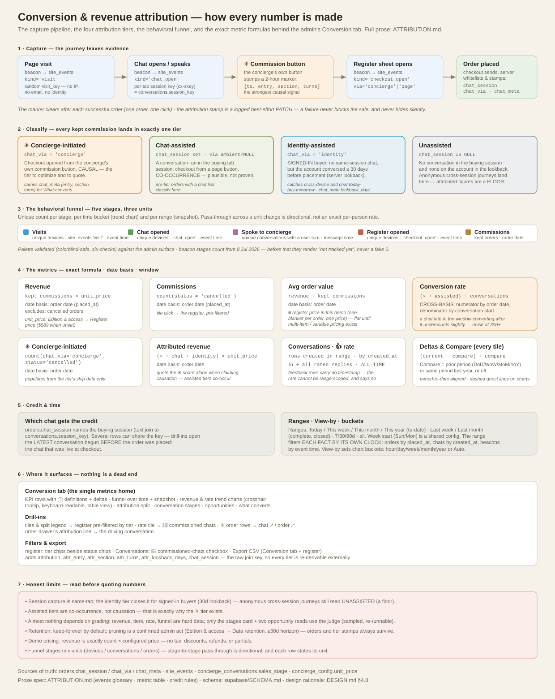

# Revenue attribution & conversion tracking

How Feierabend decides whether the AI concierge earned credit for a commission,
where every number in the admin's **Conversion** tab comes from, and — just as
important — what the numbers can and cannot claim. Written for the merchant
first, engineers second.

*The whole system on one page — capture pipeline, the three tiers, the funnel's
stages and units, every metric's exact formula and date basis, credit rules,
and the honest limits. The sections below are the prose behind each box.*

## The three tiers

Every kept (non-cancelled) commission lands in exactly one tier:

| Tier | Meaning | Signal | Confidence |
|---|---|---|---|
| **✳ Concierge-initiated** | The buyer opened checkout by tapping the concierge's own **“Begin the commission”** button | `orders.chat_via = 'concierge'` | Causal — the chat produced the click that produced the order |
| **Chat-assisted** | A conversation ran in the buying session, but checkout was opened from a page button | `orders.chat_session` set, `chat_via` NULL/`'ambient'` | Co-occurrence — the chat was present, influence is plausible but not proven |
| **Identity-assisted** | A **signed-in** buyer with no same-session chat, whose account had a conversation in the **30 days** before placement | `orders.chat_via = 'identity'` (`chat_meta.lookback_days` = days since that chat) | Weakest co-occurrence — catches cross-device and chat-today-buy-tomorrow journeys the session tier misses |
| **Unassisted** | No conversation in the buying session and none on the account within the lookback | `chat_session` NULL | The concierge played no visible part |

**Optimize on the ✳ tier.** The assisted tiers are supporting indicators;
unassisted is the baseline. When quoting a single "concierge revenue" figure,
quote the ✳ tier and mention the assisted tiers separately — adding them
together overstates. Identity-assisted is stamped **server-side at placement**
(the anonymous same-tab capture can't see identity, so this tier requires a
signed-in purchase) and carries the driving conversation's session key, so
drill-ins work the same as the other tiers.

## How a commission gets attributed (the pipeline)

1. **The chat leaves a key.** The concierge widget keeps a per-tab session key
   (`sessionStorage` `cx-skey`) and the transcript (`cx-history`)
   (`assets/concierge.js`). Server-side, every conversation row stores the same
   key (`concierge_conversations.session_key`).
2. **The commission button stamps a marker.** When the buyer taps the
   concierge's `{{action:commission}}` button, the widget writes a marker
   (`sessionStorage` `cx-commission-via`) recording the moment plus context:
   which **entry beat** the exchange came from (`typed` / `pill` /
   `opener:*` / `outreach:*` / `nudge`), the **page section**, and the
   **conversation depth** (turns so far). A page-button checkout writes no
   marker.
3. **Checkout sends the evidence.** At submit, `assets/checkout.js` includes in
   the order body:
   - `chat_session` — the chat's session key, sent whenever any conversation
     happened this tab session;
   - `chat_via` — `'concierge'` if the commission-button marker exists and is
     under 2 hours old (a slow, considered checkout still counts), else
     `'ambient'`;
   - `chat_meta` — the marker's `{entry, section, turns}`, only for
     `'concierge'`.
   After a successful order the marker is cleared, so a later page-button
   purchase can't inherit the earlier click.
4. **The server validates and stamps the order.** The commission function
   (`supabase/functions/commission/index.ts`) whitelists the values
   (`chat_via` ∈ {concierge, ambient}; `chat_meta` keys/lengths bounded) and,
   right after the order row is created, PATCHes `chat_session`, `chat_via`,
   and `chat_meta` onto it. **When checkout sent no chat key**, the server
   runs the **identity lookback**: the signed-in buyer's most recent
   conversation (by `user_id` or verified email) within 30 days of placement
   → `chat_via='identity'`, `chat_session` = that conversation's key,
   `chat_meta.lookback_days` = the gap. The PATCH is best-effort — an
   attribution failure never blocks the sale — but any failure is **logged**
   in the function logs, so lost attribution is visible rather than silent.
   The `order_events` audit trail records the stamp as an `updated` event.
5. **The admin reads it back.** `orders.chat_session` joins to
   `concierge_conversations.session_key` (a text join, not a foreign key — one
   session key can span several conversation rows), which is also how the
   order drawer resolves the origin IP.

## What each admin number means

The **Conversion tab is the single metrics home** — the Conversations tab is
the working floor (transcripts, filters, grading) and carries no figures of its
own, so numbers can never disagree between views.

### Events glossary (what gets recorded, and when)

| Event | Recorded when | Stored as | Timestamp used |
|---|---|---|---|
| **Visit** | The page loads with the widget live (once per tab session) | `site_events` `kind='visit'` | event time |
| **Chat opened** | The concierge panel opens | `site_events` `kind='chat_open'` | event time |
| **Spoke to concierge** | A conversation receives a **user** message | `concierge_messages` (`role='user'`) | message time |
| **Register opened** | The checkout sheet opens (`via` = `concierge` if the concierge's button opened it, else `page`) | `site_events` `kind='checkout_open'` | event time |
| **Commission click** | The buyer taps the concierge's "Begin the commission" button | `sessionStorage` marker → `orders.chat_via/chat_meta` at placement | click context frozen at placement |
| **Order placed** | `commission_order` inserts the row | `orders` | `placed_at` |
| **Identity lookback** | At placement, when checkout carried no chat key and the buyer is signed in: the account's most recent conversation ≤ 30 days back | `orders.chat_via='identity'`, `chat_session`, `chat_meta.lookback_days` | placement time (the lookback gap is recorded) |
| **Cancellation** | `cancel_order_return` | `orders.status`, `cancelled_at` | `cancelled_at` |

Funnel beacons are **PII-free**: a random device token (`visit_key`), optional
chat session key, section — no IP, no email, no name. They begin counting from
their ship date; earlier history shows zeros.

### Metric definitions (the formal table)

Every tile carries this same definition in its ⓘ hover.

**Range** — calendar periods, either to-date (**Today / This week / This month
/ This year**) or complete closed periods (**Last week / Last month** — the
full previous week/month, ending where the current one begins), rolling
windows (**7 / 30 / 90 days**), or all time. Closed periods compare
full-vs-full (last week vs the week before); to-date periods compare
period-to-date.
**What the range actually selects:** there is no single shared date column —
the range filters *each fact by its own clock*: **orders by order date**
(`placed_at`), **conversations by start date** (`created_at`), **funnel
beacons by event time**, **spoke-stage by message time**. So "Commissions"
means orders *placed* in the range (wherever their chats began),
"Conversations" means chats *started* in the range (whether or not they've
converted yet), and the conversion rate deliberately crosses the two bases —
its ⓘ and the caveat below spell out the consequences.
**View by** — the trend charts' bucket granularity: **hourly / daily / weekly /
monthly / yearly**, or Auto (hourly ≤ 2 days, daily ≤ 31, weekly ≤ 200, else
monthly; an explicit pick auto-coarsens only past 400 buckets).
**Compare** — what deltas and the dashed chart ghost-lines measure against:
**Prior period** (DoD / WoW / MoM / YoY when a calendar range is selected;
the previous N days for rolling ranges) or **Same period last year**, or Off.
Calendar comparisons are **period-to-date aligned** — "this month, 8 days in"
compares against the *first 8 days* of last month, never a full period against
a partial one. Ghost lines align by bucket index (day 3 over day 3).
**Week starts** — the configurable first day of the week
(`concierge_config.week_start`, set on the Conversion tab, shared by all
admins): drives the This-week range, weekly chart buckets, and WoW alignment.
Note the division of labor: **the delta follows the Range; View-by only
re-buckets the charts** — to get WoW/MoM/YoY on the tiles, pick the matching
calendar Range.

| Metric | Formula | Date basis | Exclusions |
|---|---|---|---|
| **Revenue** | kept commissions × register price | order date (`placed_at`) | cancelled orders |
| **Commissions** | count of orders `status ≠ 'cancelled'` | order date | — |
| **Avg order value** | revenue ÷ kept commissions | order date | ≡ register price in this demo (one blanket per order, one price) — flat until multi-item/variable pricing exists |
| **Conversion rate** | attributed kept commissions ÷ conversations started | **cross-basis**: numerator by order date, denominator by conversation start | see caveat below |
| **✳ Concierge-initiated** | kept commissions with `chat_via='concierge'` | order date | — |
| **Chat-assisted** | kept commissions with `chat_session` set, `chat_via` not ✳/identity | order date | — |
| **Identity-assisted** | kept commissions with `chat_via='identity'` (signed-in buyer, account conversation ≤ 30 days before placement, no same-session chat) | order date | stamped from its ship date forward |
| **Attributed revenue** | (✳ + chat-assisted + identity-assisted) × register price | order date | quote ✳ alone when claiming causation |
| **Conversations** | conversation rows created in range | conversation start (`created_at`) | — |
| **👍 rate** | thumbs-up ÷ all rated replies | **all-time** (feedback rows carry no timestamp) | not range-scopable |
| **Funnel stages** | UNIQUE count per stage — *Visits / Chat opened / Register opened* count unique **devices** (`visit_key`); *Spoke* counts unique **conversations** with a user turn; *Commissions* counts kept **orders** | event time / message time / order date | dedup is per bucket on the trend chart, per range on the snapshot; pass-through across a unit change (device→conversation→order) is directional, not an exact per-person rate |

**Which chat gets the credit:** the order's `chat_session` names the buying
session; when several conversation rows share that key, drill-ins open the
**latest conversation begun before the order was placed** — the chat that was
live at checkout.

**Bucketing:** the View-by control (see above) sets the trend charts'
granularity; Auto picks hourly ≤ 2 days, daily ≤ 31, weekly ≤ 200, else
monthly. Deltas always compare whole windows, whatever the chart granularity.

**Cross-basis caveat (conversion rate):** the numerator counts orders by order
date and the denominator counts chats by start date, so a chat late in the
window that converts after it undercounts slightly, and a bucket with zero
chats shows 0% regardless of orders. At 30+ days this skew is noise; don't
read single sparse buckets as trend.

### The report's other panels

- **Funnel over time** — the layered area/line chart of unique visitors
  reaching each stage per bucket; the snapshot card shows range totals with
  stage-to-stage pass-through and the overall visit → commission rate.
- **Conversation stages** — the LLM judge's `sales_stage` per conversation
  (`browsing → engaged → evaluating → objection → ready → won / lost`). A
  *transcript reading*, not an order record — the ✳ tier is the hard,
  order-level signal; the stages tell you *where* conversations stall.
- **Where the opportunities are** — computed reads: the biggest funnel drop,
  the rate trend vs the prior window, an unassisted majority, sections with
  chats but no ✳ conversions, and grading coverage — each phrased with the
  lever to pull.
- **What converts** — for ✳ orders only, the commission-click context from
  `chat_meta`: which page **sections** and **entry beats** (typed, pill,
  opener, outreach, nudge) produce the taps, and the average conversation
  depth, plus the order list itself.

**Nothing is a dead end.** Every Conversion number drills into the records
behind it: the tiles and split-bar legend open the register pre-filtered to
that tier; the rate tile opens Conversations filtered to 🛒 commissioned
chats; each ✳ commission row jumps to the **conversation that drove it**
(`chat ↗`) or its register row (`order ↗`); an order drawer's attribution line
opens the driving chat. Filters match the rest of the app — the register has
attribution-tier chips beside the status chips, and Conversations has a
**🛒 commissioned chats** checkbox beside the house-note one. **Export**: the
Conversion tab's Export CSV downloads the range and the regular register
export carries the same columns — `attribution` (the tier), `attr_entry` /
`attr_section` / `attr_turns` (✳ click context), `attr_lookback_days`
(identity tier), and `chat_session`, the **raw join key** back to
`concierge_conversations.session_key` — so any spreadsheet or BI tool can
re-derive and audit every tier from first principles.

**Order drawer**: each order shows its tier line (with the click context in the
tooltip); the **Chats** tab lists chats that *touched* the order — see below.

## Two links, not one (don't conflate them)

- **Conversion link** — `orders.chat_session` / `chat_via` / `chat_meta`:
  which chat preceded/drove the **placement** of this order. Feeds every
  revenue figure.
- **Service link** — `concierge_actions.conversation_id` + `serial`: chats
  where a register tool later **acted on** an existing order (cancel, address
  change, tracking…). Feeds the order drawer's Chats tab and the 🏷/journey
  navigation. A chat can hold a service link without deserving conversion
  credit, and vice versa.

## Honest limits (read before quoting numbers)

- **Session capture is same-tab.** The chat key lives in `sessionStorage`, so
  the ✳ and chat-assisted tiers require the conversation and checkout to share
  a browser tab session. The **identity tier** closes this gap for signed-in
  buyers (30-day account lookback), but anonymous cross-session journeys still
  record as **unassisted** — treat attributed figures as a **floor** on the
  concierge's true influence, never a ceiling.
- **Assisted is not causation.** A one-line chat that answered nothing still
  marks the order chat-assisted, and an identity match proves recency, not
  influence. That's why the tiers exist — the ✳ tier is the causal claim.
- **Best-effort stamp.** If the post-insert PATCH fails, the order stands
  unattributed; the failure appears in the commission function's logs (search
  "attribution PATCH").
- **The judge can be wrong — and almost nothing here depends on it.** Revenue,
  commissions, tiers, conversion rate, and the funnel are all hard data
  (orders, beacons, messages). Only the **Conversation stages** card and two
  opportunity reads use the LLM judge's `sales_stage` — model judgments with
  sampling (`goal_sample_rate`), re-runnable (Re-grade), directional, never
  ledger entries.
- **Retention is opt-in, configurable, and now administrable.** The default is
  keep-everything-forever: nothing is scheduled. Pruning happens only when the
  merchant runs it from **Edition & access → Data retention** (choose a horizon
  ≥ 30 days → confirmed **Run prune now** → admin-gated `?prune=1` →
  `prune_high_write(p_days)`; the card reports exactly what was deleted and
  records the chosen horizon as `concierge_config.retention_days`). An operator
  *may* additionally schedule it nightly with pg_cron (`setup.sql`, commented
  out; 180 is only the suggested privacy/cost balance — transcripts hold PII).
  Either way, order rows and their tier stamps survive, so long-range revenue
  reporting still works — only the drill-down into pruned transcripts is lost.
- **Demo pricing.** Revenue = count × configured unit price. There are no
  taxes, discounts, refunds, or partial payments in this demo, so revenue is
  exactly proportional to counts.

## How to raise the ✳ number

The levers, in the order they usually pay off:

1. **Get the button into more replies where intent exists** — the Selling
   section's ADVANCE move and commission trigger (Tuning → dial, angles,
   objections). Every ✳ order started as `{{action:commission}}` in a reply.
2. **Aim goals at the sections that convert** — the What-converts card shows
   where taps happen; point per-section goals and starters there.
3. **Watch the funnel for the stall stage** — many `evaluating`, few `ready`:
   sharpen angles/objections. Many `ready`, few ✳ orders: the button isn't
   being offered at the moment of intent (check transcripts of `ready`
   conversations).
4. **Compare entry beats** — if outreach/opener beats never appear in
   What-converts, the proactive lines advance conversations that never reach
   the button; adjust their goals or pacing.

## Schema quick reference

| Where | Field | Purpose |
|---|---|---|
| `orders` | `chat_session` | Session key of the chat in the buying session (text join → `concierge_conversations.session_key`) |
| `orders` | `chat_via` | Tier: `concierge` / `ambient` / `identity` / NULL (`orders_chat_via_check`) |
| `orders` | `chat_meta` | `{entry, section, turns}` at the commission click (✳ only) |
| `concierge_conversations` | `sales_stage`, `goal_status` | Judge-graded funnel stage + per-goal outcomes |
| `concierge_actions` | `conversation_id`, `serial` | Service touches on existing orders |
| `site_events` | `kind`, `visit_key`, `via` | Funnel beacons: visit / chat_open / checkout_open (PII-free) |
| `concierge_config` | `unit_price` | Register price behind every revenue figure |

Full column docs in [`supabase/SCHEMA.md`](supabase/SCHEMA.md); design
rationale in [`DESIGN.md`](DESIGN.md) §4.8.
