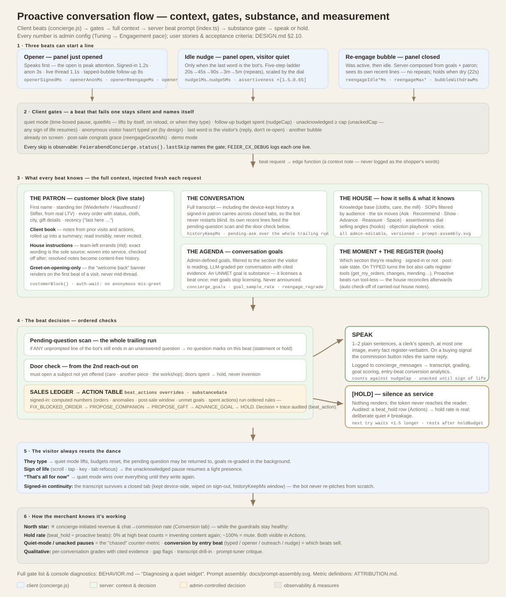

# Concierge behavior rules

The invariants that govern how the concierge *behaves* — the guardrails baked
into its prompt and helper code, as opposed to the copy an admin edits (KB, SOPs,
config). This is the reference for "why does the bot do X"; most of it lives in
`supabase/functions/concierge/index.ts` (the always-on system-prompt block) and
`kb.ts` (the move-selector and display-token rules). Admin-editable knobs are
noted where they exist.

## Orders — read the register, never remember it
- The bot **must call `get_my_orders` before answering any question about a
  patron's orders** — every status, every count, every "how many," every filtered
  list. It builds the answer, the count, and the pills **only** from the tool's
  result, never from memory or the CUSTOMER summary in the prompt.
- `get_my_orders` returns an authoritative `{ count, colorway, orders }`. When the
  patron narrows to one cloth ("show my Loden", or taps a cloth pill), the bot
  passes the **colorway filter** so the register returns exactly those rows,
  pre-counted — it does not tally or filter a long list in its head (that is how
  counts got dropped and a cloth mislabeled).
- If it already listed orders earlier in the chat and is asked again, it re-calls
  the tool rather than trusting the earlier list.
- Cancelled entries are archive: excluded from lists and counts unless the patron
  asks about history (`include_cancelled`).

## Tappable pills — always leave a path
- Whenever the patron must choose among specific things (orders, cloths, yes/no),
  the bot offers `{{reply:…}}` pills, never a bare list of numbers to type.
- **Large sets don't drop to prose.** If more than six items are eligible, the bot
  offers a few **narrowing** pills first (by cloth: `Show the Graphit`, or
  most-recent), then one pill per order within the chosen group. The client
  renders at most 6 pills per row; there is always at least one tappable step.
- For a change, after the patron picks, the bot restates the consequence in one
  line and offers exactly two pills (`Yes, cancel Nº X` / `Keep Nº X`); it calls
  the write tool only after the explicit Yes.

## Writes — confirm, then report truthfully
- Every register write (cancel, colorway, gift name, mending, resend,
  `resolve_admin_note`) is **signed-in only, ownership-scoped, and logged** to
  `concierge_actions`.
- The bot states what it's about to do, gets explicit confirmation, calls the
  tool, and reports the tool's result verbatim in substance — it never claims a
  change happened unless the tool confirmed it.
- **Address changes are never free-typed by the model.** They go through the
  in-chat address-change form, where the patron types each labelled field, because
  a model composing five address fields once mis-mapped a city into the street
  line. (See [`FORMS.md`](FORMS.md), [`TOOLS.md`](TOOLS.md).)

## House instructions (directives) — follow them, then check them off
The team can leave a standing instruction for a specific patron; it appears in the
CUSTOMER block as **HOUSE INSTRUCTIONS FOR THIS PATRON**, each printed with a
`(#id)`. Invariants (SOP `client-book-method`, which now also carries the
directive-handling detail formerly split into a separate `house-directives` SOP):
- **Honour them before anything else.** An open instruction outranks the bot's own
  plan for the conversation. It is woven into service, never read aloud or
  attributed to "the team."
- **The note's exact wording is the sole source of the errand.** If the client
  book or a past visit mentions a *similar* errand (an earlier forgotten item, an
  earlier apology), that one is history — its details must never bleed into the
  new instruction. To keep old errands from contaminating new ones, resolving a
  note writes a **content-free** book event (the note's id only, marked "a past
  errand: never repeat or reference its contents") — the errand's text lives
  only on the note itself.
- **Standing vs. one-time.** A standing preference ("always offer the Loden first")
  is followed every visit and left open. A one-time task ("apologise for the delay
  on Nº 231") is done at the first natural moment, then checked off by calling
  **`resolve_admin_note`** with its `(#id)` **in the same reply** — the CUSTOMER-block
  line warns that a completed one-time task left open will wrongly repeat next visit.
- **Proactive beats honour them too.** The idle-nudge, opener, and closed-panel
  re-engagement lines are told to act on an open instruction even when the patron
  hasn't typed (those beats run tool-less, so they can't self-resolve — the
  backstop below closes them). Every one of these lines is **recorded to
  `concierge_messages`** — including the closed-panel `?reengage=1` bubble, which
  formerly returned its text without logging it, so a note delivered there vanished
  from the transcript. The transcript is now complete: every customer-visible line
  the concierge produces is written.
- **Greet on the opening beat only.** The RE-ENGAGEMENT banner ("new visit — greet
  like someone returning") and the "on your very first line of the visit" directive
  framing render only when `customerBlock(customer, opening)` is called with
  `opening = true` (a proactive greet/reengage, or the first turn with no assistant
  reply yet). Mid-conversation they are dropped so the bot never re-greets ("what
  brings you back today?") on every reply — the live conversation is never the
  "last" one, so the banner would otherwise repeat verbatim each turn.
- **Self-resolve backstop.** Because a model sometimes acts but forgets to resolve,
  `reconcileDirectives` runs after any signed-in turn with an open one-time
  directive: a small, tool-scoped background pass re-reads what was said and calls
  `resolve_admin_note` for anything now carried out. It only ever resolves (never
  speaks), so a miss is safe — the note simply resurfaces next turn. Resolving also
  **tags** the chat (`🏷 house note`), since the tag derives from that action.
  (Full design in [`DESIGN.md`](DESIGN.md) §4.13.)

## Selling, pacing, re-engagement

*The full beat lifecycle — triggers, client gates, the context every beat
carries (patron record, client book, house notes, goals, house knowledge,
the moment), the substance-gate decision, and the measures — in one picture.*

- Covered in [`DESIGN.md`](DESIGN.md) §2.8: the move-selector (Ask/Recommend/Show/
  Advance/Reassure/Space), the assertiveness dial, hooks/objections, journey-aware
  goals, closed-panel re-engagement, and post-sale behavior. All admin-tunable.
- **Show the commission button on a buying signal — don't interrogate.** The moment
  the shopper signals intent ("I want to commission," "let's do it," "open the
  register," "I'll take it"), the bot emits `{{action:commission}}` **in that same
  reply**. It does NOT ask which cloth or where it ships first — the register sheet
  collects the cloth and address itself, so asking beforehand is friction that
  loses the sale. It never proposes opening the register ("shall I…?") without the
  button in the message, and never repeats a qualifying question.
- **`[HOLD]` is a silence signal, never a reply.** The bot may answer a *proactive*
  check-in prompt with exactly `[HOLD]` when staying quiet is kinder — the server
  turns that into a hold and shows nothing. It must never write `[HOLD]` in reply
  to a message the visitor actually sent; the token can never reach the reader (the
  pipeline strips it on every path).
- **The guardrails themselves are editable and versioned.** The entire
  ENGAGEMENT & PACING rule block is an editable base
  (`concierge_config.engagement_base` — Tuning → Engagement → The written rules, with "Load
  built-in to edit" and History ⟲ rollback like the voice base; blank = the
  built-in text below). So are the **selling method** (`selling_base` —
  discovery-before-presenting, give-first, the six moves with three close
  shapes, held-number endowment, honest proof, price framing, the commission
  trigger; keep the `{{DIAL}}` marker) and the **worked examples**
  (`exemplars_base` — the few-shot style anchors the model imitates: one pair
  per move plus WEAK→GOOD contrastive pairs for the house's own historical
  failures; editing these changes how the concierge *sounds* more reliably
  than adding rules). Both live in Tuning → Selling. `beat_notes` additionally
  appends the admin's own standing instructions to **every** proactive beat
  brief (nudges, openers, the closed-panel bubble) without replacing the bases
  — ranking below the honesty rules. Every save lands in
  `concierge_edit_history`. The bullets that follow describe the **built-in**
  defaults.
- **A live exchange never goes dead on the first beat.** The first check-in
  after the patron just spoke (check-in #1, within ~30s of their message) is a
  hot conversation, not idle re-engagement — the substance gate and even a
  ledger HOLD soften there to "offer the single most natural next step" (more
  depth, a choice, the register). Holding on that beat is allowed only when
  the patron clearly closed the conversation themselves. Keeps the post-reply
  silence inside the first ladder rung (default 8s × dial — the ladder leads
  fast and backs off: 8s→30s→90s→3m→5m; tunable via the follow-up fields).
- **Sell, don't just report.** The substance gate is not a license to become a
  status board: on every spoken beat the bot prefers the line that moves
  *toward the register* — an open goal's next step, a companion cloth for
  another room, a gift in another name — using at most one register fact as
  the doorway, never the destination. A pure status line is right only when
  service genuinely needs it (a blocked order, a delivery), and only once — a
  service fact already raised is spent, not substance.
- **Beats decide by numbers — the Sales Ledger and Action Table.** For a
  signed-in patron, a proactive beat's job is no longer the model's guess: the
  server computes a **Sales Ledger** (orders by status, days since last order,
  placeholder-address anomalies, post-sale window, unmet goals, pending
  questions, the 30-day spoken-action log) and runs it through an ordered
  **Action Table** — `FIX_BLOCKED_ORDER → PROPOSE_COMPANION → PROPOSE_GIFT →
  ADVANCE_GOAL → KEEP_WARM → HOLD` — choosing the ONE action the beat performs.
  The table lives in `beats.ts` as pure functions and is **unit-tested on every
  deploy** (`deno test` gates the workflow before the type-check). "Once" is
  state, not exhortation: a spoken action writes a `beat_action` audit row.
  A HOLD decision on the closed-panel bubble short-circuits *before* the model
  call. **Every decision is diagnosable**: the `beat_action`/`beat_hold` rows
  in the Actions tab carry the ledger snapshot and the rule-by-rule trace
  ("PROPOSE_GIFT: in cool-off — proposed 2× before, rests 3d") — "why did it
  say that?" is a lookup, never a guess. Rules can be disabled per-key via
  `config.beat_actions` (Tuning → Engagement → The written rules, versioned).
  Signed-out visitors (no register to compute from) fall back to the prompt's
  own judgment under the same guardrails.
- **A repeated proposal rests on an escalating ladder — a "no" is remembered.**
  `PROPOSE_COMPANION` and `PROPOSE_GIFT` no longer re-qualify every 24 hours
  forever: after each unanswered proposal the SAME proposal rests longer —
  default 24h → 3 days → 7 days (`outreach.proposalRestHours`, editable in
  Engagement → ⑤ After they buy → Fine-tune; set it in fractions of an hour
  when testing). A **new order or a new client-book note re-opens it early** —
  persistence with a new reason is service; the same ask on a timer is
  pestering. The cool-off is per-proposal: a resting gift never silences the
  companion, a goal, or the give-first line.
- **Give-first before silence — `KEEP_WARM`.** When every sales door is spent
  or resting, the beat does not simply go quiet: the table's last rule before
  HOLD offers one small, **unasked piece of true house expertise** keyed to the
  section the visitor is reading (a care fact, the provenance, the box, the
  mending promise) — warm, brief, no ask. Once per section per day; then, and
  only then, HOLD. This answers the observed failure "too much silence, not
  enough attempts to engage" without re-opening the invention door.
- **The speak/hold decision is a typed field, not a magic word.** Every
  proactive call (in-panel beats and the closed-panel bubble) forces a
  structured `beat_line` tool — `{speak: boolean, line: string}` — so the old
  `[HOLD]` sentinel class (decorated holds like `**[HOLD]**` slipping regex
  scrubbing into the transcript) is structurally impossible. One terminal
  scrub remains as defense-in-depth against old saved rule overrides.
- **Substance or silence — with speech as the default posture.** A proactive
  beat speaks when it has something **new and concrete** — a register fact not
  yet mentioned, an open goal's next step, a house instruction, an unoffered
  piece of house expertise. Silence is the *last resort*, not the safe
  default: when in doubt between a modest true line and silence, the rule is
  to speak the modest line. What silence still protects against is unchanged —
  restating what's on screen in new wrapping, atmosphere as filler, invented
  color. Proactive lines are also held to **plain speech** (one or two
  clerk-plain sentences, at most one image, every fact verbatim from the
  register).
- **Quiet mode is a time-boxed pause, not a switch.** Three entrances: "That's
  all for now" (the in-flow chip or ⋯ menu), "Don't message me until I write
  back", and — the snooze procedure — a **typed** wind-down ("that's all",
  "I'll come back", a clear goodbye), which the model answers with one warm
  send-off carrying `{{action:snooze}}` on its last line; the client honors
  the token by entering quiet and recording the wrap exactly like the chip
  (the token never renders, and the send-off itself is the goodbye). All enter
  quiet mode, which silences **every** proactive beat — in-panel nudges,
  openers, and the closed-panel bubble. It lifts three ways, whichever comes
  first: (1) **by itself** after the quiet window (`outreach.quietMs`, default
  30 minutes, Tuning → Engagement → House rules), after which the bot resumes a *light*
  presence rather than staying dark; (2) **on page reload** — the pause is
  deliberately not persisted, so a fresh page never inherits an old silence;
  (3) **the moment the visitor types** — their message always reopens play.
  Diagnosable live: `FeierabendConcierge.status()` reports `quietMode` and
  `quietRemainingMs`, and `lastSkip` names the quiet window when it's the gate.
- **Plain is not blunt; the book is background; status words are law.** Four
  guardrails on the plain-speech correction: (1) dropping poetry never means
  dropping warmth — no curtness, no interrogation, no scorekeeping; a patron
  asking "why buy?" always gets the true service answer (another room, a gift,
  the trial), never "I have no good answer." (2) The client book *seasons* a
  line once — an old note (a room, a light) is background, never the recurring
  agenda, and never a current fact. (3) An order's register status is
  authoritative: `placed` has not arrived — the bot never describes a cloth as
  settled in or in use unless the register says delivered. (4) The book is
  **invisible at the point of data**: the discipline line rides with the book
  content itself on every beat (not only in the toggleable Recognition
  section) — never name the book, never cite "notes/records" as a source, and
  never describe the patron's own preferences or communication style back to
  them ("the client book notes you prefer direct data…" is a service failure;
  a style note changes *how* the bot speaks, never what it says).
- **Vary the door, not the words (proactive pacing).** The bot never repeats or
  rephrases its own unanswered question on a proactive beat. The server scans
  the **whole trailing run** of its own unprompted lines (not just the last
  one — a statement beat used to "launder" the guard, and the same question
  came back two beats later): while any question of the bot's is pending, every
  proactive beat is question-free — one true statement if it has one, `[HOLD]`
  if it doesn't. From the second reach-out on, each beat must open a
  **different door** — a subject not yet offered — and when every door is
  spent, the honest move is `[HOLD]`, never invention, so five beats never
  orbit one cloth. The rule is **scoped**, not a gag: it governs only the
  bot's own unprompted follow-ups; an ambiguous reply invites a gentle
  clarify, explicit confirmations (a cancellation, a change) are always asked,
  and a pending question may be returned to once the patron speaks again.
  Persistence stays wanted; repetition is what annoys. **The closed-panel
  bubble follows the same rules**: `?reengage=1` composes each line fresh, so
  it is shown its own recent lines and bound to the same contract — spent
  subjects, no re-asks while a question is pending, and an explicit hold
  (`{hold:true}`) when nothing new is left, which the client honors with
  silence (no canned fallback line) until the patron shows fresh activity.
  For a signed-in patron the guard reads across their **recent conversations**,
  not just the current one — a wrap-up or quiet-window expiry opens a fresh
  conversation row, and a guard scoped to the new (empty) row let the same
  subject return 45 minutes later.
- **Every pacing number is admin-tunable** (Tuning → Engagement — laid out as the visitor's journey, stored on
  the `outreach` config key, no deploy): the five-step in-chat follow-up ladder
  (`nudge1Ms`–`nudge5Ms`, last repeats), `nudgeCap`, `unackedCap` (pause after
  N unacknowledged reach-outs), `holdBudget` (consecutive silent holds before
  resting), opener timings (`openerSignedMs`/`openerAnonMs`/`openerReengageMs`),
  closed-panel idle thresholds and budgets (`reengageIdle*Ms`, `reengageMax*`,
  `reengageEnabled`), bubble linger (`bubbleWithdrawMs`), ambient budget
  (`maxAmbient`), post-sale behavior (`reengageGraceMs`,
  `reengagePostSaleWindowMs`, `reengagePostSaleEnabled`), the kept-transcript
  window (`historyKeepMs`), and the **substance gate itself** (`substanceGate`,
  default on). Blank = built-in default, scaled by the assertiveness dial.
  `FeierabendConcierge.status()` reports the *effective* caps after config and
  dial are applied. **Held beats are monitored, not invisible**: each one
  writes `concierge_actions.action='beat_hold'` (conversation id + beat kind),
  so the Actions tab shows deliberate silence and hold rate is a real metric.
  The product-level user stories, acceptance criteria, and the full
  quantitative/qualitative measure set live in [`DESIGN.md`](DESIGN.md) §2.10.
- **Opening the panel earns an immediate goal beat.** The open is the visit's
  highest-attention moment, so the goal-directed opener lands while the
  visitor is actually looking: ~1.2s for a signed-in patron, ~3s for an
  anonymous visitor (after the house greeting), ~1.1s when returning to a
  live thread — and when the panel opens via a **tapped outreach bubble**
  (where the tapped line itself is the opener), the first follow-up comes at
  the quick `openerFollowMs` (default 8s) instead of the normal ladder. All
  four timings are admin config (Tuning → Engagement → ②); the substance gate still
  applies to every one of these beats.
- **Every proactive beat carries the full patron context.** In-panel nudges,
  openers, and the **closed-panel re-engagement bubble** all inject the complete
  CUSTOMER block (name, standing, orders, recency, client book, open house
  instructions) and are told to ground the line in THIS patron — the token getter
  also waits briefly for a remembered session, so a known patron is never greeted
  anonymously by a beat that fired before auth finished loading.
- **Post-purchase.** A commission is congratulated **in the transcript** the moment
  checkout closes (with the standing note — Wiederkehr/Hausfreund/Stifter — when it
  applies), whether the chat panel is open or closed. After the sale the bot leads
  with reassurance (grace window), then may re-engage for a companion cloth/gift —
  never "still eyeing it." Timings are admin-tunable (`outreach.reengageGraceMs`,
  seconds in the admin UI; `reengagePostSaleWindowMs`, a value **with a unit
  picker — hours, minutes, or seconds** — days-scale in production, default
  48 h, seconds-scale when testing; `reengagePostSaleEnabled`).
- **The post-sale window sets a duration; a separate mode picks what happens
  inside it.** Tuning → Engagement → ⑤ After they buy → *"after a purchase, the concierge should…"*
  offers three modes (`outreach.postSaleMode`): **upsell** (default — re-engage
  for a second sale: companion cloth / gift), **presence** (keep the normal
  warm check-ins with no selling frame), or **quiet** (no closed-panel bubble
  at all until the window passes). Quiet names itself in `status().lastSkip`
  (*"commissioned 2h ago and the post-sale mode is QUIET in admin — silent for
  the remaining 46h of the 48h window"*), and `status().postSale` shows the
  purchase age, window, and mode at a glance. The old checkbox key
  (`reengagePostSaleEnabled: false`) maps to quiet for back-compat.

## Chat panel & composer (client UX)
- **A blank bubble never ships.** Before a reply is committed, the client
  probes what will actually be *visible* after rendering. A reply that is only
  plumbing (e.g. a form token the register can't build, a stray action token)
  used to land as an empty bubble wearing ↑/↓ feedback arrows. Now: an unknown
  or disabled `{{form:…}}` token renders a spoken fallback ("The register can't
  raise that card right now — tell me the details here and I'll enter them by
  hand") instead of vanishing; any *other* reply that still renders empty is
  **withdrawn** if proactive (named in `lastSkip`) or replaced with a graceful
  presence line if it answered a typed message.
- **The register sheet is sacred ground.** While the checkout panel is open,
  no proactive beat fires anywhere — nudge, opener, or bubble (they share the
  same screen space on desktop, and a bot line mid-order-form is the most
  expensive interruption there is). Every such skip names itself, and
  `status()` reports `checkoutOpen`.
- **"That's all for now" is a visible control, not a hidden menu item — and it
  appears when it's needed, not always.** The chip shows up when ending is
  plausibly on the patron's mind: once the bot has begun following up on its
  own (a proactive beat is exactly what the chip answers), or once the exchange
  runs deep (default: 3 patron turns) — never parked under the very first
  reply. Both triggers are admin-tunable (Tuning → Engagement → ③ A polite way out:
  `outreach.wrapChipMinTurns`, 0 = always; `wrapChipOnFollowup`). When shown,
  it rides in the message flow under the bot's latest reply — no chrome, no
  extra row; it scrolls with the conversation and is rebuilt after each reply.
  One tap wraps the conversation: quiet mode on, the register records the
  wrap, a warm goodbye, and the panel closes. It hides while there's nothing
  to wrap (fresh chat, already wrapped, quiet, mid-stream). The ⋯ menu keeps both signals
  ("Don't message me until I write back" and "That's all for now") for
  completeness; typing again always lifts the quiet and starts a fresh
  conversation. A bot line that lands on a wound-down thread (a re-engagement)
  marks it resumed, so the resumed conversation can be wrapped again.
- **A brief tab-switch does not end the conversation.** Glancing at another tab
  (e.g. the admin) no longer marks the live chat "closed" — the wind-down fires
  only on a real leave (tab hidden ~60s, or an actual page unload). An explicit
  "That's all"/snooze still starts a fresh conversation deliberately.
- **The composer keeps focus** on pointer devices (including a narrow, side-by-side
  desktop window): the cursor lands in the box on open and returns to it after each
  reply, so you can send back-to-back with Enter. On touch it's left alone so the
  keyboard doesn't spring up.
- **The transcript follows a signed-in patron across tabs.** The live thread is
  per-tab (`sessionStorage`), but for a **signed-in** patron every save is also
  kept device-side keyed to their identity — so closing the tab and coming back
  restores the conversation, for the visitor *and* for the bot (which otherwise
  restarted from an empty thread and repeated itself). The keep is wiped on
  sign-out or identity change, expires after an admin-tunable window
  (`outreach.historyKeepMs`, default 7 days), and never applies to anonymous
  visitors — their chats stay per-tab for privacy. Server-side, a new tab still
  opens a fresh conversation row; continuity is the transcript the model sees,
  not a merged analytics session.

## Diagnosing a quiet widget (browser console)

The concierge has many *deliberate* reasons to stay silent (quiet mode, spent
budgets, an anonymous visitor who hasn't typed, a congrats grace window after a
sale). To make silence readable instead of a mystery, the widget exposes
diagnostics on any page where it's mounted — open the browser console and run:

- **`FeierabendConcierge.status()`** — a snapshot of the engagement state:
  signed-in email, `panelOpen`, `quietMode`, `wrappedUp`, whether the visitor
  has typed, nudge count vs. effective cap, unacknowledged reach-outs vs. cap,
  hold attempts, history length and last speaker, `entryMode` (how this
  conversation began: typed / opener / nudge / tapped outreach),
  `nudgeTimerArmed` (a follow-up is scheduled right now), a `reengage`
  object for the closed-panel bubble (enabled, count vs. max, fires-after-idle
  threshold vs. how long you've actually been idle, the **longest idle span
  reached this visit** (`maxIdleMsThisVisit` — proves whether the threshold was
  ever actually crossed), **what last reset the idle clock**
  (`lastActivitySource`: tap / key / scroll / mouse-move / touch / tab-return),
  whether a bubble is on screen, post-sale grace), and a `postSale` object
  (how long since the last purchase on this device, the congrats grace, the
  post-sale window, and whether the second-sale beat is enabled — see below).
- **`status().lastSkip`** — the headline field: names, in plain language with a
  timestamp, the exact gate that stopped the **most recent** proactive beat
  (e.g. *"reengage: not idle long enough — fires after 30s still; last activity
  4s ago via mouse-move"*). It covers the **whole lifecycle**, not just gates:
  when a beat's timer fires it records *"beat: FIRED — requesting the line
  now"*; if the register decides silence it becomes *"beat: the register HELD
  …"*; if the network request itself dies (offline, rate limit, server error)
  it becomes *"beat: request FAILED — network error or rate limit; nothing was
  shown"* and a spacious retry is armed; and if a line arrives but renders to
  nothing visible it is withdrawn as *"beat: the line rendered EMPTY
  (plumbing-only reply) — bubble withdrawn"*. A proactive beat can therefore
  never vanish without a trace — silence always has a name.
- **`status().recentSkips`** — the last eight skip notes, newest first.
  Checking the console is itself page activity (moving the mouse to it resets
  the idle clock), so the single `lastSkip` you see while looking is often just
  "not idle long enough" — the observer effect. `recentSkips` shows what the
  widget was deciding **before** you looked, so one snapshot tells the whole
  story.
- **`window.FEIER_CX_DEBUG = true`** — from then on, every skipped beat also
  logs live to the console (`[concierge] skip: …`) as it happens.
- **`FeierabendConcierge.open()` / `.close()`** — programmatic panel control
  (`open('question')` opens and sends the question).

Instrumented beats: in-panel follow-ups (`scheduleNudge`), the on-open
opener, the closed-panel re-engagement tick, and the ambient outreach bubble —
every early return names itself. One structural guarantee worth knowing: an
open panel never sits with **no** beat armed — if the opener stands down (for
example, the outreach line you just tapped *is* the opener), the light-presence
follow-up loop is armed in its place.

## Journey-aware goals
- Each goal can carry one or more **sections** (page/journey stages), set as
  checkboxes in Procedures → Conversation goals. The bot leads with an open goal
  when the visitor is reading **any** of its sections. No sections = pursued
  anywhere. Source of truth is `concierge_goals.sections[]`.

## Conversation starters
- The suggestion chips (and the on-page inline starters) are the admin's
  configured starters **topped up** with the baked KB defaults, per section — so a
  section left blank or only partly filled still offers a few, never one or none.
- **Where the on-page beats appear is admin-configurable** (Tuning → Engagement → ① Woven into the page itself): `outreach.inlineSections` lists the sections that carry an
  inline "Ask the mill ✳" starter (default the five content sections; add
  `hero` for the title page — its DOM id is `top`, mapped internally, which is
  why checking hero in the starters alone never showed one). The floating
  context chip's budget is tunable too: `chipCap` per page view,
  `chipLingerMs` on screen, and `chipRepeatMs` to let a section's chip
  reappear after a while instead of the default once-per-view.
- **The opening beat of a panel session never holds — but it does cool down.**
  The substance gate governs later check-ins; opening the panel is peak
  attention, so the opener (greet or re-engage) always produces one short warm
  line — even when the register holds nothing new, the return itself is
  acknowledged. The **opener cooldown** (`outreach.openerCooldownMs`, default
  10 min) is the other half of the design: while the bot's last line is still
  fresh and unanswered, a re-opened or refreshed panel lets the restored
  thread *stand* instead of re-greeting — without it, every refresh replayed
  the same welcome (same transcript + same register in → same line out).
- **One concierge, one memory (cross-surface recall).** In-panel beats and
  openers used to compose from the client transcript while closed-panel
  bubbles composed from goals — each surface re-raised what the other had
  already said. Every proactive brief (nudge, opener, bubble) now carries the
  patron's recent assistant lines read back from the server log, which holds
  both surfaces: a subject or question spent anywhere is spent everywhere, and
  a pending question on any surface suppresses question marks on all of them.
- For a **signed-in** patron the widget leads with **personalized** starters from
  `?starters=1` — built deterministically from their real orders (where's my Nº,
  change the cloth, update the gift card, care guide, show all orders) — then tops
  up with the section defaults.

## Admin console — date filters
- The date filters on the Actions / Customers / Conversations / Waitlist tabs read
  a **local** calendar day and convert it to the matching UTC window, so a
  same-day range (e.g. Jul 5 → Jul 5) returns that day's rows in the admin's own
  timezone. Both bounds are inclusive of the whole day.

## Publishing
- Storefront copy/SEO is CMS-driven and hydrates at runtime; social-crawler
  `<head>` tags are baked at publish by `scripts/bake_seo.py` inside
  `deploy-pages.yml` (the one Pages deployer; `pages-retry.yml` auto-re-runs it
  through GitHub's occasional transient deploy errors). See [`CMS.md`](CMS.md).
