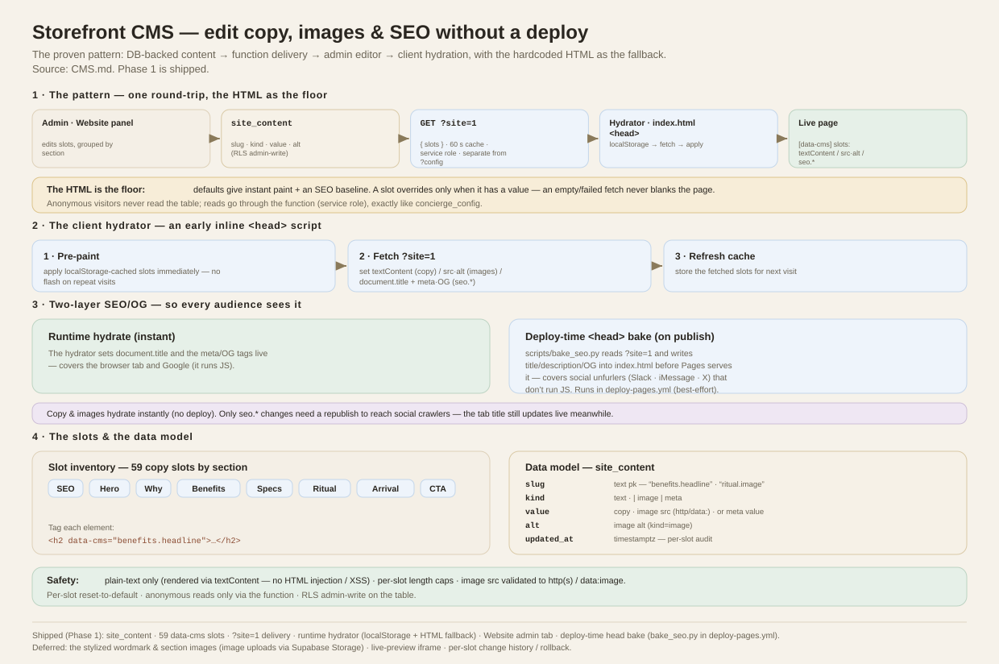

# Storefront CMS — plan

Let admins change the storefront's copy, graphics, and SEO/meta **without a
deploy**, using the pattern already proven by the concierge config, bot images,
and selling style: **DB-backed content → function delivery → admin editor →
client hydration with the hardcoded HTML as the fallback.**

The whole pattern on one page — the DB→function→hydrator round-trip, the client
hydrator, the two-layer SEO, the slot model, and the safety rules:

[](docs/cms-flow.svg)

*[`docs/cms-flow.svg`](docs/cms-flow.svg) — grounded in this document.*

Decisions (locked):
- **Scope:** everything — section copy, swappable images, and SEO/meta
  (`<title>`, description, Open Graph).
- **Delivery:** runtime hydrate; the HTML holds the defaults (instant paint +
  SEO baseline), an early fetch overrides only changed slots, `localStorage`
  caches to avoid flash on repeat visits.
- **SEO/OG:** two layers — runtime hydrate (tab + Google) **and** a deploy-time
  `<head>` bake so social crawlers get correct previews (§6).
- **Data model:** a dedicated `site_content` table (per-slot audit + future
  history/rollback).

---

## 1. Data model — `site_content`

```sql
create table if not exists public.site_content (
  slug        text primary key,               -- 'benefits.headline', 'ritual.image', 'seo.title'
  kind        text not null default 'text',   -- 'text' | 'image' | 'meta'
  value       text,                           -- copy, image src (http/data:), or meta value
  alt         text,                           -- image alt (kind='image')
  updated_at  timestamptz not null default now()
);
```

- **RLS:** reuse the `admin all` policy (authenticated admins write). Anonymous
  visitors never read the table directly — reads go through the function
  (service role), exactly like `concierge_config`.
- Migration `0032_site_content.sql` + mirror in `setup.sql`. No seed required
  (absent slug ⇒ HTML default wins); we may seed a few examples.

## 2. Slot keys — `data-cms` attributes

Tag each editable element in `index.html`; the hydrator queries `[data-cms]`
and replaces `textContent` (copy) or `src`/`alt` (images). Decouples the CMS
from DOM structure and is self-documenting.

```html
<h2 data-cms="benefits.headline">Everything a blanket should have…</h2>

```

Slot inventory (from the current page — finalized when tagging):
- **SEO/meta:** `seo.title`, `seo.description`, `seo.og_title`,
  `seo.og_description`, `seo.og_image`.
- **Hero:** `hero.wordmark`, `hero.subcopy`.
- **Why:** `why.headline`, `why.subcopy`.
- **Benefits:** `benefits.headline` + item titles/body (`benefits.item1…`).
- **Specs:** `specs.headline` + labels.
- **Ritual:** `ritual.headline`, `ritual.subcopy`, `ritual.image`.
- **Arrival:** `arrival.headline` + items (`The knot / seal / register card /
  blanket`).
- **CTA:** `cta.headline`, `cta.price`, `cta.button`.
- **Images:** the section art (today 13 inline base64 webp + `img/*.webp`) each
  gets an image slot.

## 3. Delivery — `GET ?site=1`

New function route returning `{ slots: { slug: {value, alt, kind} } }`, cached
60s server-side like the other config. (Kept separate from `?config=1` so copy
can hydrate before the chat widget loads.)

## 4. Client hydration (in `index.html`)

A small inline script in `<head>`:
1. Apply any `localStorage`-cached slots **immediately** (pre-paint) to avoid
   flash on repeat visits.
2. Fetch `?site=1`; for each `[data-cms]` element set `textContent` or
   `src`/`alt`; for `seo.*` set `document.title` and the meta/OG tags; refresh
   the cache.
3. **Fallback:** the HTML defaults stay; a slot only overrides when it has a
   value, so an empty/failed fetch never blanks the page.

**Safety:** plain-text only (the site already renders via `textContent` — no
HTML injection / XSS); per-slot length caps; image `src` validated to
`http(s)`/`data:image` (reuse the bot-images validator); per-slot **reset to
default**.

## 5. Admin — "Website" panel

New Studio tab grouped by section (SEO, Hero, Why, Benefits, Specs, Ritual,
Arrival, CTA). Each slot is a labeled field showing the default as placeholder;
image slots use the bot-images picker (URL / `data:` now, Storage upload later).
Later polish: iframe live preview, change history/rollback.

## 6. SEO/OG — two layers (decided: include the deploy-time bake)

`seo.*` slots are applied in **both** places so every audience sees them:

- **Runtime hydrate** (instant): the hydrator sets `document.title` and the
  meta/OG tags live — covers the browser tab and **Google** (it runs JS).
- **Deploy-time `<head>` bake** (on publish): a CI step reads the `seo.*` slots
  from `site_content` (via `psql "$SUPABASE_DB_URL"`, already wired) and writes
  the `<title>`/description/OG tags into `index.html` **before Pages serves it** —
  so **social unfurlers** (Slack, iMessage, Facebook, X) that read raw HTML and
  don't run JS also get the right preview.

**Infra change this requires:** today Pages auto-deploys the raw `index.html`
from the branch. To bake the head, Pages must publish through a **workflow**
instead: checkout → run the bake script (rewrite `<head>` from the DB) → 
`actions/upload-pages-artifact` → `actions/deploy-pages`. Copy and images stay
runtime-hydrated (instant, no deploy); **only `seo.*` changes need a republish**
(next push, or a manual `deploy-pages` workflow run) to reach social crawlers.
The tab title still updates instantly via the runtime layer in the meantime.

## 7. Build sequence

1. `site_content` table + RLS (migration `0032` + `setup.sql`).
2. `data-cms` tags across `index.html` (+ finalize the slot manifest).
3. Function `?site=1` endpoint.
4. Client hydrator (inline early script + `localStorage` cache + fallback + SEO
   meta application).
5. Admin **Website** panel (fields per section + image pickers + SEO + reset).
6. **Pages publish workflow** + `<head>` bake script (converts Pages from
   branch auto-deploy to workflow artifact deploy; reads `seo.*` from the DB).
7. Docs + validate (esbuild/node/pg/YAML) + deploy (function + Pages) + bump
   version.

*Effort: sizable — several deploys. Phase it so each slice lands testable:*
*(a) copy → (b) images → (c) SEO meta runtime → (d) Pages workflow + head bake.*

## Future (post-Phase-1)

- **Image uploads** via Supabase Storage (already in [BACKLOG.md](BACKLOG.md)) —
  and migrate the ~1.58 MB of inline base64 art to Storage-served files for a
  real performance win.
- **Live preview** iframe and **change history / rollback** per slot.

---

## Status (shipped)

Phase 1 is live: `site_content` table, `data-cms` slot tags (59 copy slots),
`?site=1` delivery, the runtime hydrator (localStorage-cached, HTML fallback),
and the **Website** admin tab (all copy + SEO, grouped by section). Copy + SEO
hydrate at runtime (browser tab + Google).

The **deploy-time head bake** (`scripts/bake_seo.py`) is live. It reads the
public `?site=1` endpoint (no DB creds) and writes the current
title/description/OG into `index.html <head>` before publish, for social
crawlers. It runs as a step in **`.github/workflows/deploy-pages.yml`** — the
active Pages deployer (Pages source is already **"GitHub Actions"**, so this
workflow builds and publishes the site on every push; `pages-retry.yml`
auto-re-runs it through GitHub's occasional transient "try again later" deploy
errors). The bake is best-effort: `bake_seo.py` exits 0 on any failure, leaving
the HTML untouched, so a publish never breaks on it.

*(Historical note: an earlier `pages.yml` duplicated this deployer under the
mistaken assumption Pages still served from a branch. It was redundant and has
been removed; the bake now lives in the one real deployer.)*

Deferred (noted): the stylized **wordmark** and **section images** (graphics
phase — image uploads via Supabase Storage, per BACKLOG.md), and server-side
caching of `?site=1` if traffic warrants.
