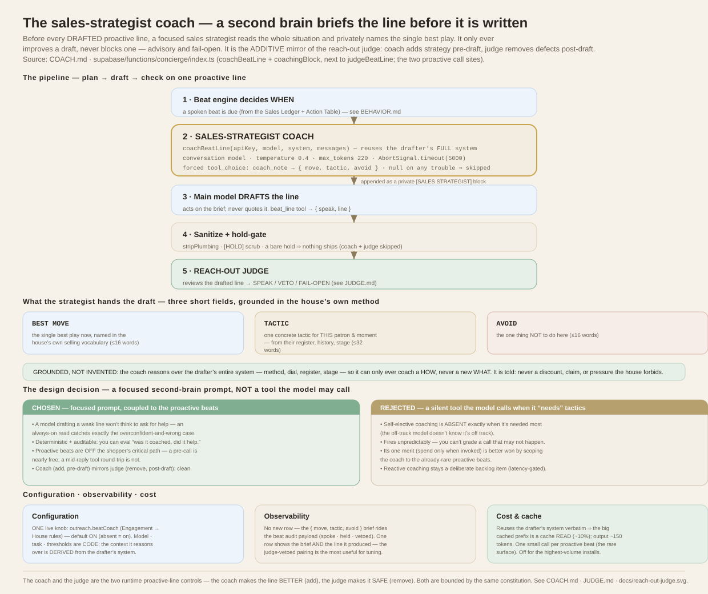
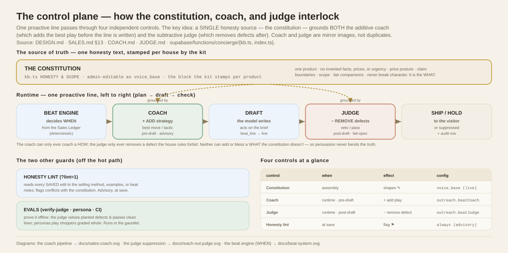

# The sales-strategist coach — proactive-line coaching

How the concierge gets a **second brain** on its shoulder before it speaks
unprompted: an independent, focused *sales strategist* reads the whole situation
and privately briefs the draft with the single best play for this exact moment.
It is the **additive mirror of the [reach-out judge](JUDGE.md)** — the judge
subtracts defects *after* a line is drafted; the coach adds strategy *before*.



**Code:** `supabase/functions/concierge/index.ts` — `coachBeatLine` /
`coachingBlock` (next to `judgeBeatLine`), in-panel call site (the proactive
nudge/opener path), closed-panel bubble call site (`?reengage=1`).
**Companions:** [JUDGE.md](JUDGE.md) (the post-draft gate) · [SALES.md](SALES.md)
(the selling method it draws on) · [BEHAVIOR.md](BEHAVIOR.md) (the beat system) ·
[COST.md](COST.md).

---

## 1. Why it exists

The static selling scaffolding — the [selling method](SALES.md), the assertiveness
dial, the hooks and objections, the exemplars — is injected into *every* prompt.
It is excellent general doctrine, but it is the same doctrine for every
conversation. A **proactive** line is the moment that most wants *situated*
tactics: there is no shopper turn to react to, so the model is choosing both
*whether* to speak and *what play to run*, cold, from the register and history.

The coach supplies exactly that situated read: a dedicated call whose only job is
to look at **this** patron, **this** stage, **this** conversation and name the one
best move — then hand it to the drafting model as a private brief. It raises the
tactical quality of the hardest-to-get-right lines without changing the doctrine.

## 2. Where it sits in the pipeline

The coach runs **before** the line is drafted; the judge runs **after**. Together
they bracket the draft in a clean *plan → draft → check*:

```
Beat engine → decides WHEN to speak (deterministic, from the Sales Ledger)
   │
   ▼
SALES-STRATEGIST COACH   ← reads the full house context + this moment
   · coachBeatLine(apiKey, model, system, messages)
   · returns { move, tactic, avoid }  (or null on any trouble)
   · appended to the drafter's system as a private [SALES STRATEGIST] block
   │
   ▼
Main model DRAFTS the line   → beat_line tool → { speak, line }
   │
   ▼
Sanitize + hold-gate  (stripPlumbing, [HOLD] scrub)
   │
   ▼
REACH-OUT JUDGE  → SPEAK / VETO / FAIL-OPEN   (see JUDGE.md)
```

The coach is **advisory and fail-open**: any error, timeout (>5 s), or empty
result returns `null`, the strategy block is simply omitted, and the line drafts
exactly as it did before the coach existed. It can only ever *improve* a draft,
never block one — and whatever it inspires still passes the judge.

## 3. The coach call — the technical contract

`coachBeatLine(apiKey, model, baseSystem, messages)` makes one Anthropic Messages
API call:

| Parameter | Value | Why |
|---|---|---|
| `model` | `BEAT_COACH_MODEL || model` — **the conversation model by default** | its value is smart, house-grounded tactical reasoning; a dedicated tier can be pinned in code |
| `system` | **the drafter's own system, verbatim**, + one coaching-task block | the coach sees the *identical* house context — and reuses the cached prefix (§10) |
| `temperature` | `0.4` | a little latitude to find a genuinely good play, not just the obvious one |
| `max_tokens` | `220` | it returns three short fields, nothing more |
| timeout | `AbortSignal.timeout(5000)` (5 s) | bounds the added latency; a slow coach is skipped, not waited on |
| `tool_choice` | `{ type: "tool", name: "coach_note" }` | **forces** a structured brief — no prose to parse |

The forced `coach_note` tool's schema is the whole output contract:

```json
{ "type": "object",
  "properties": {
    "move":   { "type": "string", "description": "the single best move now, in the house's own selling vocabulary (<=16 words)" },
    "tactic": { "type": "string", "description": "one concrete tactic for THIS patron and moment (<=32 words)" },
    "avoid":  { "type": "string", "description": "the one thing NOT to do here (<=16 words)" }
  },
  "required": ["move", "tactic", "avoid"] }
```

## 4. What it produces, and how the draft uses it

The three fields are rendered into a private system block and appended to the
drafter's prompt:

```
[SALES STRATEGIST — your house sales lead's private read of THIS moment.
 Act on it in the line you write; never quote it, name it, or hint it exists.]
BEST MOVE: …
TACTIC: …
AVOID: …
```

The drafting model treats it as coaching, not copy — it shapes the line the
shopper sees but is never quoted or revealed (and if it ever leaked, the judge's
plumbing/meta defect would catch it). Because the block is appended **after** the
cached system prefix, it never busts the prompt cache.

**Grounded, not free-associating.** The coach reads the drafter's *entire* system
— the constitution, KB, SOPs, the selling method, the dial, hooks/objections,
this patron's register and client book, the sales stage — so its advice is
already inside the house's honesty rules, price posture, and scope. Its task
prompt says so explicitly: *never coach a discount, a claim, or a pressure the
house forbids.* The coaching is a *how*, never a new *what*.

## 5. The feedback loop — the coach's real edge over the drafter

Everything above still describes a coach reasoning over the *same* inputs the
drafter has. What makes it a genuine second brain rather than a mirror is this:
the coach also sees **what has actually worked for this house lately** — outcome
data the drafter never gets.

Every proactive beat that speaks is already audited (`beat_action`,
`payload.outcome = "spoke"` — see *Observability* below). The loop reads that
trail back:

- **The signal.** For each spoken beat, did the shopper *answer* — a user turn in
  the same conversation within 30 minutes? That reply-or-not is a cheap, honest
  engagement proxy, computed entirely from the existing audit + message tables
  (no new write-path instrumentation).
- **The digest.** `beat_learning_digest()` (a `security definer` SQL function)
  buckets that reply rate by **beat kind × move** over a trailing 14-day window
  and caches the result in `concierge_insights` with a 20-minute TTL — so the hot
  path reads one row and the join recomputes only occasionally.
- **The injection.** `beatLearningBlock()` formats it into a short *"what's
  landing lately"* block and appends it to the **coach's** context (not the
  drafter's). The coach weighs it and distills it into the move/tactic it hands
  down:

  ```
  [WHAT'S LANDING LATELY — this house's OWN outcomes over the last 14 days …]
  - PROPOSE_COMPANION on a nudge: 42% replied (n=19)
  - REASSURE on a bubble: 12% replied (n=8)
  Weigh it: lean toward what's landing … a move that keeps getting ignored — a
  lighter touch, or holding, may beat repeating it.
  ```

Three properties make this the *honest* version of "learning":

1. **It's real reaction, not theory** — this house's own shoppers, this
   fortnight; the one thing the static selling method can't encode.
2. **It's honest about thin data.** Below a floor of spoken beats
   (`COACH_LEARN_MIN_SPOKE`), or with every bucket under `p_min_n`, the block is
   **empty** and the coach falls back to method-only. A quiet house — including a
   fresh demo — gets no fabricated "pattern"; small n is shown, never hidden.
3. **It can argue for restraint.** The block explicitly tells the coach that
   persistent silence after a move is itself a signal, so the loop can push the
   coach *down* to a lighter touch or a hold — not only toward another push. That
   is the direct fix for the coach's one real risk (a bias toward always doing
   something) on a restraint-valued house.

**Config:** `outreach.coachLearning` (default on; set false to feed the coach the
situation but not the outcomes). It rides the same `beatCoach` master switch, and
is **fail-open** — any digest error yields an empty block and the coach still runs.

This is also what makes the coach *measurable*: the audit now carries the coaching
brief **and** the reply outcome on the same rows, so tactic → outcome is queryable
— the raw material for grading the coach's lift and, eventually, letting the
digest drive selection directly (a bandit). See the *Backlog*.

### 5.1 The satisfaction signal (NPS)

Since the NPS loop shipped (see [NPS.md](NPS.md)), the coach's private brief
carries a second grounded input beside the outcome digest: **this customer's
own rating history** — segment, trend, recurring concerns, and a forward play
(`npsCoachBrief` → `renderCustomerNps`, joined at both proactive call sites).
The same honesty floors apply: thin history renders as an empty string, and
the brief opens with the never-quote guard — the coach may *use* the history,
the drafter must never *mention* it, and the reach-out judge independently
vetoes any quoted rating that slips through.

## 6. The design decision — a focused prompt, not a silent tool

This was a genuine fork: make coaching a **focused second-brain prompt** coupled
to the proactive beats, or a **tool the model may call** when it feels it needs
tactics? We chose the focused prompt, for four reasons:

1. **A self-elective tool misses the moments it's most needed.** A model drafting
   a weak line is precisely the model that won't recognize it should ask for help.
   Coaching that fires *because the model requested it* is absent in exactly the
   overconfident-and-wrong cases. An always-on read at the decision point catches
   them. (This is the same reasoning that makes the [judge](JUDGE.md#7-configuration--one-toggle-everything-else-is-code)
   an independent reading rather than a tool the model calls.)
2. **Determinism and auditability.** A coach that always fires at known moments is
   measurable and testable — you can eval "was it coached, and did the coaching
   help." A model-elective tool fires unpredictably; you can't grade a decision
   the model may or may not have made.
3. **Latency placement.** The proactive beats are *off the shopper's critical
   path* — the house is initiating, no one is waiting on a reply — so a serial
   pre-draft call is nearly free perceptually. A tool round-trip in the middle of
   a *reactive* answer sits on the critical path, where the shopper is waiting.
4. **Clean architecture.** Coach (pre-draft, additive) mirrors judge (post-draft,
   subtractive): a coherent plan → draft → check on one surface, each an
   independent second-brain call.

The tool approach has one real merit — it spends tokens only when invoked — but
we get that more predictably by **scoping the coach to the proactive beats**
(already rare) rather than every turn. Extending coaching to *reactive* replies is
a deliberate, documented backlog item (§12), gated on the latency cost.

## 7. Configuration — one toggle; grounding is derived

Like the judge, the coach has exactly one runtime knob — whether it runs — and
everything else is code or derived:

| Setting | Where it lives | Type | Default |
|---|---|---|---|
| **On / off** | `concierge_config.outreach.beatCoach` — admin **Engagement → House rules** ("Coach every reach-out with a sales strategist") | **config** — live, no deploy | **ON** |
| Model | `BEAT_COACH_MODEL` (`index.ts`) — empty ⇒ reuse the conversation model | code | reuse conversation model |
| Task prompt (the strategist framing) | `BEAT_COACH_TASK` (`index.ts`) | code | §3 |
| Temperature · max_tokens · timeout | `coachBeatLine` (`index.ts`) | code | `0.4` · `220` · `5000 ms` |
| The context it reasons over | **derived** — the drafter's full system (constitution, method, register, stage) | derived, not a knob | — |

The check is `oc?.beatCoach !== false`, so **absent means ON**; you only ever set
it to turn coaching *off* (a lever for very cost-sensitive or very high-volume
installs). Held beats never draft a line, so they never invoke the coach.

## 8. Observability

The coach doesn't get its own audit row — it rides the **beat audit payload** that
already records every proactive outcome. When beat auditing is on
(`beat_audit_log`), the `coaching: { move, tactic, avoid }` object is attached to
the `beat_action` (spoke), `beat_hold`, and `beat_veto` rows in
`concierge_actions`. So for any reach-out you can see, in one row, **the brief the
strategist gave and the line that resulted** — including when the judge then
vetoed it, which is the most useful pairing for tuning. (It is *advisory* context,
so it lives on the existing rows rather than adding a new high-volume action.)

Because the reply outcome is derivable from the same trail (a following user turn,
§5), **tactic → outcome is now queryable end-to-end**: the coaching brief, the
line, and whether the shopper answered all hang off `concierge_actions`. That join
is exactly what the feedback loop's `beat_learning_digest()` reads back — and what
makes grading the coach's lift a query, not a guess.

**The loop itself is inspectable.** `GET ?insights=1` (admin-only) returns the
*same* digest the coach reads — reply rate by move × kind — plus the rendered
brief it would be handed right now (honesty floor applied, so you see exactly what
the coach sees, empty and all). `?days=` widens the window; `?fresh=1` bypasses
the cache to recompute. It is **aggregate-only by construction** — counts and
rates by move, never a shopper, a message, or any PII — so it is safe to surface
in the studio (see the privacy data-flow's ROPA row for the loop).

## 9. Cost

One coaching call **per spoken-or-held proactive beat**. It is cheaper than it
looks: because the coach reuses the drafter's system *verbatim*, the large cached
prefix is a cache **read** (~10% of full price), and the coach's own output is
tiny (~150 tokens). The marginal cost is roughly one small structured call on top
of each proactive beat — and proactive beats are the rare surface, not every turn.
Turn it off for the highest-volume installs; leave it on where reach-out quality
is worth pennies per hundred. See [COST.md](COST.md).

## 10. Prompt-cache interaction

The coach is deliberately built to be cache-friendly:

- It passes the drafter's `system` **unchanged** (adding only a small task block
  *after* it), so it shares the same `cache_control` prefix — the coach's read of
  the big brand/KB/method block is a cache hit, not a fresh charge.
- The strategy block it produces is appended to the drafter's system **after** the
  cached prefix, so injecting coaching never invalidates the cache for the draft.

## 11. Relationship to the judge and the other honesty layers

| Control | Reads | When | Effect |
|---|---|---|---|
| **Constitution** (`kb.ts`) | the prompt | assembly | shapes every draft |
| **Sales coach** (this doc) | the full situation | runtime, **pre-draft** | **adds** the best play (advisory, fail-open) |
| **Reach-out judge** ([JUDGE.md](JUDGE.md)) | the drafted line | runtime, **post-draft** | **removes** defects (fail-open) |
| **Honesty lint** (`?lint=1`) | a saved edit | at save | advisory flag |

The coach and judge are the two runtime, proactive-line controls, and they are
complementary: the coach makes the line *better*, the judge makes sure it's *safe*.
Neither can weaken the house's honesty — the coach is bounded by the same
constitution the judge enforces.

**The whole interplay in one picture** — the control plane, showing how a single
constitution grounds both the additive coach and the subtractive judge, with the
honesty lint and evals as the guards around them:



## 12. How the kit (`concierge-kit`) provisions the coach

- **Vendored unchanged.** `coachBeatLine`, `coachingBlock`, `BEAT_COACH_MODEL`,
  and `BEAT_COACH_TASK` live in the pristine `engine/` snapshot and appear in
  neither stamp manifest, so every stamped store gets the coach byte-identical,
  pinned to `ENGINE_VERSION`.
- **House-grounded for free.** The coach reasons over the drafter's full system,
  which the kit already stamps per product (constitution, KB, SOPs, selling
  method). So a stamped store's coach automatically advises within *that* store's
  method and honesty rules — the 996 pilot's "offers welcome" posture, for
  instance, lets the coach suggest inviting an offer, which the same store's judge
  then treats as legitimate rather than "invented commerce."
- **Defaults ON with no seed.** `beatCoach !== false` means absent = on.
- **Gate-clean.** The task prompt is brand-neutral, so it introduces no leakage
  surface for `stamp/forbidden-strings.txt`.

## 13. Backlog / open ideas

Mirrored in [BACKLOG.md](BACKLOG.md).

- **[Shipped] The feedback loop (§5).** The coach now reads the house's own
  outcome digest (`beat_learning_digest` → reply rate per move/kind), so it
  reasons over real reactions the drafter never sees — the change that makes it a
  second brain rather than a mirror.
- **Bandit-driven selection** *(the loop's natural next step).* Today the digest
  *informs* the coach's judgement; a stricter version could let reply-rate drive
  move selection directly (Thompson sampling over moves per segment), with the
  coach explaining and the constitution still bounding it. Needs the eval below to
  guard against optimising for replies over the *right* replies.
- **Reactive coaching at stage transitions** *(scope).* Today only *proactive*
  lines are coached. A stricter product could coach reactive replies too — but on
  the shopper's critical path, so gated to high-value moments (a detected stage
  advance, a first price objection) rather than every turn, to bound latency.
- **Eval the coach's lift** *(near-term — now measurable, §8).* Add a persona-eval
  pairing that runs a proactive scenario coach-on vs. coach-off vs. inline-planning
  and grades the tactical-quality delta. The loop makes the *field* signal
  (tactic → reply rate) queryable too, so lift can be measured live, not only in
  the eval harness.
- **Configurable coach model tier** *(small).* `BEAT_COACH_MODEL` is a code
  constant; expose it per install for cost/quality trade-offs (e.g. a cheaper
  strategist at very high volume).
- **Surface the brief in the transcript viewer** *(small).* The coaching already
  rides the audit payload; render it inline next to the line it shaped, the way
  vetoes already show the killed line and reason.
