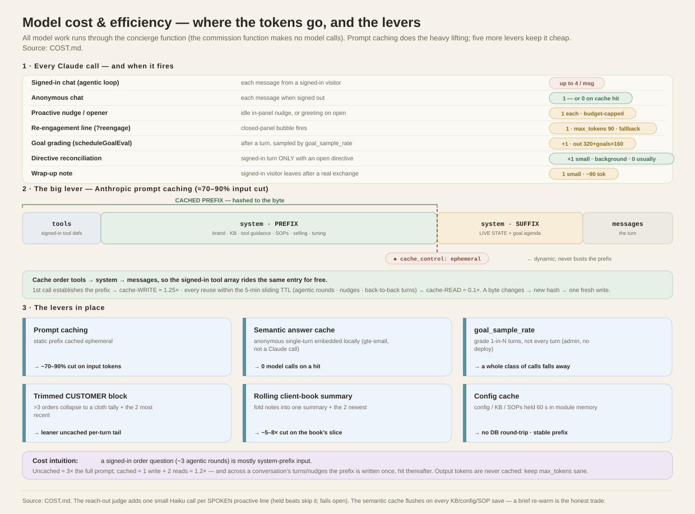

# Model cost & efficiency

Where the concierge spends Claude tokens, and the levers that keep it cheap. All
model work runs through the **concierge** edge function; the commission function
makes no model calls.

Spend is **measured, not guessed**: the meter (below) logs every call with its
purpose, and the admin's **Spend tab** reports cost per conversation, spend by
service, and customer vs testing — see "The meter" section.

The whole picture on one page — every Claude call and its cost, the prompt-cache
mechanism, and the six levers:

*[`docs/cost-model.svg`](docs/cost-model.svg) — grounded in this document.*

## Every Claude call, and when it fires

| Call | Trigger | Notes |
| --- | --- | --- |
| **Signed-in chat** (agentic loop) | each message from a signed-in visitor | **up to 4 calls per message** — it loops to run tools (get_my_orders → answer, etc.). A no-tool reply is 1 round. |
| **Anonymous chat** | each message when signed out | 1 call — **or 0** on a semantic-cache hit (see below). |
| **Proactive nudge / opener** | an idle in-panel nudge, or the greeting spoken on panel open | 1 call each. Capped per conversation by the outreach budget. |
| **Re-engagement line** (`?reengage`) | each time the closed-panel bubble fires | 1 call (`max_tokens: 90`). Has a client-side fallback line, so it can be skipped. |
| **Goal grading** (`scheduleGoalEval`) | after a turn, sampled by `goal_sample_rate` | +1 call. Output budget **scales with goal count** (`320 + goals×160`, cap 2000) so the per-goal JSON can't truncate. `goal_sample_rate` 1.0 = every turn; lower to cut. |
| **Directive reconciliation** (`reconcileDirectives`) | after a signed-in turn **only when the patron has an open one-time house directive** | +1 small, tool-scoped call. Background (`EdgeRuntime.waitUntil`), never on the shopper's critical path. Zero cost for the common case (no open directive). |
| **Wrap-up note** | signed-in visitor leaves, real exchange happened | 1 small call (~90 tok) to write a client-book line. |

## The levers (in place)

### 1. Prompt caching — the big one
Every call used to re-send the whole system prompt (brand voice + **full KB** +
tool definitions + SOPs + hooks/objections + tuning) as fresh input — several
thousand tokens, and the dominant cost given how many calls there are.

`buildSystemPrompt` now returns **`{ prefix, suffix }`**:
- **`prefix`** — everything static (brand, KB, tool guidance, SOPs, selling
  angles, objections, assertiveness, admin tuning notes). Sent as a
  `cache_control: { type: "ephemeral" }` content block.
- **`suffix`** — everything dynamic (LIVE STATE = browsing context + the
  customer's orders/standing, plus the per-conversation goal agenda). A second,
  uncached block, so it never busts the cached prefix.

Because the **tools array precedes `system`** in Claude's cache order, the
signed-in tool definitions are cached under the same breakpoint. Result: any call
that reuses the prefix within the **5-minute cache TTL** — the 2nd–4th agentic
rounds of one message, nudges, back-to-back turns — pays **~10%** of that input
instead of 100%. Realistically a 70–90% cut on input tokens.

Implementation notes: live state was moved out of `BRAND_SYSTEM` (kb.ts) to the
dynamic tail so the prefix is stable; the three chat call sites send `system` as a
two-block array and carry the `anthropic-beta: prompt-caching-2024-07-31` header.
One caveat since the structured beat decisions: the proactive nudge/opener call
carries a `tools: [beat_line]` block, and tools precede `system` in the cached
prefix — so proactive beats and plain anonymous chat now form **separate cache
lineages**. Beats still cache against each other (the beat tool is byte-stable);
the loss is only the cross-path reuse, minor at this traffic.

The reach-out judge (`outreach.beatJudge`, default on) adds **one small Haiku
call per SPOKEN proactive line** — a ~600-token review at Haiku pricing,
pennies per hundred reach-outs. Held beats skip it (nothing to review), and it
fails open, so a judge outage costs quality review, never availability. Turn
it off in Engagement → House rules if even that margin matters.

The sales-strategist coach (`outreach.beatCoach`, default on) adds **one call
per proactive beat**, but a cheap one: it reuses the drafter's system *verbatim*,
so the large brand/KB/method prefix is a cache **read** (~10% of full price), and
its own output is tiny (~150 tokens). By default it runs on the conversation model
(the value is smart tactical reasoning — a dedicated tier can be pinned via
`BEAT_COACH_MODEL`). It is proactive-only (the rare surface), advisory, and
fail-open. For the highest-volume installs, turn it off in the same panel; for
most, reach-out tactical quality is worth the marginal call. See [COACH.md](COACH.md).

The semantic answer cache now **flushes on every knowledge/config/SOP save**
(a Postgres trigger — an edited fact must never keep serving its stale cached
answer). The cost is a brief re-warm: the first anonymous asker of each common
question after a save pays a live model call instead of a cache hit. At this
traffic that's noise; it is the honest trade. The advisory honesty lint
(`?lint=1`) is one Haiku call per **changed prompt-text save** — admin-only
and effectively free.

#### How Claude's prompt cache actually works (the mechanism)

This is Anthropic's server-side **prompt caching**, not something we store. What we
control is *where the cache breakpoint sits* and *whether the cached bytes stay
identical*. The rules that matter for us:

- **A breakpoint marks a reusable prefix.** Adding `cache_control:{type:"ephemeral"}`
  to a content block tells Claude: "hash everything up to and including this block;
  if a later request repeats that exact prefix, reuse the computed state." We put
  the breakpoint on the static `prefix` block only.
- **Cache order is `tools` → `system` → `messages`.** Everything *before* the
  breakpoint is part of the cached prefix. That's why the signed-in tool array
  (sent as `tools`, ahead of `system`) rides the same cache entry for free — and
  why the dynamic `suffix` (a *second, un-marked* system block) and the per-turn
  `messages` sit **after** the breakpoint and never invalidate it.
- **Byte-identical or miss.** The cached prefix must match to the character. A
  single changed token anywhere in it — a KB edit, a new SOP, a tuning tweak —
  produces a new hash and a fresh **cache write**. This is why config/KB/SOPs are
  held in module memory for 60 s (lever 5): so the assembled prefix is stable
  across the burst of calls in one conversation.
- **Write vs. read pricing.** The first call that establishes a prefix pays a
  **cache-write** (~1.25× normal input for those tokens); every later call that
  hits it pays a **cache-read** (~0.1×). So the economics only win when a prefix is
  *reused* — which our traffic does constantly (agentic rounds, nudges, and any two
  turns within the TTL all share one prefix).
- **5-minute sliding TTL.** Each hit **refreshes** the 5-minute window, so an
  active conversation keeps the prefix warm indefinitely; only a >5-min lull lets
  it lapse, and the next call simply re-writes it. There is no eviction we manage
  and no correctness risk if it lapses — a miss just costs one more write.
- **What is *never* cached:** the reconciliation and grader calls are one-shot
  background calls with their own small system prompts and no breakpoint — they
  don't reuse the chat prefix, so they pay plain input each time (kept tiny on
  purpose).

### 2. Semantic answer cache (anonymous) + baked starter answers (everyone)
Anonymous, single-turn questions are embedded (gte-small, local — **not** a Claude
call) and matched against `concierge_cache`. A hit returns the stored answer with
**zero** model calls. Skipped for anything about live/personal state.

Ahead of the semantic match sits the **pinned tier**: conversation starters get
pre-authored answers at setup time (one judge call per starter, KB-grounded),
then serve by exact `norm_key` match with zero model **and** zero embedding
calls — any turn, any visitor. The most-tapped buttons on the page never touch
the meter again; `purpose='starter-bake'` rows are the only spend, and the
Starter probe workflow proves the zero live.

### 3. `goal_sample_rate`
Admin-tunable (Tuning → Engagement pace). At `1.0` the grader runs on every
eligible turn; drop to ~`0.2` to grade 1 in 5 — analytics stay representative and
a whole class of calls falls away. No deploy.

### 4. Trimmed CUSTOMER block
The signed-in LIVE STATE tail (uncached, re-sent every turn) used to list **every**
order inline — ~600–700 tokens on a heavy account, for data the prompt tells the
bot to ignore in favour of `get_my_orders`. Now: ≤3 orders still list inline
(cheap, natural greeting); **>3 collapse to a cloth tally + the two most recent**,
with an explicit "call `get_my_orders` for the full list." Cheaper per turn, and
one authoritative order source (which also prevents miscounts).

The client **book** does the same by consolidation (see below).

### 4b. Rolling client-book summary
The AI client book also rides the uncached tail, so a long-standing patron's ~14
notes are re-sent every turn — cost scales with note count on exactly the
highest-touch (most valuable) patrons. `consolidateClientBook` folds the raw
`fact`/`event`/`reflection` notes into **one `kind='summary'` digest** (background,
threshold-gated at ~8 new notes, plus an admin Regenerate button). The CUSTOMER
block then injects **the summary + the 2 newest notes** instead of the whole pile
— roughly a **5–8× cut** on the book's slice of the per-turn tail — while older
detail stays reachable on demand via `recall_context`. Directives are never folded
in, so a house note can't be buried by the compaction.

### 5. Config cache
`concierge_config`/KB/SOPs/tools are read once and held in module memory for 60s,
so the prompt is assembled from memory, not a DB round-trip, on most calls. (This
also keeps the cached prefix identical for the TTL.)

## The meter — measured spend (shipped)

The intuition below is now backed by measurement: every model call is logged
at the source and reported on the admin's **Spend tab**. "What does a
conversation cost?" and "where did that spike come from?" are answered by the
system's own numbers, not by squinting at the provider's daily bar chart.

## The ledger — `concierge_llm_usage`

One row per model call, written fire-and-forget by the edge function (the
meter **never** blocks or breaks serving; every failure path swallows):

| column | meaning |
| --- | --- |
| `purpose` | which job made the call — the full vocabulary is below |
| `model` | the model that actually answered (from the API response, not the request) |
| `input_tokens` / `output_tokens` | what the API reported for this call |
| `cache_read_tokens` / `cache_write_tokens` | prompt-cache traffic (priced differently) |
| `conversation_id` | set when the call belongs to a conversation (main replies, tool rounds) |
| `qa` | `true` when the session key starts with `qa-` — CI smoke and the eval deck |

Writes are service-role only (RLS with no policies), and admins read
**aggregates** via the RPC — never rows. Retention: `prune_high_write(p_days)`
deletes ledger rows past the cutoff along with the other high-write tables.

## The purpose vocabulary

Conversation-attributed (carry `conversation_id`):

- `chat` — the main streamed reply (usage captured from the SSE
  `message_start` / `message_delta` events)
- `chat-tools` — the non-streamed register tool rounds ("Consulting the
  register…"), up to 4 per turn

Session-flagged (QA detectable, no conversation row):

- `beat` — proactive beat lines (opener / nudge / outreach drafting)

Overhead (aggregate attribution only):

- `judge` / `coach` — the inline judge gate and the sales-coach grounding
- `nps-categorize` / `nps-report` — survey reason tagging; the analyst report
- `directives` / `clientbook` / `notes` / `goals` — house-note reconciliation,
  client-book consolidation, note writing, goal grading
- `starters` — admin "AI generate" conversation starters
- `starter-bake` — the setup-time pass that pre-authors baked starter answers
  (one Haiku call per starter, once — the taps themselves never meter)
- `eval-judge` / `lint` / `prompt-review` — the eval grader and the advisory
  honesty lint
- `reengage` — the return-visit bubble line

## The report — `llm_cost_metrics(p_days)`

Same guard as `nps_metrics` (concierge admin JWT or service role), aggregate
only. Returns per-purpose×model token totals with QA splits (including cache
splits), conversation-attributed totals by model, distinct customer/QA
conversation counts, and per-day buckets grouped **by model** — so per-day
dollars are priced exactly rather than blended.

The admin surface is the dedicated **Spend tab** — the API-consumption view a
merchant expects:

- **KPI row**: Customer spend (with a delta vs the prior window), Per
  conversation, Per reply, Testing & deploys (with delta), Cache savings
  (what prompt caching avoided), and a Monthly pace projection from days
  that actually have data.
- **Four trend charts** with Range + View-by (day/week/month): estimated
  spend, model calls, tokens in/out, and cache hit rate — customer and
  testing series drawn apart.
- **Where the money goes** — purposes rolled up to merchant language:
  *Serving customers* (chat + register tool rounds), *Proactive selling*
  (beats, re-engage, coach, judge), *Satisfaction (NPS)*, *Studio &
  housekeeping*, and *Testing & deploys* (ALL `qa-` spend plus the eval
  grader, wherever it occurred). The eval deck runs on **every deploy**, so
  heavy shipping days spike in Testing — the first place to look when the
  provider's chart jumps.
- **By model** tier split, the full costliest-first purpose table, and the
  editable price table.

## Pricing — estimates, labeled as such

The ledger stores **tokens**; dollars are computed in the admin from an
editable per-model price table (defaults: haiku 1/5, sonnet 3/15, opus 5/25
$ per million in/out) stored in the browser (`cx_llm_prices`). Cache reads
are priced at 10% of the input rate and cache writes at 125% — the standard
prompt-caching shape. When provider prices change, edit the table; history
reprices instantly because only tokens are stored.

## Honesty notes

- The ledger begins at its ship date — **no historical backfill exists**, so
  the card cannot explain spend from before it shipped.
- Purposes without `conversation_id` are real cost but can't be pinned to one
  conversation; they appear in totals and the purpose table, not in the
  per-conversation figure. The per-conversation number is therefore a floor
  for "fully loaded" cost — the purpose table shows the rest.
- `qa` is keyed on the `qa-` session prefix; the judge/coach/housekeeping
  calls made *on behalf of* a QA conversation are not conversation-linked and
  so land in overhead — QA spend is likewise a floor, not a ceiling.
- A `beat` row is written even when the beat later holds or is vetoed — the
  drafting call was made and paid for either way.

## Backlog (deliberately deferred)

These are held back on purpose: each trades some **quality** for cost, and with
prompt caching already doing the heavy lifting, the tradeoff isn't worth it yet.
Revisit if spend becomes a concern at scale.

- **Template the re-engagement line** — the client already has a solid fallback;
  skip the `?reengage` model call entirely, or only use the model at higher
  assertiveness.
- **Trim `get_my_orders`** — a patron with many orders makes a large JSON that is
  re-sent each agentic round; return a leaner shape.
- **Cap agentic rounds** lower than 4 if the 4th is rarely reached.
- **Cache the grader prompt** — the goal-grading system prompt is static and could
  take its own cache breakpoint.

## Rough cost intuition

For a signed-in order question (~3 agentic rounds) the system prefix is the bulk
of input. Uncached that's ~3× the full prompt; with caching it's ~1 write + 2
hits ≈ 1.2× — and across a conversation's many turns/nudges within the TTL, the
prefix is written once and hit thereafter. Output tokens (the reply itself) are
unaffected by caching, so keep `max_tokens` sane and lean on the semantic cache
and `goal_sample_rate` for the rest.
