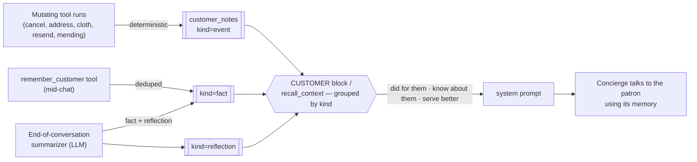
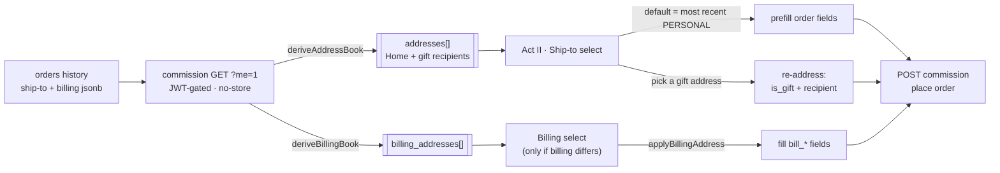
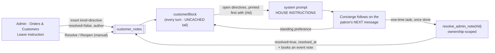

# Feierabend (Decke 01) — Design Document

The *why* behind the build: the product concept, the people it serves, the
architecture, and the design decisions and trade-offs that shaped it.

For the *how*, see the reference docs: **[`SETUP.md`](SETUP.md)** (run &
verify), **[`supabase/README.md`](supabase/README.md)** (backend & wire
contracts), **[`supabase/SCHEMA.md`](supabase/SCHEMA.md)** (every table/field).

> **This is a demo.** No product is sold and no payment is processed. The brand,
> imagery, and video are fictional and AI-generated. It exists to explore one
> idea end-to-end: *what does a genuinely attentive AI sales concierge feel like
> for a scarce, considered purchase?*

---

## 1. Concept & goals

**Feierabend — Decke 01** is a single, limited-edition object: a numbered German
wool blanket, 15,000 pieces, woven to order. The site sells it the way a small
luxury house would — not with urgency banners and stock counters, but with a
**concierge** who knows the cloth, remembers you, and treats you according to
your history with the house.

The design goals, in priority order:

1. **Clienteling, not a help desk.** The concierge should behave like a real
   luxury sales associate: greet returning patrons by name, know their standing,
   remember what they told you last time, and drive toward a sale with patience,
   not pressure.
2. **Scarcity done honestly.** Each of the 15,000 numbers is unique; the number
   you're shown is the number you get; a cancelled number returns to the edition.
   No fake counters.
3. **Everything the merchant tunes is data, not code.** Voice, knowledge,
   procedures, forms, and conversation goals are all editable in an admin studio
   without a redeploy.
4. **No servers to run.** A static site plus serverless functions plus a managed
   Postgres — cheap, and it scales to bursts without operational babysitting.
5. **Privacy by minimization.** Collect only what the demo needs; make the
   security boundary the database itself.

---

## 2. User stories

Grouped by role. Each notes, in *italics*, the feature that serves it.

### 2.1 Guest — anonymous visitor (no account)

- **As a first-time visitor**, I want to understand the object and get a question
  answered without signing up, so that I can decide if it's for me. *(Anonymous
  chat; semantic cache serves common questions instantly.)*
- **As someone just browsing**, I want the concierge to notice I'm here and open a
  relevant thread — but to ease off if I'm clearly not engaging — so that it feels
  attentive, not spammy. *(Proactive openers + presence-aware nudging.)*
- **As anyone mid-message**, I want the concierge to never talk over me while I'm
  typing — my composer must stay live and my keystrokes must never be swallowed —
  so that its proactive lines feel like a considerate person, not a UI that fights
  me. *(Proactive turns defer while composing and never disable the input; if one
  is already speaking, hitting send lets me take over.)*
- **As an undecided guest**, I want to start a commission and see my number held
  while I decide, without an account, so that scarcity feels real but low-friction.
  *(`?hold=1` reserves a number for the visit.)*
- **As a guest who's warming up**, I want to be invited — gently, occasionally —
  to leave my email so I'm remembered next time, so that signing in feels like a
  courtesy, not a gate. *(Periodic email invite in later check-ins.)*
- **As a guest ready to buy**, I want to commission with just an email
  verification, so that I don't have to create a password. *(Magic-link OTP guest
  checkout.)*
- **As a returning patron**, I want my email already filled in when I sign in
  again, so that I don't retype it every visit. *(The last email used to request a
  key — and the last one actually verified — is kept in `localStorage`
  (`feier_last_email`) and prefills the sign-in row, selected so a tap-Enter sends
  or a keystroke replaces it. Device-local convenience; it deliberately survives
  sign-out and never leaves the browser.)*

### 2.2 Customer — signed-in / returning patron

- **As a returning patron**, I want to be recognized the moment I arrive — greeted
  by name, my orders and standing known — so that I don't have to repeat myself.
  *(Customer block: name, standing, orders, client book, re-engagement recency.)*
- **As a patron mid-conversation**, I want to sign in and keep the same thread, so
  that signing in is continuity, not a reset. *(Anonymous → signed-in adoption.)*
- **As a returning patron placing another order**, I want my saved addresses
  offered so I don't re-type them — my own door *and* the people I've shipped
  gifts to — so that a re-order (or "send Oma another") is a tap, not a form.
  *(Checkout Act II address book: `GET ?me=1` returns the managed `saved_addresses`
  (or a derived fallback) — personal + past gift recipients; picking a gift
  address re-addresses the order to that recipient. See §4.12.)*
- **As a patron managing my details**, I want to **remove** (or edit) a saved
  address I no longer use, so that my address book stays mine — not just a
  read-only echo of every place I've ever shipped. *(Managed `customer_addresses`
  table: a "Remove this saved address" link at checkout → commission
  `POST ?address_delete`; add/edit via `POST ?address_save`. Backfilled from
  history and auto-saved on each order. See §4.12.)*
- **As a customer with an order**, I want to check status, change the shipping
  address or colorway, or cancel — in chat, myself — so that I'm not emailing
  support. *(Register tools, gated to still-mutable orders, fully audited.)*
- **As a customer who lost the email**, I want the concierge to re-send my order
  confirmation, shipping note, or cancellation to the address on file, so that a
  missing note isn't a support ticket. *(`resend_confirmation` tool → service-only
  commission `?custresend=1`, kind checked against the order's real status.)*
- **As a customer with a question about my blanket**, I want to track where it is,
  ask how to care for the wool, fix the name on a gift card, or open a mending
  request — all in chat — so that the concierge is a real service desk, not just a
  salesperson. *(`track_shipment`, `get_care_guide`, `update_gift_details`,
  `request_mending` — ownership-scoped, audited; see* [`TOOLS.md`](TOOLS.md)*.)*
- **As a valued patron**, I want to be treated according to my standing — more
  deference the more I've bought — so that loyalty is felt, not just logged.
  *(LTV tiers: Eintrag → Wiederkehr → Hausfreund → Stifter.)*
- **As a patron the house knows**, I want it to remember what I told it last time
  (the room, the person, the cloth I favored) *and* what it did for me (a
  cancellation, an address change), so that each visit builds on the last and I
  never have to re-explain. *(Typed client book — `fact`/`event`/`reflection`
  notes read back grouped into the prompt; `recall_context`; see §4.10.)*
- **As a patron with a special arrangement**, I want a promise the team made me
  (a waived rush fee, an apology for a delay, an address quirk they'll double-check)
  to actually be honoured next time — without my having to re-explain or prove it —
  so that the house feels like it keeps its word. *(House directives: a human's
  `kind='directive'` note the concierge is instructed to follow on my next visit,
  woven into service rather than quoted back. See §4.13.)*
- **As someone who's done for now**, I want to say "that's all" or "don't message
  me until I write back" and have it respected, so that I'm in control.
  *(Customer-signalled close / quiet mode + auto wind-down.)*
- **As a customer who just purchased**, I want a warm acknowledgement now and a
  welcome-back next time, so that the relationship continues past the sale.
  *(Post-purchase check-in + re-engagement.)*

### 2.3 Gift-giver (a customer buying for someone else)

- **As a gift-giver**, I want the recipient's name on the register card but the
  order in my name, so that the gift is theirs and the record is mine.
  *(Purchaser vs. recipient split.)*
- **As a gift-giver**, I want different billing and shipping addresses, so that it
  ships to them and bills to me. *(Separate billing/shipping.)*
- **As a gift-giver**, I want the concierge to handle the gift framing naturally,
  so that it feels considered. *(Gift-aware prompt + card copy.)*

### 2.4 Merchant — content & operations admin

*Everything below is a tab or control in the admin studio (`admin.html`): Tuning,
Knowledge, Procedures, Cache, Customers, Conversations, Website, Tools.*

**Tuning the concierge**

- **As the merchant**, I want to tune the concierge's voice, the greeting, and the
  starter prompts without a deploy, so that I can iterate on tone live. *(Tuning
  tab: config + voice notes + starters — DB-backed, 60s cache.)*
- **As the merchant**, I want to control how quickly and eagerly the concierge
  reaches out — the in-chat follow-up delays, the idle reach-out when the widget
  is closed, and whether it engages a visitor who hasn't scrolled — so that I can
  dial engagement from attentive to restrained without a deploy. *(Tuning tab:
  Engagement pace → `outreach` config, delivered to the widget via `?config=1`.)*
- **As the merchant**, I want to edit the knowledge base and the selling
  procedures (SOPs) that the concierge follows, so that policy and pitch are mine
  to control. *(Knowledge tab + Procedures tab; injected into the system prompt.)*
- **As the merchant**, I want to define the goals of every conversation and see,
  per chat, which were met — with the evidence — so that I can measure quality.
  *(Procedures tab: admin-editable goals; LLM-judge scoring with cited
  justifications.)*
- **As the merchant**, I want to keep a deck of behavior tests — "shows the
  commission button on a buying signal," "never leaks `[HOLD]`," "reads the
  register instead of guessing" — edit them without a deploy, run them against
  the live concierge, and see a pass rate with the actual replies, so that I can
  prove a prompt or model change didn't quietly break something I fixed. *(Evals
  tab: `concierge_evals` scenarios + typed checks; in-browser replay + an
  admin-gated server-side binary LLM judge; see §4.9 and* [`evals/README.md`](evals/README.md)*.)*
- **As the merchant**, I want one place that shows everything the concierge can
  *do*, lets me switch each capability on or off and re-instruct it, **and lets me
  create new capabilities myself** — so that the bot's powers are mine to shape
  without waiting on a deploy. *(Tools tab, two kinds:*
  - ***Model tools** — code-backed actions the model calls (`get_my_orders`,
    `resend_confirmation`, `cancel_order`, …). Enable/disable + description overrides
    live in `concierge_tools`, merged over the code defaults (`buildToolsForModel`)
    before the tool list reaches the model; the catalog comes from `?tools=1`. New
    model tools need a handler (developer).*
  - ***Form tools** — in-chat forms the bot hands out (`concierge_forms`), which the
    merchant **creates, edits, enables, and removes right in the panel**: pick a
    write path, define the labelled fields, done. This is the no-code way to add a
    new capability — and the safe way to collect what the model shouldn't free-type
    (an address).*
  *Full design:* [`TOOLS.md`](TOOLS.md)*,* [`FORMS.md`](FORMS.md)*.)*

**Running the register (orders, fulfillment, edition)**

- **As the merchant**, I want to set the edition's run size and the next number to
  issue, so that I can open a fresh edition or frame the scarcity story without
  touching the database. *(Tuning tab: Edition card → `get_edition`/`set_edition`;
  the storefront ticker reads it live.)*
- **As the merchant**, I want the register as a scannable table — one line per
  order with a status badge and cloth colour dot — that I can filter by status,
  sort by any column, and multi-select for **bulk** fulfilment, cancellation,
  resend, or export, so that working a queue of orders isn't one accordion click
  at a time. *(Orders & Customers tab → **Orders** view: compact order table +
  status count chips + sortable headers + bulk action bar. See §4.11.)*
- **As the merchant**, I want to advance an order through fulfillment
  (`placed → weaving → finishing → shipped → delivered`, or `returned`) and attach
  a tracking number, so that a real order can actually move — and the customer is
  emailed when it ships or is returned. *(Order **detail drawer**: fulfilment
  control → commission `POST ?fulfill=1`, admin-gated, audited, sends email; bulk
  "Advance to…" / "Cancel" run the same endpoint over a selection.)*
- **As the merchant**, I want to see which transactional emails were sent for an
  order (confirmation, shipment, return, cancellation) — including failures — and
  re-send any of them, so that a customer who lost or never got a note isn't left
  in the dark. *(Order detail drawer: per-order email timeline from `email_log`;
  resend via commission `POST ?resend=1`, admin-gated; bulk resend too.)*
- **As the merchant**, I want to look up every order placed from a given **IP
  address** (and see, per order, which IP it came from), so that when I have to
  report abuse to authorities I can pull the whole trail. *(Search box accepts an
  IP in both views; resolved via `orders.chat_session ↔ conversations.session_key
  ↔ conversations.ip`. The drawer shows and links the order's origin IP.)*
- **As the merchant**, I want to leave the concierge a **standing instruction for
  a specific patron** — an order exception or special handling — so that when they
  return, the bot follows my note without me having to be there. *(House directive:
  a `kind='directive'` client-book note I write in the Patrons view or the order
  drawer; surfaced at the top of that patron's CUSTOMER block on their very next
  message, since the customer block is rebuilt per turn in the uncached prompt
  tail. See §4.13.)*
- **As the merchant**, I want a **one-time** instruction (apologise for a delay,
  confirm a detail before shipping) to be checked off once the concierge has
  actually carried it out — while a **standing** preference keeps applying — so
  that the list reflects what's still outstanding. *(Directives carry a `resolved`
  flag: the concierge calls `resolve_admin_note` after doing a one-time task; I
  can also Resolve/Reopen any directive by hand. An SOP tells the bot to check for
  these every signed-in visit, follow them, and resolve only what it has done.)*
- **As the merchant**, I want **one place that shows every house note across all
  patrons** — open vs. resolved, who left it, when — and, for one the concierge
  acted on in a chat, a jump straight to **that conversation**, so that I can
  follow up and audit at a glance. *(Orders & Customers → **House notes** view:
  lists all `kind='directive'` notes; filter open/resolved/all; Resolve/Reopen,
  Delete, View customer, and "Find the chat" via the `resolve_admin_note` audit
  action → `conversation_id`. See §4.13.)*
- **As the merchant**, I want to **bulk-add** a house instruction to many
  customers at once, and **bulk resolve / reopen / delete** notes, so that I'm not
  editing one at a time. *(Orders view bulk bar → "Leave note…" writes one
  directive to each distinct customer behind the selected orders; House notes view
  has a filter + Select-all + a bulk Resolve/Reopen/Delete bar.)*
- **As the merchant/operator**, I want house-note handling **graded like every
  other goal**, and I want the **chats that acted on a note tagged** so I can
  audit them, so that "did the bot follow the house's instruction" is measured,
  not assumed. *(The `house-notes` goal — the grader is fed the patron's directive
  text so it's judgeable; the Conversations list shows a `🏷 house note #N` chip
  on any chat where the concierge resolved one. See §4.13.)*
- **As the merchant**, I want a single-order drawer that consolidates **the
  customer** (name, standing, lifetime value, blankets, last order, note count),
  **this order's** shipping *and* billing (both editable), its emails, and the
  patron's client book + a leave-a-note box — so that managing one order needs
  nothing else open. *(Order detail drawer sections: Customer → Fulfillment →
  Shipping & billing → Emails → Client book & house instructions.)*
- **As the merchant**, I want to correct an order's **billing** address (or set it
  back to "same as shipping"), not just shipping, so that a mis-entered billing
  record can be fixed. *(Drawer "Shipping & billing" → Edit billing address →
  commission `POST ?editbilling=1`, admin-gated, writes the `orders.billing`
  jsonb.)*
- **As the merchant**, I want to see every **register action** the concierge took
  on a customer's behalf — status reads, address and colorway changes,
  cancellations, context recalls, notes written — so that nothing the bot did to
  the register is invisible to me. *(Register-action log: `concierge_actions`,
  surfaced in the studio; every order change also captured in `order_events`.)*
- **As the merchant**, I want to see each customer's lifetime value, their orders,
  and what the concierge learned *and did* for them, so that I can serve them well.
  *(Orders & Customers tab → **Patrons** view: one card per buyer, sortable by
  standing / value / recency / name / notes, with LTV, order history, and the
  typed client book — `event`/`fact`/`reflection` notes, each tagged; recording
  policy tunable in Tuning → Client book. See §4.10.)*
- **As the merchant**, I want a real waitlist — captured when the edition sells
  out (a form on the sold-out state) and by the concierge in chat — that I can
  filter, mark people notified on, and export to email, so that demand past a
  full run isn't lost. *(Customers tab: Waitlist card; `waitlist` table;
  commission `POST ?waitlist=1`; concierge `join_waitlist` tool.)*
- **As the merchant**, I want to know the concierge is actually selling, so that I
  can justify it — so I need its assisted revenue attributed. *(Order ↔ chat
  attribution via `chat_session`.)*

**Quality & knowledge upkeep**

- **As the merchant**, I want to browse conversations and feedback and see where
  the concierge lacked an answer, so that I can improve the knowledge base.
  *(Conversations tab + feedback + knowledge-gap flags.)*
- **As the merchant**, I want to inspect the semantic answer cache and clear stale
  entries, so that a changed policy isn't served from an old answer. *(Cache tab:
  view entries + hit counts, evict on demand.)*

### 2.5 Super admin — owner / access control

- **As the owner**, I want to add and remove other admins from the panel, so that
  I can delegate without touching the database. *(Roster management UI.)*
- **As the owner**, I want to be the one admin who can never be removed or
  demoted, so that I never lose control. *(Protected super admin.)*
- **As the owner**, I want these rules enforced even against direct API calls, not
  just hidden in the UI, so that access control is real. *(Command-split RLS on
  `concierge_admins` via `is_super_admin()`.)*

### 2.6 Platform / database administrator — ops

- **As the operator**, I want to stand the *whole* database up — schema, RLS,
  functions, and all seed content (KB, SOPs, forms, goals) — from one idempotent
  file, safe to re-run, so that setup is a single paste and never a fragile
  sequence. *(`setup.sql` as the single source of truth; each content block seeds
  only if empty, so re-runs never clobber Studio edits.)*
- **As the operator**, I want `setup.sql` to be the file I actually maintain, with
  the ordered `migrations/` folder kept only as history, so that there's one place
  to change and no drift. *(`setup.sql` canonical, applied in the SQL editor;
  `migrations/` is a changelog. The deploy workflow's `db push` step is
  **best-effort / non-blocking** — this repo's schema is not managed incrementally,
  so a push mismatch never halts the function deploy.)*
- **As the operator**, I want to audit at scale — filter logs, conversations,
  customers, and the waitlist by date range and keyword, jump straight to an order
  by its **Nº** or a conversation by its **id**, page through long lists instead
  of hitting a hard cap, and **export** what I'm looking at to CSV — so that
  nothing is buried once volume grows. *(Server-side trigram filters; order-number
  and conversation-id lookup; range-paged lists with "Load more"; CSV export of
  the register, a transcript, and the waitlist; stage chips; goal-outcome filter.)*
- **As the operator**, I want to change what the concierge says and shows without a
  deploy — copy, tuning notes, starters, **selling angles**, **objection playbook**,
  **assertiveness**, engagement pacing, in-chat **forms**, and the **images** the
  bot shares — all from the Studio. *(All `concierge_config`/table-backed, live
  within a minute.)*
- **As the operator**, I want to deploy the functions and know exactly which build
  is live, so that I'm never debugging stale code. *(`BUILD_TAG` + `selftest`.)*
- **As the operator**, I want to verify the live system end-to-end without
  guessing — is sign-in recognized, is the schema applied, is attribution
  working — so that I can trust it. *(`?selftest=1`, `?cachecheck=1`.)*
- **As the operator**, I want an automated way to prove the concierge still
  *behaves* — shows the commission button on a buying signal, never leaks
  `[HOLD]`, doesn't loop in discovery, reads the register instead of guessing —
  after any prompt or model change, so that a fix I already shipped can't quietly
  regress. *(`evals/` behavior deck, runnable from the CLI or the admin Evals tab:
  scripted conversations replayed against the deployed function, deterministic
  checks + a pinned binary LLM judge, reported as a pass rate; see*
  [`evals/README.md`](evals/README.md)*. Design rationale in §4.9.)*
- **As the operator**, I want to look up one conversation by its id and see which
  model answered each message, so that I can confirm a model or fallback change
  actually took effect instead of trusting the config screen. *(Conversations tab:
  search by conversation id / session key; per-message model + "models used"
  summary; CSV transcript export. Model resolution is fully configurable — §4.7.)*
- **As the operator**, I want to find every conversation from a given **IP
  address**, so that I can investigate abuse and report it. *(Conversations tab:
  an IPv4/IPv6 in the search box does an exact `ip` lookup — a partial prefix
  matches as a substring — over the admin-only, PII-gated `ip` column.)*
- **As the operator**, I want a complete audit trail of every order change and
  tool action, so that nothing mutates the register invisibly.
  *(`order_events` trigger records field-level `{old,new}` diffs on every update
  and the full row on create — append-only, admin-readable, and **not** touched
  by retention; plus `concierge_actions`. Orders mutate in place, so `orders`
  holds current state and `order_events` holds the history.)*
- **As the operator**, I want order-field edits to be correct, not free-typed by
  the model. *(Address changes go through the labeled `address-change` **form**,
  never a free-text tool — a city can't land in the street line. The commission
  function's admin-gated `?editaddr=1` + the per-order **address editor** in the
  register are the reliable correction path; writes are service-role, verified,
  and ownership-scoped.)*
- **As the operator**, I want the database itself to be the security boundary, so
  that a front-end bug can't leak or corrupt data. *(RLS + `security definer`
  functions; browser holds only the publishable key.)*
- **As the operator**, I want abuse bounded and personal data minimized, so that
  the system is safe and there's little to safeguard. *(Per-IP rate limits, CORS,
  data-minimized orders — no payment data ever.)*
- **As the operator**, I want to diagnose auth/email failures from the logs and
  swap the email provider without code changes, so that infra is decoupled from
  the app. *(Supabase Auth logs + custom SMTP config.)*

### 2.7 The AI sales concierge — how it sells

Stories for the assistant itself: the selling behaviors, framed from the
shopper's side. (The register-tool and memory stories the concierge fulfils for
signed-in patrons are in §2.2; the merchant's control over all of this is §2.4.)

- **As a shopper**, I want the concierge to understand who the blanket is for and
  where it will live *before* it presents, so that it feels like advice, not a
  pitch. *(Discovery-first selling method / SOP; the `discover` goal.)*
- **As a shopper**, I want it to translate specs into what they mean for my home
  ("dense enough that it settles over you") rather than reciting numbers, so that
  the value is concrete. *(Fact → benefit → your-life laddering in the sales SOP.)*
- **As a shopper**, I want a single, gentle nudge toward commissioning when I'm
  genuinely interested — never repeated pressure — so that I'm guided, not
  chased. *(Soft close, `{{action:commission}}` at most once per answer.)*
- **As a shopper**, I want it to answer honestly and never invent a price, a stock
  number, a delivery date, or a product we don't sell, so that I can trust it.
  *(Anti-hallucination rules; one product only — no gift cards or accessories.)*
- **As a shopper**, I want it to *show* me the object — the packaging, the seal,
  the cloth — when a picture helps, so that I can see what I'm considering.
  *(Image tokens; admin-managed beyond the built-ins.)*
- **As a shopper**, I want to tap quick replies and fill short in-chat forms
  instead of typing everything, so that deciding and changing an order is fast.
  *(`{{reply:…}}` pills, `{{form:…}}` forms.)*
- **As a returning shopper**, I want it to greet me like someone who remembers me
  and pick up the thread, so that each visit builds on the last. *(Client book +
  re-engagement recency + openers.)*
- **As a shopper**, I want it to know when to give me space and circle back later
  like a real person — not spam me — so that the presence feels human.
  *(Presence/acknowledgement model; paced nudges; quiet mode.)*
- **As a shopper when the run is sold out**, I want to leave my name for the next
  edition, so that I'm not turned away empty-handed. *(Waitlist — sold-out form +
  the concierge's `join_waitlist` tool.)*
- **As a shopper**, I want a common question answered instantly, so that I'm not
  waiting on the model for things the house already knows. *(Semantic cache.)*
- **As a shopper**, I want the conversation to close warmly with nothing left
  hanging, so that I leave feeling served. *(Wrap-up SOP; needs-met goal; a
  client-book note recorded silently.)*

### 2.8 The selling engine — moves, assertiveness, and stages

*The behavioral guardrails that govern the concierge — reading the register
before it answers, always leaving a tappable path, confirming before writes,
never free-typing an address — are collected in [`BEHAVIOR.md`](BEHAVIOR.md).*

The concierge is a *seller*, not a Q&A bot. Three mechanisms keep it driving
rather than merely reacting:

- **Next-move selector (in the prompt).** Instead of ending every turn with a
  question, each turn the bot picks the ONE move that fits — **Ask · Recommend ·
  Show · Advance (soft/assumptive close) · Reassure · Space** — and never repeats
  the same move twice in a row. This is what makes it feel human: it recommends,
  paints a picture, or proposes the next step rather than always interrogating.
  It also ladders small yeses (room → cloth → open the register) instead of one
  big ask, and builds desire with true "selling angles."
- **Assertiveness dial (admin, `assertiveness` 1–5, default 3 = warm consultant).**
  One knob sets how far the bot leans toward Recommend/Show/Advance versus
  Ask/Space: it scales the prompt guidance, the in-chat follow-up caps and pace,
  and the closed-panel reach-out budget. Higher drives sooner; it never becomes
  pushy. Surfaced in Tuning → Selling style, delivered to the widget via
  `?config`.
- **Sales stage (per conversation).** The async grader classifies each
  conversation's funnel stage — *browsing · engaged · evaluating · objection ·
  ready · won · lost* — stored on `concierge_conversations.sales_stage` and shown
  as a chip in the Conversations tab, so the admin can see where chats stall. The
  live bot also reads the stage each turn to choose a stage-appropriate move.
- **Grader token budget & honest re-grade.** The judge returns one JSON entry
  per goal (`{status, note}`, note ≤160 chars) plus `_stage`. A flat `max_tokens`
  cap silently truncated that JSON once the goal set grew (adding `house-notes`
  tipped it over) — the parse then threw and **no scorecard was written**, which
  surfaced as "graded, but the judge returned no scorecard." The budget now
  **scales with goal count** (`320 + goals×160`, capped 2000). `evaluateGoals`
  also returns a real success boolean, so `?regrade=1` reports `{graded, empty,
  failed}` honestly instead of counting a silent judge failure as success, and
  the admin's per-chat Re-grade **auto-retries once** on a transient `failed`.

- **Proactive re-engagement (closed panel).** When a visitor is active
  (scrolls) then goes idle with the widget closed, the concierge reaches out. It
  re-arms only on *fresh* activity, so a visitor who truly left isn't nagged.
  Cadence derives from the assertiveness dial (Attentive baseline), with
  per-audience admin overrides (idle interval + max, anon vs signed-in) and an
  on/off. The reach-out line is **goal + journey aware**: the client asks the
  `?reengage=1` endpoint, which reads the freshest `goal_status`, picks the open
  goal mapped to the section the visitor is reading, and composes one short line
  (falling back to a client line if unavailable). An admin `reengage_regrade`
  toggle (default off) re-grades goals synchronously first for maximum freshness,
  at one extra model call. The post-purchase "welcome back" bubble now marks
  itself done only once it actually renders, so it reliably reappears on a later
  refresh if it couldn't show — and opens the chat when tapped.
- **Post-sale re-engagement.** After a commission the concierge stays quiet for a
  short **grace** window (congrats + the post-purchase check-in own that moment),
  then re-engages in **post-sale mode** — inviting a *second* entry (a companion
  cloth for another room, or one as a gift), never treating the buyer as still
  undecided. The `?reengage=1` endpoint has a `post_sale` branch for this; the
  grace, the post-sale window length, and whether to re-engage at all after a
  sale are admin-tunable (`outreach.reengageGraceMs`,
  `reengagePostSaleWindowMs`, `reengagePostSaleEnabled`).
- **Journey-aware goals.** Each goal can carry one or more `sections` (page/journey
  stages), edited as checkboxes in the admin; `buildSystemPrompt` flags the open goals that match where the visitor is and
  tells the concierge to lead with them, so the agenda tracks the shopper's path
  down the page (discover→why, match-cloth→wool, handle-doubt→specs,
  advance→reserve by default; all admin-editable).

Admin-editable selling inputs (all config keys): `assertiveness`, `hooks`
(selling angles woven in to build desire), `objections` (`{trigger, response}`
playbook for the Reassure move), plus engagement pacing (`outreach.nudgeCap`,
`outreach.maxAmbient`, `outreach.dwell2Ms`, re-engagement
(`outreach.reengageEnabled`, `reengageIdleAnonMs`/`reengageMaxAnon`,
`reengageIdleSignedMs`/`reengageMaxSigned`, post-sale
`reengageGraceMs`/`reengagePostSaleWindowMs`/`reengagePostSaleEnabled`), and the
existing nudge/dwell/draft timings and `goal_sample_rate`).

The **storefront itself** is admin-editable too — copy, section images, and
SEO/meta — via the Studio's **Website** tab, backed by the `site_content` table,
delivered by `?site=1`, and hydrated on the page with the hardcoded HTML as the
fallback. Full design: [`CMS.md`](CMS.md).

---

## 3. Architecture

**Three tiers, no server to operate:**

- **Front end** — a static site and admin panel on GitHub Pages. ES5 IIFE,
  `textContent`-only rendering, cache-busted assets. The browser holds only the
  **publishable** anon key.
- **Two edge functions** (Deno, deployed to Supabase):
  - `concierge` — proxies streaming chat to Anthropic, runs the tool-use loop,
    the semantic cache, conversation logging, goal scoring, and the lifecycle.
    The system prompt is split into a **prompt-cached static prefix** and a
    dynamic tail to keep input cost down — full accounting of every model call
    and the cost levers in [`COST.md`](COST.md).
  - `commission` — the demo checkout: serial holds and order placement.
  - Both talk to Postgres with the **service-role** key over raw PostgREST (no
    `supabase-js`), so they bypass RLS by design; the SQL functions enforce the
    invariants instead.
- **Postgres** — the source of truth and the security boundary. RLS governs the
  browser and the admin; the functions are trusted.

**The Anthropic API key never leaves the server.** The browser talks only to our
functions; the functions talk to Anthropic.

---

## 4. Key design decisions & trade-offs

### 4.1 Static + serverless, RLS as the boundary
**Decision:** no application server; the database's Row-Level Security *is* the
authorization layer.
**Why:** zero ops, cheap, scales to bursts. The trust model is crisp — the
browser (anon key) can do almost nothing; a signed-in user sees only their own
rows; an admin is gated by `is_concierge_admin()`; the edge functions (service
role) are trusted and enforce invariants in SQL.
**Trade-off:** logic that must be trusted lives in two places — Deno functions
and `security definer` SQL — rather than one app tier. We accept that for the
operational simplicity, and keep the truly critical invariants (serial
allocation, cancellation) in SQL where they're closest to the data.

### 4.2 Serial numbers: unique, shown-is-yours, reclaimable
This is the concurrency heart of the demo. Requirements: 15,000 unique numbers,
**no collisions under load**, the number displayed during checkout is the number
you receive, idle holds expire, and a cancelled number returns to the edition.

**Design:**
- A single-row `allocation_counter` issues never-before-seen numbers.
- `serial_holds` reserves a number for a visit with an expiry; `hold_serial()`
  hands out the **lowest free** number using `FOR UPDATE SKIP LOCKED`, so
  concurrent visitors never block each other or collide.
- `commission_order()` consumes the visit's hold atomically at placement. It is
  **collision-tolerant**: `orders.serial` is `UNIQUE`, so if the chosen number is
  somehow already on the register (counter/hold drift — e.g. after heavy testing or
  a reused hold), it catches the `unique_violation` and advances to the next
  genuinely-free number (`max(serial)+1`, counter kept ahead) rather than failing
  the placement. A placement never 502s just because a number was taken.
- On cancel, `cancel_order_return()` moves `serial → cancelled_serial`, nulls the
  live `serial` (a partial-unique column ignores nulls, so the number frees), and
  re-inserts it as an already-lapsed hold so it's reclaimable — **lowest-first**,
  so a returning shopper gets the *same* number back rather than the next new one.

**Trade-off:** more moving parts than a naive `MAX(serial)+1`, but that naive
approach collides under concurrency and can't reclaim. `SKIP LOCKED` gives us
lock-free-feeling allocation with correctness. (See migrations `0006`, `0010`,
`0011`.)

### 4.3 Two caches, and why they don't overlap

The concierge uses **two independent caches**. They're easy to conflate, so the
distinction up front:

| | **Semantic answer cache** (ours) | **Prompt cache** (Anthropic's) |
| --- | --- | --- |
| What it stores | a whole finished **answer**, keyed by the question's meaning | the model's computed state for a repeated **prompt prefix** |
| Where it lives | our Postgres (`concierge_cache`, pgvector) | Anthropic's servers; we only set a breakpoint |
| Saves | the **entire** model call (0 calls on a hit) | ~90% of the **input** tokens on a call that still happens |
| Applies to | anonymous, single-turn, state-free questions | every chat call (anon, signed-in, nudge, opener) |
| Lifetime | until an admin clears it (manual) | 5-minute sliding TTL, self-refreshing |

The prompt cache is documented mechanism-and-all in [`COST.md`](COST.md) (lever 1);
the semantic cache is below.

**Semantic answer cache.**
**Decision:** cache answers to common, single-turn, anonymous questions using
pgvector embeddings; serve a hit instantly without calling the model.
**Why:** most first questions are the same handful ("how much?", "what's it made
of?", "is it soft?"). Caching them cuts cost and latency to near zero.
**How it runs, end to end:**
1. On an eligible turn (anonymous, exactly one user turn, ≤300 chars, and not
   matching `CACHE_SKIP` — the regex that catches live/personal asks like *stock,
   remaining, my order, status, track*), the question is embedded locally with
   **gte-small** (384-dim, `Supabase.ai.Session` — **not** a Claude call).
2. `match_cached_answer` (pgvector `<#>`) returns the nearest stored answer above a
   **0.90** cosine threshold. A hit streams straight back with **zero** model calls.
3. On a **miss**, the model answers normally, and on the way out — only if the
   answer is state-free (`cacheableAnswer`: it rejects serial-style comma-thousands
   like *Nº 14,215*, while keeping static truth like *15,000* editions and *$589*)
   — the `{question, answer_md, embedding, model}` row is written back to
   `concierge_cache` so the next asker hits it.
**Guardrails:** only anonymous, single-turn, short questions are cacheable —
signed-in answers depend on private register state and multi-turn answers on
context, so neither is ever cached or served from cache. The `match_cached_answer`
RPC qualifies the pgvector operator explicitly (`operator(extensions.<#>)`)
because the function's `search_path` is pinned empty for safety.
**Operate it:** the admin **Cache** tab lists entries and clears stale ones (a
changed policy shouldn't be served from an old answer — invalidation is manual by
design), and `?cachecheck=1` exercises the whole write → match → delete round-trip
so an embedding-runtime outage is visible.
**Trade-off:** a background embedding call and a similarity threshold to tune; in
exchange, the cheapest possible path for the most common traffic.

### 4.4 Streaming + tool use
Replies stream over SSE (`data: {"t":…}` chunks) so the concierge "weaves" in
real time. For signed-in patrons the function runs a **tool-use loop** — the
model can read the register, change an address or colorway, cancel, recall prior
context, or note the client book — all behind the same verified-JWT trust
boundary. Tools are the only way private data enters or is mutated, and every
call is written to an audit log (`concierge_actions`).

### 4.5 Identity & conversation lifecycle
Conversations live in `sessionStorage`, independent of auth, which created subtle
correctness bugs that drove a deliberate model:

- **Anonymous → signed-in = adopt.** Signing in mid-chat keeps the thread and
  attributes it to you on the next turn — sign-in is continuity, not a reset.
- **Sign-out or account switch = wipe.** The thread is tagged with its owner;
  when the identity changes to a *different* person, it's cleared so no one's chat
  bleeds into another's view.
- **Leaving = recorded.** A `pagehide` / `visibilitychange` beacon (`keepalive`)
  marks the conversation wound-down and schedules a client-book summary; the next
  visit reads as a re-engagement.

**Trade-off:** this required identity-tagging the stored thread and reconciling on
load, rather than trusting `sessionStorage` blindly — more code, but it's the
difference between "feels right" and "shows a stranger's order numbers."

### 4.6 The engagement model — attentive, not annoying
A luxury associate lingers nearby without hovering. Encoding that:

- **Openers** — on opening the panel, the concierge speaks first, contextually:
  a returning patron is greeted by name; a fresh visitor gets a warm line drawn
  from what they're browsing.
- **Nudges** — if they fall quiet, it circles back with substance a couple of
  times, then settles into light "still here whenever you'd like" check-ins at
  growing intervals.
- **Presence as a read-receipt proxy** — there's no true per-message read receipt
  in a browser, and tab-visibility is a poor proxy (a minimized panel still shows
  bubbles). Instead, each proactive line is "unacknowledged" until the visitor
  shows a *sign of life* (scroll, tap, key, pointer move, tab refocus). After two
  unacknowledged lines it **pauses** — it's talking to no one — and any sign of
  life resumes it. A reply always counts.
- **Customer control** — an explicit "that's all for now" or "don't message me
  until I write back" (quiet mode) always wins over the automatic behavior.

**Trade-off:** several heuristics and caps to tune, but the alternative (fixed
timers, or pinging until a hard cap) either annoys present users or wastes calls
on absent ones.

### 4.7 Everything tunable is data
Config, knowledge base, standard operating procedures, in-chat forms,
conversation goals, and behavior-eval scenarios are **rows**, cached in the
function for 60 seconds. The merchant edits tone, policy, goals, and the eval
deck in the admin studio and sees them live within a minute — no deploy. The
compiled-in knowledge (`kb.ts`) is only a fallback if the DB is empty or
unreachable, so the concierge never goes blank.

**The model choice follows the same rule — nothing about it is hard-coded.**
Which model answers is resolved, most to least specific, by `resolveModel()`:
`config.model` (the admin's Tuning → Model choice) → `config.model_fallback`
(a configured fallback, also editable in Tuning) → the `MODEL` env var (an
ops-level default that survives even a config-read failure) → a single compiled
last-resort constant. The last resort is deliberately the **cheap** model, so a
rare config blip degrades *down* in cost, never silently up. Every model call
site goes through this one function, so there is no stray literal to surprise
you — and because each reply is logged with the model that produced it
(`concierge_messages.model`), you can always vet what actually ran (§7).

### 4.8 Measuring the concierge
Because the pitch is "it's a virtual sales associate," it has to be measurable:
- **Goals** are admin-defined and scored per conversation by an LLM judge that
  must cite evidence from the transcript (no evidence → unmet). The live status is
  fed *back* into the prompt so the concierge actively drives the open goals.
- **Attribution** — an order carries the `chat_session` that drove it, so the
  admin sees the concierge's assisted revenue.

### 4.9 Behavior evals — catching regressions in a non-deterministic bot
**Decision:** a small automated test deck (`evals/`) replays scripted
conversations against the **deployed** concierge and reports a **pass rate** per
behavior, so a prompt or model change can't silently reintroduce a bug we already
fixed.
**Why:** the concierge's most important properties aren't unit-testable — *does it
show the commission button on a buying signal, never leak the internal `[HOLD]`
token, stop looping in discovery once the cloth is known, and call
`get_my_orders` instead of guessing a count?* Every one of those was a real bug
this build hit; each is now a scenario in the deck.
**How it judges, grounded in current LLM-as-judge practice:**
- **Deterministic checks first.** Most behaviors are mechanically observable — a
  reply *contains* `{{action:commission}}`, *never contains* `[HOLD]`, asks *at
  most one* question, or emitted the "Reading the register…" status frame (which
  proves a tool ran). These are cheap, stable, and pinpoint the regression.
- **An LLM judge only for the genuinely fuzzy** ("did it *advance the sale*?"),
  always phrased as **one concrete, binary yes/no criterion** — binary is far more
  self-consistent run-to-run than a 1–10 score, and a specific criterion blunts a
  judge's verbosity/position bias. The judge is pinned (temperature 0, a fixed
  contract, told to ignore tone/length) and forced to answer through a `verdict`
  tool.
- **Repeat N times, report a *rate*** (e.g. 9/10). One green run doesn't prove an
  LLM won't flake next time; a rate below `EVAL_THRESHOLD` fails the run, so it
  drops straight into CI.
**Trade-off:** it tests against a live deployment (a token cost and a network
dependency), not a mock — but that's the point: it measures the behavior a real
shopper would get, prompt + model + tools together. The judge checks need an
`ANTHROPIC_API_KEY` and are skipped without one; a `--selftest` mode proves the
harness itself with zero network. Full design and how to run it:
[`evals/README.md`](evals/README.md).

**In the studio, too.** True to "everything tunable is data" (§4.7), the deck is
also a table (`concierge_evals`) the merchant edits in the admin **Evals** tab:
add or edit a scenario, build its turns and typed checks, toggle it, then hit
**Run** and watch each reply, the status frames, and the pass-rate per behavior
render inline — expandable to the full transcript and the judge's one-line
reason. The scenario replay runs in the browser against the live function; the
LLM judge can't (its Anthropic key must never reach the client), so it goes
through an **admin-gated `POST ?judge=1`** endpoint that runs the same pinned
binary judge server-side. Signed-in scenarios use the admin's own session, so
they read a real register. The CLI and the panel share one source of truth: the
runner can pull the same deck from the admin-gated `GET ?evals=1`.

### 4.10 The client book — memory the concierge *uses*
**Decision:** the concierge keeps a **typed client book** (`customer_notes.kind`),
like a good support agent's CRM notes — and, crucially, reads it back into the
prompt so it talks to the patron with that memory, rather than merely storing it.
Three kinds, each written and read differently:

- **`event`** — *what the concierge did*: a cancellation, an address or cloth
  change, a re-sent email, a mending request. Written **deterministically** the
  moment a mutating tool runs (`bookEvent` inside `logAction`), so an action can
  **never** be missing from the book — it doesn't depend on a model choosing to
  note it.
- **`fact`** — *a durable preference*: a room, a favored cloth, a gift occasion.
  Written by the `remember_customer` tool mid-chat and by the end-of-conversation
  summarizer, both **deduped** so return visits don't refill the book with the
  same line.
- **`reflection`** — *how to serve them better next time*: a self-critique the
  summarizer writes ("lead with Loden; confirm the shipping city before bulk
  orders"). **Private** — the concierge acts on it but never quotes it back.

**Why typed, not a knowledge graph:** this is *per-patron* memory a clerk would
keep, not cross-entity reasoning. A graph would add a graph store and traversal
for value that a labelled, retrievable note gives directly. If cross-customer
analytics is ever wanted, it's a layer *over* this data, not a replacement.

**The loop** — write on every turn/action, read on every signed-in turn:

**Tunable, nothing hard-coded:** the summarizer's policy is an admin field
(Tuning → **Client book**, `clientbook_policy`), and event-logging and reflections
are toggles (`clientbook_log_actions`, `clientbook_reflect`). The `remember_customer`
tool's own instruction is editable in the Tools tab. In the admin's Orders &
Customers tab (Patrons view, and the order detail drawer) each note shows its
kind tag, and the admin can delete any line.

### 4.11 The register admin — Orders & Customers
**Decision:** the register is managed order-first, patron-second. One tab, two
views over the same loaded, paginated order set:

- **Orders** — a compact table, one line per order (select checkbox · Nº · cloth
  **colour dot** · **status badge** · patron · destination · placed date). Status
  **count chips** filter the loaded set; **column headers sort** it; a **bulk
  action bar** (appears on selection) runs *advance status*, *cancel* (strike the
  Nº via `?fulfill=1` → `returned`, which emails the buyer and returns the number
  to the edition), *resend confirmation*, *export selected*, and *clear* over the
  whole selection. This is the queue-working view.
- **Patrons** — one card per buyer, sortable by standing / value / recency / name
  / notes, expanding to that buyer's orders and their **client book** (§4.10).
  This is the relationship view.

Clicking any order in either view opens a single reused **detail drawer**
(slide-in): fulfilment control (status + tracking), pre-shipment address editor,
email timeline + resend, the buyer's client book, and the **IP** the order was
placed from. The drawer and its backdrop are `pointer-events:none` when closed so
they never trap clicks.

**IP attribution & search.** Every conversation logs its origin `ip`
(`x-forwarded-for`, admin-only, PII-gated — §4.5, SCHEMA). An order carries the
`chat_session` that drove it, which equals the conversation's `session_key`, so
`orders.chat_session ↔ conversations.session_key ↔ conversations.ip` ties an
order to an IP. The search box accepts an IP in **both** the Conversations tab
(matches conversations directly) and the Orders & Customers tab (resolves the
matching session keys, then constrains the order query) — the trail an operator
needs to report abuse to authorities. A full IPv4/IPv6 matches exactly; a partial
prefix matches as a substring. IP appears in the drawer and the register CSV
export (admin-only).

**Why a redesign, not a tweak:** the prior accordion made bulk fulfilment
impossible (one order at a time, controls stacked vertically per row) and had no
IP trail. The table + drawer split gives scanning and bulk work their own
surface while keeping the full per-order controls one click away, and the two
views keep order-management and relationship-management from crowding each other.

### 4.12 The checkout address book — re-order without re-typing
**Decision:** a returning signed-in patron shouldn't retype an address the house
already has. `GET ?me=1` returns, alongside standing and the latest entry, two
derived books:

- **`addresses[]`** — distinct **ship-to** addresses from order history, one entry
  per `(address · city · zip · recipient)`, newest-first, ≤8. Each is labelled a
  **personal** door (`Home`) or a **past gift recipient** (their name).
- **`billing_addresses[]`** — distinct **billing** addresses from `orders.billing`
  (only stored when it differed from shipping), same shape, ≤8.

**Server functions.** `deriveAddressBook(rows)` and `deriveBillingBook(rows)` in
the commission function dedupe the last 30 non-cancelled orders into these two
lists. Both return the shared `AddressEntry` shape
`{key, label, is_gift, recipient_name, name, address, address2, city, state, zip}`.

**Client.** Checkout Act II renders each book as a compact **`<select>`** (scales
to any number of addresses — the earlier chip row got unwieldy and showed
indistinct duplicate "Home" tags). Ship-to options read *"Home — 8201 peach
orchard pass, MCKINNEY"* / *"Gift → Oma — …"* / *"＋ Enter a new address"*; the
billing select appears only when **"billing differs from shipping"** is checked.
Picking an option calls `applyAddress` / `applyBillingAddress`, which overrides the
typed fields and re-renders the act.

**The gift sharp-edge, fixed.** An order's single `address` is the *ship-to* — for
a gift, that's the **recipient's** address. The old prefill blindly reused the
latest order's ship-to, so a patron whose last order was a gift saw the
recipient's address in their own next order. Now the **default** prefill is the
most recent *non-gift* address (their own door); gift addresses never auto-fill —
they're only there as explicit picks. Choosing a gift option re-addresses the
order to that recipient (sets `is_gift` + `recipient`), so "send Oma another" is
one selection. The `feier-patron` local cache carries an `is_gift` flag for the
same reason, so even the offline prefill won't leak a recipient's door.

**The managed book — add / edit / remove.** The derived view can't be *removed*
from (it just reflects history), so there is also a real **`customer_addresses`**
table: rows a patron owns and can add, rename, and **delete**. `?me=1` returns a
`saved_addresses[]` from it; the checkout prefers that over the derived list (and
falls back to derived if it's empty). It is **backfilled** from order history the
first time a signed-in patron opens the checkout, and **auto-saved** to on every
order placement, so it fills naturally without a manual "add address" step. The
checkout shows a **"Remove this saved address"** link under the ship-to select for
any managed entry; billing options combine the managed personal addresses with
prior billing addresses so "bill to my home" is one pick. All patron access is
brokered by the commission function (service role + verified-JWT ownership) — no
anon RLS path — via `?addresses` (list), `POST ?address_save`, `POST
?address_delete`. Admins get full CRUD through the "admin all" RLS policy.

### 4.13 House directives — the team instructs the concierge, per patron
**Decision:** the team can leave a **standing instruction for a specific patron**
that the concierge must follow — an order exception, a special courtesy, a detail
to double-check. This is a fourth client-book kind, `directive`, authored by a
**human admin** (never the AI), reusing `customer_notes` rather than a new table:
the retrieval and admin surfaces already exist, and a directive *is* a note the
concierge reads to serve the patron — it just outranks the rest.

**How it reaches the bot — and why "the patron is already on the site" is fine.**
The `CUSTOMER` block is **rebuilt on every request** and lives in the **uncached
suffix** of the system prompt (the cached prefix is brand + KB + tools + SOPs).
`customerBlock` runs a fresh, unbounded query for the patron's *open* directives
on each turn and prints them first, framed as non-optional, each with its `(#id)`.
So a directive added while the patron is mid-conversation is picked up on their
**very next message** — the only latency is one turn (a reply already streaming
can't be interrupted). No cache to bust, no new session required.

**Standing vs. one-time — and checking off.** A directive has a `resolved` flag.
A **standing** preference ("always offer the Loden first", "VIP — waive rush
fees") is followed every visit and left open. A **one-time** task ("apologise for
the delay on Nº 231", "confirm the apartment number before shipping") is done at
the first natural moment, then checked off — either by the concierge calling
**`resolve_admin_note`** (a new tool, ownership-scoped: it can only resolve *this*
patron's own open directive) or by an admin's Resolve/Reopen button. Resolving
books an `event` note ("Followed a house instruction…") so the audit trail shows
the loop closed. An SOP (`house-directives`) governs the behaviour: check every
signed-in visit, weave the instruction into service (never quote it or attribute
it to "the team"), resolve only what was actually done, and never expose one
patron's directives to another.

**Order exceptions & special cases this covers.** A bounced parcel → "confirm the
unit number before you let this ship again." A goodwill promise → "their last
order was late; offer a care kit, once." A VIP rule → "always propose priority
handling." A do-not → "do not ship to the old Berlin address; it's stale." Each is
a plain sentence a clerk would understand, and the concierge treats it as the
house's word.

**Data & API summary (directives).**
- **Table:** `customer_notes`, `kind='directive'` — new fields `resolved boolean`
  (default false), `resolved_at timestamptz`, `author text`; partial index
  `customer_notes_directive_idx (email, resolved) where kind='directive'`.
  Migration `0040_admin_directives.sql` (mirrored in `setup.sql`).
- **Write:** admin insert (RLS "admin all"), `author` = admin email.
- **Read:** `customerBlock` (a dedicated `resolved=eq.false` query, unbounded by
  the 14-note window) prints them first in the CUSTOMER block.
- **Resolve:** model tool `resolve_admin_note({note_id})` — ownership-scoped
  PATCH; books an `event` via `logAction`/`bookEvent`. Also admin Resolve/Reopen.
- **Behaviour:** SOP `house-directives` (seeded, editable in Procedures); the
  CUSTOMER-block directive line demands **same-reply** resolution for a completed
  one-time task, warning it will wrongly repeat if left open, plus the
  `client-book-method` SOP giving the whole review → leave → resolve loop.

**Management & follow-up (the House notes view).** A dedicated view in Orders &
Customers lists **every** directive across all patrons: status (open/resolved),
author, dates, filterable open/resolved/all. Each row offers Resolve/Reopen,
Delete, **View customer**, and — when the concierge acted on it in a chat — **Go
to where it was acted on**, which opens that conversation *and scrolls the
transcript straight to the reply where it happened*, pulsing it and marking it
with a brass rail (`↳ acted on here`). The jump target is the resolve action's
`conversation_id` **and its timestamp**: `jumpToConversation(conv, at)` opens the
chat and `renderTranscript` selects the last assistant message at/just-before
`at`. Each row also offers **Customer's chats** (all of that patron's
conversations — the fallback for a note with no recorded resolving action), and
the view has a text filter + **Select all shown** so bulk work isn't one checkbox
at a time. **Bulk:** the Orders bulk bar can write one directive to all distinct
customers behind the selected orders; the House notes view multi-selects for bulk
Resolve/Reopen/Delete.

**Order drawer → Conversations.** Opening an order shows, in the same panel, a
**Conversations** section: the chats that **touched this order** (a register
action logged against its Nº in `concierge_actions`) listed first and badged `◆
touched this order`, then the patron's other chats. Each row opens the
transcript; an order chat scrolls to the moment the order was touched (same
`jumpToConversation` mechanism, keyed on the first action's timestamp). Loaded
async so the drawer opens instantly, and it back-fills any order-related chat
that fell outside the newest-30 window.

**Self-resolve backstop (reconciliation).** Acting on a one-time directive and
remembering to *check it off* are two steps: the model reliably does the first
and occasionally drops the second, which leaves a completed task open (it then
wrongly repeats next visit) **and tags no chat** — because the `🏷 house note`
tag is derived from the `resolve_admin_note` action, a missed resolve is also a
missed tag. So after **every** signed-in turn where a one-time directive was
open, `reconcileDirectives` runs a small, tool-scoped background pass: it re-reads
what was actually said (the transcript plus the reply just sent) and calls
`resolve_admin_note` for any instruction now clearly carried out — never touching
a standing preference, never speaking to the shopper. It runs via
`EdgeRuntime.waitUntil` (no added latency), fires on **both** the tool-enabled
path *and* the tool-less proactive beat (a nudge/opener has no tools, so a
directive honoured there could not self-resolve — the backstop closes it on the
same or the very next turn), and because it resolves through the same
`runRegisterTool` → `logAction` path, resolution and the chat **tag** land
together. A false negative is safe: the note simply stays open for next time.
The proactive **nudge and opener** instructions now also explicitly tell the bot
to honour an open HOUSE INSTRUCTION in its self-started line, so directives are
acted on even when the patron never types.

**Graded & tagged.** House-note handling is a scored **goal** (`house-notes`): the
per-conversation goal grader marks whether the concierge followed the team's
instruction and resolved one-time ones. Because the grader can't see the system
prompt, `evaluateGoals` hands it the patron's directive text so the goal is
judgeable; if the patron had no directive, the goal is treated as met. And the
Conversations list **tags** any chat where the concierge resolved a note with a
`🏷 house note #N` chip (from the same `resolve_admin_note` audit action), so you
can spot — and open — the chats that acted on notes and which note they relate to.
**Clicking that chip** opens the transcript scrolled to the reply where it
happened (keyed on the resolve action's timestamp), not just the chat.

**Surfacing open directives elsewhere.** A patron with an unresolved directive is
flagged where you'd notice: the **Patrons list** row carries a purple left rail
and a `🏷 N open house note` badge (from `customer_notes` where
`kind='directive' AND NOT resolved`), and the **order drawer** keeps the client
book / leave-instruction box near the top with the customer block. The drawer
reads top-to-bottom as **Customer → Client book & instructions → order detail
(fulfilment, shipping & billing, emails) → Conversations**; the customer's email
(like the IP line) is click-to-find-every-order.

**A note on the stage chip.** The sales-funnel stage value `evaluating` is shown
as **"considering"** in the Conversations list, so it can't be misread as
"still being graded" (an evaluation status); the stored value and colour are
unchanged.

---

## 5. Subsystems

- **Concierge engine** (`functions/concierge/`) — request validation, rate limit,
  nudge/opener injection, system-prompt assembly (brand voice + KB + SOPs + live
  state + customer block + goal focus), streaming + tool loop, semantic cache,
  logging, async goal scoring and client-book summarization. Diagnostics:
  `?selftest=1` (what does it know about me / is the schema applied),
  `?cachecheck=1` (cache round-trip health).
- **Checkout / commission** (`functions/commission/`) — hold a number
  (`?hold=1`), place an order (POST) and email a confirmation, read your standing
  + latest entry + **saved address book** for prefill (`?me=1`; see §4.12), the
  live edition counter for the ticker (`?next=1`),
  recent orders for the ticker (`?recent=1`), and an admin-gated fulfillment
  endpoint (`POST ?fulfill=1`) that advances status / attaches tracking and emails
  the customer on shipment or return. Guest checkout verifies email via the same
  magic-link OTP path.
- **Admin studio** (`admin.html`) — tabs for Tuning (config, voice, starters,
  admins, **edition run**), Knowledge, Procedures (SOPs, forms, goals), Cache,
  **Orders & Customers** (an **Orders** view — compact order table with status
  chips, sortable columns, bulk actions, and a per-order detail drawer — and a
  **Patrons** view — one sortable card per buyer with LTV, order history, and the
  typed client book; search by name / email / **IP**), and Conversations
  (transcripts + goal scorecards; search by id / session / **IP**). All writes are
  governed by RLS or an admin-gated endpoint. See §4.11.

**Concierge content tokens.** The concierge can place special `{{…}}` markers in
a reply, which the widget renders as UI. Admins can embed `{{reply:…}}` pills
directly in the greeting; the rest the bot emits per its procedures (shape *when*
via SOPs / tuning notes). The full set is documented in the admin studio
(Tuning → *Concierge tokens*):

- `{{img:pack-wide}}`, `{{img:pack-seal}}`, `{{img:hero}}` — a photo on its own
  line. These three are built in (`assets/concierge-kb.js`); admins add more in
  the studio (Tuning → *Bot images*: token, source URL / `data:` URI,
  description). Custom images are stored in config, delivered to the widget via
  `?config=1` and merged into its image map, and their tokens + descriptions are
  injected into the system prompt so the concierge knows to use them.
- `{{action:commission}}` / `{{action:signin}}` — the commission / sign-in
  buttons. `{{reply:<text>}}` — a tappable pill. `{{form:<slug>:<serial>}}` — an
  in-chat form (defined under Procedures → Forms). Forms — the field schema,
  submit-tool binding, how to add one, and how to steer when the bot offers it —
  are documented in [`FORMS.md`](FORMS.md).

Data model rationale is documented field-by-field in
[`supabase/SCHEMA.md`](supabase/SCHEMA.md).

---

## 6. Security & privacy

- **Secrets** (Anthropic, service-role, SMTP) live only in Supabase/GitHub; the
  browser sees only the publishable anon key. CORS is pinned to the site origin;
  per-IP rate limits bound abuse.
- **RLS is the boundary.** Owners see only their rows; admins are gated by a
  `security definer` helper; admin removal is restricted to a protected super
  admin. The edge functions (service role) are the only trusted writers of orders,
  holds, cache, and audit rows.
- **Data minimization.** The commission stores only what the demo needs (email,
  name, city/state, colorway, and shipping only when relevant) — no payment data
  ever, since nothing is charged. Data never collected never needs safeguarding.

---

## 7. Observability & self-diagnosis

Because it's a distributed system with a database and an LLM, it's built to
explain itself: a `BUILD_TAG` proves which function build is live; `?selftest=1`
reports recognition, schema presence, attribution, and the exact context the
model receives; `?cachecheck=1` exercises the whole cache round-trip; and every
tool call, order change, feedback, and knowledge gap is logged for the admin.

Beyond diagnosing a single request, the **behavior-eval deck** (§4.9) — runnable
from the CLI *or* the admin **Evals** tab — is how we prove the concierge still
*behaves* across a change: it replays scripted conversations against the deployed
function and reports a pass rate per behavior, so a prompt or model tweak that
reintroduces a known bug shows up as a failing check rather than a customer
complaint.

**Every reply is attributable.** Each assistant message is logged with the model
that produced it (`concierge_messages.model`) and its latency. In the admin
**Conversations** tab you can pull a specific conversation by its **id** (or
session key) straight from the search box, and the transcript shows the model on
every reply plus a "models used" summary — so a question like "did my switch to
haiku actually take effect?" is answered by looking, not guessing. (A brief mix
of models right after a change is expected: config is cached for 60 s per warm
function instance, so in-flight instances finish on the previous model before
the new one propagates.) The open transcript exports to CSV for a record.

---

## 8. Roadmap

### Recently shipped

- **Order fulfillment progression.** The admin's Customers view now carries a
  per-order control to advance status (`placed → weaving → finishing → shipped →
  delivered`, plus `returned`) and attach a tracking number. Writes go through an
  admin-gated endpoint on the commission function (`POST ?fulfill=1`, guarded by
  `verifyUser` + an `is_concierge_admin` membership check) rather than direct
  table writes, and land on `orders` where the existing audit trigger records
  them. The concierge already *reads* that status/tracking, so an advanced order
  is reflected in chat.
- **Transactional email notifications.** Order events now send branded email via
  Resend (`RESEND_API_KEY`, optional `EMAIL_FROM`): a confirmation when an order
  is placed, a shipment note (with tracking) or a return note when an admin
  advances the order, and a cancellation note when a customer cancels in chat
  (sent from the concierge's `cancel_order` tool). Auth email (magic link)
  continues to go through Supabase SMTP. Sending is best-effort and fired via
  `EdgeRuntime.waitUntil` so it never blocks the response.
- **Admin-settable edition run.** The total run size lives on
  `allocation_counter.run_size` (no longer the hardcoded 15,000) and is read/set
  by admins through the `get_edition`/`set_edition` RPCs, surfaced as an Edition
  card in the admin studio. The allocation functions cap against `run_size`, and
  the storefront ticker reads the live figure from `?next=1`. The demo seeds at
  **Nº 14,215 of 15,000** for the "nearly sold out" scarcity story; an admin can
  reset it to a fresh edition (start at Nº 1, any run size) at will.

### Designed for, not yet built

Called out so the docs never overclaim:

- **Demo auto-progression.** Fulfillment advances only when an admin acts; there's
  no timed auto-progression that would make the edition visibly move on its own.
- **Scheduled idle-close job.** See §9 — leave-detection is best-effort; a
  server-side sweep would close conversations idle for N hours regardless of the
  beacon firing.

## 9. Known limitations (inherent)

- **Leave-detection is best-effort.** The `pagehide`/`visibilitychange` beacon can
  be skipped on a hard crash or aggressive mobile eviction. A scheduled job that
  ends conversations idle for N hours would close the gap.
- **Goal scoring and summaries are single-judge** — one async LLM call. An
  adversarial/multi-judge pass would raise confidence.
- **Cache invalidation is manual** — stale answers aren't auto-evicted when the
  knowledge changes; an admin clears them.
- **No true read receipts** — presence is inferred from activity.
- **Single-region** — fine for a demo; a global audience wants closer infra.

## 10. Keeping the docs in sync

Documentation is part of the feature, not an afterthought. When a feature lands,
the same change updates whichever of these it touches:

- **[DESIGN.md](DESIGN.md)** — user stories (§2), the relevant decision/roadmap
  section, and moves items out of §8 as they ship.
- **[supabase/setup.sql](supabase/setup.sql)** — the single source of truth for
  the database: schema, RLS, functions, and all seed content. Schema changes land
  here (a `supabase/migrations/` file is optional, only for `supabase db push`).
- **[supabase/SCHEMA.md](supabase/SCHEMA.md)** — any new table/column/RPC.
- **[supabase/README.md](supabase/README.md)** — any new endpoint/wire contract.
- **[SETUP.md](SETUP.md)** / **[DEMO.md](DEMO.md)** — if setup, verification, or
  the walkthrough changes.
- **[evals/](evals/)** — when a behavior change fixes (or risks) something a
  shopper would notice, add or update a scenario so the fix is guarded. A recurring
  behavior bug that isn't in the deck is a gap.

A feature isn't "done" until its docs are.

---

*Built as an exploration of AI-assisted clienteling. See
[`LICENSE`](LICENSE) — source-available for review only.*
