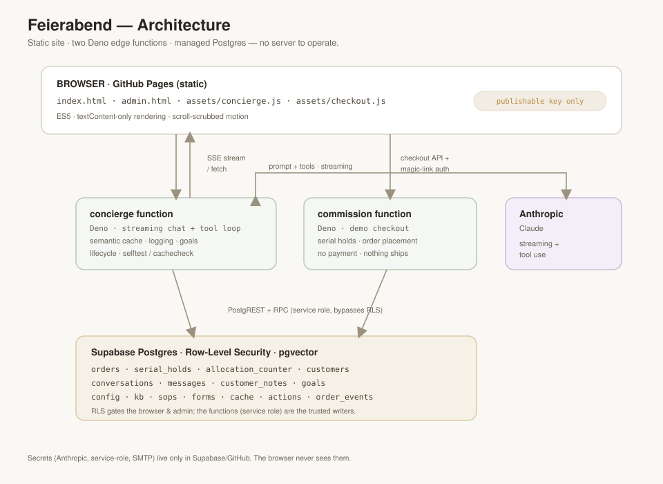

# Feierabend (Decke 01) — Design Document

The *why* behind the build: the product concept, the people it serves, the
architecture, and the design decisions and trade-offs that shaped it.

For the *how*, see the reference docs: **[`SETUP.md`](SETUP.md)** (run &
verify), **[`supabase/README.md`](supabase/README.md)** (backend & wire
contracts), **[`supabase/SCHEMA.md`](supabase/SCHEMA.md)** (every table/field).

> **This is a demo.** No product is sold and no payment is processed. The brand,
> imagery, and video are fictional and AI-generated. It exists to explore one
> idea end-to-end: *what does a genuinely attentive AI sales concierge feel like
> for a scarce, considered purchase?*

---

## 1. Concept & goals

**Feierabend — Decke 01** is a single, limited-edition object: a numbered German
wool blanket, 15,000 pieces, woven to order. The site sells it the way a small
luxury house would — not with urgency banners and stock counters, but with a
**concierge** who knows the cloth, remembers you, and treats you according to
your history with the house.

The design goals, in priority order:

1. **Clienteling, not a help desk.** The concierge should behave like a real
   luxury sales associate: greet returning patrons by name, know their standing,
   remember what they told you last time, and drive toward a sale with patience,
   not pressure.
2. **Scarcity done honestly.** Each of the 15,000 numbers is unique; the number
   you're shown is the number you get; a cancelled number returns to the edition.
   No fake counters.
3. **Everything the merchant tunes is data, not code.** Voice, knowledge,
   procedures, forms, and conversation goals are all editable in an admin studio
   without a redeploy.
4. **No servers to run.** A static site plus serverless functions plus a managed
   Postgres — cheap, and it scales to bursts without operational babysitting.
5. **Privacy by minimization.** Collect only what the demo needs; make the
   security boundary the database itself.

---

## 2. User stories

Grouped by role. Each notes, in *italics*, the feature that serves it.

### 2.1 Guest — anonymous visitor (no account)

- **As a first-time visitor**, I want to understand the object and get a question
  answered without signing up, so that I can decide if it's for me. *(Anonymous
  chat; semantic cache serves common questions instantly.)*
- **As someone just browsing**, I want the concierge to notice I'm here and open a
  relevant thread — but to ease off if I'm clearly not engaging — so that it feels
  attentive, not spammy. *(Proactive openers + presence-aware nudging.)*
- **As an undecided guest**, I want to start a commission and see my number held
  while I decide, without an account, so that scarcity feels real but low-friction.
  *(`?hold=1` reserves a number for the visit.)*
- **As a guest who's warming up**, I want to be invited — gently, occasionally —
  to leave my email so I'm remembered next time, so that signing in feels like a
  courtesy, not a gate. *(Periodic email invite in later check-ins.)*
- **As a guest ready to buy**, I want to commission with just an email
  verification, so that I don't have to create a password. *(Magic-link OTP guest
  checkout.)*

### 2.2 Customer — signed-in / returning patron

- **As a returning patron**, I want to be recognized the moment I arrive — greeted
  by name, my orders and standing known — so that I don't have to repeat myself.
  *(Customer block: name, standing, orders, client book, re-engagement recency.)*
- **As a patron mid-conversation**, I want to sign in and keep the same thread, so
  that signing in is continuity, not a reset. *(Anonymous → signed-in adoption.)*
- **As a customer with an order**, I want to check status, change the shipping
  address or colorway, or cancel — in chat, myself — so that I'm not emailing
  support. *(Register tools, gated to still-mutable orders, fully audited.)*
- **As a valued patron**, I want to be treated according to my standing — more
  deference the more I've bought — so that loyalty is felt, not just logged.
  *(LTV tiers: Eintrag → Wiederkehr → Hausfreund → Stifter.)*
- **As a patron the house knows**, I want it to remember what I told it last time
  (the room, the person, the cloth I favored), so that each visit builds on the
  last. *(Client book + `recall_context`.)*
- **As someone who's done for now**, I want to say "that's all" or "don't message
  me until I write back" and have it respected, so that I'm in control.
  *(Customer-signalled close / quiet mode + auto wind-down.)*
- **As a customer who just purchased**, I want a warm acknowledgement now and a
  welcome-back next time, so that the relationship continues past the sale.
  *(Post-purchase check-in + re-engagement.)*

### 2.3 Gift-giver (a customer buying for someone else)

- **As a gift-giver**, I want the recipient's name on the register card but the
  order in my name, so that the gift is theirs and the record is mine.
  *(Purchaser vs. recipient split.)*
- **As a gift-giver**, I want different billing and shipping addresses, so that it
  ships to them and bills to me. *(Separate billing/shipping.)*
- **As a gift-giver**, I want the concierge to handle the gift framing naturally,
  so that it feels considered. *(Gift-aware prompt + card copy.)*

### 2.4 Merchant — content & operations admin

- **As the merchant**, I want to tune the concierge's voice, knowledge, and
  selling procedures without a deploy, so that I can iterate on tone and policy
  live. *(Config, KB, SOPs — DB-backed, 60s cache.)*
- **As the merchant**, I want to define the goals of every conversation and see,
  per chat, which were met — with the evidence — so that I can measure quality.
  *(Admin-editable goals; LLM-judge scoring with cited justifications.)*
- **As the merchant**, I want in-chat forms for structured order changes, so that
  the concierge can collect exactly what a change needs. *(Admin-defined forms.)*
- **As the merchant**, I want to see each customer's lifetime value, their orders,
  and what the concierge learned about them, so that I can serve them well.
  *(Customers ledger + client book.)*
- **As the merchant**, I want to know the concierge is actually selling, so that I
  can justify it — so I need its assisted revenue attributed. *(Order ↔ chat
  attribution.)*
- **As the merchant**, I want to browse conversations and feedback and see where
  the concierge lacked an answer, so that I can improve the knowledge base.
  *(Conversations + feedback + knowledge-gap flags.)*

### 2.5 Super admin — owner / access control

- **As the owner**, I want to add and remove other admins from the panel, so that
  I can delegate without touching the database. *(Roster management UI.)*
- **As the owner**, I want to be the one admin who can never be removed or
  demoted, so that I never lose control. *(Protected super admin.)*
- **As the owner**, I want these rules enforced even against direct API calls, not
  just hidden in the UI, so that access control is real. *(Command-split RLS on
  `concierge_admins` via `is_super_admin()`.)*

### 2.6 Platform / database administrator — ops

- **As the operator**, I want to stand the whole database up from one idempotent
  file, safe to re-run, so that setup isn't a fragile sequence. *(`setup.sql`.)*
- **As the operator**, I want schema changes as ordered migrations mirrored in the
  setup file, so that fresh installs and `db push` stay in lockstep.
  *(`migrations/` + `setup.sql`.)*
- **As the operator**, I want to deploy the functions and know exactly which build
  is live, so that I'm never debugging stale code. *(`BUILD_TAG` + `selftest`.)*
- **As the operator**, I want to verify the live system end-to-end without
  guessing — is sign-in recognized, is the schema applied, is attribution
  working — so that I can trust it. *(`?selftest=1`, `?cachecheck=1`.)*
- **As the operator**, I want a complete audit trail of every order change and
  tool action, so that nothing mutates the register invisibly.
  *(`order_events` trigger + `concierge_actions`.)*
- **As the operator**, I want the database itself to be the security boundary, so
  that a front-end bug can't leak or corrupt data. *(RLS + `security definer`
  functions; browser holds only the publishable key.)*
- **As the operator**, I want abuse bounded and personal data minimized, so that
  the system is safe and there's little to safeguard. *(Per-IP rate limits, CORS,
  data-minimized orders — no payment data ever.)*
- **As the operator**, I want to diagnose auth/email failures from the logs and
  swap the email provider without code changes, so that infra is decoupled from
  the app. *(Supabase Auth logs + custom SMTP config.)*

---

## 3. Architecture

**Three tiers, no server to operate:**

- **Front end** — a static site and admin panel on GitHub Pages. ES5 IIFE,
  `textContent`-only rendering, cache-busted assets. The browser holds only the
  **publishable** anon key.
- **Two edge functions** (Deno, deployed to Supabase):
  - `concierge` — proxies streaming chat to Anthropic, runs the tool-use loop,
    the semantic cache, conversation logging, goal scoring, and the lifecycle.
  - `commission` — the demo checkout: serial holds and order placement.
  - Both talk to Postgres with the **service-role** key over raw PostgREST (no
    `supabase-js`), so they bypass RLS by design; the SQL functions enforce the
    invariants instead.
- **Postgres** — the source of truth and the security boundary. RLS governs the
  browser and the admin; the functions are trusted.

**The Anthropic API key never leaves the server.** The browser talks only to our
functions; the functions talk to Anthropic.

---

## 4. Key design decisions & trade-offs

### 4.1 Static + serverless, RLS as the boundary
**Decision:** no application server; the database's Row-Level Security *is* the
authorization layer.
**Why:** zero ops, cheap, scales to bursts. The trust model is crisp — the
browser (anon key) can do almost nothing; a signed-in user sees only their own
rows; an admin is gated by `is_concierge_admin()`; the edge functions (service
role) are trusted and enforce invariants in SQL.
**Trade-off:** logic that must be trusted lives in two places — Deno functions
and `security definer` SQL — rather than one app tier. We accept that for the
operational simplicity, and keep the truly critical invariants (serial
allocation, cancellation) in SQL where they're closest to the data.

### 4.2 Serial numbers: unique, shown-is-yours, reclaimable
This is the concurrency heart of the demo. Requirements: 15,000 unique numbers,
**no collisions under load**, the number displayed during checkout is the number
you receive, idle holds expire, and a cancelled number returns to the edition.

**Design:**
- A single-row `allocation_counter` issues never-before-seen numbers.
- `serial_holds` reserves a number for a visit with an expiry; `hold_serial()`
  hands out the **lowest free** number using `FOR UPDATE SKIP LOCKED`, so
  concurrent visitors never block each other or collide.
- `commission_order()` consumes the visit's hold atomically at placement.
- On cancel, `cancel_order_return()` moves `serial → cancelled_serial`, nulls the
  live `serial` (a partial-unique column ignores nulls, so the number frees), and
  re-inserts it as an already-lapsed hold so it's reclaimable — **lowest-first**,
  so a returning shopper gets the *same* number back rather than the next new one.

**Trade-off:** more moving parts than a naive `MAX(serial)+1`, but that naive
approach collides under concurrency and can't reclaim. `SKIP LOCKED` gives us
lock-free-feeling allocation with correctness. (See migrations `0006`, `0010`,
`0011`.)

### 4.3 Semantic cache for anonymous questions
**Decision:** cache answers to common, single-turn, anonymous questions using
pgvector embeddings; serve a hit instantly without calling the model.
**Why:** most first questions are the same handful ("how much?", "what's it made
of?", "is it soft?"). Caching them cuts cost and latency to near zero.
**Guardrails:** only anonymous, single-turn, short questions are cacheable —
signed-in answers depend on private register state and multi-turn answers on
context, so neither is ever cached or served from cache. The `match_cached_answer`
RPC qualifies the pgvector operator explicitly (`operator(extensions.<#>)`)
because the function's `search_path` is pinned empty for safety.
**Trade-off:** a background embedding call and a similarity threshold to tune; in
exchange, the cheapest possible path for the most common traffic.

### 4.4 Streaming + tool use
Replies stream over SSE (`data: {"t":…}` chunks) so the concierge "weaves" in
real time. For signed-in patrons the function runs a **tool-use loop** — the
model can read the register, change an address or colorway, cancel, recall prior
context, or note the client book — all behind the same verified-JWT trust
boundary. Tools are the only way private data enters or is mutated, and every
call is written to an audit log (`concierge_actions`).

### 4.5 Identity & conversation lifecycle
Conversations live in `sessionStorage`, independent of auth, which created subtle
correctness bugs that drove a deliberate model:

- **Anonymous → signed-in = adopt.** Signing in mid-chat keeps the thread and
  attributes it to you on the next turn — sign-in is continuity, not a reset.
- **Sign-out or account switch = wipe.** The thread is tagged with its owner;
  when the identity changes to a *different* person, it's cleared so no one's chat
  bleeds into another's view.
- **Leaving = recorded.** A `pagehide` / `visibilitychange` beacon (`keepalive`)
  marks the conversation wound-down and schedules a client-book summary; the next
  visit reads as a re-engagement.

**Trade-off:** this required identity-tagging the stored thread and reconciling on
load, rather than trusting `sessionStorage` blindly — more code, but it's the
difference between "feels right" and "shows a stranger's order numbers."

### 4.6 The engagement model — attentive, not annoying
A luxury associate lingers nearby without hovering. Encoding that:

- **Openers** — on opening the panel, the concierge speaks first, contextually:
  a returning patron is greeted by name; a fresh visitor gets a warm line drawn
  from what they're browsing.
- **Nudges** — if they fall quiet, it circles back with substance a couple of
  times, then settles into light "still here whenever you'd like" check-ins at
  growing intervals.
- **Presence as a read-receipt proxy** — there's no true per-message read receipt
  in a browser, and tab-visibility is a poor proxy (a minimized panel still shows
  bubbles). Instead, each proactive line is "unacknowledged" until the visitor
  shows a *sign of life* (scroll, tap, key, pointer move, tab refocus). After two
  unacknowledged lines it **pauses** — it's talking to no one — and any sign of
  life resumes it. A reply always counts.
- **Customer control** — an explicit "that's all for now" or "don't message me
  until I write back" (quiet mode) always wins over the automatic behavior.

**Trade-off:** several heuristics and caps to tune, but the alternative (fixed
timers, or pinging until a hard cap) either annoys present users or wastes calls
on absent ones.

### 4.7 Everything tunable is data
Config, knowledge base, standard operating procedures, in-chat forms, and
conversation goals are **rows**, cached in the function for 60 seconds. The
merchant edits tone, policy, and goals in the admin studio and sees them live
within a minute — no deploy. The compiled-in knowledge (`kb.ts`) is only a
fallback if the DB is empty or unreachable, so the concierge never goes blank.

### 4.8 Measuring the concierge
Because the pitch is "it's a virtual sales associate," it has to be measurable:
- **Goals** are admin-defined and scored per conversation by an LLM judge that
  must cite evidence from the transcript (no evidence → unmet). The live status is
  fed *back* into the prompt so the concierge actively drives the open goals.
- **Attribution** — an order carries the `chat_session` that drove it, so the
  admin sees the concierge's assisted revenue.

---

## 5. Subsystems

- **Concierge engine** (`functions/concierge/`) — request validation, rate limit,
  nudge/opener injection, system-prompt assembly (brand voice + KB + SOPs + live
  state + customer block + goal focus), streaming + tool loop, semantic cache,
  logging, async goal scoring and client-book summarization. Diagnostics:
  `?selftest=1` (what does it know about me / is the schema applied),
  `?cachecheck=1` (cache round-trip health).
- **Checkout / commission** (`functions/commission/`) — hold a number
  (`?hold=1`), place an order (POST), read your orders for prefill (`?me=1`),
  recent orders for the ticker (`?recent=1`). Guest checkout verifies email via
  the same magic-link OTP path.
- **Admin studio** (`admin.html`) — tabs for Tuning (config, voice, starters,
  admins), Knowledge, Procedures (SOPs, forms, goals), Cache, Customers (LTV +
  client book), and Conversations (transcripts + goal scorecards). All writes are
  governed by RLS.

Data model rationale is documented field-by-field in
[`supabase/SCHEMA.md`](supabase/SCHEMA.md).

---

## 6. Security & privacy

- **Secrets** (Anthropic, service-role, SMTP) live only in Supabase/GitHub; the
  browser sees only the publishable anon key. CORS is pinned to the site origin;
  per-IP rate limits bound abuse.
- **RLS is the boundary.** Owners see only their rows; admins are gated by a
  `security definer` helper; admin removal is restricted to a protected super
  admin. The edge functions (service role) are the only trusted writers of orders,
  holds, cache, and audit rows.
- **Data minimization.** The commission stores only what the demo needs (email,
  name, city/state, colorway, and shipping only when relevant) — no payment data
  ever, since nothing is charged. Data never collected never needs safeguarding.

---

## 7. Observability & self-diagnosis

Because it's a distributed system with a database and an LLM, it's built to
explain itself: a `BUILD_TAG` proves which function build is live; `?selftest=1`
reports recognition, schema presence, attribution, and the exact context the
model receives; `?cachecheck=1` exercises the whole cache round-trip; and every
tool call, order change, feedback, and knowledge gap is logged for the admin.

---

## 8. Limitations & what's next

Honest gaps, roughly in priority:

- **Leave-detection is best-effort.** The `pagehide`/`visibilitychange` beacon
  can be skipped on a hard crash or aggressive mobile eviction. A small scheduled
  job that marks conversations idle for N hours as ended would close the gap.
- **Goal scoring and summaries are single-judge.** An adversarial or multi-judge
  pass would raise confidence; today it's one LLM call, best-effort and async.
- **Cache invalidation is manual.** If the knowledge changes, stale cached answers
  aren't auto-evicted; an admin clears them. A content-hash or TTL would automate
  it.
- **No true read receipts.** Presence is inferred from activity — good enough to
  stop talking into the void, but not a delivery guarantee.
- **Single-region.** Fine for a demo; a global audience would want the functions
  and DB closer to users.

---

*Built as an exploration of AI-assisted clienteling. See
[`LICENSE`](LICENSE) — source-available for review only.*
