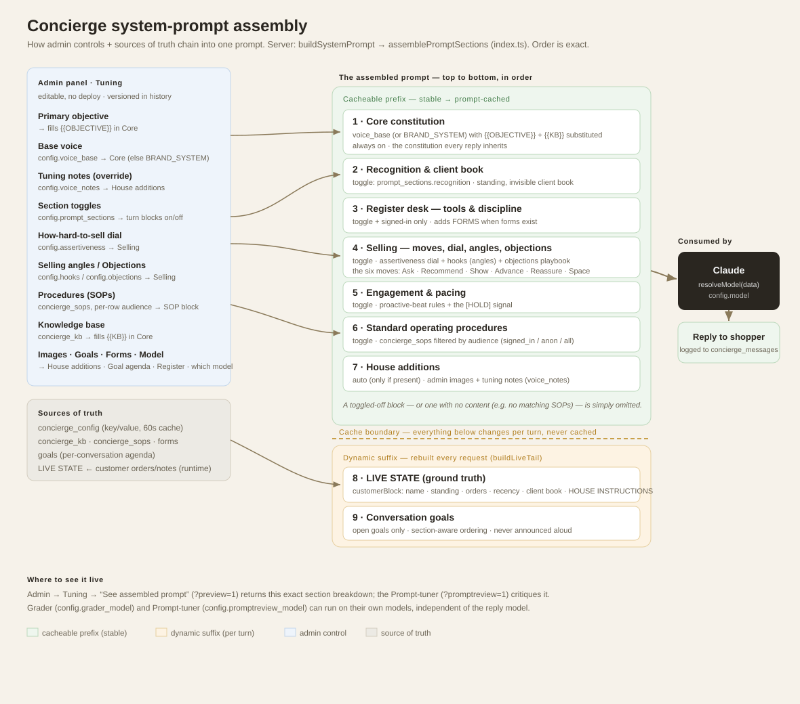
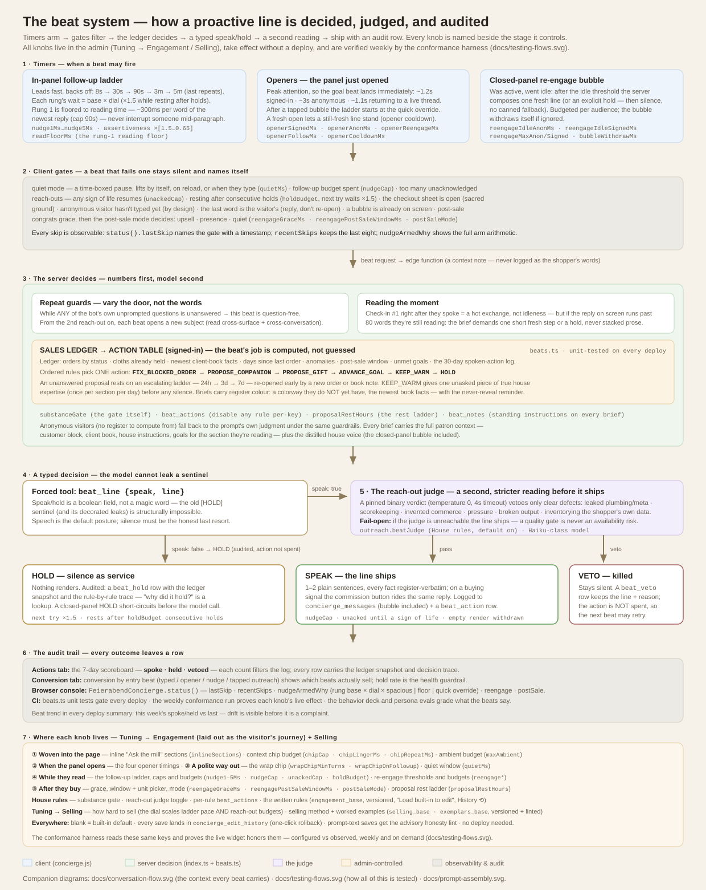
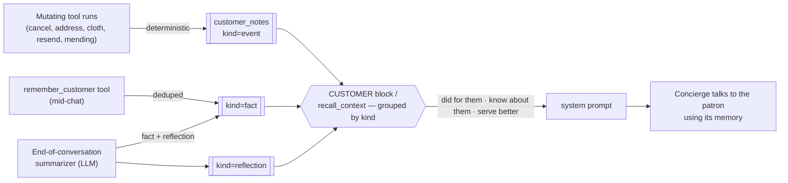
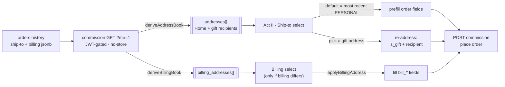
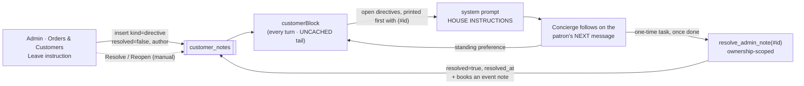
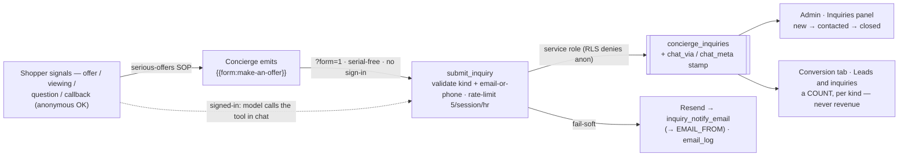

# Feierabend (Decke 01) — Design Document

The *why* behind the build: the product concept, the people it serves, the
architecture, and the design decisions and trade-offs that shaped it.

For the *how*, see the reference docs: **[`SETUP.md`](SETUP.md)** (run &
verify), **[`supabase/README.md`](supabase/README.md)** (backend & wire
contracts), **[`supabase/SCHEMA.md`](supabase/SCHEMA.md)** (every table/field).

> **This is a demo.** No product is sold and no payment is processed. The brand,
> imagery, and video are fictional and AI-generated. It exists to explore one
> idea end-to-end: *what does a genuinely attentive AI sales concierge feel like
> for a scarce, considered purchase?*

---

## 1. Concept & goals

**Feierabend — Decke 01** is a single, limited-edition object: a numbered German
wool blanket, 15,000 pieces, woven to order. The site sells it the way a small
luxury house would — not with urgency banners and stock counters, but with a
**concierge** who knows the cloth, remembers you, and treats you according to
your history with the house.

The design goals, in priority order:

1. **Clienteling, not a help desk.** The concierge should behave like a real
   luxury sales associate: greet returning patrons by name, know their standing,
   remember what they told you last time, and drive toward a sale with patience,
   not pressure.
2. **Scarcity done honestly.** Each of the 15,000 numbers is unique; the number
   you're shown is the number you get; a cancelled number returns to the edition.
   No fake counters.
3. **Everything the merchant tunes is data, not code.** Voice, knowledge,
   procedures, forms, and conversation goals are all editable in an admin studio
   without a redeploy.
4. **No servers to run.** A static site plus serverless functions plus a managed
   Postgres — cheap, and it scales to bursts without operational babysitting.
5. **Privacy by minimization.** Collect only what the demo needs; make the
   security boundary the database itself.

---

## 2. User stories

Grouped by role. Each notes, in *italics*, the feature that serves it.

### 2.1 Guest — anonymous visitor (no account)

- **As a first-time visitor**, I want to understand the object and get a question
  answered without signing up, so that I can decide if it's for me. *(Anonymous
  chat; semantic cache serves common questions instantly.)*
- **As a first-time mobile visitor, I want to be shown — once, briefly — that
  the chat sheet swipes up to fill the screen, so that I discover the roomier
  view without hunting for it and without being nagged about it after.**
  *Accepted when:* on a mobile open, a small rising chevron with "swipe up for
  more room" rides the drag handle; it appears at most twice ever, dismisses
  the moment I grab the handle, is marked permanently learned once I expand
  the sheet, and reduced-motion users get the caption without the animation.
- **As someone just browsing**, I want the concierge to notice I'm here and open a
  relevant thread — but to ease off if I'm clearly not engaging — so that it feels
  attentive, not spammy. *(Proactive openers + presence-aware nudging.)*
- **As anyone mid-message**, I want the concierge to never talk over me while I'm
  typing — my composer must stay live and my keystrokes must never be swallowed —
  so that its proactive lines feel like a considerate person, not a UI that fights
  me. *(Proactive turns defer while composing and never disable the input; if one
  is already speaking, hitting send lets me take over.)*
- **As an undecided guest**, I want to start a commission and see my number held
  while I decide, without an account, so that scarcity feels real but low-friction.
  *(`?hold=1` reserves a number for the visit.)*
- **As a guest who's warming up**, I want to be invited — gently, occasionally —
  to leave my email so I'm remembered next time, so that signing in feels like a
  courtesy, not a gate. *(Periodic email invite in later check-ins.)*
- **As a guest offered the sign-in key, I want the invitation to behave like a
  line in the conversation — offered once, answered once — so that signing in
  stays a courtesy I take up when ready, never a pursuit that follows me down
  the page.**
  *Accepted when:* the bot offers sign-in at most once per thread of reach-outs
  (the offer is a spent SUBJECT under the vary-the-door contract); when several
  offers exist in an older transcript, only the **newest** button is live —
  earlier ones dim; tapping one opens the email form **in the conversation
  flow, right where it was served** — it scrolls away with the thread, never
  pinned to the panel where it would follow the reader; after the key is
  accepted for delivery, **every** sign-in button flips to "Key sent — check
  your inbox" and the confirmation says plainly that the key can take a minute
  and may land in spam; and once I'm signed in, every sign-in button stands
  down ("Signed in — the register is open to you"), including on the
  mid-thread sign-in that keeps my conversation (no re-render hides them —
  they are swept on the auth change itself).
- **As a guest ready to buy**, I want to commission with just an email
  verification, so that I don't have to create a password. *(Magic-link OTP guest
  checkout.)*
- **As a returning patron**, I want my email already filled in when I sign in
  again, so that I don't retype it every visit. *(The last email used to request a
  key — and the last one actually verified — is kept in `localStorage`
  (`feier_last_email`) and prefills the sign-in row, selected so a tap-Enter sends
  or a keystroke replaces it. Device-local convenience; it deliberately survives
  sign-out and never leaves the browser.)*
- **As an anonymous shopper on a page with no checkout** (a single-piece listing,
  a used car for sale), I want to make a serious offer, book a viewing, ask the
  owner a question, or request a callback — right in the chat, without making an
  account — so that I can act on real interest without friction. *(Inquiry mode:
  the concierge captures the lead through the `make-an-offer` / `book-a-viewing`
  forms or the `submit_inquiry` tool. Anonymous-capable and serial-free — no
  sign-in — with email **or** phone the only thing required so the house can
  follow up. See* [`INQUIRIES.md`](INQUIRIES.md)*.)*
- **As a shopper making an offer**, I want the price held firm and my details
  simply taken down so the owner can get back to me — not a bot that haggles or
  invents a discount — so that I trust I'm dealing with a real house. *(The
  `serious-offers` SOP keeps the price firm: an inquiry opens a conversation with
  the owner, it is **not** a negotiation. `submit_inquiry` stores the offer
  (`kind=offer`, with the figure when named) and emails the house — my interest is
  captured as a **lead**, never quietly discounted.)*

### 2.2 Customer — signed-in / returning patron

- **As a returning patron**, I want to be recognized the moment I arrive — greeted
  by name, my orders and standing known — so that I don't have to repeat myself.
  *(Customer block: name, standing, orders, client book, re-engagement recency.)*
- **As a patron mid-conversation**, I want to sign in and keep the same thread, so
  that signing in is continuity, not a reset. *(Anonymous → signed-in adoption.)*
- **As a returning patron placing another order**, I want my saved addresses
  offered so I don't re-type them — my own door *and* the people I've shipped
  gifts to — so that a re-order (or "send Oma another") is a tap, not a form.
  *(Checkout Act II address book: `GET ?me=1` returns the managed `saved_addresses`
  (or a derived fallback) — personal + past gift recipients; picking a gift
  address re-addresses the order to that recipient. See §4.12.)*
- **As a patron managing my details**, I want to **remove** (or edit) a saved
  address I no longer use, so that my address book stays mine — not just a
  read-only echo of every place I've ever shipped. *(Managed `customer_addresses`
  table: a "Remove this saved address" link at checkout → commission
  `POST ?address_delete`; add/edit via `POST ?address_save`. Backfilled from
  history and auto-saved on each order. See §4.12.)*
- **As a customer with an order**, I want to check status, change the shipping
  address or colorway, or cancel — in chat, myself — so that I'm not emailing
  support. *(Register tools, gated to still-mutable orders, fully audited.)*
- **As a customer who lost the email**, I want the concierge to re-send my order
  confirmation, shipping note, or cancellation to the address on file, so that a
  missing note isn't a support ticket. *(`resend_confirmation` tool → service-only
  commission `?custresend=1`, kind checked against the order's real status.)*
- **As a customer with a question about my blanket**, I want to track where it is,
  ask how to care for the wool, fix the name on a gift card, or open a mending
  request — all in chat — so that the concierge is a real service desk, not just a
  salesperson. *(`track_shipment`, `get_care_guide`, `update_gift_details`,
  `request_mending` — ownership-scoped, audited; see* [`TOOLS.md`](TOOLS.md)*.)*
- **As a valued patron**, I want to be treated according to my standing — more
  deference the more I've bought — so that loyalty is felt, not just logged.
  *(LTV tiers: Eintrag → Wiederkehr → Hausfreund → Stifter.)*
- **As a patron the house knows**, I want it to remember what I told it last time
  (the room, the person, the cloth I favored) *and* what it did for me (a
  cancellation, an address change), so that each visit builds on the last and I
  never have to re-explain. *(Typed client book — `fact`/`event`/`reflection`
  notes read back grouped into the prompt; `recall_context`; see §4.10.)*
- **As a patron with a special arrangement**, I want a promise the team made me
  (a waived rush fee, an apology for a delay, an address quirk they'll double-check)
  to actually be honoured next time — without my having to re-explain or prove it —
  so that the house feels like it keeps its word. *(House directives: a human's
  `kind='directive'` note the concierge is instructed to follow on my next visit,
  woven into service rather than quoted back. See §4.13.)*
- **As someone who's done for now**, I want to say "that's all" or "don't message
  me until I write back" and have it respected, so that I'm in control.
  *(Customer-signalled close / quiet mode + auto wind-down. The quiet is a
  time-boxed pause — `outreach.quietMs`, default 30 min — that lifts by itself,
  on reload, or the moment I type; acceptance criteria in §2.10.)*
- **As a customer who just purchased**, I want a warm acknowledgement now and a
  welcome-back next time, so that the relationship continues past the sale.
  *(Post-purchase check-in + re-engagement.)*

### 2.3 Gift-giver (a customer buying for someone else)

- **As a gift-giver**, I want the recipient's name on the register card but the
  order in my name, so that the gift is theirs and the record is mine.
  *(Purchaser vs. recipient split.)*
- **As a gift-giver**, I want different billing and shipping addresses, so that it
  ships to them and bills to me. *(Separate billing/shipping.)*
- **As a gift-giver**, I want the concierge to handle the gift framing naturally,
  so that it feels considered. *(Gift-aware prompt + card copy.)*

### 2.4 Merchant — content & operations admin

*Everything below is a tab or control in the admin studio (`admin.html`): Tuning,
Knowledge, Procedures, Cache, Customers, Conversations, Website, Tools.*

**Tuning the concierge**

- **As the merchant**, I want to tune the concierge's voice, the greeting, and the
  starter prompts without a deploy, so that I can iterate on tone live. *(Tuning
  tab: config + voice notes + starters — DB-backed, 60s cache.)*
- **As the merchant**, I want to **draft the conversation starters from my
  knowledge base** instead of writing a trio per section by hand — especially on a
  freshly-adopted site where they ship blank — so that every section offers real,
  on-brand opening questions. *(Tuning → Conversation starters → **Draft with AI
  ✳**: POSTs the section keys to the admin-only `?genstarters=1`; the server reads
  the live KB + house voice and returns a few tappable shopper questions per
  section, grounded only in the KB — no invented specs or prices. It fills **only
  empty** slots so hand-written starters are preserved, and nothing is saved until
  the merchant reviews and presses Save. Same propose-never-commit shape as the
  prompt tuner and the honesty lint.)*
- **As the merchant**, I want each tunable field to tell me **what's in effect
  right now** and let me **revert to the built-in default**, so that I can lightly
  edit the current configuration instead of guessing or starting blank. *(Every
  field that falls back to a default when empty — greeting, voice notes,
  client-book policy, model, max tokens, selling angles, objection playbook —
  carries an **ⓘ info badge** (helper text in a hover tooltip so the label stays
  short) and a live **"Effect" readout** beneath it: `Now: custom …` (with a
  one-click **Revert to default** that clears the field) when set, or `Blank →
  using <the built-in default>` when empty. These fields are **additive** — blank
  means the base behavior applies with nothing overlaid — so reverting is simply
  clearing the field; there is no separate default text to load.)*
- **As the merchant**, I want to **edit the built-in defaults themselves** — the
  brand/voice prompt and the client-book recording policy — not just overlay them,
  so that I own the base behavior. *(The Voice card has a **"Base voice — brand &
  personality prompt"** box and the Client-book card a **"Base policy — what to
  record"** box, backed by new config keys `voice_base` / `clientbook_base` the
  server reads with a fallback to the compiled-in default (`BRAND_SYSTEM` / an
  inline prompt). **Load built-in to edit** fetches the current default via the
  admin-only `?defaults=1` endpoint and fills the box to tweak; the tuning-notes /
  policy-notes boxes remain as quick overrides layered on top. The voice base
  guards the `{{KB}}` marker so an edit that drops it still appends the knowledge
  base. Selling angles/objections have no hidden default text — their base is the
  salescraft inside the voice base + SOPs — so they stay plain editable lists.)*
- **As the merchant**, editing a base prompt is high-impact, so I want **version
  history and one-click rollback** on anything I can change, so that no
  experiment on the concierge's voice or rules is ever more than one click
  from undone. *(Append-only
  `concierge_edit_history`, written by a security-definer trigger on
  `concierge_config`, `concierge_sops`, and `concierge_kb` that snapshots a row
  after every real change and records the editing admin. A **"History ⟲"** link on
  each versioned Tuning field — and on each SOP and Knowledge section — opens a
  modal listing snapshots (time · editor · preview) with **Restore** (which
  re-saves the chosen snapshot, itself recorded as a new version, so a rollback is
  itself undoable).)*
- **As the merchant**, I want the Tuning page to be **navigable, not an
  11-card scroll**, so that I can find a setting fast. *(The cards are grouped into
  five inner sub-tabs — **Voice & memory · Selling · Engagement · Engine & keys ·
  Edition & access** — reusing the drawer-tab pattern; `setTuningTab()` toggles the
  active sub-panel and sizes its textareas.)*
- **As the merchant**, I want to control how quickly and eagerly the concierge
  reaches out — the in-chat follow-up delays, the idle reach-out when the widget
  is closed, and whether it engages a visitor who hasn't scrolled — so that I can
  dial engagement from attentive to restrained without a deploy. *(Tuning tab:
  Tuning → Engagement → `outreach` config, delivered to the widget via `?config=1`.)*
- **As the merchant**, I want to edit the knowledge base and the selling
  procedures (SOPs) that the concierge follows, so that policy and pitch are mine
  to control. *(Knowledge tab + Procedures tab; injected into the system prompt.)*
- **As the merchant**, I want to define the goals of every conversation and see,
  per chat, which were met — with the evidence — so that I can measure quality.
  *(Procedures tab: admin-editable goals; LLM-judge scoring with cited
  justifications.)*
- **As the merchant**, I want to keep a deck of behavior tests — "shows the
  commission button on a buying signal," "never leaks `[HOLD]`," "reads the
  register instead of guessing" — edit them without a deploy, run them against
  the live concierge, and see a pass rate with the actual replies, so that I can
  prove a prompt or model change didn't quietly break something I fixed. *(Evals
  tab: `concierge_evals` scenarios + typed checks; in-browser replay + an
  admin-gated server-side binary LLM judge; see §4.9 and* [`evals/README.md`](evals/README.md)*.)*
- **As the merchant**, I want one place that shows everything the concierge can
  *do*, lets me switch each capability on or off and re-instruct it, **and lets me
  create new capabilities myself** — so that the bot's powers are mine to shape
  without waiting on a deploy. *(Tools tab, two kinds:*
  - ***Model tools** — code-backed actions the model calls (`get_my_orders`,
    `resend_confirmation`, `cancel_order`, …). Enable/disable + description overrides
    live in `concierge_tools`, merged over the code defaults (`buildToolsForModel`)
    before the tool list reaches the model; the catalog comes from `?tools=1`. New
    model tools need a handler (developer).*
  - ***Form tools** — in-chat forms the bot hands out (`concierge_forms`), which the
    merchant **creates, edits, enables, and removes right in the panel**: pick a
    write path, define the labelled fields, done. This is the no-code way to add a
    new capability — and the safe way to collect what the model shouldn't free-type
    (an address).*
  *Full design:* [`TOOLS.md`](TOOLS.md)*,* [`FORMS.md`](FORMS.md)*.)*

**Running the register (orders, fulfillment, edition)**

- **As the merchant**, I want to set the edition's run size and the next number to
  issue, so that I can open a fresh edition or frame the scarcity story without
  touching the database. *(Tuning tab: Edition card → `get_edition`/`set_edition`;
  the storefront ticker reads it live.)*
- **As the merchant**, I want the register as a scannable table — one line per
  order with a status badge and cloth colour dot — that I can filter by status,
  sort by any column, and multi-select for **bulk** fulfilment, cancellation,
  resend, or export, so that working a queue of orders isn't one accordion click
  at a time. *(Orders & Customers tab → **Orders** view: compact order table +
  status count chips + sortable headers + bulk action bar. See §4.11.)*
- **As the merchant**, I want to advance an order through fulfillment
  (`placed → weaving → finishing → shipped → delivered`, or `returned`) and attach
  a tracking number, so that a real order can actually move — and the customer is
  emailed when it ships or is returned. *(Order **detail drawer**: fulfilment
  control → commission `POST ?fulfill=1`, admin-gated, audited, sends email; bulk
  "Advance to…" / "Cancel" run the same endpoint over a selection.)*
- **As the merchant**, I want to see which transactional emails were sent for an
  order (confirmation, shipment, return, cancellation) — including failures — and
  re-send any of them, so that a customer who lost or never got a note isn't left
  in the dark. *(Order detail drawer: per-order email timeline from `email_log`;
  resend via commission `POST ?resend=1`, admin-gated; bulk resend too.)*
- **As the merchant**, I want to look up every order placed from a given **IP
  address** (and see, per order, which IP it came from), so that when I have to
  report abuse to authorities I can pull the whole trail. *(Search box accepts an
  IP in both views; resolved via `orders.chat_session ↔ conversations.session_key
  ↔ conversations.ip`. The drawer shows and links the order's origin IP.)*
- **As the merchant**, I want to leave the concierge a **standing instruction for
  a specific patron** — an order exception or special handling — so that when they
  return, the bot follows my note without me having to be there. *(House directive:
  a `kind='directive'` client-book note I write in the Patrons view or the order
  drawer; surfaced at the top of that patron's CUSTOMER block on their very next
  message, since the customer block is rebuilt per turn in the uncached prompt
  tail. See §4.13.)*
- **As the merchant**, I want a **one-time** instruction (apologise for a delay,
  confirm a detail before shipping) to be checked off once the concierge has
  actually carried it out — while a **standing** preference keeps applying — so
  that the list reflects what's still outstanding. *(Directives carry a `resolved`
  flag: the concierge calls `resolve_admin_note` after doing a one-time task; I
  can also Resolve/Reopen any directive by hand. An SOP tells the bot to check for
  these every signed-in visit, follow them, and resolve only what it has done.)*
- **As the merchant**, I want the concierge to act on my house note **proactively**
  — on its own first line, in its greeting or an idle nudge — not only when the
  customer happens to ask, so that my instruction is honoured the moment they
  arrive. *(The directive is honoured in words on every proactive beat — opener,
  nudge, and the closed-panel re-engagement line — with no tool required;
  "acting" is decoupled from "checking off" so a tool-less beat never blocks it.
  The closed-panel re-engagement line (`?reengage=1`) also **records what it
  said to `concierge_messages`** and runs `scheduleDirectiveReconcile`, so a
  note delivered in the launcher bubble is never invisible in the transcript and
  its `🏷` marker lands on the real delivery. See §4.13.)*
- **As the merchant**, I want a one-time note the bot **acted on but forgot to
  formally close** to be checked off (and the chat tagged) anyway, so that a
  completed courtesy never wrongly repeats and I still see which chat handled it.
  *(`reconcileDirectives`: after any signed-in turn with an open one-time
  directive, a background tool-scoped pass re-reads the turn and calls
  `resolve_admin_note` for anything now done — resolution and the `🏷 house note`
  tag land together. A miss is safe; it just resurfaces next turn.)*
- **As the merchant**, I want **one place that shows every house note across all
  patrons** — open vs. resolved, who left it, when — and, for one the concierge
  acted on in a chat, a jump straight to **that conversation**, so that I can
  follow up and audit at a glance. *(Orders & Customers → **House notes** view:
  lists all `kind='directive'` notes; filter open/resolved/all; Resolve/Reopen,
  Delete, View customer, and "Find the chat" via the `resolve_admin_note` audit
  action → `conversation_id`. See §4.13.)*
- **As the merchant**, when I follow a note (or an order) to its chat, I want to
  land on the **exact reply where it was acted on**, not just the top of the
  transcript, and know **which kind** of action it was, so that the marker is
  never an unexplained "acted on here". *(An order/plain jump opens the transcript
  scrolled to the acted-on reply — keyed on the action's timestamp — and pulses it
  with a brass rail, **reason-tagged** via `jumpToConversation(conv, at, reason)`:
  `↳ this order acted on here` for an order-touch jump, with a tooltip spelling out
  what the concierge did.)*
- **As the merchant**, when a chat carried out **several** house instructions, I
  want to see **each** one — its text, pinned to the exact reply that delivered
  it — not a single unlabelled jump, so that I can tell which message answered
  which note. *(`openConvo` loads **every** `resolve_admin_note` action for the
  chat, each with its note text; `renderTranscript` maps each to the reply it
  landed on and renders a purple `🏷 house instruction #id carried out here`
  marker with the full note text beneath that bubble. A sticky
  `🏷 N house instructions acted on` jumper steps through them; the first is
  centered and pulsed on open. Replaces the earlier single-timestamp jump that
  collapsed a multi-note chat to one marker.)*
- **As the merchant**, I want to see **at a glance in the Patrons list** which
  patrons have an open house note waiting, so that I don't have to open each card
  to find outstanding work. *(A patron with an unresolved directive gets a purple
  left rail and a `🏷 N open house note` badge on the collapsed row.)*
- **As the merchant**, I want to **bulk-add** a house instruction to many
  customers at once, and **bulk resolve / reopen / delete** notes, so that I'm not
  editing one at a time. *(Orders view bulk bar → "Leave note…" writes one
  directive to each distinct customer behind the selected orders; the **Patrons**
  view multi-selects patrons for the same bulk "Leave note to N selected"; House
  notes view has a filter + Select-all + a bulk Resolve/Reopen/Delete bar.)*
- **As the merchant/operator**, I want house-note handling **graded like every
  other goal**, and I want the **chats that acted on a note tagged** so I can
  audit them, so that "did the bot follow the house's instruction" is measured,
  not assumed. *(The `house-notes` goal — the grader is fed the patron's directive
  text so it's judgeable; the Conversations list shows a `🏷 house note #N` chip
  on any chat where the concierge resolved one. See §4.13.)*
- **As the merchant**, I want a single-order drawer that consolidates **the
  customer** (name, standing, lifetime value, blankets, last order, note count),
  **this order's** shipping *and* billing (both editable), its emails, and the
  patron's client book + a leave-a-note box — so that managing one order needs
  nothing else open, **without a wall of text**. *(Order detail drawer, **tabbed**:
  a pinned header (Nº · cloth · status · name · tier · email) over three tabs —
  **Overview** (standing stat row, gift/IP links, fulfilment, shipping & billing,
  emails), **Notes** (open house instructions pinned at top, then the client book
  with older notes **collapsed** behind "Show N older", then the leave-a-note box),
  and **Chats** (conversations). The active tab persists across in-drawer edits.)*
- **As the merchant**, I want the client book to stay legible as it grows — quiet
  notes, long ones **collapsed** — so that the signal isn't buried and a house
  note can't be missed. *(Each note is a card with a kind-colored rail, a compact
  `kind · date · state · actions` line, and a body clamped to a few lines that
  expands on click; open directives sit above the book and are never collapsed.)*
- **As the merchant**, I want the client book to **consolidate itself**, so
  that a long-standing patron doesn't get expensive to serve and their signal
  doesn't decay — one actionable summary the bot uses, with the raw notes kept
  as history.
  *(**Rolling client summary**: a `kind='summary'` note per patron. A background
  pass (`consolidateClientBook`) folds the AI's `fact`/`event`/`reflection` notes
  into a tight digest — never touching **directives** — and only its timestamp
  moves forward, so raw notes after it are the "since then" tail and the rest stay
  as history (reachable by the bot via `recall_context`). It fires automatically
  once ~8 new notes pile up (background, threshold-gated) and on demand from the
  drawer's **Client summary** card (**Regenerate** → admin `?consolidate=1`; the
  summary is admin-editable). The bot's CUSTOMER block then injects **open
  directives + the summary + the 2 newest notes** instead of ~14 — cutting the
  per-turn uncached tail and keeping directives unmissable. See [`COST.md`](COST.md).)*
- **As the merchant**, I want the client book to hold **relationship & selling
  memory only** — not a frozen copy of order state — so that notes never go stale
  or duplicate the register's ledger. *(Order bookkeeping — serial numbers, order
  counts, status, what was bought, shipping/billing addresses — lives in the
  **register** and the concierge reads it **live** with `get_my_orders`; a note
  would only freeze a snapshot that rots. The rule is enforced everywhere a note is
  written: the `remember_customer` tool description, the `consolidateClientBook`
  roll-up prompt, and the `sales-skill` / `wrap-up` / `client-book-method` SOPs
  (with top-level `replace()` updates so already-seeded installs pick it up). A
  note may still reference an order as **durable context** — "the Loden for the
  east-facing office" — never as a list of serials/status. Deterministic
  `order_events` still record register actions separately for the audit trail.)*
- **As the merchant**, I want the order drawer to show, in the same panel, **the
  chats tied to this order and the patron's other chats** — and to never be fooled
  into opening a *different* account's chat as if it were this patron's — so that I
  can see the conversation behind an order without leaving it. *(Drawer
  **Conversations** section: chats that touched this Nº — a `concierge_actions` row
  against its serial, badged `◆ touched this order` — first, then the patron's
  other chats; clicking one opens the transcript, an order chat scrolled to the
  moment it was touched. **Serial numbers are recycled** — `cancel_order` returns a
  Nº to the edition and a later order can take it — so the serial join is **bounded
  to this order's own lifetime** (`created_at >= placed_at`) to keep a *previous*
  holder's chats off it, and every row prints **whose chat it actually is**
  (`user_email`), badged **`⚠ other account`** with a tooltip when it differs from
  the order's patron. See §4.13.)*
- **As the merchant**, I want to click a customer's **email** (like the IP line)
  to pull up every order by that patron, so that jumping from one order to their
  whole history is one click. *(Drawer Customer block: the email is
  click-to-search the register/patrons by that address.)*
- **As the merchant**, when I open **"Customer's chats"** I want *only that
  patron's own* conversations — not every chat that merely *mentions* their email
  — yet I still want the search box to find a mention when I ask for one, so that
  navigation is trustworthy without losing forensic search. *(Two distinct paths:
  the **navigation** (`openCustomerChats`) sets `state.convoIdentity` and matches
  the conversation's **own `user_email`** exactly — never transcript content — so a
  foreign chat that typed or echoed the address is never presented as theirs. The
  **search box** stays fuzzy with its input-type dispatch — conversation id /
  session key → exact lookup, IPv4/IPv6 → exact (prefix = substring), free text
  *including an email* → `user_email` substring **OR transcript-content** match —
  so typing an email there still surfaces chats that mention it. Any manual edit /
  Apply / Clear drops the exact scope. See §4.13.)*
- **As the merchant**, I want to correct an order's **billing** address (or set it
  back to "same as shipping"), not just shipping, so that a mis-entered billing
  record can be fixed. *(Drawer "Shipping & billing" → Edit billing address →
  commission `POST ?editbilling=1`, admin-gated, writes the `orders.billing`
  jsonb.)*
- **As the merchant**, I want to see every **register action** the concierge took
  on a customer's behalf — status reads, address and colorway changes,
  cancellations, context recalls, notes written — and to **click through to the
  chat, the order, and the IP** behind each one, so that nothing the bot did is
  invisible and I can trace it to its source. *(Register-action log:
  `concierge_actions`, in its **own top-level "Actions" tab** (next to
  Conversations — it's an audit trail, no longer buried at the bottom of the
  Procedures handbook); every order change also captured in `order_events`. Each
  row is **clickable → jumps to the conversation** where it
  happened, scrolled to the moment (reason-tagged marker); the **Nº opens that
  order's drawer**; and the **origin IP** is shown (joined from the conversation —
  admin-only, click-to-copy). The search box also takes an **IP** (full = exact,
  prefix = substring), resolved through the conversations that originated there.)*
- **As the merchant**, I want to see each customer's lifetime value, their orders,
  and what the concierge learned *and did* for them, so that I can serve them well
  — with the same **client summary** the bot reads and **without a long tail of
  cancelled orders burying the live ones**. *(Orders & Customers tab → **Patrons**
  view: one card per buyer, sortable by standing / value / recency / name / notes,
  with LTV, order history, and the typed client book — `event`/`fact`/`reflection`
  notes, each tagged. The expand leads with the rolling **Client summary** card
  (the `kind='summary'` digest, with Regenerate/Edit — the same one in the order
  drawer), and the orders are grouped into a compact **Active / Fulfilled / Closed**
  segmented control that defaults to the first non-empty group, so cancelled orders
  sit one click away instead of dominating. Recording policy tunable in Tuning →
  Client book. See §4.10.)*
- **As the merchant**, I want a real waitlist — captured when the edition sells
  out (a form on the sold-out state) and by the concierge in chat — that I can
  filter, mark people notified on, and export to email, so that demand past a
  full run isn't lost. *(Customers tab: Waitlist card; `waitlist` table;
  commission `POST ?waitlist=1`; concierge `join_waitlist` tool.)*
- **As the merchant**, I want the leads the concierge captures — serious offers,
  viewing requests, questions, callbacks — in one worklist I can filter and
  export, and where I can move each one **new → contacted → closed** as I work it,
  so that a serious buyer never falls through the cracks. *(Customers tab:
  **Inquiries** panel below Waitlist, mirroring it — newest first, filter by date /
  keyword / kind / status, CSV export, and a per-row status control that writes a
  `concierge_inquiries` update, admin-only under RLS. See §4.14 and*
  [`INQUIRIES.md`](INQUIRIES.md)*.)*
- **As the merchant**, I want the offer and viewing forms to arrive as **drafts I
  switch on only when the page is ready**, so that lead capture goes live on my
  say-so, not automatically. *(Tools → Form tools: `make-an-offer` and
  `book-a-viewing` seed **`enabled=false`**, each bound to `submit_inquiry` with
  its `kind` fixed by a hidden field; I set the destination in the
  `inquiry_notify_email` config key and tick **Enabled** to turn them on. Like all
  generated content, they are drafts-first. See* [`FORMS.md`](FORMS.md)*.)*
- **As the merchant**, I want to know the concierge is actually selling, so that I
  can justify it — so I need its assisted revenue attributed. *(Order ↔ chat
  attribution via `chat_session`.)*

**Quality & knowledge upkeep**

- **As the merchant**, I want to browse conversations and feedback and see where
  the concierge lacked an answer, so that I can improve the knowledge base.
  *(Conversations tab + feedback + knowledge-gap flags.)*
- **As the merchant**, I want to **filter chats by 👍/👎**, **jump straight to the
  rated replies** inside one, and **export the ratings**, so that I can act on the
  concierge's best and worst answers. *(A **Feedback** filter (thumbs-up /
  thumbs-down / any) over the loaded set, backed by a per-conversation ratings
  map — `concierge_feedback` embedded on its message's `conversation_id`; a `👍n
  👎n` chip on rated rows; inside a transcript, rated replies get a colored rail
  and a **sticky ▲/▼ jumper** steps through them; and both CSV exports carry
  `rating` + `rating_note` columns.)*
- **As the merchant**, I want the Conversations toolbar to be **obvious** — filters
  in one place, actions in another, and no mystery checkboxes — so that I never
  have to guess what a control governs before I use it. *(Two labelled
  zones: a **Filter** row (search · dates · goals · stage · feedback · house-note)
  and an **Actions** row (Load more · Re-grade shown · Export CSV · Refresh). The
  old "Include PII" — which governs the **export**, not the view — is relabelled
  **"PII in export"** and sits beside Export.)*
- **As the merchant**, I want each conversation in the list to tell me plainly
  **whether it's been graded** — and, if so, the outcome — separate from where the
  shopper sits in the funnel, so that I don't mistake a funnel *stage* for a
  grading *status*. *(Quiet, chip-free row: the right of the top line shows a
  single **colored stage dot + word** in the stage's tone (or a **hollow dot +
  "ungraded"** when the evaluator hasn't run); the who-line carries a muted
  `N/M goals` fraction and a small clickable `🏷` house-note flag. No bordered
  chips, no repeated words — one status cue per row. The funnel value `evaluating`
  reads as **considering**.)*
- **As the merchant**, I want to **re-run goal grading on demand** — one
  conversation from its transcript, every one currently shown, or **exactly the
  ones I've selected** — and be told honestly if the judge returned nothing, so
  that a chat is graded when I need it, not only on the sampled async pass.
  *(Per-chat **Re-grade goals**, and a batch button that is **selection-aware**:
  with chats ticked it reads **"Re-grade selected (N)"** and grades that real count
  — not a fixed cap — otherwise **"Re-grade shown"**. `POST ?regrade=1` grades ≤30
  per request sequentially, so a larger set is **chunked** client-side (progress in
  the button) and honoured in full; reports `{graded, empty, failed}`, the per-chat
  button auto-retries once on a transient failure, and the list re-renders in
  place.)*
- **As the merchant**, when a conversation is graded, I want to **click a goal and
  jump to the line(s) in the transcript that earned it**, so that I can verify the
  grade against what was actually said instead of trusting the label. *(The judge
  returns, per goal, a short **verbatim `quote`** copied from the transcript
  alongside the human `note`; clicking a scored goal chip scrolls the transcript to
  the message that contains it and rings it in brass. Matching prefers the exact
  quote and falls back to token overlap with the `note`, so it still works on
  conversations graded before quotes existed. Unmet goals aren't clickable — there's
  nothing to point at.)*
- **As the merchant**, I want **one Conversion tab where every business number
  lives** — revenue, commissions, average order value, conversion rate, the
  attribution tiers, conversations, and the 👍 rate — so that metrics never
  disagree between views. *(The Conversations tab carries no figures of its own;
  each Conversion tile states its **exact definition, formula, and date basis**
  in an ⓘ hover, and shows a **delta vs the prior equal-length window**.
  Diagram: `docs/conversion-metrics.svg`; formal spec: `ATTRIBUTION.md`.)*
- **As the merchant**, I want to know **which commissions the concierge actually
  drove**, not just which buyers also chatted, so that I can quote assisted
  revenue honestly and optimize the causal number. *(Three tiers on every kept
  order: **✳ concierge-initiated** — the buyer tapped the concierge's own
  commission button (`orders.chat_via`, with the click's `{entry, section,
  turns}` in `chat_meta`); **chat-assisted** — a conversation co-occurred in the
  buying session (`chat_session`); **unassisted**. See §4.8.)*
- **As the merchant on a checkout-less install**, I want a **Leads & inquiries**
  card that **counts** the leads the concierge captured — broken down by kind
  (offer / viewing / question / callback), **with no dollar value ever attached** —
  so that I can measure demand honestly and a lead is never mistaken for a sale.
  *(Conversion tab: a **count-only** card reading `concierge_inquiries` by
  `created_at` — never joined to `orders` — with the same delta / period-compare /
  trend treatment as the commission metrics. It is **hidden entirely** on a
  commission-mode install like Feierabend (no inquiries), so it never disturbs or
  blends into the revenue figures; `qa-` / `eval-` traffic is excluded exactly as
  elsewhere. A lead is counted, never valued, never folded into revenue. See §4.14
  and* [`ATTRIBUTION.md`](ATTRIBUTION.md)*.)*
- **As the merchant**, I want a **real behavioral funnel** — visits → chat
  opened → spoke to the concierge → register opened → commission — **measured
  over time**, so that I can see where journeys leak and whether changes move
  the stages. *(PII-free `site_events` beacons (random device token, no IP/
  email) + a funnel-over-time trend chart and a snapshot with stage-to-stage
  pass-through; stages that predate the beacons render "not tracked yet",
  never a fake 0.)*
- **As the merchant**, I want **trend lines with tooltips and a table view** —
  revenue (total vs attributed) and conversion rate per day/week/month — so
  that direction is visible at a glance and every value is reachable without
  hovering. *(Hand-built SVG charts to the dataviz spec: crosshair + unified
  tooltip, keyboard-readable, colorblind-validated palette, ⊞ table toggle.)*
- **As the merchant**, I want the report to **tell me where the opportunities
  are**, so that I know what to turn next without spelunking. *(A computed
  card: biggest funnel drop, rate trend vs the prior window, unassisted-
  majority warning, sections with chats but no ✳ conversions, grading
  coverage — each phrased with the lever to pull.)*
- **As the merchant**, I want the **register price behind every revenue figure
  to be configurable**, so that reporting follows the real price without a
  deploy. *(`concierge_config.unit_price`, Edition & access → Register price;
  $589 fallback. Feeds Conversion, the LTV figures, and patron stats.)*
- **As the merchant**, I want to **compare any period against the one before it
  or the same period last year** — day, week, month, or year over year — and
  **view trends at the granularity I choose**, so that direction is measurable,
  not guessed. *(Ranges: to-date and complete calendar periods + rolling;
  Compare: prior period / last year / off, period-to-date aligned with dashed
  ghost-lines on the charts; View-by: hourly→yearly buckets; a shared
  configurable week start.)*
- **As the merchant**, I want **data retention to be my deliberate act, not a
  hidden default**, so that nothing is deleted without me and privacy hygiene
  is still one click when I want it. *(Default keep-forever — nothing
  scheduled; Edition & access → Data retention runs a confirmed
  `prune_high_write` at a chosen ≥30-day horizon via the admin-gated
  `?prune=1`, reports the deleted counts, and records the horizon as
  `concierge_config.retention_days`. Orders and attribution stamps always
  survive.)*
- **As the merchant**, I want to **filter conversations by funnel stage** and see
  a **funnel overview** — how many chats sit at browsing, engaged, considering,
  objection, ready, won, lost (and how many aren't graded yet) — so that I can see
  where shoppers pile up or drop off and **optimize how they move through**.
  *(Conversations tab: a **funnel bar** of click-to-filter cells with counts and
  each stage's share of graded chats, plus a stage `<select>`. The stage is the
  AI grader's per-conversation `sales_stage`; every graded chat carries one, and
  the `not yet graded` bucket + **Re-grade shown** lets me drive coverage to 100%.
  Working the loop — filter to `objection`, read those chats, then tune the
  **objection playbook** / **assertiveness** in Tuning — is how the funnel gets
  optimized. See §2.8, §4.7.)*
- **As the merchant**, I want to **select a segment of conversations and leave one
  house note for every patron behind them** — e.g. tick everyone at `considering`
  and drop a targeted instruction on all of them at once — so that I can act on a
  whole funnel stage, not one chat at a time. *(Conversations tab: each chat row
  has a **selection checkbox**; a **selection bar** above the list offers a
  segment-aware **"Select all N [stage]"** (filter to a funnel stage first, then
  select-all = the segment) and shows the selection's **distinct-patron count** and
  how many **anonymous chats are skipped** (a house note needs an account).
  **Add house note** opens a composer that **lists the exact recipients** before
  writing, then inserts one `kind='directive'` note per **distinct** patron —
  deduped by identity (lowercased `user_email`, else `user_id`), so a patron with
  several selected chats gets it once. Each patron's concierge honours it on their
  next visit like any house instruction (§2.6). Selection survives client-side
  stage/goal/rating filtering and is dropped on a fresh server load.)*
- **As the merchant**, I want to inspect the semantic answer cache and clear stale
  entries, so that a changed policy isn't served from an old answer. *(Cache tab:
  view entries + hit counts, evict on demand.)*

### 2.5 Super admin — owner / access control

- **As the owner**, I want to add and remove other admins from the panel, so that
  I can delegate without touching the database. *(Roster management UI.)*
- **As the owner**, I want to be the one admin who can never be removed or
  demoted, so that I never lose control. *(Protected super admin.)*
- **As the owner**, I want these rules enforced even against direct API calls, not
  just hidden in the UI, so that access control is real. *(Command-split RLS on
  `concierge_admins` via `is_super_admin()`.)*

### 2.6 Platform / database administrator — ops

- **As the operator**, I want to stand the *whole* database up — schema, RLS,
  functions, and all seed content (KB, SOPs, forms, goals) — from one idempotent
  file, safe to re-run, so that setup is a single paste and never a fragile
  sequence. *(`setup.sql` as the single source of truth; each content block seeds
  only if empty, so re-runs never clobber Studio edits.)*
- **As the operator**, I want `setup.sql` to be the file I actually maintain, with
  the ordered `migrations/` folder kept only as history, so that there's one place
  to change and no drift. *(`setup.sql` canonical, applied in the SQL editor;
  `migrations/` is a changelog. The deploy workflow's `db push` step is
  **best-effort / non-blocking** — this repo's schema is not managed incrementally,
  so a push mismatch never halts the function deploy.)*
- **As the operator**, I want to audit at scale — filter logs, conversations,
  customers, and the waitlist by date range and keyword, jump straight to an order
  by its **Nº** or a conversation by its **id**, page through long lists instead
  of hitting a hard cap, and **export** what I'm looking at to CSV — so that
  nothing is buried once volume grows. *(Server-side trigram filters; order-number
  and conversation-id lookup; range-paged lists with "Load more"; CSV export of
  the register, a transcript, and the waitlist; stage chips; goal-outcome filter.
  Both conversation exports — one transcript and the streamed **Export all** —
  carry the conversation's `section`, `sales_stage`, `goals_met`, `goals_total`,
  the full `goal_status` JSON, and each message's `rating`/`rating_note` on every
  row, so the funnel, grades, and thumbs are in the spreadsheet, not just on
  screen.)*
- **As the operator**, I want to change what the concierge says and shows without a
  deploy — copy, tuning notes, starters, **selling angles**, **objection playbook**,
  **assertiveness**, engagement pacing, in-chat **forms**, and the **images** the
  bot shares — all from the Studio, so that running the concierge is
  merchandising, not engineering. *(All `concierge_config`/table-backed, live
  within a minute.)*
- **As the operator**, I want to deploy the functions and know exactly which build
  is live, so that I'm never debugging stale code. *(`BUILD_TAG` + `selftest`.)*
- **As the operator**, I want to verify the live system end-to-end without
  guessing — is sign-in recognized, is the schema applied, is attribution
  working — so that I can trust it. *(`?selftest=1`, `?cachecheck=1`.)*
- **As the operator**, I want an automated way to prove the concierge still
  *behaves* — shows the commission button on a buying signal, never leaks
  `[HOLD]`, doesn't loop in discovery, reads the register instead of guessing —
  after any prompt or model change, so that a fix I already shipped can't quietly
  regress. *(`evals/` behavior deck, runnable from the CLI or the admin Evals tab:
  scripted conversations replayed against the deployed function, deterministic
  checks + a pinned binary LLM judge, reported as a pass rate; see*
  [`evals/README.md`](evals/README.md)*. Design rationale in §4.9.)*
- **As the operator**, I want to look up one conversation by its id and see which
  model answered each message, so that I can confirm a model or fallback change
  actually took effect instead of trusting the config screen. *(Conversations tab:
  search by conversation id / session key; per-message model + "models used"
  summary; CSV transcript export. Model resolution is fully configurable — §4.7.)*
- **As the operator**, I want to find every conversation from a given **IP
  address**, so that I can investigate abuse and report it. *(Conversations tab:
  an IPv4/IPv6 in the search box does an exact `ip` lookup — a partial prefix
  matches as a substring — over the admin-only, PII-gated `ip` column.)*
- **As the operator**, I want a complete audit trail of every order change and
  tool action, so that nothing mutates the register invisibly.
  *(`order_events` trigger records field-level `{old,new}` diffs on every update
  and the full row on create — append-only, admin-readable, and **not** touched
  by retention; plus `concierge_actions`. Orders mutate in place, so `orders`
  holds current state and `order_events` holds the history.)*
- **As the operator**, I want order-field edits to be correct, not free-typed by
  the model, so that a shipping record can never be scrambled by a well-meaning
  paraphrase. *(Address changes go through the labeled `address-change` **form**,
  never a free-text tool — a city can't land in the street line. The commission
  function's admin-gated `?editaddr=1` + the per-order **address editor** in the
  register are the reliable correction path; writes are service-role, verified,
  and ownership-scoped.)*
- **As the operator**, I want the database itself to be the security boundary, so
  that a front-end bug can't leak or corrupt data. *(RLS + `security definer`
  functions; browser holds only the publishable key.)*
- **As the operator**, I want abuse bounded and personal data minimized, so that
  the system is safe and there's little to safeguard. *(Per-IP rate limits, CORS,
  data-minimized orders — no payment data ever.)*
- **As the operator**, I want to diagnose auth/email failures from the logs and
  swap the email provider without code changes, so that infra is decoupled from
  the app. *(Supabase Auth logs + custom SMTP config.)*

### 2.7 The AI sales concierge — how it sells

Stories for the assistant itself: the selling behaviors, framed from the
shopper's side. (The register-tool and memory stories the concierge fulfils for
signed-in patrons are in §2.2; the merchant's control over all of this is §2.4.)

- **As a shopper**, I want the concierge to understand who the blanket is for and
  where it will live *before* it presents, so that it feels like advice, not a
  pitch. *(Discovery-first selling method / SOP; the `discover` goal.)*
- **As a shopper**, I want it to translate specs into what they mean for my home
  ("dense enough that it settles over you") rather than reciting numbers, so that
  the value is concrete. *(Fact → benefit → your-life laddering in the sales SOP.)*
- **As a shopper**, I want a single, gentle nudge toward commissioning when I'm
  genuinely interested — never repeated pressure — so that I'm guided, not
  chased. *(Soft close, `{{action:commission}}` at most once per answer.)*
- **As a shopper**, I want it to answer honestly and never invent a price, a stock
  number, a delivery date, or a product we don't sell, so that I can trust it.
  *(Anti-hallucination rules; one product only — no gift cards or accessories.)*
- **As a shopper**, I want it to *show* me the object — the packaging, the seal,
  the cloth — when a picture helps, so that I can see what I'm considering.
  *(Image tokens; admin-managed beyond the built-ins.)*
- **As a shopper**, I want to tap quick replies and fill short in-chat forms
  instead of typing everything, so that deciding and changing an order is fast.
  *(`{{reply:…}}` pills, `{{form:…}}` forms.)*
- **As a returning shopper**, I want it to greet me like someone who remembers me
  and pick up the thread, so that each visit builds on the last. *(Client book +
  re-engagement recency + openers.)*
- **As a shopper**, I want it to know when to give me space and circle back later
  like a real person — not spam me — so that the presence feels human.
  *(Presence/acknowledgement model; paced nudges; quiet mode.)*
- **As a shopper when the run is sold out**, I want to leave my name for the next
  edition, so that I'm not turned away empty-handed. *(Waitlist — sold-out form +
  the concierge's `join_waitlist` tool.)*
- **As a shopper**, I want a common question answered instantly, so that I'm not
  waiting on the model for things the house already knows. *(Semantic cache.)*
- **As a shopper**, I want the conversation to close warmly with nothing left
  hanging, so that I leave feeling served. *(Wrap-up SOP; needs-met goal; a
  client-book note recorded silently.)*

### 2.8 The selling engine — moves, assertiveness, and stages

*The behavioral guardrails that govern the concierge — reading the register
before it answers, always leaving a tappable path, confirming before writes,
never free-typing an address — are collected in [`BEHAVIOR.md`](BEHAVIOR.md).*

The concierge is a *seller*, not a Q&A bot. Three mechanisms keep it driving
rather than merely reacting:

- **Next-move selector (in the prompt).** Instead of ending every turn with a
  question, each turn the bot picks the ONE move that fits — **Ask · Recommend ·
  Show · Advance (soft/assumptive close) · Reassure · Space** — and never repeats
  the same move twice in a row. This is what makes it feel human: it recommends,
  paints a picture, or proposes the next step rather than always interrogating.
  It also ladders small yeses (room → cloth → open the register) instead of one
  big ask, and builds desire with true "selling angles."
- **Assertiveness dial (admin, `assertiveness` 1–5, default 3 = warm consultant).**
  One knob sets how far the bot leans toward Recommend/Show/Advance versus
  Ask/Space: it scales the prompt guidance, the in-chat follow-up caps and pace,
  and the closed-panel reach-out budget. Higher drives sooner; it never becomes
  pushy. Surfaced in Tuning → Selling style, delivered to the widget via
  `?config`.
- **Sales stage (per conversation).** The async grader classifies each
  conversation's funnel stage — *browsing · engaged · evaluating · objection ·
  ready · won · lost* — stored on `concierge_conversations.sales_stage` and shown
  as a `stage · …` chip in the Conversations tab (the value `evaluating` displays
  as **considering** so it can't be read as "still being graded"). **This stored
  value is analytics only — it is *not* fed back to the live bot.** The concierge
  forms its *own* read of the funnel stage every turn, in the moment, from the
  conversation and LIVE STATE (the NEXT-MOVE selector in `kb.ts`), and that live
  read — not the graded `sales_stage` — is what drives its move. So the two are
  deliberately independent: the grader's stage is an after-the-fact judgment for
  the admin (it can even lag or disagree with the bot's live read), and the live
  path fetches `goal_status` but not `sales_stage`. Every graded
  conversation carries a stage; short/older chats that were never graded show as
  **not yet graded**, and **Re-grade shown** (which grades any chat with messages,
  no substance gate) drives coverage to 100%. The Conversations tab adds a
  **funnel overview** — click-to-filter cells with per-stage counts and each
  stage's share of graded chats, plus a stage `<select>` — so the admin can see
  where shoppers pile up or drop off and **optimize movement** by working a stuck
  stage (e.g. filter to `objection`, read those chats, tune the objection playbook
  / assertiveness). `renderFunnelBar` + `convoStageMatch` in `admin.html`.
- **Grader token budget & honest re-grade.** The judge returns one JSON entry
  per goal (`{status, note}`, note ≤160 chars) plus `_stage`. A flat `max_tokens`
  cap silently truncated that JSON once the goal set grew (adding `house-notes`
  tipped it over) — the parse then threw and **no scorecard was written**, which
  surfaced as "graded, but the judge returned no scorecard." The budget now
  **scales with goal count** (`320 + goals×160`, capped 2000). `evaluateGoals`
  also returns a real success boolean, so `?regrade=1` reports `{graded, empty,
  failed}` honestly instead of counting a silent judge failure as success, and
  the admin's per-chat Re-grade **auto-retries once** on a transient `failed`.

- **Proactive re-engagement (closed panel).** When a visitor is active
  (scrolls) then goes idle with the widget closed, the concierge reaches out. It
  re-arms only on *fresh* activity, so a visitor who truly left isn't nagged.
  Cadence derives from the assertiveness dial (Attentive baseline), with
  per-audience admin overrides (idle interval + max, anon vs signed-in) and an
  on/off. The reach-out line is **goal + journey aware**: the client asks the
  `?reengage=1` endpoint, which reads the freshest `goal_status`, picks the open
  goal mapped to the section the visitor is reading, and composes one short line
  (falling back to a client line if unavailable). An admin `reengage_regrade`
  toggle (default off) re-grades goals synchronously first for maximum freshness,
  at one extra model call. The post-purchase "welcome back" bubble now marks
  itself done only once it actually renders, so it reliably reappears on a later
  refresh if it couldn't show — and opens the chat when tapped.
- **Post-sale re-engagement.** After a commission the concierge stays quiet for a
  short **grace** window (congrats + the post-purchase check-in own that moment),
  then re-engages in **post-sale mode** — inviting a *second* entry (a companion
  cloth for another room, or one as a gift), never treating the buyer as still
  undecided. The `?reengage=1` endpoint has a `post_sale` branch for this; the
  grace, the post-sale window length (value + unit picker), and the behavior
  inside the window are admin-tunable (`outreach.reengageGraceMs`,
  `reengagePostSaleWindowMs`, `postSaleMode`). The mode is explicit:
  **upsell** (second-sale framing, default), **presence** (warm check-ins
  without the selling frame), or **quiet** (*no* closed-panel bubble for the
  entire window — names itself in `status().lastSkip` and shows in
  `status().postSale`; the legacy `reengagePostSaleEnabled: false` maps here).
- **Journey-aware goals.** Each goal can carry one or more `sections` (page/journey
  stages), edited as checkboxes in the admin; `buildSystemPrompt` flags the open goals that match where the visitor is and
  tells the concierge to lead with them, so the agenda tracks the shopper's path
  down the page (discover→why, match-cloth→wool, handle-doubt→specs,
  advance→reserve by default; all admin-editable).

**The psychology, spelled out.** The selling method (`SELLING_BASE` in
`index.ts`, editable as `selling_base` — keep the `{{DIAL}}` marker) applies a
small set of classic persuasion mechanics, each one bounded by an honesty rule
so the technique can never outrun the truth. This is the design summary — the
full reference (each mechanic's psychology, its failure mode, the dial table,
configuration, and verification) is [`SALES.md`](SALES.md):

- **Discovery before presenting** (consultative / SPIN-shaped): earn the
  *situation* (which room, who for), the *problem* with what they have, and the
  *payoff* in their own life before recommending — then **translate, never
  recite**: fact → benefit → their life ("dense enough that it settles over
  you"), because specs inform but pictures sell.
- **Give first** (reciprocity): early with a new shopper, one small unasked
  piece of true house expertise keyed to what they revealed — a shopper who has
  received something listens differently. The beat engine extends the same
  principle to silence: `KEEP_WARM` gives once more before holding.
- **Laddered yeses** (commitment & consistency): room → cloth → open the
  register; never one big ask, and never the same move twice in a row.
- **Three close shapes**, picked by what the conversation *earned*:
  **assumptive** ("shall I open the register for the Loden?" + the button),
  **alternative** ("Loden or Graphit?" with a pill per cloth *and* the button),
  **summary** (one line mirroring what *they* said they wanted, then the
  button). If the register is offered, one tap must be able to act.
- **Objections: acknowledge → isolate → answer → confirm.** A vague hesitation
  is isolated with one question ("the price, or whether it suits the room?");
  the answer is always a *true house fact* (the twelve-dollars-a-year
  arithmetic, mended-for-life, the 30-night trial). "I'll think about it" is
  treated as a stall, not an objection — met with grace, never argument.
- **Endowment on the held number**: once LIVE STATE shows a held slot it is
  "*your* Nº 14,231", never "a number" — and the lapse consequence may be
  stated **once, truthfully, without countdown theater** (the hold is read
  verbatim from LIVE STATE or not mentioned at all).
- **Honest proof**: claimed/remaining counts may be given once at the
  evaluating/ready stage, verbatim from LIVE STATE — social proof as fact,
  never as a ticking clock, never invented.
- **Price framing without defending**: the number is given plainly with
  **exactly one** piece of true context riding along. The rule states its own
  psychology: *a second justification stacked on the first reads as defending
  the number, and a defended price sounds negotiable* (two pieces are right
  only inside REASSURE, after an actual objection).
- **Real levers only for order value**: a companion cloth for a room *they
  named*, a gift alongside their own, the standing tier — the price itself
  never moves (the house doesn't discount). For a **gift**, the concierge sells
  the *giver's* meaning — the recipient's name on the register card and in the
  Webbuch — and asks **one** thing (who it's for; the occasion surfaces on its
  own), never a stacked double question.
- **Worked examples over rules** (`EXEMPLARS_BASE`, editable as
  `exemplars_base`): rules under-determine style, so a few-shot block pins it —
  one canonical pair per move plus **WEAK→GOOD contrastive pairs** for the
  house's own observed failure modes (scorekeeping, spec-dumping, reciting the
  client book, defending a price that was only asked about, hedged medical
  claims). When evals catch a selling failure, the fix usually lands here:
  editing the examples changes how the concierge *sounds* more reliably than
  adding another rule.

Every one of these sits **under** the constitution's honesty rules (a hedged
claim is still a claim; no invented facts, prices, or urgency), and two
independent readers keep it that way at runtime: the **reach-out judge** vetoes
any proactive line that slips into pressure or invented commerce, and the
**honesty lint** flags a saved rule edit that conflicts with the constitution
(see §2.10 and [`BEHAVIOR.md`](BEHAVIOR.md)). On the proactive surface a third
runtime brain raises *quality* rather than policing it: the **sales-strategist
coach** ([`COACH.md`](COACH.md)) reads the whole situation before each unprompted
line is written and privately briefs the draft with the best move — the additive
pre-draft mirror of the (subtractive, post-draft) judge, and bounded by the same
constitution so it lifts tactics without loosening honesty.

Admin-editable selling inputs (all config keys, all versioned in
`concierge_edit_history`, all lint-checked on save): `assertiveness` (the
dial), `hooks` (selling angles woven in to build desire), `objections`
(`{trigger, response}` playbook for the Reassure move), and the three editable
prompt bases — `selling_base` (the method above), `exemplars_base` (the worked
examples), `engagement_base` (the pacing rulebook) — plus `beat_notes`
(standing instructions appended to every proactive brief). The full engagement
pacing surface (`outreach.*` — the follow-up ladder, caps, budgets, opener and
re-engage timings, post-sale mode, quiet window, proposal rest ladder,
substance gate, beat-judge toggle, per-rule `beat_actions` overrides) is
specified story-by-story in §2.10, with the live reference in
[`BEHAVIOR.md`](BEHAVIOR.md).

The **storefront itself** is admin-editable too — copy, section images, and
SEO/meta — via the Studio's **Website** tab, backed by the `site_content` table,
delivered by `?site=1`, and hydrated on the page with the hardcoded HTML as the
fallback. Full design: [`CMS.md`](CMS.md).

### 2.9 The prompt architecture — one concern, one owner

*How each admin control and source of truth chains into the ordered prompt — a
cacheable prefix (Core + toggleable named sections) and a dynamic, never-cached
suffix (LIVE STATE + goal agenda). Mirrors `assemblePromptSections()` exactly;
the admin sees this breakdown live via Tuning → “See assembled prompt”
(`?preview=1`).*

The system prompt grew by accretion until the same rule appeared in four places
(the selling method was stated in NEXT MOVE, SALESCRAFT, a COMMISSION BUTTON
block, and a `sales-skill` SOP; order handling and the pills pattern each thrice)
and instructions began to soft-conflict. A large, self-contradicting prompt is
harder for the model to follow and harder for an admin to steer. The rebuild
applies one principle — **one concern, one owner; layer by stability; the
constitution points to each owner as the source of truth** — and gives the admin
direct controls over the result.

- **As the admin, I want the prompt organized so nothing fights itself**, so that
  the concierge behaves predictably. The prompt is now a small always-on **CORE
  constitution** (`BRAND_SYSTEM` in `kb.ts`: identity, the objective, voice, the
  display-token contract, and the honesty/scope rules that never bend) followed by
  a handful of **named sections**, each the single owner of its concern —
  **Recognition & client book**, **Register desk** (signed-in), **Selling**
  (the six moves + the how-hard dial + the house's angles & objections),
  **Engagement & pacing** (the speak/hold discipline + follow-up caps), and the **Standard operating
  procedures**. The constitution carries a **"how this brief is organized"**
  precedence block that names each downstream section as the authority for its
  domain — *facts → KNOWLEDGE, tasks → the matching SOP, live facts → LIVE STATE* —
  and states the tie-break order, so a rule lives in exactly one place and the
  others reference it. `assemblePromptSections()` in `index.ts` builds the ordered
  list; the selling duplication was collapsed into one `sellingBlock`, and the
  `sales-skill`, `engagement`, and `snooze` SOPs (now owned by the sections) were
  deleted, `house-directives` merged into a self-contained `client-book-method`.
- **As the admin, I want one field for the concierge's primary objective**, so
  that I can state what it's *for* in a sentence and have it lead every prompt.
  `config.primary_objective` substitutes into the `{{OBJECTIVE}}` marker at the top
  of the constitution (blank = the built-in objective), with Load-built-in and
  version history like the other base fields. Tuning → Selling → **Behavior**.
- **As the admin, I want one clear "how hard to sell" dial**, so that I'm not
  hunting across scattered knobs. The assertiveness 1–5 slider is relabeled
  **How hard to sell** and sits in the Behavior card beside the objective; it is
  the single lever that scales the selling section's guidance (and, as before, the
  follow-up pace and reach-out budget).
- **As the admin, I want each section to be switchable on or off**, so that I can
  shape what the model is fed without editing prose. Per-section toggles
  (`config.prompt_sections`, a section is on unless explicitly `false`) render as
  switches in the **Assembled prompt** card; `register` is signed-in-only and drops
  out for anonymous visitors regardless.
- **As the admin, I want the prompt to shrink to what's relevant**, so that the
  anonymous prompt isn't padded with register mechanics. SOPs carry an **audience**
  (`all` · `signed_in` · `anon`); `sopTextForAudience()` injects the register/
  order-management procedures only when the shopper is signed in. A per-SOP
  dropdown in the Procedures editor sets it.
- **As the admin, I want to *see* exactly what the model will be fed**, so that I
  can confirm nothing conflicts. **"See the assembled prompt"** (`?preview=1`,
  admin-gated) renders the whole assembly section by section — with a size for each
  and the off ones struck through — for the anonymous or signed-in variant, plus
  the full text.
- **As the admin, I want an AI to check the prompt for me**, so that I catch
  conflicts I'd miss by eye. **"Ask the prompt tuner"** (`?promptreview=1`) feeds
  the assembled prompt to the model as an expert prompt engineer and returns
  structured findings — **conflict · redundancy · ambiguity · gap**, each with a
  location and a concrete suggested fix — plus a one-line overall read.
- **As the admin, I want to apply the tuner's suggestions with one click**, so that
  I don't hand-copy edits. Alongside its findings the tuner returns **applyable
  edits**, each a *complete* replacement for one **editable** target — the primary
  objective, selling angles, objection playbook, or a specific SOP's body (the fixed
  engine sections stay advisory-only). Each edit shows a preview and an **Apply**
  button that writes through the normal path, so every apply lands in
  **version history** and is one-click revertible. Nothing changes without a click.
- **As the admin, I want the tuner to run on its own model**, so that I can review
  with a stronger model than the one answering shoppers. A separate
  **Prompt-tuner model** (`config.promptreview_model`, blank = the concierge model)
  is picked from the same live dropdown and used only for the review pass.
- **As the admin, I want to pick the model from the current lineup**, so that I'm
  not typing an id from memory. The Model and Fallback fields gain a dropdown
  populated live from Anthropic's model list (`?models=1`, key stays server-side),
  and the free-text field stays for any custom id.

### 2.10 Proactive engagement — substance, silence, and measurement

*The whole pipeline in one picture — timers → client gates → Sales Ledger →
Action Table → the typed speak/hold → the reach-out judge → audit rows — with
every knob mapped to the admin card that owns it.*

The proactive system's product bar: **a shopper should feel accompanied, never
chased — and the merchant should be able to see, tune, and prove which one is
happening.** Stories with acceptance criteria:

**Shopper-facing**

- **As a shopper, I want a proactive line to reach me only when it's worth my
  attention, so that being accompanied never turns into being chased.**
  *Accepted when:* a beat with nothing new to say emits nothing (the model
  sets the typed `beat_line` tool's `speak` field to false — no sentinel
  token exists to leak); a beat that speaks carries at least one concrete,
  previously-unmentioned fact (register entry, goal step, house note) in
  **one–two plain sentences**; no beat invents facts — every count, cloth,
  city, and number matches the register verbatim; and every spoken line
  passes a second, stricter reading (the **reach-out judge**) before I see
  it — a line that keeps score of my silence, invents a discount, or leaks
  internal wording is killed and logged, never shown.
- **As a shopper, I want the concierge to wait while I read its last reply, so
  that a follow-up lands as attentiveness, never impatience.**
  *Accepted when:* the first follow-up after a reply is floored to that
  reply's reading time (~300ms/word, capped at 90s), and past 80 words the
  server itself stands the "keep the thread moving" push down — one short
  fresh step or silence, never prose stacked on unread prose.
- **As a shopper, I want corrected knowledge to reach me at once and my
  question's polarity to be respected, so that every answer I get is current
  and actually answers what I asked.**
  *Accepted when:* any save to the knowledge base, SOPs, or configuration
  flushes the anonymous answer cache (a Postgres trigger — it re-warms from
  traffic), and a cached answer is refused when my question's polarity
  differs from the cached one's ("does it shed?" vs "does it never shed?").
- **As a shopper, I want a question I've left unanswered to rest until I
  return to it, so that my silence is read as an answer, not an invitation to
  ask again.**
  *Accepted when:* while any question of the bot's sits unanswered (checked
  across the whole trailing run of its unprompted lines, not just the last),
  proactive beats contain no question marks; the pending question may return
  only after I speak again.
- **As a shopper, I want successive reach-outs to open genuinely different
  doors — on any surface — so that persistence feels like service, never
  repetition.**
  *Accepted when:* from the second reach-out on, each beat opens a subject not
  yet offered, and when the subjects are spent the bot holds instead of
  re-wrapping old ones. This binds the **closed-panel bubble** too: it is
  shown its own recent lines, a raised subject is spent until I answer, its
  pending question suppresses further question marks, and its hold is real
  silence (no canned fallback line) until I show fresh activity.
- **As a signed-in patron, I want my conversation to survive the tab, so that
  returning is continuity, not starting over.**
  *Accepted when:* closing and reopening the site within the kept-transcript
  window restores the visible thread and the bot's context (no re-greeting, no
  repeated pitch); signing out or switching identity wipes the kept copy;
  anonymous chats stay per-tab.
- **As any visitor, I want my "leave me alone" to win immediately and lapse
  gracefully on its own, so that I control the pace without having to manage
  a setting.**
  *Accepted when:* quiet mode stops every beat for the configured window
  (`outreach.quietMs`, default 30 min) and lifts by itself, on reload, or the
  moment I type — whichever comes first; unacknowledged reach-outs pause the
  bot at the configured count.

**Merchant-facing**

- **As the merchant, I want every pacing number tunable without a deploy, so
  that the concierge's manner is a merchandising decision, not an engineering
  ticket.**
  *Accepted when:* Tuning → Engagement exposes the full in-chat ladder
  (`nudge1Ms`–`nudge5Ms`), both rest counts (`nudgeCap`, `unackedCap`), the
  hold budget, opener timings (`openerSignedMs`/`openerAnonMs`/
  `openerReengageMs`), closed-panel idle/max per audience, bubble linger
  (`bubbleWithdrawMs`), post-sale behavior, and the kept-transcript window
  (`historyKeepMs`); a blank field falls back to the built-in default scaled
  by the assertiveness dial; changes take effect within the 60s config cache.
- **As the merchant, I want to control the substance gate itself, so that the
  choice between disciplined silence and constant presence is deliberately
  mine.**
  *Accepted when:* the "Substance gate" toggle (default ON) switches the beat
  prompts between hold-when-nothing-new and the older always-speak bias.
- **As the merchant, I want silence to be measurable, so that a broken widget
  and a deliberately quiet one never look the same.**
  *Accepted when:* every held beat writes a `concierge_actions` row
  (`action='beat_hold'`, with conversation id and beat kind), so the Actions
  tab can filter to holds and **hold rate** (holds ÷ proactive beats) is
  derivable per period; a broken widget and a deliberately quiet one no longer
  look the same.
- **As the merchant, I want to diagnose the live widget without guessing, so
  that "why didn't it speak?" is a lookup, not an investigation.**
  *Accepted when:* `FeierabendConcierge.status()` reports the *effective*
  caps/timers (after config + dial), `lastSkip` names the exact gate that
  stopped the last beat, and `nudgeArmedMs`/`nudgeArmedWhy` record the full
  arithmetic of the armed follow-up (rung, base, dial, reading-time floor,
  overrides), per [`BEHAVIOR.md`](BEHAVIOR.md).
- **As the merchant, I want automatic proof that my settings are what the live
  widget runs, so that I hold standing evidence of the design working — not
  assurances.**
  *Accepted when:* the **Config Conformance** workflow (on demand + weekly)
  boots the real widget headless against production under a metrics-excluded
  `qa-` session key and reports parameter-by-parameter PASS/FAIL — configured
  vs effective values and *observed* timings, dial scaling included; a FAIL
  row names the configured value and what the widget actually did, written
  to be pasted back for diagnosis.
- **As the merchant, I want every reach-out reviewed before it sends and the
  outcomes counted, so that no off-brand line reaches a shopper unrecorded.**
  *Accepted when:* the reach-out judge (default ON, Engagement → House rules)
  vetoes only clear defects (plumbing leaks, scorekeeping, invented commerce,
  pressure, broken output), fails open on any API error, writes a `beat_veto`
  row carrying the killed line + reason, never marks the decided action
  spent, and the Actions tab shows the 7-day **spoke · held · vetoed**
  scoreboard with each count filtering the log.
- **As the merchant, I want the concierge exercised like a real shopper would
  — not only with scripted turns — so that failures that only emerge in live
  back-and-forth surface before shoppers find them.**
  *Accepted when:* the **Persona Evals** workflow (on demand + weekly) has a
  model play distinct shoppers (hesitant comparer, hurried gift buyer, happy
  post-purchase browser) against production for several turns, grades the
  whole conversation (mechanical checks + a binary conversation-level judge),
  and prints the failing transcript inline — advisory, never a gate.
- **As the merchant, I want to hear about a rule that fights the constitution
  at the moment I write it, so that misconfiguration surfaces as a heads-up,
  not as the concierge slowly getting weird.**
  *Accepted when:* saving a *changed* prompt text (voice, client-book policy,
  engagement rulebook, selling method, worked examples, beat notes) runs the
  advisory honesty lint (`?lint=1`), which flags only clear conflicts
  (invention, discounts, pressure, revealing the book, deception) as a
  heads-up — never style/tone/pacing, and never blocking the save.
- **As the merchant, I want an order strike to do what its name says, so that
  the books, the edition's pool, and the buyer are all told the same story.**
  *Accepted when:* **cancelled** is only offered while an order is `placed`
  (the true cancel: the Nº returns to the edition's pool) and **returned**
  covers weaving-or-later strikes (refund; the Nº stays woven into the
  cloth); the bulk Strike button routes each order to the right strike with
  a confirm that spells out the consequences; returned orders never count as
  revenue, kept orders, standing, or ledger totals.

**The measures to build to** (all merchant-visible):

| Kind | Measure | Where |
|---|---|---|
| Quantitative | ✳ concierge-initiated revenue & share, chat→commission rate, AOV | Conversion tab (definitions in [`ATTRIBUTION.md`](ATTRIBUTION.md)) |
| Quantitative | Conversion by **entry beat** (typed / opener / outreach / nudge) | Conversion tab, "what converts" |
| Quantitative | **Hold rate** — held ÷ (held + spoken) proactive beats | Actions tab (`beat_hold`) vs transcript beat lines |
| Quantitative | **Veto rate** — judge-killed reach-outs (line + reason per row) | Actions tab (`beat_veto`; spoke · held · vetoed strip) |
| Quantitative | **Config conformance** — configured ↔ live PASS/FAIL per parameter | Actions → Config Conformance (weekly + on demand) |
| Quantitative | Reply rate to proactive beats; unacked-pause frequency | Transcripts; `status()` during QA |
| Qualitative | **Persona conversations** — multi-turn live grades + transcripts | Actions → Persona Evals (advisory, weekly + on demand) |
| Quantitative | Goal outcomes (met / partial / unmet) per conversation | Goals grading, Conversations tab |
| Qualitative | Per-conversation grade with cited evidence | Grader (Conversations drawer) |
| Qualitative | Gap flags (odd replies auto-flagged) & transcript drill-in | Conversations tab |
| Qualitative | Prompt-tuner critique of the assembled prompt | Tuning (`?promptreview=1`) |

The north star pairing: **✳ attributed revenue up** while **hold rate stays
honest** (a healthy agent holds sometimes — 0% holds at high beat counts means
it's inventing content again) and **quiet-mode invocations stay rare** (shoppers
asking for silence is the counter-metric for "chased").

---

## 3. Architecture

**Three tiers, no server to operate:**

- **Front end** — a static site and admin panel on GitHub Pages. ES5 IIFE,
  `textContent`-only rendering, cache-busted assets. The browser holds only the
  **publishable** anon key.
- **Two edge functions** (Deno, deployed to Supabase):
  - `concierge` — proxies streaming chat to Anthropic, runs the tool-use loop,
    the semantic cache, conversation logging, goal scoring, and the lifecycle.
    The system prompt is split into a **prompt-cached static prefix** and a
    dynamic tail to keep input cost down — full accounting of every model call
    and the cost levers in [`COST.md`](COST.md).
  - `commission` — the demo checkout: serial holds and order placement.
  - Both talk to Postgres with the **service-role** key over raw PostgREST (no
    `supabase-js`), so they bypass RLS by design; the SQL functions enforce the
    invariants instead.
- **Postgres** — the source of truth and the security boundary. RLS governs the
  browser and the admin; the functions are trusted.

**The Anthropic API key never leaves the server.** The browser talks only to our
functions; the functions talk to Anthropic.

---

## 4. Key design decisions & trade-offs

### 4.1 Static + serverless, RLS as the boundary
**Decision:** no application server; the database's Row-Level Security *is* the
authorization layer.
**Why:** zero ops, cheap, scales to bursts. The trust model is crisp — the
browser (anon key) can do almost nothing; a signed-in user sees only their own
rows; an admin is gated by `is_concierge_admin()`; the edge functions (service
role) are trusted and enforce invariants in SQL.
**Trade-off:** logic that must be trusted lives in two places — Deno functions
and `security definer` SQL — rather than one app tier. We accept that for the
operational simplicity, and keep the truly critical invariants (serial
allocation, cancellation) in SQL where they're closest to the data.

### 4.2 Serial numbers: unique, shown-is-yours, reclaimable
This is the concurrency heart of the demo. Requirements: 15,000 unique numbers,
**no collisions under load**, the number displayed during checkout is the number
you receive, idle holds expire, and a cancelled number returns to the edition.

**Design:**
- A single-row `allocation_counter` issues never-before-seen numbers.
- `serial_holds` reserves a number for a visit with an expiry; `hold_serial()`
  hands out the **lowest free** number using `FOR UPDATE SKIP LOCKED`, so
  concurrent visitors never block each other or collide.
- `commission_order()` consumes the visit's hold atomically at placement. It is
  **collision-tolerant**: `orders.serial` is `UNIQUE`, so if the chosen number is
  somehow already on the register (counter/hold drift — e.g. after heavy testing or
  a reused hold), it catches the `unique_violation` and advances to the next
  genuinely-free number (`max(serial)+1`, counter kept ahead) rather than failing
  the placement. A placement never 502s just because a number was taken.
- On cancel, `cancel_order_return()` moves `serial → cancelled_serial`, nulls the
  live `serial` (a partial-unique column ignores nulls, so the number frees), and
  re-inserts it as an already-lapsed hold so it's reclaimable — **lowest-first**,
  so a returning shopper gets the *same* number back rather than the next new one.

**Trade-off:** more moving parts than a naive `MAX(serial)+1`, but that naive
approach collides under concurrency and can't reclaim. `SKIP LOCKED` gives us
lock-free-feeling allocation with correctness. (See migrations `0006`, `0010`,
`0011`.)

### 4.3 Two caches, and why they don't overlap

The concierge uses **two independent caches**. They're easy to conflate, so the
distinction up front:

| | **Semantic answer cache** (ours) | **Prompt cache** (Anthropic's) |
| --- | --- | --- |
| What it stores | a whole finished **answer**, keyed by the question's meaning | the model's computed state for a repeated **prompt prefix** |
| Where it lives | our Postgres (`concierge_cache`, pgvector) | Anthropic's servers; we only set a breakpoint |
| Saves | the **entire** model call (0 calls on a hit) | ~90% of the **input** tokens on a call that still happens |
| Applies to | anonymous, single-turn, state-free questions | every chat call (anon, signed-in, nudge, opener) |
| Lifetime | until an admin clears it (manual) | 5-minute sliding TTL, self-refreshing |

The prompt cache is documented mechanism-and-all in [`COST.md`](COST.md) (lever 1);
the semantic cache is below.

**Semantic answer cache.**
**Decision:** cache answers to common, single-turn, anonymous questions using
pgvector embeddings; serve a hit instantly without calling the model.
**Why:** most first questions are the same handful ("how much?", "what's it made
of?", "is it soft?"). Caching them cuts cost and latency to near zero.
**How it runs, end to end:**
1. On an eligible turn (anonymous, exactly one user turn, ≤300 chars, and not
   matching `CACHE_SKIP` — the regex that catches live/personal asks like *stock,
   remaining, my order, status, track*), the question is embedded locally with
   **gte-small** (384-dim, `Supabase.ai.Session` — **not** a Claude call).
2. `match_cached_answer` (pgvector `<#>`) returns the nearest stored answer above a
   **0.90** cosine threshold. A hit streams straight back with **zero** model calls.
3. On a **miss**, the model answers normally, and on the way out — only if the
   answer is state-free (`cacheableAnswer`: it rejects serial-style comma-thousands
   like *Nº 14,215*, while keeping static truth like *15,000* editions and *$589*)
   — the `{question, answer_md, embedding, model}` row is written back to
   `concierge_cache` so the next asker hits it.
**Guardrails:** only anonymous, single-turn, short questions are cacheable —
signed-in answers depend on private register state and multi-turn answers on
context, so neither is ever cached or served from cache. The `match_cached_answer`
RPC qualifies the pgvector operator explicitly (`operator(extensions.<#>)`)
because the function's `search_path` is pinned empty for safety.
**Operate it:** the admin **Cache** tab lists entries and clears stale ones (a
changed policy shouldn't be served from an old answer — invalidation is manual by
design), and `?cachecheck=1` exercises the whole write → match → delete round-trip
so an embedding-runtime outage is visible.
**Trade-off:** a background embedding call and a similarity threshold to tune; in
exchange, the cheapest possible path for the most common traffic.

### 4.4 Streaming + tool use
Replies stream over SSE (`data: {"t":…}` chunks) so the concierge "weaves" in
real time. For signed-in patrons the function runs a **tool-use loop** — the
model can read the register, change an address or colorway, cancel, recall prior
context, or note the client book — all behind the same verified-JWT trust
boundary. Tools are the only way private data enters or is mutated, and every
call is written to an audit log (`concierge_actions`).

### 4.5 Identity & conversation lifecycle
Conversations live in `sessionStorage`, independent of auth, which created subtle
correctness bugs that drove a deliberate model:

- **Anonymous → signed-in = adopt.** Signing in mid-chat keeps the thread and
  attributes it to you on the next turn — sign-in is continuity, not a reset.
- **Sign-out or account switch = wipe.** The thread is tagged with its owner;
  when the identity changes to a *different* person, it's cleared so no one's chat
  bleeds into another's view.
- **Leaving = recorded.** A `pagehide` / `visibilitychange` beacon (`keepalive`)
  marks the conversation wound-down and schedules a client-book summary; the next
  visit reads as a re-engagement.

**Trade-off:** this required identity-tagging the stored thread and reconciling on
load, rather than trusting `sessionStorage` blindly — more code, but it's the
difference between "feels right" and "shows a stranger's order numbers."

### 4.6 The engagement model — attentive, not annoying

A luxury associate lingers nearby without hovering. Encoding that:

- **Openers** — on opening the panel, the concierge speaks first, contextually:
  a returning patron is greeted by name; a fresh visitor gets a warm line drawn
  from what they're browsing.
- **Nudges** — if they fall quiet, it circles back with substance a couple of
  times, then settles into light "still here whenever you'd like" check-ins at
  growing intervals.
- **Presence as a read-receipt proxy** — there's no true per-message read receipt
  in a browser, and tab-visibility is a poor proxy (a minimized panel still shows
  bubbles). Instead, each proactive line is "unacknowledged" until the visitor
  shows a *sign of life* (scroll, tap, key, pointer move, tab refocus). After two
  unacknowledged lines it **pauses** — it's talking to no one — and any sign of
  life resumes it. A reply always counts.
- **Customer control** — an explicit "that's all for now" or "don't message me
  until I write back" (quiet mode) always wins over the automatic behavior —
  for a **time-boxed window** (`outreach.quietMs`, default 30 min), never
  persisted across a reload; it lifts by itself, on reload, or the moment they
  type, so an old "leave me alone" can't read as a broken bot days later.
- **Substance gate** — beats fire on timers, but timers don't create new facts:
  a model *ordered* to speak on schedule fills the gap with atmosphere and
  invented color once the true facts are spent. So the beat prompts demand
  something **new and concrete** or a typed hold (the forced `beat_line`
  tool's `speak: false` — the structural replacement for the retired `[HOLD]`
  sentinel); proactive lines are
  held to plain, register-verbatim speech. Every held beat is **logged**
  (`concierge_actions.action='beat_hold'`) so deliberate silence is measurable
  and distinguishable from breakage; the gate itself is an admin toggle
  (`outreach.substanceGate`, default on).
- **Signed-in continuity** — the transcript is kept device-side keyed to the
  patron's identity, so a closed tab doesn't reset the bot to an empty thread
  (the root cause of cross-tab repetition). Wiped on sign-out; admin-tunable
  window; anonymous stays per-tab.

**Trade-off:** several heuristics and caps to tune, but the alternative (fixed
timers, or pinging until a hard cap) either annoys present users or wastes calls
on absent ones. The full story-level spec with acceptance criteria is §2.10;
the step-change roadmap (event-driven beats, decide-then-speak, per-visit
campaign state) is in §8.

### 4.7 Everything tunable is data
Config, knowledge base, standard operating procedures, in-chat forms,
conversation goals, and behavior-eval scenarios are **rows**, cached in the
function for 60 seconds. The merchant edits tone, policy, goals, and the eval
deck in the admin studio and sees them live within a minute — no deploy. The
compiled-in knowledge (`kb.ts`) is only a fallback if the DB is empty or
unreachable, so the concierge never goes blank.

**The model choice follows the same rule — nothing about it is hard-coded.**
Which model answers is resolved, most to least specific, by `resolveModel()`:
`config.model` (the admin's Tuning → Model choice) → `config.model_fallback`
(a configured fallback, also editable in Tuning) → the `MODEL` env var (an
ops-level default that survives even a config-read failure) → a single compiled
last-resort constant. The last resort is deliberately the **cheap** model, so a
rare config blip degrades *down* in cost, never silently up. Every model call
site goes through this one function, so there is no stray literal to surprise
you — and because each reply is logged with the model that produced it
(`concierge_messages.model`), you can always vet what actually ran (§7).

### 4.8 Measuring the concierge
Because the pitch is "it's a virtual sales associate," it has to be measurable:
- **Goals** are admin-defined and scored per conversation by an LLM judge that
  must cite evidence from the transcript (no evidence → unmet). The live status is
  fed *back* into the prompt so the concierge actively drives the open goals.
- **Attribution is tiered, not binary.** Every kept order lands in one of three
  tiers: **✳ concierge-initiated** (`orders.chat_via='concierge'` — checkout was
  opened from the concierge's own `{{action:commission}}` button; the click also
  captures `chat_meta` = `{entry, section, turns}`), **chat-assisted**
  (`chat_session` set, no button click — a conversation co-occurred in the buying
  session), and **unassisted**. The tier distinction exists because
  session-co-occurrence alone over-credits the bot; the merchant optimizes on the
  ✳ tier. Capture is same-tab-session (`sessionStorage`), so attributed figures
  are a floor on true influence — the trade-off is zero PII persistence and no
  cross-device tracking, which fits the house. The stamp is a best-effort PATCH
  after order insert (a failure never blocks the sale, but is logged).
- **The Conversion tab is the ledger.** Range-bounded tiles (kept commissions,
  tier counts, attributed revenue at the configurable
  `concierge_config.unit_price`, chat→commission rate), the attribution split,
  the judge's sales-stage funnel, and a "what converts" card grouping ✳ orders
  by the commission-click's section/entry-beat/depth — the levers the merchant
  actually turns. Full mechanics, metric definitions, and the honest limits of
  each number live in [`ATTRIBUTION.md`](ATTRIBUTION.md).
- **Two links, kept distinct:** the conversion link above vs the service link
  (`concierge_actions.conversation_id`+`serial` — chats that later *acted on* an
  existing order, feeding the order drawer's Chats tab). A chat can hold one
  without the other.

### 4.9 Behavior evals — catching regressions in a non-deterministic bot
**Decision:** a small automated test deck (`evals/`) replays scripted
conversations against the **deployed** concierge and reports a **pass rate** per
behavior, so a prompt or model change can't silently reintroduce a bug we already
fixed.
**Why:** the concierge's most important properties aren't unit-testable — *does it
show the commission button on a buying signal, never leak the internal `[HOLD]`
token, stop looping in discovery once the cloth is known, and call
`get_my_orders` instead of guessing a count?* Every one of those was a real bug
this build hit; each is now a scenario in the deck. (The `[HOLD]` sentinel has
since been retired for a typed `{speak, line}` decision that makes the leak
structurally impossible — the *never contains `[HOLD]`* check stays in the deck
as a regression tripwire against old saved rule overrides.)
**How it judges, grounded in current LLM-as-judge practice:**
- **Deterministic checks first.** Most behaviors are mechanically observable — a
  reply *contains* `{{action:commission}}`, *never contains* `[HOLD]`, asks *at
  most one* question, or emitted the "Reading the register…" status frame (which
  proves a tool ran). These are cheap, stable, and pinpoint the regression.
- **An LLM judge only for the genuinely fuzzy** ("did it *advance the sale*?"),
  always phrased as **one concrete, binary yes/no criterion** — binary is far more
  self-consistent run-to-run than a 1–10 score, and a specific criterion blunts a
  judge's verbosity/position bias. The judge is pinned (temperature 0, a fixed
  contract, told to ignore tone/length) and forced to answer through a `verdict`
  tool.
- **Repeat N times, report a *rate*** (e.g. 9/10). One green run doesn't prove an
  LLM won't flake next time; a rate below `EVAL_THRESHOLD` fails the run, so it
  drops straight into CI.
**Trade-off:** it tests against a live deployment (a token cost and a network
dependency), not a mock — but that's the point: it measures the behavior a real
shopper would get, prompt + model + tools together. The judge checks need an
`ANTHROPIC_API_KEY` and are skipped without one; a `--selftest` mode proves the
harness itself with zero network. Full design and how to run it:
[`evals/README.md`](evals/README.md).

**In the studio, too.** True to "everything tunable is data" (§4.7), the deck is
also a table (`concierge_evals`) the merchant edits in the admin **Evals** tab:
add or edit a scenario, build its turns and typed checks, toggle it, then hit
**Run** and watch each reply, the status frames, and the pass-rate per behavior
render inline — expandable to the full transcript and the judge's one-line
reason. The scenario replay runs in the browser against the live function; the
LLM judge can't (its Anthropic key must never reach the client), so it goes
through an **admin-gated `POST ?judge=1`** endpoint that runs the same pinned
binary judge server-side. Signed-in scenarios use the admin's own session, so
they read a real register. The CLI and the panel share one source of truth: the
runner can pull the same deck from the admin-gated `GET ?evals=1`.

### 4.10 The client book — memory the concierge *uses*
**Decision:** the concierge keeps a **typed client book** (`customer_notes.kind`),
like a good support agent's CRM notes — and, crucially, reads it back into the
prompt so it talks to the patron with that memory, rather than merely storing it.
Three kinds, each written and read differently:

- **`event`** — *what the concierge did*: a cancellation, an address or cloth
  change, a re-sent email, a mending request. Written **deterministically** the
  moment a mutating tool runs (`bookEvent` inside `logAction`), so an action can
  **never** be missing from the book — it doesn't depend on a model choosing to
  note it.
- **`fact`** — *a durable preference*: a room, a favored cloth, a gift occasion.
  Written by the `remember_customer` tool mid-chat and by the end-of-conversation
  summarizer, both **deduped** so return visits don't refill the book with the
  same line.
- **`reflection`** — *how to serve them better next time*: a self-critique the
  summarizer writes ("lead with Loden; confirm the shipping city before bulk
  orders"). **Private** — the concierge acts on it but never quotes it back.

**Why typed, not a knowledge graph:** this is *per-patron* memory a clerk would
keep, not cross-entity reasoning. A graph would add a graph store and traversal
for value that a labelled, retrievable note gives directly. If cross-customer
analytics is ever wanted, it's a layer *over* this data, not a replacement.

**The loop** — write on every turn/action, read on every signed-in turn:

**Tunable, nothing hard-coded:** the summarizer's policy is an admin field
(Tuning → **Client book**, `clientbook_policy`), and event-logging and reflections
are toggles (`clientbook_log_actions`, `clientbook_reflect`). The `remember_customer`
tool's own instruction is editable in the Tools tab. In the admin's Orders &
Customers tab (Patrons view, and the order detail drawer) each note shows its
kind tag, and the admin can delete any line.

### 4.11 The register admin — Orders & Customers
**Decision:** the register is managed order-first, patron-second. One tab, two
views over the same loaded, paginated order set:

- **Orders** — a compact table, one line per order (select checkbox · Nº · cloth
  **colour dot** · **status badge** · patron · destination · placed date). Status
  **count chips** filter the loaded set; **column headers sort** it; a **bulk
  action bar** (appears on selection) runs *advance status*, *cancel* (strike the
  Nº via `?fulfill=1` → `returned`, which emails the buyer and returns the number
  to the edition), *resend confirmation*, *export selected*, and *clear* over the
  whole selection. This is the queue-working view.
- **Patrons** — one card per buyer, sortable by standing / value / recency / name
  / notes, expanding to that buyer's orders and their **client book** (§4.10).
  This is the relationship view.

Clicking any order in either view opens a single reused **detail drawer**
(slide-in): fulfilment control (status + tracking), pre-shipment address editor,
email timeline + resend, the buyer's client book, and the **IP** the order was
placed from. The drawer and its backdrop are `pointer-events:none` when closed so
they never trap clicks.

**IP attribution & search.** Every conversation logs its origin `ip`
(`x-forwarded-for`, admin-only, PII-gated — §4.5, SCHEMA). An order carries the
`chat_session` that drove it, which equals the conversation's `session_key`, so
`orders.chat_session ↔ conversations.session_key ↔ conversations.ip` ties an
order to an IP. The search box accepts an IP in **both** the Conversations tab
(matches conversations directly) and the Orders & Customers tab (resolves the
matching session keys, then constrains the order query) — the trail an operator
needs to report abuse to authorities. A full IPv4/IPv6 matches exactly; a partial
prefix matches as a substring. IP appears in the drawer and the register CSV
export (admin-only).

**Why a redesign, not a tweak:** the prior accordion made bulk fulfilment
impossible (one order at a time, controls stacked vertically per row) and had no
IP trail. The table + drawer split gives scanning and bulk work their own
surface while keeping the full per-order controls one click away, and the two
views keep order-management and relationship-management from crowding each other.

### 4.12 The checkout address book — re-order without re-typing
**Decision:** a returning signed-in patron shouldn't retype an address the house
already has. `GET ?me=1` returns, alongside standing and the latest entry, two
derived books:

- **`addresses[]`** — distinct **ship-to** addresses from order history, one entry
  per `(address · city · zip · recipient)`, newest-first, ≤8. Each is labelled a
  **personal** door (`Home`) or a **past gift recipient** (their name).
- **`billing_addresses[]`** — distinct **billing** addresses from `orders.billing`
  (only stored when it differed from shipping), same shape, ≤8.

**Server functions.** `deriveAddressBook(rows)` and `deriveBillingBook(rows)` in
the commission function dedupe the last 30 non-cancelled orders into these two
lists. Both return the shared `AddressEntry` shape
`{key, label, is_gift, recipient_name, name, address, address2, city, state, zip}`.

**Client.** Checkout Act II renders each book as a compact **`<select>`** (scales
to any number of addresses — the earlier chip row got unwieldy and showed
indistinct duplicate "Home" tags). Ship-to options read *"Home — 8201 peach
orchard pass, MCKINNEY"* / *"Gift → Oma — …"* / *"＋ Enter a new address"*; the
billing select appears only when **"billing differs from shipping"** is checked.
Picking an option calls `applyAddress` / `applyBillingAddress`, which overrides the
typed fields and re-renders the act.

**The gift sharp-edge, fixed.** An order's single `address` is the *ship-to* — for
a gift, that's the **recipient's** address. The old prefill blindly reused the
latest order's ship-to, so a patron whose last order was a gift saw the
recipient's address in their own next order. Now the **default** prefill is the
most recent *non-gift* address (their own door); gift addresses never auto-fill —
they're only there as explicit picks. Choosing a gift option re-addresses the
order to that recipient (sets `is_gift` + `recipient`), so "send Oma another" is
one selection. The `feier-patron` local cache carries an `is_gift` flag for the
same reason, so even the offline prefill won't leak a recipient's door.

**The managed book — add / edit / remove.** The derived view can't be *removed*
from (it just reflects history), so there is also a real **`customer_addresses`**
table: rows a patron owns and can add, rename, and **delete**. `?me=1` returns a
`saved_addresses[]` from it; the checkout prefers that over the derived list (and
falls back to derived if it's empty). It is **backfilled** from order history the
first time a signed-in patron opens the checkout, and **auto-saved** to on every
order placement, so it fills naturally without a manual "add address" step. The
checkout shows a **"Remove this saved address"** link under the ship-to select for
any managed entry; billing options combine the managed personal addresses with
prior billing addresses so "bill to my home" is one pick. All patron access is
brokered by the commission function (service role + verified-JWT ownership) — no
anon RLS path — via `?addresses` (list), `POST ?address_save`, `POST
?address_delete`. Admins get full CRUD through the "admin all" RLS policy.

### 4.13 House directives — the team instructs the concierge, per patron
**Decision:** the team can leave a **standing instruction for a specific patron**
that the concierge must follow — an order exception, a special courtesy, a detail
to double-check. This is a fourth client-book kind, `directive`, authored by a
**human admin** (never the AI), reusing `customer_notes` rather than a new table:
the retrieval and admin surfaces already exist, and a directive *is* a note the
concierge reads to serve the patron — it just outranks the rest.

**How it reaches the bot — and why "the patron is already on the site" is fine.**
The `CUSTOMER` block is **rebuilt on every request** and lives in the **uncached
suffix** of the system prompt (the cached prefix is brand + KB + tools + SOPs).
`customerBlock` runs a fresh, unbounded query for the patron's *open* directives
on each turn and prints them first, framed as non-optional, each with its `(#id)`.
So a directive added while the patron is mid-conversation is picked up on their
**very next message** — the only latency is one turn (a reply already streaming
can't be interrupted). No cache to bust, no new session required.

**Standing vs. one-time — and checking off.** A directive has a `resolved` flag.
A **standing** preference ("always offer the Loden first", "VIP — waive rush
fees") is followed every visit and left open. A **one-time** task ("apologise for
the delay on Nº 231", "confirm the apartment number before shipping") is done at
the first natural moment, then checked off — either by the concierge calling
**`resolve_admin_note`** (a new tool, ownership-scoped: it can only resolve *this*
patron's own open directive) or by an admin's Resolve/Reopen button. Resolving
books an `event` note ("Followed a house instruction…") so the audit trail shows
the loop closed. An SOP (`house-directives`) governs the behaviour: check every
signed-in visit, weave the instruction into service (never quote it or attribute
it to "the team"), resolve only what was actually done, and never expose one
patron's directives to another.

**Order exceptions & special cases this covers.** A bounced parcel → "confirm the
unit number before you let this ship again." A goodwill promise → "their last
order was late; offer a care kit, once." A VIP rule → "always propose priority
handling." A do-not → "do not ship to the old Berlin address; it's stale." Each is
a plain sentence a clerk would understand, and the concierge treats it as the
house's word.

**Data & API summary (directives).**
- **Table:** `customer_notes`, `kind='directive'` — new fields `resolved boolean`
  (default false), `resolved_at timestamptz`, `author text`; partial index
  `customer_notes_directive_idx (email, resolved) where kind='directive'`.
  Migration `0040_admin_directives.sql` (mirrored in `setup.sql`).
- **Write:** admin insert (RLS "admin all"), `author` = admin email.
- **Read:** `customerBlock` (a dedicated `resolved=eq.false` query, unbounded by
  the 14-note window) prints them first in the CUSTOMER block.
- **Resolve:** model tool `resolve_admin_note({note_id})` — ownership-scoped
  PATCH; books an `event` via `logAction`/`bookEvent`. Also admin Resolve/Reopen.
- **Behaviour:** SOP `house-directives` (seeded, editable in Procedures); the
  CUSTOMER-block directive line demands **same-reply** resolution for a completed
  one-time task, warning it will wrongly repeat if left open, plus the
  `client-book-method` SOP giving the whole review → leave → resolve loop.

**Management & follow-up (the House notes view).** A dedicated view in Orders &
Customers lists **every** directive across all patrons: status (open/resolved),
author, dates, filterable open/resolved/all. Each row offers Resolve/Reopen,
Delete, **View customer**, and — when the concierge acted on it in a chat — **Go
to where it was acted on**, which opens that conversation *and scrolls the
transcript straight to the reply where it happened*, pulsing it and marking it
with a brass rail (`↳ house instruction acted on here`, reason-tagged so it is
never confused with an order-touch jump). The jump target is the resolve action's
`conversation_id` **and its timestamp**: `jumpToConversation(conv, at)` opens the
chat and `renderTranscript` selects the last assistant message at/just-before
`at`. Each row also offers **Customer's chats** (all of that patron's
conversations — the fallback for a note with no recorded resolving action), and
the view has a text filter + **Select all shown** so bulk work isn't one checkbox
at a time.

*"Customer's chats" is an exact-identity scope, not a search.* It sets
`state.convoIdentity` so `loadConversations` matches the conversation's **own**
`user_email` exactly — never transcript content — so a chat that merely *mentions*
the address (another patron who typed it, or the concierge echoing it back) is
never presented as this patron's. The manual search box stays fuzzy and keeps its
input-type dispatch: a **conversation id / session key** → exact lookup, an
**IPv4/IPv6** → exact (prefix = substring), and **free text (including an email)**
→ `user_email` substring **OR transcript-content** match — so typing an email in
the box still finds chats that *mention* it. Any manual edit / Apply / Clear drops
`convoIdentity`, so the exact scope never silently constrains a later search. **Bulk:** the Orders bulk bar can write one directive to all distinct
customers behind the selected orders; the House notes view multi-selects for bulk
Resolve/Reopen/Delete.

**Order drawer → Conversations.** Opening an order shows, in the same panel, a
**Conversations** section: the chats that **touched this order** (a register
action logged against its Nº in `concierge_actions`) listed first and badged `◆
touched this order`, then the patron's other chats. Each row opens the
transcript; an order chat scrolls to the moment the order was touched (same
`jumpToConversation` mechanism, keyed on the first action's timestamp). Loaded
async so the drawer opens instantly, and it back-fills any order-related chat
that fell outside the newest-30 window.

*Recycled serials & identity, made explicit.* The "touched this order" set is a
**serial join** — any conversation with an action on the order's Nº. Serial
numbers are **recycled**: `cancel_order` returns a Nº to the year's edition and a
later order can pick it up, so a *bare* serial match would attach the **previous
holder's** chats (their cancel/colorway/address actions) to whoever holds the
number now — a real cross-patron leak, not just a demo artifact. Two guards:
(1) the serial join is **bounded to this order's own lifetime**
(`concierge_actions.created_at >= order.placed_at`); every serial-bearing action
is a post-placement register op, so a prior holder's actions (all before this
order was placed) drop out. (2) As a safety net and for clarity, every row prints
**whose chat it actually is** (`user_email`), and when that differs from the
order's patron it is badged **`⚠ other account`** with a tooltip — shown (it
genuinely touched the number, an audit trail) but never mis-presented as this
patron's. This is also why a chat is *correct in the Conversations page* (keyed
on the conversation's own `user_email`) yet was *cross-linked in the order
drawer* (keyed on the serial): same data, two different join keys.

*The jump marker is reason-aware.* `↳ acted on here` was one generic phrase for
two different jumps. `jumpToConversation(conv, at, reason)` now threads a
`reason` (`'order'` | `'house'`), so the marker reads **`↳ this order acted on
here`** (order-touch) or **`↳ house instruction acted on here`** (a
`resolve_admin_note`), each with a tooltip spelling out what the concierge did —
so an order-touch jump no longer reads as a house-note action, and an unlabeled
"acted on here" never appears.

**Self-resolve backstop (reconciliation).** Acting on a one-time directive and
remembering to *check it off* are two steps: the model reliably does the first
and occasionally drops the second, which leaves a completed task open (it then
wrongly repeats next visit) **and tags no chat** — because the `🏷 house note`
tag is derived from the `resolve_admin_note` action, a missed resolve is also a
missed tag. So after **every** signed-in turn where a one-time directive was
open, `reconcileDirectives` runs a small, tool-scoped background pass: it re-reads
what was actually said (the transcript plus the reply just sent) and calls
`resolve_admin_note` for any instruction now clearly carried out — never touching
a standing preference, never speaking to the shopper. It runs via
`EdgeRuntime.waitUntil` (no added latency), fires on **both** the tool-enabled
path *and* the tool-less proactive beat (a nudge/opener has no tools, so a
directive honoured there could not self-resolve — the backstop closes it on the
same or the very next turn), and because it resolves through the same
`runRegisterTool` → `logAction` path, resolution and the chat **tag** land
together. A false negative is safe: the note simply stays open for next time.
The proactive **nudge and opener** instructions now also explicitly tell the bot
to honour an open HOUSE INSTRUCTION in its self-started line, so directives are
acted on even when the patron never types.

**Graded & tagged.** House-note handling is a scored **goal** (`house-notes`): the
per-conversation goal grader marks whether the concierge followed the team's
instruction and resolved one-time ones. Because the grader can't see the system
prompt, `evaluateGoals` hands it the patron's directive text so the goal is
judgeable. **When no directive existed for the patron** (an anonymous chat, or a
signed-in one with none) the goal is **Not Applicable** — `evaluateGoals` *omits*
it from `goal_status` entirely (rather than recording a misleading "met"), so it
doesn't inflate metrics and the chat isn't falsely tagged. Its **presence** in
`goal_status` therefore means a directive actually applied — which is exactly what
the **House-note chats** filter keys on (union of `resolve_admin_note` actions and
conversations whose `goal_status` contains `house-notes`, any status — an `unmet`
there is a genuine miss worth surfacing). *(Reminder: directives are tied to a
signed-in identity; an **anonymous** session — even from the same device — never
loads the CUSTOMER block, so there is no instruction to act on or grade.)* And the
Conversations list **tags** any chat where the concierge resolved a note with a
`🏷 house note #N` chip (from the same `resolve_admin_note` audit action), so you
can spot — and open — the chats that acted on notes and which note they relate to.
**Clicking that chip** opens the transcript scrolled to the reply where it
happened (keyed on the resolve action's timestamp), not just the chat.

**Surfacing open directives elsewhere.** A patron with an unresolved directive is
flagged where you'd notice: the **Patrons list** row carries a purple left rail
and a `🏷 N open house note` badge (from `customer_notes` where
`kind='directive' AND NOT resolved`), and the **order drawer** keeps the client
book / leave-instruction box near the top with the customer block. The drawer
reads top-to-bottom as **Customer → Client book & instructions → order detail
(fulfilment, shipping & billing, emails) → Conversations**; the customer's email
(like the IP line) is click-to-find-every-order.

**A note on the stage chip.** The sales-funnel stage value `evaluating` is shown
as **"considering"** in the Conversations list, so it can't be misread as
"still being graded" (an evaluation status); the stored value and colour are
unchanged.

### 4.14 Inquiry mode — lead capture without a checkout
**Decision:** not every page the concierge sells on has a register. A single-piece
listing, a used-car sale page, a made-to-order commission — there is nothing to
place an order against, so the concierge cannot earn a commission and there is no
checkout to attribute. The most valuable thing a shopper can do there is **hand
the house a lead**: a serious offer, a request to view the piece in person, a
question only the owner can answer, or a request for a callback. The **inquiry**
primitive captures exactly that — stores it, and emails the house — and the
capture is treated as the **inquiry-mode conversion event**, the analog of the
commission-button click. Crucially, though, **an inquiry is a qualified lead, not
a sale**: it is counted, never valued, and never allowed anywhere near revenue.
Full spec: [`INQUIRIES.md`](INQUIRIES.md); attribution: [`ATTRIBUTION.md`](ATTRIBUTION.md).

**The primitive.** A `concierge_inquiries` row is the whole unit: `kind` (one of
`offer` · `viewing` · `question` · `callback`), the shopper's `name`, `email`
and/or `phone`, an optional offer `amount`, a line of `message`, the `session_key`
and `page_url` for provenance, and a `status` (`new` → `contacted` → `closed`) the
house works. **RLS mirrors `waitlist` exactly:** row-level security on,
authenticated **admins** get full access (`is_concierge_admin()`), and there is
**no anon policy** — a direct client insert is denied. The row is written only by
the edge function's **service role**, which bypasses RLS.

**Anonymous capture, by design.** A serious buyer usually has no account — they
arrived from a listing, not a login — so an inquiry must never require sign-in.
Two paths reach the same `submit_inquiry` tool:

- **Anonymously, via an inquiry form.** The widget POSTs the form to the edge
  function's `?form=1` endpoint; `handleFormPost` routes any form whose
  `submit_tool` is `submit_inquiry` down a **serial-free, sign-in-free** path and
  runs the tool with the service role. This is the exception to the otherwise
  order-scoped, ownership-gated form contract (see [`FORMS.md`](FORMS.md)) — an
  inquiry form carries no order serial and requires no JWT.
- **Signed-in, in the tool loop.** The model may call `submit_inquiry` directly,
  e.g. when a signed-in owner makes an offer in chat.

The tool **re-validates server-side** regardless of what the form sent: the `kind`
must be one of the four, and **`email` OR `phone`** is required so the house has a
way back. It is **rate-limited** twice over — the shared per-IP form limiter, plus
a per-session cap of **5 inquiries per `session_key` per rolling hour** (it counts
the session's recent rows and, over the cap, returns a polite "we already have
your details" **without inserting or re-notifying**).

**Fail-soft house notification.** On a successful insert the tool fires a Resend
email to the address in the `inquiry_notify_email` config key, **falling back to
the `EMAIL_FROM` address when that key is blank**. The send is deliberately
**fail-soft**: a Resend error (or a missing `RESEND_API_KEY`) never fails the tool —
the lead is already saved — and every attempt, hit or miss, is recorded in
`email_log` (kind `inquiry`). Losing the notification must never lose the lead.

**Drafts-first forms.** Two `concierge_forms` rows are seeded — `make-an-offer`
(name, email, phone, amount, message → `kind=offer`) and `book-a-viewing` (name,
email, phone, preferred time → `kind=viewing`) — both **`enabled=false`**, like all
generated content. The `kind` is bound by a **fixed-value hidden field** set by the
definition, not typed by the shopper. An operator turns a form on when the page is
ready; the `serious-offers` SOP (also seeded) tells the concierge to emit
`{{form:make-an-offer}}` / `{{form:book-a-viewing}}` when a shopper signals a
serious offer or asks to view — and to keep the price **firm** while doing so.

**The honesty decision — a lead is its own bucket, never revenue.** Because the
inquiry is the conversion event, it is tempting to fold it into the same reporting
as a commission. It is deliberately **not**:

- **Its own table, its own bucket.** Everything is read from `concierge_inquiries`
  by `created_at` — **never joined to `orders`**, never added to commission
  revenue, the ✳/assisted tiers, or "sales."
- **A count, never a value.** The Conversion tab surfaces a dedicated **Leads &
  inquiries** card — a total plus a per-kind split — with the same
  period-comparison / delta / trend treatment as the other metrics, but **no dollar
  figure is ever attached**. A lead has no price because the deal closes
  off-platform; the house follows up by email or phone.
- **Rendered only where it applies.** On a commission-mode install like Feierabend
  (no inquiries) the card is **hidden entirely** — it never disturbs or blends into
  the commission metrics. Where inquiries exist but none fall in the range, it
  shows honest zeros.
- **Same exclusions.** `qa-` / `eval-` test traffic is excluded exactly as it is
  from every commission metric.

**Attribution reuse — concierge-attributed by construction.** An inquiry is
submitted *through* the concierge, so there is no non-chat path to imply. At insert
time `submit_inquiry` stamps two columns mirroring `orders`, so the same machinery
that measures commissions measures leads:

| Column | Value |
|--------|-------|
| `chat_via` | always `concierge` (constraint: `NULL` or `concierge`) |
| `chat_meta` | `{section, turns, origin, captured_at}` — the page section, the conversation depth, how it arrived (`origin`: `tool` in chat / `form` via a form POST), and the capture timestamp |

The session context reaches the stamp the same way the commission marker reaches
checkout: injected from the live request on the agentic tool path, or carried on
the anonymous `?form=1` body (`section` / `turns` beside `session_key`) on the form
path — so the forms stay sign-in-free while the stamp is still faithful. This
mirrors the commission click's `{entry, section, turns}` exactly.

**Data & API summary (inquiries).**
- **Table:** `concierge_inquiries` (idempotent `create table if not exists` in
  `setup.sql`); RLS mirrors `waitlist` (admin all, no anon policy); columns
  `chat_via` / `chat_meta` added idempotently (`chat_via` constrained `NULL` or
  `concierge`). Indexes: `created_at desc`, `(status, created_at)`,
  `(session_key, created_at)` for the rate-limit lookup.
- **Write:** `submit_inquiry` tool (service role) — anonymous via `handleFormPost`
  (`?form=1`) or signed-in in the tool loop; validates `kind` + email-or-phone,
  rate-limits 5/session/hour, fires the fail-soft `inquiry_notify_email` notice.
- **Forms:** `make-an-offer` / `book-a-viewing` seeded `enabled=false`, bound to
  `submit_inquiry` with a fixed hidden `kind`.
- **Config:** `concierge_config.inquiry_notify_email` (blank → `EMAIL_FROM`).
- **Admin:** Inquiries panel (Customers tab) — filter / export / status control;
  Leads & inquiries card (Conversion tab) — count-only, per-kind, hidden on
  commission-mode installs.
- **Evals:** `serious-offer-capture` (behavior deck), a persona
  (`serious-offer-maker`), and conformance rows for the tool / config key / table.

---

## 5. Subsystems

- **Concierge engine** (`functions/concierge/`) — request validation, rate limit,
  nudge/opener injection, system-prompt assembly (brand voice + KB + SOPs + live
  state + customer block + goal focus), streaming + tool loop, semantic cache,
  logging, async goal scoring and client-book summarization. Diagnostics:
  `?selftest=1` (what does it know about me / is the schema applied),
  `?cachecheck=1` (cache round-trip health).
- **Checkout / commission** (`functions/commission/`) — hold a number
  (`?hold=1`), place an order (POST) and email a confirmation, read your standing
  + latest entry + **saved address book** for prefill (`?me=1`; see §4.12), the
  live edition counter for the ticker (`?next=1`),
  recent orders for the ticker (`?recent=1`), and an admin-gated fulfillment
  endpoint (`POST ?fulfill=1`) that advances status / attaches tracking and emails
  the customer on shipment or return. Guest checkout verifies email via the same
  magic-link OTP path.
- **Admin studio** (`admin.html`) — tabs for Tuning (config, voice, starters,
  admins, **edition run**), Knowledge, Procedures (SOPs, forms, goals), Cache,
  **Orders & Customers** (an **Orders** view — compact order table with status
  chips, sortable columns, bulk actions, and a per-order detail drawer — and a
  **Patrons** view — one sortable card per buyer with LTV, order history, and the
  typed client book; search by name / email / **IP**), and Conversations
  (transcripts + goal scorecards; search by id / session / **IP**). All writes are
  governed by RLS or an admin-gated endpoint. See §4.11.

**Concierge content tokens.** The concierge can place special `{{…}}` markers in
a reply, which the widget renders as UI. Admins can embed `{{reply:…}}` pills
directly in the greeting; the rest the bot emits per its procedures (shape *when*
via SOPs / tuning notes). The full set is documented in the admin studio
(Tuning → *Concierge tokens*):

- `{{img:pack-wide}}`, `{{img:pack-seal}}`, `{{img:hero}}` — a photo on its own
  line. These three are built in (`assets/concierge-kb.js`); admins add more in
  the studio (Tuning → *Bot images*: token, source URL / `data:` URI,
  description). Custom images are stored in config, delivered to the widget via
  `?config=1` and merged into its image map, and their tokens + descriptions are
  injected into the system prompt so the concierge knows to use them.
- `{{video:<token>}}` — a playable clip on its own line, rendered as a
  `<video controls preload="metadata" playsinline>` inside the same `cx-fig`
  figure the images use. None ship built in; admins register each in the studio
  (Tuning → *Bot videos*: token, source MP4 URL / `data:video` URI, optional
  poster, label, description). Videos mirror the image path exactly — stored in
  config under the `videos` key, delivered via `?config=1` and merged into the
  widget's video map (baked `videos` from `assets/concierge-kb.js` + admin
  `remoteVideos`), and their tokens + descriptions injected into the system
  prompt (ADDITIONAL VIDEOS) so the concierge offers one only when a shopper
  asks to see something in motion.
- `{{action:commission}}` / `{{action:signin}}` — the commission / sign-in
  buttons. `{{reply:<text>}}` — a tappable pill. `{{form:<slug>:<serial>}}` — an
  in-chat form (defined under Procedures → Forms). Forms — the field schema,
  submit-tool binding, how to add one, and how to steer when the bot offers it —
  are documented in [`FORMS.md`](FORMS.md).

Data model rationale is documented field-by-field in
[`supabase/SCHEMA.md`](supabase/SCHEMA.md).

---

## 6. Security & privacy

- **Secrets** (Anthropic, service-role, SMTP) live only in Supabase/GitHub; the
  browser sees only the publishable anon key. CORS is pinned to the site origin;
  per-IP rate limits bound abuse.
- **RLS is the boundary.** Owners see only their rows; admins are gated by a
  `security definer` helper; admin removal is restricted to a protected super
  admin. The edge functions (service role) are the only trusted writers of orders,
  holds, cache, and audit rows.
- **Data minimization.** The commission stores only what the demo needs (email,
  name, city/state, colorway, and shipping only when relevant) — no payment data
  ever, since nothing is charged. Data never collected never needs safeguarding.

---

## 7. Observability & self-diagnosis

Because it's a distributed system with a database and an LLM, it's built to
explain itself: a `BUILD_TAG` proves which function build is live; `?selftest=1`
reports recognition, schema presence, attribution, and the exact context the
model receives; `?cachecheck=1` exercises the whole cache round-trip; and every
tool call, order change, feedback, and knowledge gap is logged for the admin.

Beyond diagnosing a single request, the **behavior-eval deck** (§4.9) — runnable
from the CLI *or* the admin **Evals** tab — is how we prove the concierge still
*behaves* across a change: it replays scripted conversations against the deployed
function and reports a pass rate per behavior, so a prompt or model tweak that
reintroduces a known bug shows up as a failing check rather than a customer
complaint.

**Every reply is attributable.** Each assistant message is logged with the model
that produced it (`concierge_messages.model`) and its latency. In the admin
**Conversations** tab you can pull a specific conversation by its **id** (or
session key) straight from the search box, and the transcript shows the model on
every reply plus a "models used" summary — so a question like "did my switch to
haiku actually take effect?" is answered by looking, not guessing. (A brief mix
of models right after a change is expected: config is cached for 60 s per warm
function instance, so in-flight instances finish on the previous model before
the new one propagates.) The open transcript exports to CSV for a record.

---

## 8. Roadmap

### Recently shipped

- **The engagement-quality program (four batches).** (1) The proactive beat
  brain extracted to pure, unit-tested code (`beats.ts` — the Action Table,
  escalating proposal cool-offs, the detectors; `deno test` gates every
  deploy) with typed `{speak, line}` decisions replacing the `[HOLD]`
  sentinel. (2) The selling method and worked examples as editable, versioned
  prompt bases (`selling_base`, `exemplars_base`), with speech as the default
  posture and give-first `KEEP_WARM` before any silence. (3) The reach-out
  judge (every spoken proactive line reviewed before it ships; `beat_veto`
  audit + the spoke · held · vetoed strip), register-grounded companion/gift
  briefs (`byCloth`, `bookFacts` + the never-reveal reminder), reading-time
  pacing, and persona-simulated multi-turn evals. (4) The honest cache
  (flush-on-edit triggers + polarity guard), the advisory honesty lint on
  rule saves (`?lint=1`), and the closed-panel bubble carrying the house
  voice. Alongside: the **Config Conformance** and **Persona Evals**
  workflows, judge-graded behavior evals in the deploy gauntlet, and
  intuitive order strikes (true *cancelled* vs *returned*, counted honestly).
- **Order fulfillment progression.** The admin's Customers view now carries a
  per-order control to advance status (`placed → weaving → finishing → shipped →
  delivered`, plus `returned`) and attach a tracking number. Writes go through an
  admin-gated endpoint on the commission function (`POST ?fulfill=1`, guarded by
  `verifyUser` + an `is_concierge_admin` membership check) rather than direct
  table writes, and land on `orders` where the existing audit trigger records
  them. The concierge already *reads* that status/tracking, so an advanced order
  is reflected in chat.
- **Transactional email notifications.** Order events now send branded email via
  Resend (`RESEND_API_KEY`, optional `EMAIL_FROM`): a confirmation when an order
  is placed, a shipment note (with tracking) or a return note when an admin
  advances the order, and a cancellation note when a customer cancels in chat
  (sent from the concierge's `cancel_order` tool). Auth email (magic link)
  continues to go through Supabase SMTP. Sending is best-effort and fired via
  `EdgeRuntime.waitUntil` so it never blocks the response.
- **Admin-settable edition run.** The total run size lives on
  `allocation_counter.run_size` (no longer the hardcoded 15,000) and is read/set
  by admins through the `get_edition`/`set_edition` RPCs, surfaced as an Edition
  card in the admin studio. The allocation functions cap against `run_size`, and
  the storefront ticker reads the live figure from `?next=1`. The demo seeds at
  **Nº 14,215 of 15,000** for the "nearly sold out" scarcity story; an admin can
  reset it to a fresh edition (start at Nº 1, any run size) at will.
- **Inquiry mode — lead capture without a checkout.** A `concierge_inquiries`
  table and a `submit_inquiry` tool let the concierge capture a serious offer,
  viewing request, question, or callback on a checkout-less page — **anonymous-
  capable** (a serial-free, sign-in-free `?form=1` path or the signed-in tool
  loop), validating `kind` + email-or-phone, rate-limited 5/session/hour, and
  firing a **fail-soft** house email to `inquiry_notify_email` (falling back to
  `EMAIL_FROM`; every attempt logged in `email_log`). Two drafts-first forms
  (`make-an-offer`, `book-a-viewing`, `enabled=false`) and a `serious-offers` SOP
  drive it while keeping the price firm. The submitted inquiry is wired as the
  **inquiry-mode conversion event** — stamped `chat_via='concierge'` +
  `chat_meta` by construction and surfaced on the Conversion tab as a
  **Leads & inquiries** count with a per-kind breakdown and **no dollar value**,
  in its own bucket (never joined to `orders` or folded into revenue) and hidden on
  commission-mode installs. Admins work leads in an **Inquiries** panel (new →
  contacted → closed). A lead is a qualified lead, never a sale. See §4.14,
  [`INQUIRIES.md`](INQUIRIES.md), [`ATTRIBUTION.md`](ATTRIBUTION.md).

### Designed for, not yet built

Called out so the docs never overclaim:

- **Demo auto-progression.** Fulfillment advances only when an admin acts; there's
  no timed auto-progression that would make the edition visibly move on its own.
- **Scheduled idle-close job.** See §9 — leave-detection is best-effort; a
  server-side sweep would close conversations idle for N hours regardless of the
  beacon firing.
- **Proactive-engagement step change** (the path from "doesn't annoy" to
  "high-level sales agent"), in leverage order:
  1. **Decide-then-speak beats.** Split each beat into a cheap structured
     "is there a next-best-action worth saying, or NONE?" call and a speaking
     call that runs only on substance, briefed with the chosen action. Today
     one completion is judge and performer at once, and generative models are
     biased toward producing output when asked; the prompt-level substance
     gate mitigates but can't remove that. Smallest build, biggest quality win
     (the goal-regrade and directive-reconcile passes already model the shape).
  2. **Event-driven beats.** Fire on signals — section change, dwell on one
     cloth, checkout opened-and-stalled, return visit, order status change —
     with the idle timer demoted to low-frequency fallback. The funnel beacons
     and section tracking already capture most of these signals; they just
     don't trigger beats yet. Fresh input per beat removes confabulation by
     construction.
  3. **Per-visit campaign state.** A compact server-side agenda per
     conversation (subjects touched, offers made, question pending, last beat's
     action) fed into every beat — today the model re-infers all of that from
     the raw transcript each time, and the anti-orbit rule leans on exhortation
     rather than state.

## 9. Known limitations (inherent)

- **Leave-detection is best-effort.** The `pagehide`/`visibilitychange` beacon can
  be skipped on a hard crash or aggressive mobile eviction. A scheduled job that
  ends conversations idle for N hours would close the gap.
- **Goal scoring and summaries are single-judge** — one async LLM call. An
  adversarial/multi-judge pass would raise confidence.
- **Cache invalidation is manual** — stale answers aren't auto-evicted when the
  knowledge changes; an admin clears them.
- **No true read receipts** — presence is inferred from activity.
- **Single-region** — fine for a demo; a global audience wants closer infra.

## 10. Keeping the docs in sync

Documentation is part of the feature, not an afterthought. When a feature lands,
the same change updates whichever of these it touches:

- **[DESIGN.md](DESIGN.md)** — user stories (§2), the relevant decision/roadmap
  section, and moves items out of §8 as they ship.
- **[supabase/setup.sql](supabase/setup.sql)** — the single source of truth for
  the database: schema, RLS, functions, and all seed content. Schema changes land
  here (a `supabase/migrations/` file is optional, only for `supabase db push`).
- **[supabase/SCHEMA.md](supabase/SCHEMA.md)** — any new table/column/RPC.
- **[supabase/README.md](supabase/README.md)** — any new endpoint/wire contract.
- **[SETUP.md](SETUP.md)** / **[DEMO.md](DEMO.md)** — if setup, verification, or
  the walkthrough changes.
- **[evals/](evals/)** — when a behavior change fixes (or risks) something a
  shopper would notice, add or update a scenario so the fix is guarded. A recurring
  behavior bug that isn't in the deck is a gap.

A feature isn't "done" until its docs are.

---

*Built as an exploration of AI-assisted clienteling. See
[`LICENSE`](LICENSE) — source-available for review only.*
