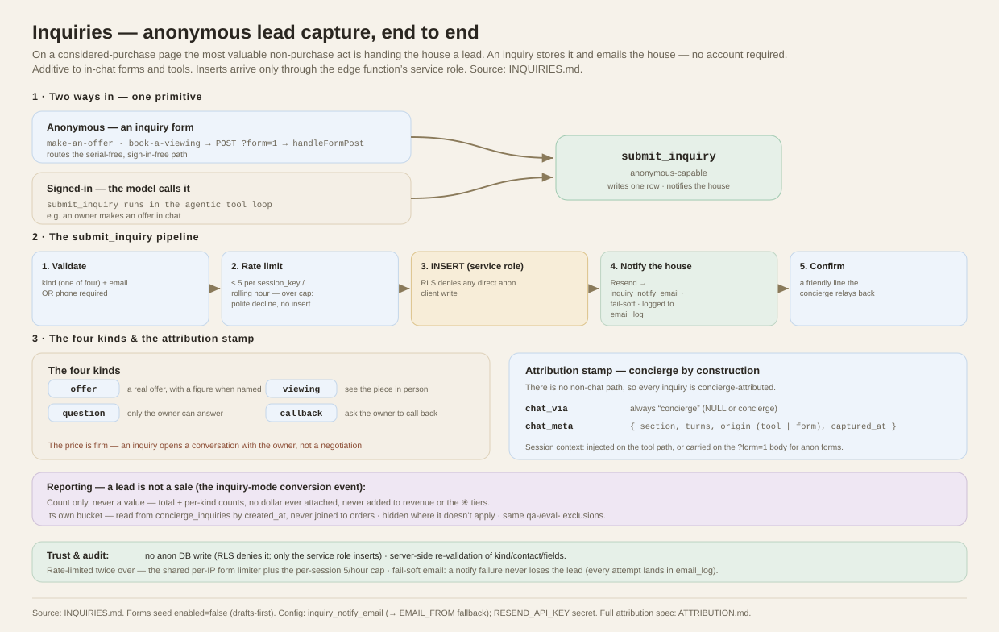

# Inquiries — the lead-capture primitive

On a considered-purchase page, the most valuable thing a shopper can do short of
buying is **hand the house a lead**: a serious offer, a request to view the piece
in person, a question only the owner can answer, or a request for a callback. The
**inquiry** primitive captures exactly that — stores it, and emails the house.

The whole primitive on one page — the two entry paths, the submit_inquiry
pipeline, the four kinds, the attribution stamp, and the lead-is-not-a-sale rule:

*[`docs/inquiry-flow.svg`](docs/inquiry-flow.svg) — grounded in this document.*

It is deliberately **anonymous-capable**. A serious buyer often has no account
(they arrived from a listing, not a login), so an inquiry never requires sign-in.
Inserts arrive through the edge function's service role, never a direct client
write.

Everything below is additive to the existing [in-chat forms](FORMS.md) and
[tools](TOOLS.md) — an inquiry is captured by an inquiry **form** or the
`submit_inquiry` **tool**, both of which write one row and notify the house.

---

## 1. The four kinds

`kind` is one of:

| Kind | When the concierge uses it |
|------|----------------------------|
| `offer` | the shopper makes a real offer (with a figure, when named) |
| `viewing` | they want to see the piece in person |
| `question` | a question only the owner can answer |
| `callback` | they ask the owner to call them back |

The price is **firm** — an inquiry opens a conversation with the owner; it is not
a negotiation. See the `serious-offers` SOP seed in `setup.sql`.

---

## 2. The table — `concierge_inquiries`

Defined in `supabase/setup.sql` (idempotent `create table if not exists`).

| Column | Type | Notes |
|--------|------|-------|
| `id` | uuid pk | `gen_random_uuid()` |
| `created_at` | timestamptz | `now()` |
| `kind` | text | check: `offer` · `viewing` · `question` · `callback` |
| `name` | text | the shopper's name |
| `email` | text | email **or** phone is required |
| `phone` | text | nullable |
| `amount` | numeric | the offer figure, nullable |
| `message` | text | a line of context |
| `session_key` | text | the widget session — used for the rate limit |
| `page_url` | text | nullable — where the inquiry was made |
| `status` | text | check: `new` (default) · `contacted` · `closed` |
| `meta` | jsonb | `{}` default; carries the signed-in user id/email when present |

**RLS** mirrors `waitlist` exactly: row-level security is on, authenticated
**admins** get full access (`is_concierge_admin()`), and there is **no anon
policy** — a direct client insert is denied. The edge function's service role
bypasses RLS to write the row. Indexes: `created_at desc`, `(status, created_at)`,
and `(session_key, created_at)` for the rate-limit lookup.

---

## 3. The tool — `submit_inquiry`

Registered alongside the other concierge tools in
`supabase/functions/concierge/index.ts`. Anonymous-capable.

**Args:** `kind` (required, one of the four), `name` (required), `email`,
`phone`, `amount` (number), `message`. It requires **`email` OR `phone`** so the
house has a way to follow up.

**Behavior:**

1. Validate `kind` and the minimal contact (email or phone).
2. **Rate limit** — at most **5 inquiries per `session_key` per rolling hour**.
   The tool counts the session's recent rows; over the cap it returns a polite
   *"we already have your details"* and **does not insert** (and does not
   re-notify).
3. Insert the row via the service-role client.
4. **Notify the house** — a Resend email to the address in the
   `inquiry_notify_email` config key (falling back to the `EMAIL_FROM` address
   when unset). The send is **fail-soft**: a Resend error never fails the tool —
   the row is already saved. The attempt is recorded in `email_log` (kind
   `inquiry`).
5. Return a friendly confirmation the concierge relays.

### How it's reached

- **Anonymously** — via an inquiry **form** (below). The widget POSTs the form to
  the edge function's `?form=1` endpoint; `handleFormPost` routes any form whose
  `submit_tool` is `submit_inquiry` down a **serial-free, sign-in-free** path and
  runs the tool with the service role.
- **Signed-in** — the model may call `submit_inquiry` directly in the agentic
  tool loop, e.g. when an owner makes an offer in chat.

The `session_key` (and optional `page_url`) are passed through from the form POST
so the rate limit and provenance work for anonymous traffic.

---

## 4. The forms — `make-an-offer` & `book-a-viewing`

Two `concierge_forms` rows are seeded in `setup.sql`, both **`enabled = false`**
(drafts-first, like all generated content — an operator turns them on when the
page is ready):

| Form | Fields | Binds to |
|------|--------|----------|
| `make-an-offer` | name, email, phone (optional), amount, message | `submit_inquiry`, `kind=offer` |
| `book-a-viewing` | name, email, phone, preferred time / message | `submit_inquiry`, `kind=viewing` |

The `kind` is bound to the form by a **fixed-value hidden field**
(`{"name":"kind","type":"hidden","value":"offer"}`) — set by the definition, not
typed by the shopper. Unlike register-edit forms, inquiry forms carry **no order
serial** and require **no sign-in**.

The concierge emits `{{form:make-an-offer}}` / `{{form:book-a-viewing}}` on its
own line when the `serious-offers` SOP (also seeded) tells it to — when a shopper
signals a serious offer or asks to view.

---

## 5. The admin panel — Inquiries

In the admin studio's **Customers** tab, below the Waitlist panel. It mirrors the
Waitlist list: newest first, showing kind, name, contact, amount, message, and
date, with filters (date range, keyword, kind, status) and CSV export. Each row
has a status control to move an inquiry **new → contacted → closed** as it's
worked (a direct `concierge_inquiries` update, admin-only under RLS).

---

## 6. Reporting — the inquiry-mode conversion event

On a checkout-less page the concierge can't earn a commission, so **a submitted
inquiry is its conversion event** — the analog of the commission-button click.
The **Conversion** tab surfaces it as a dedicated **Leads & inquiries** card,
built in the same style as the commission metrics (range-scoped tiles, deltas vs
the comparison window, a per-kind split bar, and a trend chart).

The hard honesty rule: **a lead is not a sale.** So this card is deliberately
walled off from every revenue figure:

- **Count only, never a value.** A total lead count plus per-kind counts (offer /
  viewing / question / callback). **No dollar figure is ever attached**, and a
  lead is never added to commission revenue, the ✳ tiers, or "sales."
- **Its own bucket.** Everything is read from `concierge_inquiries` by
  `created_at` — never joined to `orders`.
- **Hidden where it doesn't apply.** On a commission-mode install (e.g.
  Feierabend) with no inquiries, the card renders nothing at all — it never
  disturbs or blends into the commission metrics. Where inquiries exist but none
  fall in the selected range, it shows honest zeros.
- **Same exclusions.** `qa-` / `eval-` test traffic is excluded exactly as it is
  from the commission metrics.

### Attribution stamp

Because an inquiry is submitted **through** the concierge, it is
**concierge-attributed by construction** — there is no non-chat path. At insert
time `submit_inquiry` stamps two columns mirroring `orders`:

| Column | Value |
|--------|-------|
| `chat_via` | always `concierge` (constraint: `NULL` or `concierge`) |
| `chat_meta` | `{section, turns, origin, captured_at}` — page section, conversation depth, how it arrived (`tool` in chat / `form` via a form POST), and the timestamp |

The session context reaches the stamp the same way the commission marker reaches
checkout: injected from the live request on the agentic tool path, or carried on
the anonymous `?form=1` body (`section` / `turns` beside `session_key`) on the
form path — the forms stay sign-in-free. Full spec and the lead-vs-sale
distinction: [`ATTRIBUTION.md`](ATTRIBUTION.md).

## 7. Configuration

| Where | Key | What |
|-------|-----|------|
| `concierge_config` | `inquiry_notify_email` | destination for new-inquiry emails; blank → falls back to the `EMAIL_FROM` address |
| Function secret | `RESEND_API_KEY` | required for the notification to actually send; absent → the row is still saved and the miss is logged |

---

## 8. Trust & audit

- **No anon DB write.** RLS denies a direct client insert; the row is written by
  the service role inside the edge function only.
- **Server-side validation.** `kind`, contact, and field values are re-checked in
  the tool regardless of what the form sent.
- **Rate limited** twice over: the shared per-IP form limiter, plus the per-session
  5/hour inquiry cap.
- **Fail-soft email.** A notification failure never loses the lead; every attempt
  lands in `email_log`.
