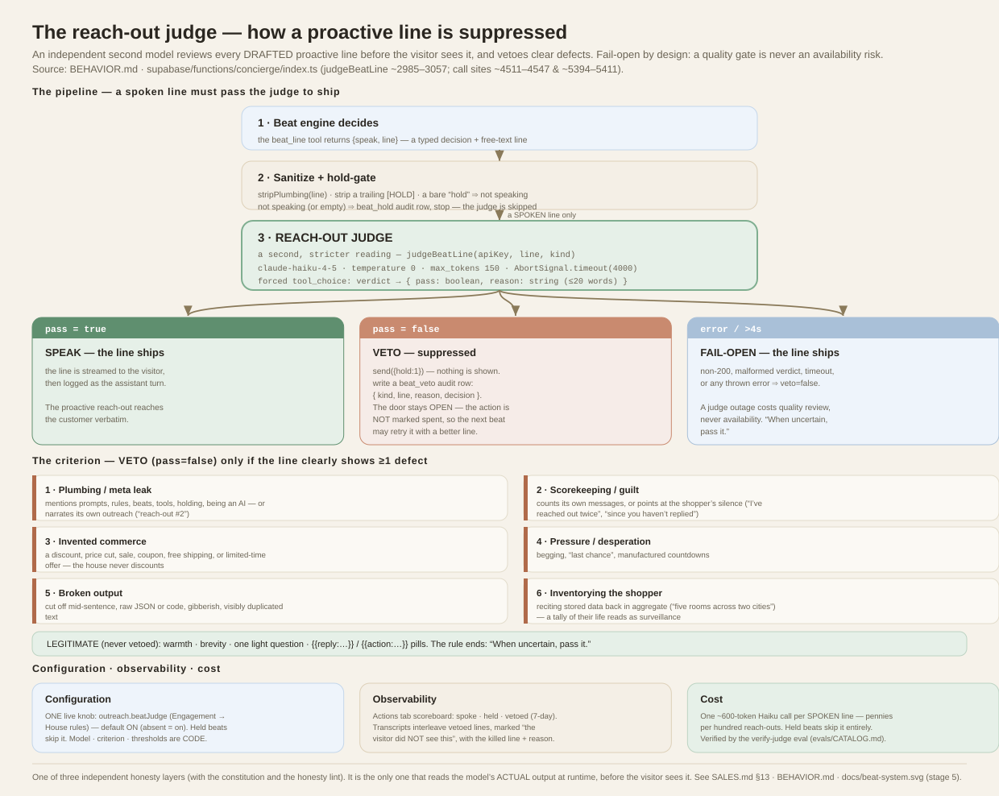

# The reach-out judge — proactive-line suppression

How the concierge suppresses a bad **proactive** line before a visitor ever sees
it: an independent second model reads the drafted line, and vetoes clear defects.
It is **fail-open** — a quality gate is never allowed to become an availability risk.



**Code:** `supabase/functions/concierge/index.ts` — `judgeBeatLine` (~2985–3057),
in-panel call site (~4511–4547), closed-panel bubble call site (~5394–5411).
**Companions:** [COACH.md](COACH.md) (the pre-draft mirror — the sales-strategist
coach that *adds* strategy before the line is written, where this judge *removes*
defects after) · [BEHAVIOR.md](BEHAVIOR.md) (the beat system) · [SALES.md](SALES.md) §13
(the three honesty layers) · [COST.md](COST.md) · [`docs/beat-system.svg`](docs/beat-system.svg)
(stage 5).

---

## 1. Why it exists

The beat system speaks *unprompted* — an opener on panel-open, a nudge after a
lull, a closed-panel bubble. Unprompted lines are the highest-risk surface:
there is no user turn to constrain them, and a single off-key line ("since you
haven't replied…", "last chance!", a leaked "reach-out #2") erodes trust
instantly. The prompt already forbids these, but **prompts are not a control** —
they instruct the same model whose output is in question.

The reach-out judge is a control: a *second, independent reading* of the model's
**actual output** by a different, cheaper model whose only job is to catch clear
defects. It is the only one of the three honesty layers that inspects the real
generated line at runtime (the [constitution](SALES.md#13-what-keeps-it-honest-at-runtime)
binds the prompt; the honesty lint checks *saved edits*, not live output).

## 2. Where it sits in the pipeline

A proactive line only reaches the judge if the beat engine decided to speak and
the line survived sanitization:

```
Beat engine → beat_line tool → { speak, line }
   │  (typed decision + free-text line)
   ▼
Sanitize + hold-gate
   · stripPlumbing(line)              (remove any leaked meta)
   · strip a trailing "[HOLD]"        (a saved override may still emit it)
   · a bare "hold" ⇒ speak = false
   │
   ├─ not speaking / empty  ──►  beat_hold  (audit row; the judge is SKIPPED)
   ▼
REACH-OUT JUDGE  (only a SPOKEN line reaches here)
   ├─ pass = true            ──►  SPEAK    — the line ships, logged as the turn
   ├─ pass = false           ──►  VETO     — suppressed + beat_veto audit row
   └─ error / timeout / bad  ──►  FAIL-OPEN — the line ships (veto = false)
```

The sanitize step is a deliberate belt-and-suspenders: `stripPlumbing` and the
`[HOLD]` scrub run *before* the judge so the judge spends its budget on judgment,
not on catching a stray marker a merchant-era saved `engagement_base` override
might still emit.

## 3. The judge call — the technical contract

`judgeBeatLine(apiKey, line, kind, houseRules)` makes one Anthropic Messages API call:

| Parameter | Value | Why |
|---|---|---|
| `model` | `claude-haiku-4-5-20251001` | cheap + fast; the task is narrow classification |
| `temperature` | `0` | deterministic verdicts; no creativity wanted |
| `max_tokens` | `150` | it only returns a boolean + a short reason |
| timeout | `AbortSignal.timeout(4000)` (4 s) | bounds the added latency; a slow judge fails open |
| `tool_choice` | `{ type: "tool", name: "verdict" }` | **forces** a structured verdict — no prose to parse |
| `system` | "strict, literal reviewer of ONE line … judge ONLY against the criterion" | keeps it from drifting into taste/tone |

The forced `verdict` tool's schema is the whole output contract:

```json
{ "type": "object",
  "properties": {
    "pass":   { "type": "boolean", "description": "true = fit to send; false = veto" },
    "reason": { "type": "string",  "description": "one short clause (<=20 words) citing the deciding evidence" }
  },
  "required": ["pass", "reason"] }
```

The function returns `{ veto: input.pass === false, reason }`. The `kind`
("nudge" | "opener" | "bubble" | "bubble-postsale") is passed to the judge as
context but does not change the criterion.

The **`houseRules`** argument is what makes the judge house-accurate rather than
Feierabend-specific — see §4a. Both call sites compute it with
`houseHonestyRules(config)` and append it to the user message under a
`HOUSE RULES (authoritative for this house)` heading. It is optional: absent, the
judge falls back to the six universal defects alone.

## 4. The criterion — what a veto *is*

The criterion has **two parts**: six **universal defects** that are hardcoded and
apply to every house (`BEAT_JUDGE_CRITERION`), and a **per-house grounding** block
injected at call time (§4a). The judge **vetoes if the line clearly exhibits at
least one universal defect, OR clearly contradicts the house rules it is given.**

The six universal defects (`BEAT_JUDGE_CRITERION`, always in force):

1. **Plumbing / meta leak** — mentions instructions, prompts, rules, beats,
   tools, holding, being an AI/model, or narrates its own outreach
   ("reach-out #2", "checking in as instructed").
2. **Scorekeeping / guilt** — counts its own messages or points at the shopper's
   silence ("I've reached out twice", "since you haven't replied").
3. **Invented commerce** — a discount, price cut, sale, coupon, free shipping,
   urgency, or countdown **the house rules do not authorize**. *If the house holds
   a firm price, any discount is a veto; if the house rules permit offers or
   negotiation, inviting one is legitimate, not invented.* (This clause used to
   hardcode "the house never discounts" — a Feierabend assumption; it is now
   resolved against the house's actual price posture, §4a.)
4. **Pressure / desperation** — begging, "last chance", manufactured countdowns.
5. **Broken output** — cut off mid-sentence, raw JSON or code, gibberish,
   visibly duplicated text.
6. **Inventorying the shopper** — stringing **two or more** stored personal
   details into a tally ("you're furnishing five rooms across two cities, and
   your wife…"): a tally of their life reads as surveillance. *One remembered
   detail worn lightly — **especially** one the house notes or recent transcript
   below already contain — is grounded **service**, not this defect; a single
   grounded callback is always passed.* (Tightened after the judge was seen
   vetoing single grounded callbacks — "still furnishing the van?" — as
   "inventorying"; the root cause was missing grounding, see §4b.)

Explicitly **legitimate** (never a veto): warmth, brevity, one light question,
and `{{reply:…}}` / `{{action:…}}` pills. The criterion ends with the tie-break
that keeps it high-precision: **"When uncertain, pass it."** The judge is a
defect filter, not a taste critic — false vetoes (silencing good lines) are
treated as worse than a rare miss, which is why the whole design is precision-biased.

## 4a. House grounding — dynamic, per-house, from the constitution

The six defects are universal, but *what a given house may claim, how it prices,
and what it may offer* is house-specific. Rather than bake Feierabend's answers
into the gate, the judge is grounded at call time in the **effective
constitution's HONESTY & SCOPE** — the same source of truth that binds the
drafting prompt:

```
houseHonestyRules(config)                       (index.ts, next to judgeBeatLine)
  · base = config.voice_base   (admin-editable override in the studio)
           else BRAND_SYSTEM    (the code fallback — stamped per-product by the kit)
  · slice from the "HONESTY & SCOPE" heading onward
  · strip {{TOKENS}}, cap 1600 chars
  ▼
appended to the judge's user message under
"HOUSE RULES (authoritative for this house)"
```

This is deliberately **not** the assertiveness/selling dial. The judge reads the
house's *truth* — price posture ("$589 and it never moves; no discounts" for
Feierabend, or "offers welcome" for a private car sale), medical/claim
boundaries, one-product scope — never how hard the house is selling. A harder or
softer sell can therefore never move the gate; only the house's honesty rules do.
Two consequences:

- **Fewer false vetoes.** For a house whose rules permit negotiation, an
  invitation to make an offer is no longer misread as "invented commerce".
- **More true vetoes.** A house-specific claim the rules forbid (a medical claim,
  a product outside scope, a fabricated figure) is now catchable, because the
  judge can see what this house is actually allowed to say.

Because `voice_base` is admin-editable and `BRAND_SYSTEM` is the block the kit
stamps per product (§13), the grounding stays accurate for every house **with no
change to the judge code** — the gate is dynamic without becoming operator-weakenable
(the six universal defects remain a fixed floor the constitution cannot remove).

## 4b. What the judge sees — the complete grounding

"What did the judge actually have in front of it?" must never be a mystery: a gap
here is precisely what turns a legitimate line into a **false veto**. Both call
sites (`judgeBeatLine` — the nudge/opener site next to the beat loop, and the
closed-panel bubble site) hand the reviewer **only** the following. It does NOT
see the full KB, the registered media, or the drafting system prompt:

1. **`houseRules`** = the constitution's HONESTY & SCOPE slice (§4a) **+ what the
   house sells + house amendments.** The "what the house sells" block
   (`authorizedScopeForJudge(kbText)`) lifts the KB sections that NAME the product
   and cloths (Product / Colorways / range / …), because the SCOPE slice states
   the cloth *count* ("three colorways") but **not their names** — so without it
   the judge vetoed authorized cloths ("Ungefärbt", "Loden") as *invented
   colorways*. It reads the house's own KB (rows joined as `## <title>\n<body>`),
   so it travels to every stamped house; a site with no such section ⇒ no-op.
2. **`beatFacts`** — the grounding blob (≤3000 chars): live **edition** counts +
   **booking/callback** facts + **house notes on this shopper**
   (`judgeGroundingFacts`, ≤10 notes / ≤1100 chars) + the **recent transcript**
   (`recentTurnsForJudge`). This is what lets a warm callback to a known fact
   ("still furnishing the van?") read as service, not inventing/inventorying.
   House notes are the grounding that survives a page refresh, so the bubble path
   (no live transcript) still receives them.
3. **The drafted line itself** + the shopper's **last message** (`recentUser`).

The rule of thumb: **anything the drafter legitimately knows but the judge is not
handed becomes a false-veto risk.** When the drafter uses a fact from the KB, the
media registry, or memory, that fact must be mirrored into (1) or (2) — the whole
job of `authorizedScopeForJudge` + `judgeGroundingFacts` + `editionContextBlock` +
`bookingContextBlock`. A missing colorway name (fixed via the roster) and a
truncated house note (fixed by the wider window) were both false-veto sources.

## 5. Outcomes & their semantics

- **PASS → SPEAK.** The line is streamed to the visitor and logged as the
  assistant turn. Nothing special happens; the reach-out reaches the customer
  verbatim.
- **VETO → SUPPRESS.** `send({ hold: 1 })` — the widget shows nothing. If beat
  auditing is on, a `concierge_actions` row is written with `action="beat_veto"`,
  `payload = { kind, line, reason, decision }`, and `result = "vetoed — <reason>"`.
  **Crucially, a veto does NOT mark the beat's decided action spent** — the door
  stays open, so the *next* beat may try the same objective again with a better
  line. A veto suppresses *this* wording, not the intent.
- **FAIL-OPEN.** Any non-200 response, a malformed/missing verdict, a >4 s
  timeout, or any thrown error resolves to `{ veto: false }` — the line ships.
  A judge outage costs quality review, never availability.

**`beat_hold` vs `beat_veto` are distinct outcomes** and are recorded
separately: a *hold* means the model chose silence (nothing to say); a *veto*
means the model drafted a line and the judge killed it. Collapsing them would
make "the concierge had nothing to say" and "the concierge tried to say
something bad" look identical in the metrics.

## 6. Where it runs

Two call sites, same function, same criterion:

- **In-panel** openers and nudges — the toolless fast path (~4520): kind
  `"opener"` / `"nudge"`.
- **Closed-panel re-engagement bubble** (~5406): kind `"bubble"` /
  `"bubble-postsale"`.

Both guard on the same toggle and both write `beat_veto` on suppression.

## 7. Configuration — one toggle; everything else is code

The judge has a deliberately tiny *knob* surface. **Exactly one thing is a
toggle: whether it runs at all.** Its model, its six universal defects, and its
thresholds are **code** — constants in the concierge function, versioned with it
and changed only by a developer. The one part that *does* vary per house — the
house-rules grounding (§4a) — is not a judge knob at all: it is **derived** from
the effective constitution (`voice_base` else `BRAND_SYSTEM`), the same honesty
text that already binds the drafting prompt. So the gate tracks each house's
truth without exposing a control the merchant could use to *weaken* it (contrast
the [selling method](SALES.md), which is all live-editable data).

| Setting | Where it lives | Type | Default |
|---|---|---|---|
| **On / off** | `concierge_config.outreach.beatJudge` — admin **Engagement → House rules** ("Review every reach-out before it sends") | **config** — live, no deploy | **ON** |
| Model | `BEAT_JUDGE_MODEL` (`index.ts`) | code | `claude-haiku-4-5-20251001` |
| Universal defects (the six) | `BEAT_JUDGE_CRITERION` (`index.ts`) | code | §4 |
| House-rules grounding | `houseHonestyRules(config)` — the HONESTY & SCOPE slice of `voice_base` else `BRAND_SYSTEM` | **derived** from the constitution (not a judge knob) | §4a |
| Temperature · max_tokens · timeout | `judgeBeatLine` (`index.ts`) | code | `0` · `150` · `4000 ms` |
| Audit rows on/off | `beatAuditOn(config)` (writes `beat_action`/`beat_veto`) | config | on (stamped/scale installs may seed off) |

So in practice, **"configuring the judge" = one switch**: *Engagement → House
rules → "Review every reach-out before it sends."*

- The check in code is `oj?.beatJudge !== false` — so the key being **absent
  means ON**. You only ever set it to turn the judge *off*.
- **Off** ships every spoken line unreviewed (a lever for very high-volume,
  cost-sensitive installs). **On** (default) reviews every spoken line.
- **Held beats never reach the judge**, so the toggle affects spoken lines only,
  never silence.

To change the *universal* defects or *which model* reviews, edit
`BEAT_JUDGE_CRITERION` / `BEAT_JUDGE_MODEL` and redeploy the function — see §11.
To change what's *house-specific* (this house's price posture, claim boundaries,
scope), edit the **constitution** — `voice_base` in the studio, live — and the
judge picks it up on the next reach-out, because it reads that same HONESTY &
SCOPE text (§4a). That split is the whole point: the universal floor is
developer-owned code; the house-specific truth is the constitution the operator
already maintains; neither is a dedicated "judge criterion" knob the merchant can
loosen.

## 8. Observability

- **Actions tab scoreboard** — a 7-day **spoke · held · vetoed** tally.
- **Transcripts** interleave held and vetoed beats by time, marked *"the visitor
  did NOT see this"*; a vetoed row carries the **killed line and the judge's
  reason**, so an operator can see exactly what was blocked and why.
- Every veto is an auditable `beat_veto` row; auditing is itself gated
  (`beat_action` / `beat_veto` are the fastest-growing rows, so stamped/scale
  installs can seed it off). See [BEHAVIOR.md](BEHAVIOR.md).

## 9. Cost

One ~600-token Haiku-class call **per spoken proactive line** — pennies per
hundred reach-outs. Held beats skip it entirely (the common case). It fails open,
so the spend buys review, never uptime. See [COST.md](COST.md).

## 10. Verification

The judge is exercised by the **verify-judge** eval (it confirms the judge
actually vetoes planted defects and passes clean lines), run in CI alongside the
persona evals. See [`evals/CATALOG.md`](evals/CATALOG.md).

## 11. Design trade-offs & extension points

- **Precision over recall, on purpose.** "When uncertain, pass" + six concrete
  defects keeps false vetoes low. The cost is that a *subtly* off line can slip;
  the mitigation is that the constitution already shapes the draft, and the
  criterion covers the observed failure modes rather than trying to be exhaustive.
- **Fail-open, not fail-closed.** A stricter product could hold on judge error;
  this one ships, because for a *sales* concierge a missed reach-out is a worse
  outcome than a rare unreviewed line, and the base rate of defects is low.
- **The universal defects are code; the house grounding is derived, not a knob.**
  The six defects are versioned with the function and changed by a developer. The
  house-specific truth is read from the constitution (§4a) — dynamic per house,
  but sourced from the honesty text the operator already maintains, never a
  dedicated judge criterion the merchant can loosen. The safety floor stays a
  floor; only the house's *own honesty rules* move the house-specific part.
- **Extending it:** add a defect category to `BEAT_JUDGE_CRITERION`; refine what
  `houseHonestyRules` extracts from the constitution; add a new `kind` at a new
  call site; or (future) make the model tier configurable. Any change should keep
  the forced-`verdict` contract and the fail-open guarantee.

## 12. Relationship to the other honesty layers

| Layer | Reads | When | On failure |
|---|---|---|---|
| **Constitution** (`kb.ts`) | the prompt | assembly | shapes the draft |
| **Sales coach** ([COACH.md](COACH.md)) | the full situation | runtime, **pre-draft** | **adds** the best play (advisory, fail-open) |
| **Reach-out judge** (this doc) | the model's **actual line** | runtime, **post-draft** | **suppresses** defects (fail-open) |
| **Honesty lint** (`?lint=1`) | a **saved edit** to method/examples/beats | at save | advisory flag |

The judge is the only runtime *output-inspecting* control — the last thing
between a drafted proactive line and the visitor. Its immediate partner is the
[sales coach](COACH.md), the *pre-draft* runtime control: the coach improves the
line, the judge makes sure it's safe. Coach adds, judge removes; both are bounded
by the same constitution, so neither can weaken the house's honesty.

**The whole interplay in one picture** — the control plane, showing how one
constitution grounds both the coach and this judge, with the honesty lint and
evals as the surrounding guards:


## 13. How the kit (`concierge-kit`) provisions the judge

The judge is part of the **reusable engine**, and the kit —
[Maniwar/concierge-kit](https://github.com/Maniwar/concierge-kit) — stamps that
engine onto a new storefront. As of this writing, its handling of the judge:

- **Judge code vendored unchanged.** `judgeBeatLine`, `BEAT_JUDGE_MODEL`, and
  `BEAT_JUDGE_CRITERION` (the six universal defects) live in the pristine
  `engine/` snapshot and appear in **neither** stamp manifest
  (`stamp/tokens.manifest.json`, `stamp/blocks.manifest.json`). Every stamped
  product gets the judge **byte-identical**, pinned to `ENGINE_VERSION`. This is
  deliberate — the universal floor is a safety backstop, kept uniform and
  versioned rather than regenerated per brand (the same reasoning as §7).
- **House grounding rides the constitution the kit already stamps.** The
  house-specific half (§4a) is read from `voice_base` else `BRAND_SYSTEM`, and
  `BRAND_SYSTEM` **is** a Class-2 block the kit rewrites per product
  (`blocks.manifest.json`). So a stamped store's judge is grounded in *that
  store's* HONESTY & SCOPE — price posture, claim boundaries, scope — with no
  judge-specific stamp step. The 996 pilot's "offers welcome" posture, for
  instance, reaches the judge through its stamped constitution automatically.
- **Defaults ON with no seed.** `beatJudge !== false` means absent = on; the
  stamp does not need to seed it.
- **Gate-clean.** The universal defects use only generic terms, so they carry no
  brand string and pass `stamp/forbidden-strings.txt` (the leakage gate)
  untouched; the house grounding is derived at runtime from the already-stamped
  constitution, so it introduces no new leakage surface.
- **Exercised per product.** `adopt generate` writes a product-specific eval deck
  (judge-adjacent scenarios like *no-scarcity-theater*), and `adopt verify` runs
  it against the new deployment — so the reach-out judge is *tested* against each
  brand even though its universal rules are not rewritten. *(The `judge:` fields
  in that deck are the eval grader — a separate mechanism from this reach-out
  judge.)*

## 14. Backlog / open ideas

Recorded so the current design is intentional and the options are on the record;
mirrored in [BACKLOG.md](BACKLOG.md).

- **[Shipped] Dynamic per-house grounding.** Defect (3) no longer hardcodes "the
  house never discounts"; it now reads against the house's actual price posture,
  and the judge is grounded per call in the effective constitution's HONESTY &
  SCOPE (`houseHonestyRules`, §4a). This both removed the Feierabend seam and
  made the judge catch house-specific claim violations — without adding an
  operator-weakenable knob (the six universal defects remain a fixed floor).
- **Per-product criterion via the block manifest** *(considered).* Make
  `BEAT_JUDGE_CRITERION` a Class-2 block the kit rewrites per brand. Trade-off: it
  adds a brand-authored surface to a *safety* control and weakens the "one uniform
  backstop" guarantee — held unless a product needs genuinely different defects.
- **Operator-editable criterion (admin)** *(declined, by design).* A merchant
  editing the gate that constrains their own bot is the failure mode the gate
  prevents (§7). House-specific "never say X" belongs in the constitution/SOPs,
  which shape the draft.
- **Configurable judge model tier** *(small).* Expose `BEAT_JUDGE_MODEL` as a
  per-install setting for cost/quality trade-offs at scale.
- **Judge reactive replies too** *(scope).* Today only *proactive* lines are
  judged; a stricter product could extend the same gate to reactive answers, at a
  per-turn latency/cost the current design deliberately avoids.
