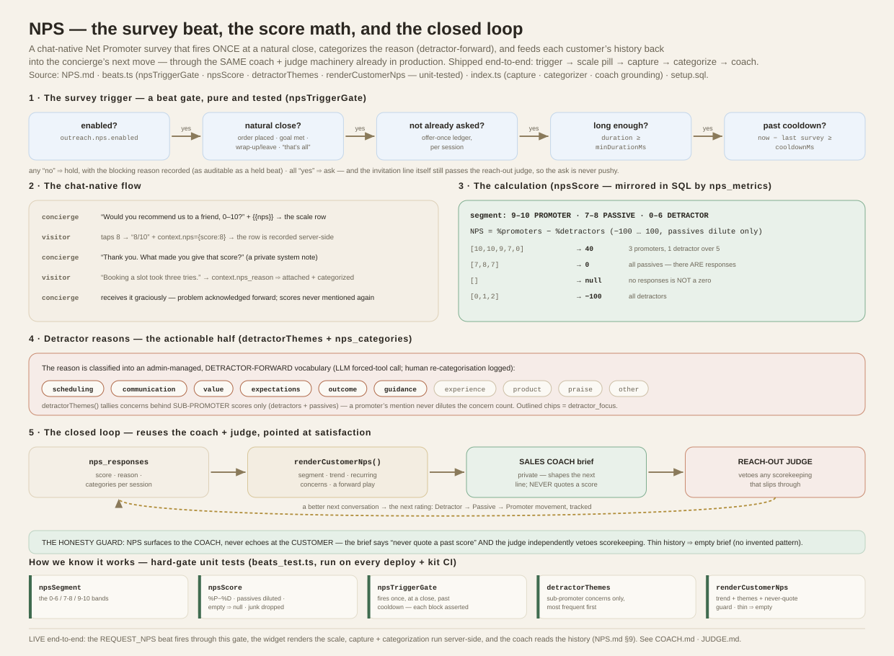

# NPS — closed-loop feedback for the concierge

How the concierge captures a **Net Promoter Score** at the end of a session,
turns the reason into structured, **detractor-aware** categories, and feeds that
history back into how it talks to each customer — the same closed-loop pattern
as the [sales coach](COACH.md) and the [reach-out judge](JUDGE.md), pointed at
satisfaction instead of reply-rate.

**Design stance:** the survey is a **beat** (fire once, at a natural close,
gated), the score is **standard NPS math**, and the closed loop **reuses the
machinery already in production** — the coach brief, the judge's honesty gate,
and the `concierge_insights`-style cached digest. New surface area is small.



**Code:** `supabase/functions/concierge/beats.ts` — `npsSegment`, `npsScore`,
`npsTriggerGate`, `detractorThemes`, `renderCustomerNps` (all pure, unit-tested
in `beats_test.ts`). Schema + the aggregate calculation: `supabase/setup.sql`
(`nps_responses`, `nps_categories`, `nps_metrics()`).
**Companions:** [COACH.md](COACH.md) (the loop this reuses) · [JUDGE.md](JUDGE.md)
(the never-quote-a-score guard) · [BEHAVIOR.md](BEHAVIOR.md) (the beat system) ·
[SCHEMA.md](supabase/SCHEMA.md).

> **Status: LIVE end-to-end.** The `REQUEST_NPS` beat fires through the tested
> gate, the widget renders the 0–10 scale, score + reason capture and the LLM
> categorizer run server-side, the customer's history grounds the coach (judge-
> guarded), and the admin studio carries the config block, the Conversion-tab
> NPS card, the patron badge, and the transcript badge. Default ON
> (`outreach.nps.enabled !== false`); turn it off in Engagement → House rules.

---

## 1. The survey trigger — it's a beat

An NPS prompt is a proactive line, so it is a **beat**, gated by the same
discipline as every other (BEHAVIOR.md): fire **once**, only at a **natural
close**, only for a session **worth rating**, never inside a **cooldown**. The
gate is a pure function, `npsTriggerGate`, so it's testable and auditable:

```
npsTriggerGate({ enabled, concluded, alreadySurveyedSession,
                 sessionDurationMs, minDurationMs,
                 lastSurveyedAtMs, cooldownMs, nowMs }) → { ask, reason }
```

It answers **yes** only when all hold:

- **enabled** — `outreach.nps.enabled` (absent = **ON**, the house pattern; Engagement → House rules).
- **concluded** — a natural end was reached: an order placed, a goal met, the
  wrap-up/leave signal (`?wrapup` / `pagehide`), or the visitor's "that's all for
  now". Never mid-conversation.
- **not already offered this session** — the "offer once" ledger, exactly like
  the beat engine's spent-action logic; a submitted row or a recorded offer
  closes the door for the session.
- **long enough** — `sessionDurationMs ≥ outreach.nps.minDurationMs`; a
  five-second bounce isn't worth a survey.
- **past the cooldown** — `now − lastSurveyedAtMs ≥ outreach.nps.cooldownMs`;
  the same customer isn't re-surveyed too soon (over-prompting *lowers* both
  response rate and trust).

Every decision returns a `reason`, so a held survey is as diagnosable as a held
beat. When it fires, the concierge's **invitation line still passes the
[reach-out judge](JUDGE.md)** — so an NPS ask can never come across as pushy or
guilt-tripping.

## 2. The survey flow (chat-native)

The prompt is part of the conversation, not a modal:

1. The beat speaks one warm line ending with the **`{{nps}}` token**, which the
   widget renders as a tappable **0–10 scale row** (the pill mechanism).
2. A tap sends a visible turn ("8/10") carrying `context.nps = {score}` — the
   server records the `nps_responses` row **deterministically** (never
   model-dependent), once per conversation, and a private system note has the
   concierge thank them and ask the follow-up: *"what made you give that score?"*
3. The next real message carries `context.nps_reason = 1`; the server attaches
   it as `reason_text` on the open row and fires the **async categorizer**.
4. The concierge receives it graciously (problem → acknowledged and addressed
   forward; praise → light thanks) and never mentions scores again. **Skip** is
   simply not answering — the gate never re-asks this session.

It is fast, mobile-native, and accessible because it *is* the chat — the same
components the widget already renders.

## 3. The calculation — standard NPS

Two pure functions pin the math (and `nps_metrics()` mirrors them in SQL for the
dashboards, so the number is identical wherever it's shown):

- **`npsSegment(score)`** — 9–10 **promoter**, 7–8 **passive**, 0–6
  **detractor**. In the schema this is a **generated column**, never stored loose.
- **`npsScore(scores)`** — `%promoters − %detractors`, on a **−100…100** scale,
  rounded. **Passives count in the denominator but never the numerator** — that
  is the whole point of the metric. It returns **null** for an empty set: no
  responses is *not* a score of zero, and that difference has to stay visible.

| input | promoters | detractors | NPS |
|---|---|---|---|
| `[10,10,9,7,0]` | 3 | 1 | **40** |
| `[9,9,9,9]` | 4 | 0 | **100** |
| `[0,1,2]` | 0 | 3 | **−100** |
| `[7,8,7]` | 0 | 0 | **0** (not null — there are responses) |
| `[]` | — | — | **null** |

## 4. Detractor reasons — the actionable half

A score is a thermometer; the **reason** is the lever. On submission an LLM
classifies `reason_text` into one or more **admin-managed categories**
(`nps_categories` — `slug, label, prompt_hint, detractor_focus, enabled`), using
the same forced-tool structured-output pattern as the judge and the goal grader.
Both the raw text and the assigned categories are stored, and an operator can
**re-categorise** on the dashboard (logged, `category_source='human'`).

The vocabulary is **detractor-forward** by design — its seed leads with the
themes that explain *why* someone is unhappy and are the most fixable:
`scheduling`, `communication`, `value`, `expectations`, `outcome`, `guidance`
(all `detractor_focus`), plus `experience`, `product`, `praise`, `other`.

`detractorThemes(history)` tallies the categories behind **sub-promoter** scores
(detractors **and** passives), most frequent first — promoter mentions are
excluded so praise never dilutes the concerns. `nps_metrics()` exposes the same
split at the aggregate level (`themes` + a separate `detractor_themes`), which is
what powers "3 customers cited *scheduling* this week."

## 5. The closed loop — and the honesty guard

This is where NPS stops being a report and starts changing behaviour, and it is
**the coach loop reused**:

- **Per customer.** `renderCustomerNps(history)` builds a private brief — current
  segment, trend, the recurring concerns, and a **forward-looking play**
  (*rebuild trust* for a detractor, *nudge one improvement* for a passive,
  *invite a referral* for a promoter). It is fed to the [sales coach](COACH.md)
  the same way the reply-rate digest is, so the concierge's next proactive line
  is shaped by this customer's real feedback. Empty on thin history (the
  `renderLearningDigest` honesty floor — no invented pattern for a customer with
  one rating).
- **In aggregate.** `nps_metrics()` (optionally per coach) surfaces the pattern
  panel on the dashboard — the `beat_learning_digest` sibling.

**The load-bearing safety design.** An NPS-aware concierge that references a past
low score is repellent. Two controls stop that, and they already exist:

1. `renderCustomerNps` leads with an explicit instruction: *"NEVER quote a past
   score, rating, or survey back at them."* The brief is a *how*, never a line to
   read out — same contract as the coach.
2. The [reach-out judge](JUDGE.md) independently **vetoes scorekeeping** — so
   even if a draft slipped ("you rated us a 3"), it's killed before the customer
   sees it. NPS surfaces to the *coach*, never echoes at the *customer*.

## 6. Customer 360°

NPS folds into the existing **client book** rather than a parallel store: the
Patron drawer gains an NPS section (timeline of score badges + reason snippets +
category chips; a status card = segment + rolling NPS + trend; themes folded into
`consolidateClientBook`'s rolling summary). One compact NPS line joins the
per-turn **CUSTOMER block** so the *live* conversation is NPS-aware. The
per-customer rolling status is computed the `customer_nps_summary` way — a
cached digest (the `concierge_insights` pattern), recomputed on each new response.

## 7. Data model

| object | shape | notes |
|---|---|---|
| `nps_responses` | id, conversation_id, customer_id (nullable), coach_id, score (0–10), **segment** (generated), reason_text, categories jsonb, category_source, response_time_seconds, survey_version, created_at | admin-read RLS; service-role write. Linked to the conversation thread. |
| `nps_categories` | slug, label, prompt_hint, **detractor_focus**, enabled, sort | admin-managed vocabulary; detractor-forward seed. |
| `nps_metrics(p_days, p_coach?)` | → jsonb `{ nps, responses, promoters/passives/detractors, themes, detractor_themes }` | `security definer`; the dashboard/aggregate calculation, mirroring `npsScore`. |

## 8. Tests — how we know it works

The trigger and the math are pure, so they're pinned in the **hard-gate** deck
(`beats_test.ts`, run by `deno test` on every deploy and by the kit CI):

- **`npsSegment`** — the 0-6 / 7-8 / 9-10 bands.
- **`npsScore`** — %P−%D with passives ignored in the numerator; all-promoters =
  100, all-detractors = −100, all-passives = 0, empty = **null**, out-of-range
  dropped.
- **`npsTriggerGate`** — fires once, only concluded, only long-enough, only past
  the cooldown; each blocking condition asserted independently.
- **`detractorThemes`** — tallies only sub-promoter concerns, most frequent
  first, promoter mentions excluded.
- **`renderCustomerNps`** — a detractor brief carries the themes, the trend, the
  never-quote guard, and the rebuild-trust play; a promoter brief invites a
  referral; thin history ⇒ **empty**.

When the live surface is wired (§9), the eval harness extends the same way the
coach did: a behavior-deck scenario (survey fires at close, not mid-flow, not
twice), a conformance row (admin question/categories reflected in the live
widget), and a judge check (**a planted "you rated us low" line is vetoed**).

## 9. The live wiring — what shipped, and how

- **The trigger** lives in the **nudge beat path**: it gathers the gate's inputs
  (conversation age, post-sale window or a met goal as *concluded*, the offer-
  once check, the per-customer cooldown) and calls the unit-tested
  `npsTriggerGate`; on *ask* it overrides the beat decision with **REQUEST_NPS**
  (service — a blocked order — always outranks it, and a pending question of
  ours suppresses it). The gate's verdict + reason ride the beat audit.
- **Capture is deterministic**: `context.nps` / `context.nps_reason` from the
  widget, written server-side (`captureNpsScore` / `attachNpsReason`) with the
  model only supplying warm language via private system notes. Both fail-open.
- **The categorizer** (`categorizeNpsReason`) — one Haiku forced-tool call over
  the admin-managed `nps_categories`, async, `category_source='llm'`.
- **The coach grounding** — `npsCoachBrief` (→ `renderCustomerNps`) joins the
  reply-rate digest in `coachBeatLine`'s private brief at both proactive sites;
  the judge criterion now names quoting past ratings as scorekeeping and
  whitelists the `{{nps}}` pill.
- **The widget** renders `{{nps}}` as an accessible 0–10 pill row (ES5, the
  `.cx-reply` components).
- **Admin**: Engagement → House rules NPS block (`outreach.nps` — enabled ·
  min-minutes · cooldown-days · question), the Conversion-tab **NPS card**
  (`nps_metrics()` — NPS, segments, detractor themes, recent reasons), a rating
  badge on the patron card and on the conversation transcript head.

**Dashboard depth (shipped in the follow-up pass):** the NPS card now carries a
**trend chart** (segment counts per bucket, the bucket NPS in the tooltip — the
same `cvChart` spec as every other chart), **CSV export**, a **per-coach line**
(when more than one coach has responses), **segment movement** for repeat raters
(↑ improved / ↓ declined, with the at-risk names), and **✎ re-categorisation**
on each recent response (`category_source='human'`, via an admin RLS update
policy). The behavior deck gained `nps-score-capture` — the widget's exact
`context.nps` turns replayed against production (deck turns now support a
per-turn `ctx`). The privacy notice names the voluntary rating in *What we
collect*.

**Fail-visible + deploy-proven (hardening pass):** the NPS card never hides
silently — any `nps_metrics()` failure renders the card with an inline
"NPS unavailable — *reason*" line (and a `console.warn`), so "not deployed" and
"erroring" are distinguishable at a glance. Every deploy now proves the RPC
live: after applying `setup.sql`, the workflow executes `nps_metrics(30)` in
the database (service-role claim) **and** probes the REST path the admin uses —
`403` for the publishable key passes (resolvable + guarded), `404` fails the
deploy (stale PostgREST schema cache; `setup.sql` also ends with
`notify pgrst, 'reload schema'`). The schema-apply step is now blocking — a
SQL error fails the run instead of hiding behind `continue-on-error`.

**Still open** (tracked in [BACKLOG.md](BACKLOG.md)): a segment filter on the
conversations list, and the judge-veto deck scenario for a planted "you rated
us low" line (unit + criterion cover it today; a live-fire deck case is flaky
to force).

## 10. Open decisions (from the PRD)

- **"coach" = who?** The AI concierge instance, or a human agent — `coach_id`
  carries either; the design is invariant. Confirm before the dashboard's coach
  table is built.
- **Response-rate target (>35%)** is a hypothesis to instrument, not a
  guarantee; the cooldown + once-per-session + judge exist precisely so chasing
  the number never costs trust.
- **Causation** — segment movement after an intervention is correlational; a
  holdout/A-B is the honest way to claim the coach *caused* a Detractor →
  Promoter move (the same caveat as the coach-lift eval).
