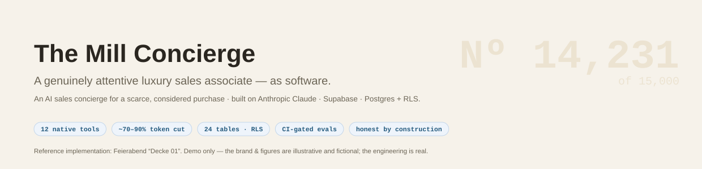
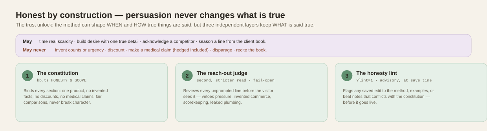
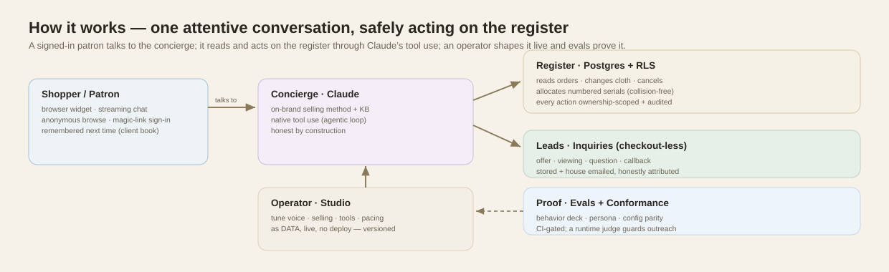
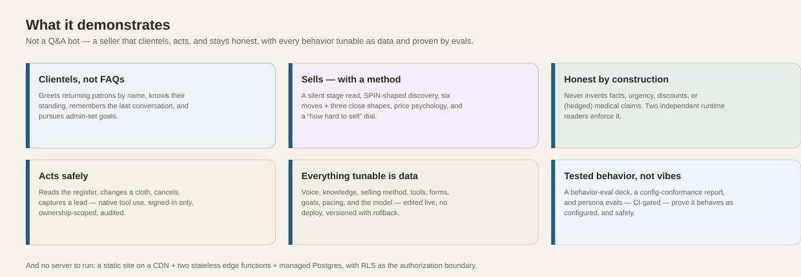
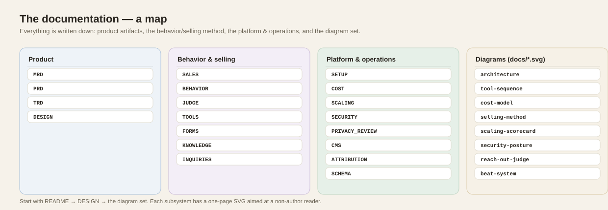

# Feierabend — Decke 01

An AI **sales concierge** for a scarce, considered purchase — a numbered,
limited-edition (15,000-piece) German wool blanket. It explores one question
end-to-end: *what does a genuinely attentive luxury sales associate feel like
when it's software?*

**▶ Live demo:** **https://feier-abend.co/** · mirror: https://maniwar.github.io/Blanket/

> **Demo only** — nothing ships and no payment is taken. The brand, imagery, and
> video are fictional and AI-generated.

---

## The summary in 60 seconds

If you're evaluating this as applied-AI engineering, the LLM substance lives here —
each links a one-page diagram:

- **Native Anthropic tool use** — 12 JSON-schema tools + an agentic `tool_use` loop,
  every call ownership-scoped (RLS) and audited → [docs/tool-sequence.svg](docs/tool-sequence.svg)
- **Prompt caching** — a static cached prefix + a dynamic suffix (tools→system→messages,
  5-min TTL) for a ~70–90% input-token cut → [docs/cost-model.svg](docs/cost-model.svg)
- **Honest by construction** — a constitution + a second-reader judge + an honesty
  lint; persuasion shapes *when and how* true things are said, never *what* is true;
  hedged medical claims are blocked → [SALES.md](SALES.md) · [docs/selling-method.svg](docs/selling-method.svg) · [JUDGE.md](JUDGE.md) (the runtime suppression control)
- **Two brains on every reach-out** — before an unprompted line is written, a focused
  *sales strategist* reads the whole situation and privately briefs the draft with the
  best play; after it's written, the *reach-out judge* vetoes any defect. Coach adds,
  judge removes; **one constitution grounds both** → [COACH.md](COACH.md) · [JUDGE.md](JUDGE.md) · the control-plane view: [docs/runtime-brains.svg](docs/runtime-brains.svg)
- **Evals over vibes** — a behavioral eval harness that doubles as guardrail-regression,
  CI-gated → [evals/](evals/) · [docs/testing-flows.svg](docs/testing-flows.svg)
- **Engineered end-to-end** — [security review](SECURITY.md) (RLS as the authorization
  boundary) · [scaling review](SCALING.md) + a [k6 load-test harness](loadtest/) ·
  [cost model](COST.md).

**Honest by construction** is the differentiating idea — worth its own picture:

---

## How it works

---

## What it demonstrates

- **A concierge that clientels, not FAQs.** It greets returning patrons by name,
  knows their standing (lifetime value), remembers what they told you last time
  (a "client book"), pursues admin-defined conversation goals, and drives toward
  a sale with patience. It reads your register, changes an address/colorway, or
  cancels an order — in chat, itself.
- **Scarcity done honestly.** A numbered edition (15,000 by default, admin-settable),
  allocated collision-free under concurrency (`FOR UPDATE SKIP LOCKED`); the number
  you're shown is the number you get; a cancelled number returns to the edition,
  lowest-first.
- **A merchant back office.** The admin studio sets the edition run, advances an
  order through fulfillment (`placed → … → shipped`, with tracking), and sends the
  buyer a branded confirmation and shipment email along the way.
- **Attentive, not annoying.** The concierge speaks first on open, circles back
  when you go quiet, and — with no true read receipts available — uses
  *acknowledgement/presence* as a proxy: it pauses when it's talking to no one and
  resumes the moment you show a sign of life.
- **Everything tunable is data.** Voice, knowledge, selling procedures, in-chat
  forms, conversation goals, **behavior-eval scenarios**, and even the **model**
  (with a configurable fallback) are database rows editable in an admin studio —
  live, no redeploy.
- **Tested behavior, not vibes.** Four layers: a behavior-eval deck replays
  scripted conversations against the live concierge and reports a **pass
  rate** per behavior (deterministic checks + a pinned binary LLM judge, run
  in the deploy gauntlet); a **Config Conformance** workflow boots the real
  widget headless against production and proves parameter-by-parameter that
  the admin's settings are what the widget actually runs; **Persona Evals**
  have a model play distinct shoppers for multi-turn live conversations,
  graded whole; and at runtime a **reach-out judge** reviews every unprompted
  line before the visitor sees it (vetoes are logged with the killed line and
  reason). All runnable on demand from Actions or the admin **Evals** tab.
- **No server to run.** Static site (GitHub Pages) + two Deno edge functions +
  managed Postgres, with Row-Level Security as the authorization boundary and a
  documented [security review](SECURITY.md).

## Stack

Static ES5 front end (self-contained HTML, WebP data-URIs, scroll-scrubbed
motion, `prefers-reduced-motion` respected) · Supabase Edge Functions (Deno) ·
Postgres + RLS + pgvector · Anthropic Claude (streaming + tool use) ·
passwordless email auth.

## Documentation

| Doc | What's in it |
| --- | --- |
| **[DESIGN.md](DESIGN.md)** | The design doc — concept, **user stories** (guest, customer, gift-giver, merchant, super admin, operator), architecture, and the key decisions & trade-offs (serial holds, semantic cache, identity/lifecycle, the engagement model). |
| **[MRD.md](MRD.md)** · **[PRD.md](PRD.md)** · **[TRD.md](TRD.md)** | Product artifacts — the market requirements (problem, personas, competition, opportunity), the product requirements (goals, user stories, functional requirements, roadmap), and the technical requirements (architecture, NFRs, decisions, traceability). |
| **[DEMO.md](DEMO.md)** | A 6–8 minute live walkthrough script — do-this / point-out / demonstrates, plus interviewer talking points. |
| **[SETUP.md](SETUP.md)** | Stand it up and verify it — setup steps, custom SMTP, a `selftest`-driven checklist, troubleshooting. |
| **[supabase/README.md](supabase/README.md)** | Backend reference — the edge functions, wire contracts (SSE frames, endpoints), rate limits. |
| **[supabase/SCHEMA.md](supabase/SCHEMA.md)** | Data model — every table, column, RPC, and what reads/writes it. |
| **[SALES.md](SALES.md)** | The selling method — the concierge's sales psychology in full: the stage read, SPIN-shaped discovery, give-first, the six moves and three close shapes, price framing, honest scarcity, gift psychology, the dial, the proactive selling rules, the worked-examples lever, and where each piece is configured and tested. |
| **[UPSELL.md](UPSELL.md)** | Upsell & cross-sell — the companion-piece catalog (single source of truth), how the concierge offers one with an `{{addon:…}}` pill, the register's pre-order toggles + running total and the post-order add, line-level `added_by` attribution, the `order_addons` schema + idempotent RPCs, and the Conversion tab's **Upsell & AOV** card (attach rate, concierge-driven revenue, AOV lift). |
| **[BEHAVIOR.md](BEHAVIOR.md)** | The concierge's behavior rules — read-the-register invariants, selling/pacing/re-engagement (the beat system), quiet mode, and the console diagnostics for a deliberately quiet widget. |
| **[COACH.md](COACH.md)** | The sales-strategist coach — the pre-draft "second brain" that briefs each proactive line with the best move/tactic before it's written: the coach call contract, the grounded output, the focused-prompt-vs-tool design decision, config, observability, and cost. Diagram: [sales coach](docs/sales-coach.svg). |
| **[JUDGE.md](JUDGE.md)** | The reach-out judge — how a drafted proactive line is suppressed before the visitor sees it: the judge call contract, the six-defect criterion + per-house grounding, veto/hold/fail-open semantics, control, observability, and cost. Diagram: [reach-out judge](docs/reach-out-judge.svg). |
| **[NPS.md](NPS.md)** | Closed-loop NPS — the survey-as-a-beat trigger gate, the score math (%P−%D, honest nulls), detractor-forward reason categorization, and how each customer's history feeds the coach (judge-guarded, never echoed at the customer). Foundation shipped + unit-tested; live wiring next. Diagram: [NPS loop](docs/nps-loop.svg). |
| **[KNOWLEDGE.md](KNOWLEDGE.md)** | How the knowledge base & SOPs work — where the knowledge lives, how it's injected whole into the prompt each turn (the `{{KB}}` block + named sections + precedence), why it's **not RAG**, the semantic answer cache (the one embedding use), per-customer memory, and how you manage it. |
| **[SUPPORT.md](SUPPORT.md)** | Support mode — what happens when the concierge *cannot* answer: it opens a threaded, owned **ticket** and hands back a reference. The answer-first rule and the deflection read, the three axes (`type` drives intake, `area` drives the queue, `priority` drives the SLA), routing most-specific-first, the internal-note boundary enforced in the RLS policy, the lifecycle triggers that keep the bot and the studio from drifting, CSAT, the agent queue, and the portability contract (no dependency on the commerce schema). |
| **[INQUIRIES.md](INQUIRIES.md)** | The inquiry lead-capture primitive — the `concierge_inquiries` table, the anonymous-capable `submit_inquiry` tool (with its per-session rate limit and fail-soft house email), the make-an-offer / book-a-viewing forms, and the admin Inquiries panel. |
| **[TOOLS.md](TOOLS.md)** | The concierge's tools — the two kinds (model vs form), the native Anthropic function-calling mechanism, the built-in catalog, and the config-over-code override model. Diagrams: [tool read/write sequence](docs/tool-sequence.svg) · [tool system map](docs/tools-system.svg). |
| **[FORMS.md](FORMS.md)** | In-chat forms — anatomy (slug + submit tool + fields), the token→render→audited-write lifecycle, and the field schema. Diagram: [forms flow](docs/forms-flow.svg). |
| **[COST.md](COST.md)** | Model cost & efficiency — every Claude call, the prompt-cache mechanism, and the six cost levers. Diagram: [cost model](docs/cost-model.svg). |
| **[CMS.md](CMS.md)** | Storefront CMS — DB-backed copy/images/SEO edited without a deploy (hydrate over the HTML defaults) + the two-layer SEO bake. Diagram: [CMS flow](docs/cms-flow.svg). |
| **[docs/](docs/)** | The full diagram set (SVG): [architecture](docs/architecture.svg) · [prompt assembly](docs/prompt-assembly.svg) · [conversation flow](docs/conversation-flow.svg) · [beat system + every knob](docs/beat-system.svg) · [selling method](docs/selling-method.svg) · [tool sequence](docs/tool-sequence.svg) · [conversion metrics](docs/conversion-metrics.svg) · [scaling scorecard](docs/scaling-scorecard.svg) · [security posture](docs/security-posture.svg) · [control plane (constitution · coach · judge)](docs/runtime-brains.svg) · [sales coach](docs/sales-coach.svg) · [reach-out judge](docs/reach-out-judge.svg) · [NPS loop](docs/nps-loop.svg) · [privacy data-flow](docs/privacy-dataflow.svg) · [the test surface](docs/testing-flows.svg). |
| **[ATTRIBUTION.md](ATTRIBUTION.md)** | Revenue attribution & conversion tracking — the three attribution tiers (✳ concierge-initiated / chat-assisted / unassisted), how every Conversion-tab number is computed, honest limits, and the levers that raise conversion. |
| **[evals/README.md](evals/README.md)** | The test surface — behavior evals (deterministic checks + a pinned binary LLM judge, reported as a pass rate), the **config-conformance** report (configured ↔ live widget, dial scaling and observed timings included), and **persona evals** (multi-turn simulated shoppers, graded whole). CLI, admin **Evals** tab, or GitHub Actions. Every individual case — setup, checks, design rationale, and the sales-psychology coverage map — is enumerated in **[evals/CATALOG.md](evals/CATALOG.md)**; the visual flow is [docs/testing-flows.svg](docs/testing-flows.svg). |
| **[SECURITY.md](SECURITY.md)** | Security review — CISSP/OWASP-framed audit (injection, XSS, access control, RLS, secrets): what was found and fixed, residual risks, and the path to a formal certification. |
| **[PRIVACY_REVIEW.md](PRIVACY_REVIEW.md)** | Privacy compliance check of the published notice against GDPR + CCPA/CPRA — required-disclosure gap analysis, factual corrections, and what still needs counsel. |
| **[SCALING.md](SCALING.md)** | Scaling review — what holds at millions of users, what was hardened, what's next. |
| **[BACKLOG.md](BACKLOG.md)** | Prioritized future work (scalability, features, quality) — none blocking. |

## License

**All rights reserved** — see **[LICENSE](LICENSE)**. This repository is public
for **viewing and evaluation only** (e.g. reviewing the author's work); it is not
open-source and no reuse is permitted without written permission.
