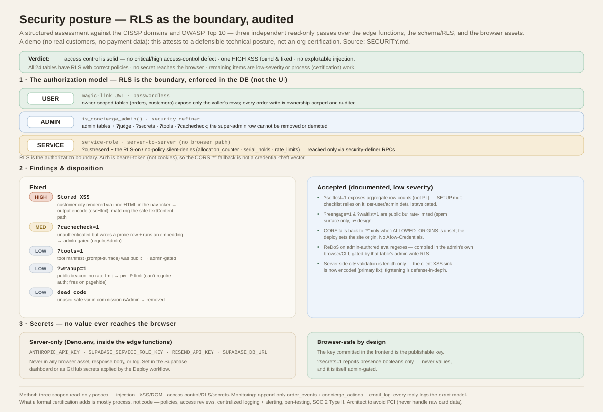

# Security review

A structured security assessment of the Feierabend (Decke 01) demo, framed
against the CISSP domains and the OWASP Top 10. It records the audit method, what
was found and fixed, the residual (accepted) risks, and what a *formal*
certification would additionally require.

> **Scope & honesty note.** This is a **demo** — no real customers, no payment
> data. "Certified secure" is not a state code can be in: certifications (SOC 2,
> ISO 27001) attest to an *organization's operational controls over real data*,
> not to a repository. What this document attests to is a **defensible technical
> posture**, verified by audit.

## Method

Three independent read-only audits over the edge functions
(`supabase/functions/*`), the database schema/RLS (`supabase/setup.sql`), and the
browser assets (`admin.html`, `index.html`, `assets/*.js`):

1. **Injection** — every place request-derived input reaches a query (PostgREST
   filter strings, RPC args, raw URLs).
2. **XSS / DOM injection** — every DOM sink that can execute markup/script, and
   whether the data reaching it is attacker-influenceable.
3. **Access control, RLS, and secrets** — every HTTP entrypoint and its gate,
   RLS coverage on every table, and whether any secret can reach the browser.

## Verdict

**Access control is solid. No critical/high access-control defect. One HIGH XSS
found and fixed. No exploitable injection. All 24 tables have RLS with correct
policies. No secret reaches the browser.** Remaining items are low-severity or
operational-process (certification) work.

The whole review on one page — the verdict, the USER/ADMIN/SERVICE authorization
model over the RLS boundary, the fixed/accepted findings, and where each secret lives:

*[`docs/security-posture.svg`](docs/security-posture.svg) — grounded in this document.*

## Findings & disposition

### Fixed

| Sev | Finding | Fix |
| --- | --- | --- |
| **HIGH** | **Stored XSS** in the storefront nav ticker: the customer-supplied `city` field (validated for length only) was rendered via `innerHTML`. A crafted city (``) would execute for every homepage visitor. | Output-encode (`escHtml`) the DB-derived value before it enters the ticker markup, matching the safe `textContent` path the visible claims list already used. Defense-in-depth server-side `city` validation is tracked below. |
| **MED** | `GET ?cachecheck=1` was unauthenticated but **writes** a probe row and runs an embedding — a write/compute-amplification surface. | Admin-gated (`requireAdmin`). It has no client caller — it's a manual health check. |
| **LOW** | `GET ?tools=1` (tool manifest — internal capability/prompt-surface disclosure) was public. | Admin-gated. The only caller (admin Tools tab) already sends the admin JWT. |
| **LOW** | `POST ?wrapup=1` (public lifecycle beacon) had no rate limit — anon status-flip spam. | Per-IP rate limit. It can't require auth (it fires on `pagehide`), but beacons are rare per visitor so a window is invisible to real use. |
| **LOW** | Dead `safe` variable in commission `isAdmin`. | Removed. |

### Accepted (documented, low severity)

- **`GET ?selftest=1`** exposes aggregate **row counts** (not PII) to anonymous
  callers. Kept public because `SETUP.md`'s verification checklist relies on it to
  confirm "the schema is applied" before sign-in works. Per-user and admin detail
  are correctly gated.
- **`POST ?reengage=1`** and **`POST ?waitlist=1`** are public but **rate-limited**
  — an outreach line (paid model, 90-token cap) and a waitlist insert. Spam
  surface only; by design.
- **CORS** falls back to `*` only when `ALLOWED_ORIGINS` is unset; the deploy sets
  it to the site origin in production. Auth is **bearer-token, not cookies**, and
  `Allow-Credentials` is not set, so a wildcard is not a credential-theft vector.
- **ReDoS** on admin-authored eval regexes (`concierge_evals`) — compiled and run
  in the admin's own browser / the CLI, gated by that table's admin-write RLS.
- **Server-side `city` validation** is length-only. The client XSS sink is now
  encoded (the correct primary fix); tightening the server validation to reject
  control/markup characters is a defense-in-depth follow-up.

## Posture by CISSP domain

- **Security Architecture & Engineering** — the database's **Row-Level Security is
  the authorization boundary**. All 24 tables have RLS enabled; owner-scoped tables
  (`orders`, `customers`) expose only the caller's rows; admin tables are gated by
  the `is_concierge_admin()` `security definer` helper; the super-admin row cannot
  be removed or demoted. Tables with RLS-on-but-no-policy
  (`allocation_counter`, `serial_holds`, `rate_limits`) are deliberate silent
  denies, reached only via `security definer` RPCs / the service role.
- **Identity & Access Management** — every mutating or private-data endpoint is
  gated USER / ADMIN / SERVICE. `?judge` and `?secrets` are admin-only; `?custresend`
  is service-to-server only (unreachable from the browser); order writes are
  ownership-scoped and audited. Auth is passwordless magic-link (no password store).
  Chat-injected tool-call JSON can't forge a tool invocation — tool calls are
  structured API channels (not text the server parses) and identity is JWT-derived,
  not taken from the message; see [`TOOLS.md`](TOOLS.md#can-a-user-forge-a-tool-call-by-typing-json-into-the-chat).
- **Secure Software Development (OWASP)** — **A01** access control enforced in the
  DB, not just the UI; **A02** secrets server-only, TLS by the platform; **A03**
  no exploitable injection (numeric coercion, whitelists, UUID validation,
  `encodeURIComponent` + character stripping) and XSS closed by `textContent` /
  output encoding, with concierge link tokens gated by an `https:`/`mailto:`
  allowlist.
- **Cryptography & Secrets** — `ANTHROPIC_API_KEY`, the service-role key,
  `RESEND_API_KEY`, and `SUPABASE_DB_URL` exist only in `Deno.env` inside the edge
  functions; none appears in any browser asset or response body or log. The key
  committed in the frontend is the **publishable** key (browser-safe by design).
  `GET ?secrets=1` reports **presence booleans only**, never values.
- **Security Assessment & Testing** — the behavior-eval deck (`evals/`) doubles as
  a guardrail-regression harness; this audit is repeatable (three scoped passes).
- **Security Operations / Monitoring** — append-only `order_events` (field-level
  diffs) + `concierge_actions` (every tool call) + `email_log`; each reply logs the
  exact model that produced it; all public write/compute paths are rate-limited.

## Secrets — where each key belongs

No secret **value** is ever entered in the browser (the admin page is public).
Values are set in the **Supabase dashboard** (Edge Functions → Secrets) or as
**GitHub secrets** that the *Deploy Concierge* workflow applies with
`supabase secrets set`. The admin panel can only ever *report presence* via the
admin-gated `?secrets=1`. See [`SETUP.md`](SETUP.md) for the per-key setup.

| Key | Where | Required |
| --- | --- | --- |
| `SUPABASE_URL`, `SUPABASE_ANON_KEY`, `SUPABASE_SERVICE_ROLE_KEY` | auto-injected by Supabase | — |
| `ANTHROPIC_API_KEY` | Supabase secret / GitHub secret | **Yes** (chat) |
| SMTP (Auth → dashboard) | Supabase dashboard | **Yes** (sign-in email) |
| `RESEND_API_KEY`, `EMAIL_FROM` | Supabase secret / GitHub secret | Optional (order email) |
| `ALLOWED_ORIGINS` | set by the deploy workflow | Recommended (CORS) |
| publishable key | committed in the frontend (public by design) | — |

## What a formal certification would additionally require

Mostly **process, not code**: written security policies, periodic access reviews,
centralized logging with alerting/monitoring, vulnerability management + periodic
penetration testing, vendor/risk management, and change management. For a
production deployment the pragmatic path is **GDPR/CCPA hygiene + SOC 2 Type II**
(when an enterprise customer first asks), while **architecting to avoid PCI** by
never handling raw card data (use a hosted processor).
