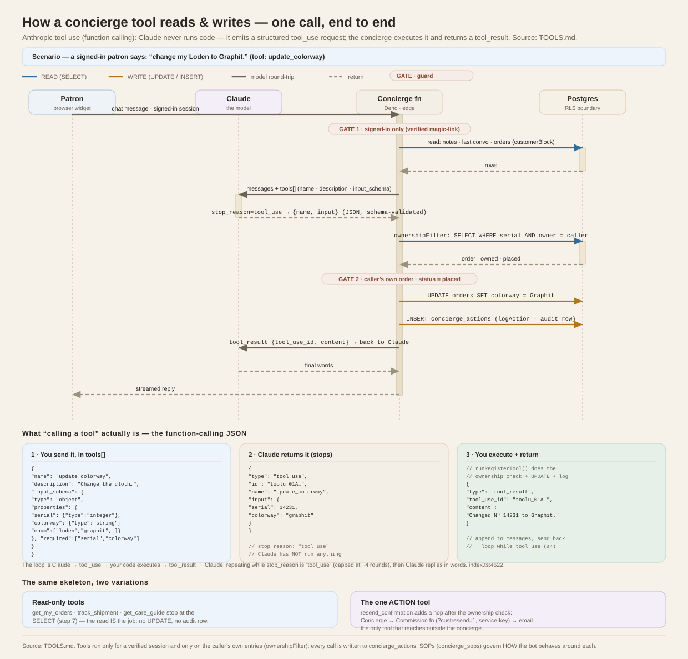
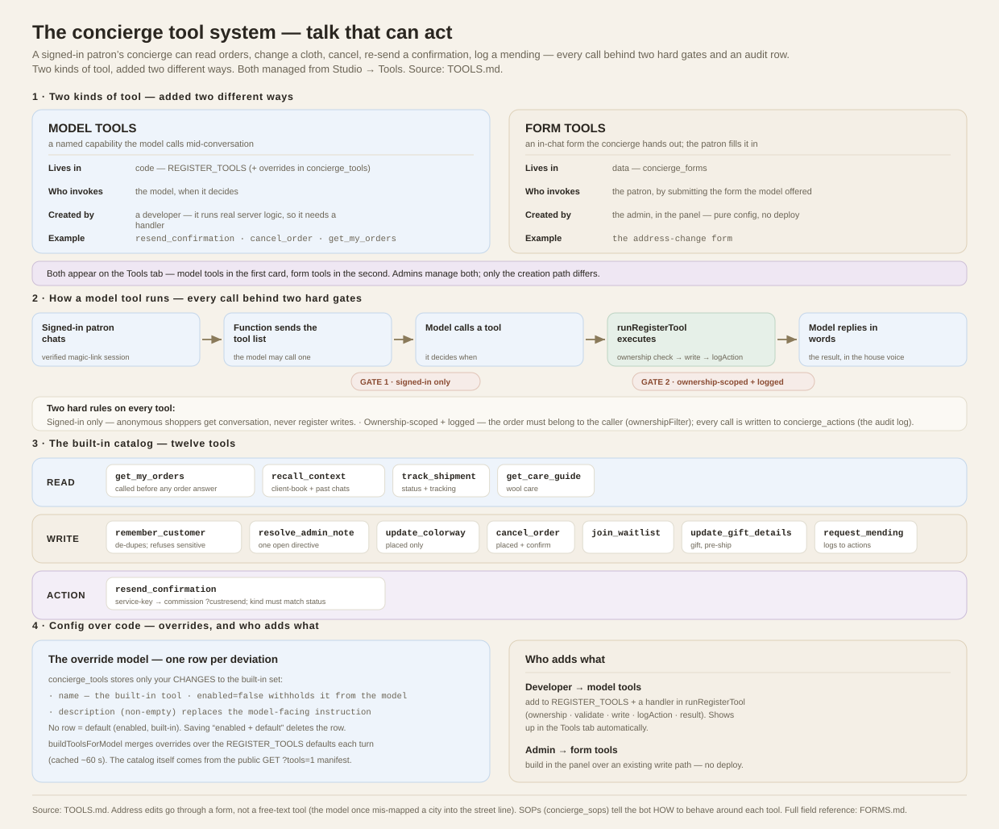

# Concierge tools

The concierge doesn't just talk — it can **act** on a signed-in patron's behalf:
read their orders, change a cloth, cancel, re-send a confirmation, log a mending
request, and more. This document covers what the tools are, how they're gated, and
how an admin manages — and **creates** — them from the Studio's **Tools** tab.

**How a tool actually reads and writes** — one call traced end to end (patron →
model → concierge → Postgres), every read and write labelled and both gates shown:

And the whole system on one page — the two kinds of tool, the runtime lifecycle,
the built-in catalog, and the config-over-code override model:

*[`docs/tool-sequence.svg`](docs/tool-sequence.svg) · [`docs/tools-system.svg`](docs/tools-system.svg) — both grounded in this document.*

> **Not a tool, by design: the satisfaction survey.** The bot can never write,
> change, or block an NPS rating, so there is no survey tool to list here — only
> the customer's tap writes or revises a score, through unit-tested server code
> ([`NPS.md`](NPS.md)). The survey's knobs (question, timing, cooldown, rating
> change window) live under **Engagement → House rules**; its wording is the
> **closing-survey SOP**; results are on the **NPS** tab.

## 0. Two kinds of tool

Everything the concierge can *do* is one of two kinds, and they're **added in two
different ways**:

| | **Model tools** | **Form tools** |
| --- | --- | --- |
| What it is | A named capability the model chooses to call mid-conversation. | An in-chat form the concierge hands out; the patron fills it in and it writes to an order. |
| Lives in | Code (`REGISTER_TOOLS`) + overrides in `concierge_tools`. | Data (`concierge_forms`). |
| Who invokes it | The model, when it decides. | The patron, by submitting the form the model offered. |
| **Created by** | **A developer** — it runs real server logic, so it needs a handler. Admins can enable/disable and re-instruct existing ones. | **The admin, in the panel** — pure configuration, no deploy. |
| Example | `resend_confirmation`, `cancel_order` | the `address-change` form |

Both appear on the **Tools** tab: model tools in the first card, form tools in the
second. The rest of this doc goes kind by kind.

---

## 1. What a tool is

A tool is a named capability with a JSON input schema, defined in the concierge
function's code (`supabase/functions/concierge/index.ts`, the `REGISTER_TOOLS`
array). When a signed-in patron chats, the function sends the model the tool list;
the model may call one, the function **executes** it (`runRegisterTool`) and feeds
the result back, then the model replies in words.

These are **Anthropic tool use (native function calling)** — not a custom
mechanism. Each tool is a `{ name, description, input_schema }` definition sent
in the API's `tools[]` array; Claude never runs code — it stops with
`stop_reason: "tool_use"` and returns a structured `tool_use` block (`{ name,
input }`, JSON validated against the schema). The function executes that request
and appends a `tool_result` block, and the loop repeats while
`stop_reason === "tool_use"` (capped at ~4 rounds). See
[`docs/tool-sequence.svg`](docs/tool-sequence.svg) for the exact JSON at each step.

### Can a user forge a tool call by typing JSON into the chat?

**No.** A user can only ever produce a `user` message with **`text`** content, so
pasting `{"type":"tool_use","name":"cancel_order",…}` (or a fake `tool_result`)
lands as *text that happens to contain JSON* — Claude reads it as characters, not
as an invocation. Tool calls are separate **structured channels**, not patterns
parsed out of prose: a `tool_use` block is only ever emitted by the model
(returned by the API with `stop_reason: "tool_use"`), and a `tool_result` is only
ever produced by the server. The execution trigger is `stop_reason` on the
*assistant* turn, never a scan of the user's words — so typed JSON reaches no code
path that writes anything.

The stronger case — *prompt-injecting the model into actually calling a tool* —
also fails, by defense in depth that doesn't trust the model:

- **Identity comes from the session, not the chat.** `runRegisterTool(name,
  input, customer, cid)` derives `customer` from the verified magic-link JWT; the
  model's `input` only supplies parameters (a serial, a colorway). Every write is
  scoped by `ownershipFilter(customer)`, which ANDs `user_id = <the caller>` into
  the query — so a tool aimed at someone else's order matches **zero rows**.
- **Anonymous sessions get no tools at all** — a logged-out visitor can't call
  anything.
- **Server-side revalidation** — `input` is schema-validated by the API *and*
  re-checked in `runRegisterTool` (colorway enum whitelist, integer serials,
  status guards like "only while `placed`").
- **Everything is logged** to `concierge_actions`.

The one residual is cosmetic: a pasted fake `tool_result` might make the model
*narrate* a success in words, but **no write occurs** — the database never
changed, and it's the source of truth (`get_my_orders` reads real state, so the
claim is immediately contradicted). That's a truthfulness annoyance, not a breach.
The boundary is architectural (structured channels + JWT-derived identity + RLS
ownership), not "the model is clever enough not to be fooled."

Two hard rules apply to every tool:

- **Signed-in only.** Tools run only for a verified magic-link session. Anonymous
  shoppers get conversation, never register writes.
- **Ownership-scoped + logged.** Any tool that touches an order first confirms the
  order exists **and belongs to the caller** (`ownershipFilter`). Every call is
  written to `concierge_actions` (the admin audit log). A tool can only ever act on
  the caller's own entries.

Address edits are deliberately **not** a free-text tool — the model once mis-mapped
a city into the street line, so address changes go through an in-chat **form**
(`{{form:address-change:…}}`) where a human types each labelled field. See FORMS.md.

---

## 2. The built-in tools

| Tool | Reads / writes | What it does | Guard beyond ownership |
| --- | --- | --- | --- |
| `get_my_orders` | read | The caller's orders — Nº, status, tracking, cloth, address, date. Takes an optional `colorway` filter and returns an authoritative `{ count, orders }`, so counts and "show my Loden" are answered from the register, not tallied by hand. Called before answering any order question. | — |
| `recall_context` | read | The caller's full client-book notes + the tail of earlier conversations, to re-engage a returning patron faithfully. | — |
| `remember_customer` | write | Adds one short factual line to the client book. De-duplicates against existing notes; refuses sensitive content. | — |
| `resolve_admin_note` | write | Checks off ONE house directive (a human admin's instruction, shown as `(#id)` in the CUSTOMER block) after the concierge has actually carried out a one-time task. Sets `resolved=true`; books an `event` note. | Ownership-scoped to the caller's own **open** directive; never resolves a standing preference. See DESIGN §4.13. |
| `update_colorway` | write | Changes the cloth on an order. | Only while `placed` (loom not started). |
| `cancel_order` | write | Cancels an order; the number returns to the edition. | Only while `placed`; explicit confirmation. |
| `join_waitlist` | write | Adds the patron to a future-edition waitlist. | — |
| `resend_confirmation` | action | Re-sends the order confirmation / shipping / cancellation email to the address on file. Proxies to the commission function's service-only `?custresend=1`. | `kind` must match the order's real status. |
| `track_shipment` | read | Where an order stands — status and, once shipped, the tracking number. | — |
| `get_care_guide` | read | Cloth-tailored wool care instructions. | — |
| `update_gift_details` | write | Changes the gift recipient's name on the enclosed card. | Gift orders only, before shipment. |
| `request_mending` | write | Logs a repair/mending request with the workshop (to `concierge_actions`). | — |

`resend_confirmation` is the only tool that reaches outside the concierge: it calls
`${SUPABASE_URL}/functions/v1/commission?custresend=1` with the **service key** as a
bearer token (so no browser can hit that endpoint), and only **after** it has
verified the caller owns the order. The commission side re-checks the `kind`
against the order's status and re-uses the same `orderEmail` templates the
confirmation/shipping/cancellation notes are built from.

---

## 3. Admin control — the Tools tab (model tools)

**Studio → Tools → Model tools** lets an admin, without a deploy:

- **Enable / disable** any tool. A disabled tool is dropped from the list sent to
  the model — the concierge can no longer call it at all. Tools the bot leans on
  (`get_my_orders`, `recall_context`) are marked **core**; turning one off works but
  visibly dulls the concierge, and the UI warns you.
- **Re-instruct** a tool. The description shown to the model is what tells it *when*
  and *how* to use the tool. Rewriting it (e.g. "only offer mending for orders older
  than 30 days") changes behaviour immediately. A blank instruction falls back to the
  built-in default; a "custom instruction" badge shows when you've overridden one.

### How it's stored

Overrides live in the `concierge_tools` table — **one row per deviation only**:

| Column | Meaning |
| --- | --- |
| `name` | the built-in tool name |
| `enabled` | `false` withholds it from the model |
| `description` | non-empty → replaces the model-facing instruction |

A tool with **no row** runs at its default (enabled, built-in instruction). Saving
"enabled + default instruction" deletes the row rather than storing a no-op. The
built-in set itself is never in the table — only your changes to it.

### How it reaches the model

`loadConciergeData` reads `concierge_tools` (cached ~60 s with the rest of the
config). `buildToolsForModel` merges it over the code defaults — dropping disabled
tools, swapping in overridden descriptions — and the result is the `tools` array
sent on each turn. The admin tab reads the built-in **catalog** from the public
`GET ?tools=1` manifest (names, defaults, core flags — which only the server knows)
and the live override state straight from the table, then writes changes back under
RLS (`is_concierge_admin()`).

---

## 4. Creating a form tool (admin, no code)

Form tools are the capability you **add yourself** in the panel. A form tool
collects labelled fields from the patron in the chat and writes them to one of
their orders — the safe way to let a patron make a change the model shouldn't
free-type (an address, a gift name).

**Studio → Tools → Form tools → "Create form tool":**

1. **Slug** — the handle used in the token, e.g. `gift-name`. The concierge emits
   `{{form:gift-name:14228}}` and the widget renders the form for that order.
2. **Title** — what the patron sees at the top of the form.
3. **Write path** — the register action the submission runs. Pick from the offered
   list; today: `update_shipping_address`, `update_colorway`, `update_gift_details`,
   `request_mending`. (These are the model tools that take a serial + fields; the
   server rejects any other target at submit time.) Choosing one loads a starter set
   of fields you can adjust.
4. **Fields** — the labelled inputs (JSON): `name` (must match what the write path
   expects), `label`, `type` (`text` · `state` · `zip`), `required`, `maxlength`. At
   least one field is required.
5. Save. It's live within a minute; **disable** it any time to stop the bot offering
   it (the row stays so you can turn it back on).

Because a form tool routes through an existing write path, it can only do what that
path already does — you're composing a **new labelled flow** over an existing
action, not a new action. To collect for something no write path handles yet, a
developer adds the write path first (§5), then you build the form over it.

Stored in `concierge_forms` (`slug`, `title`, `submit_tool`, `fields`, `enabled`);
the bot is told which enabled forms exist so it knows it may offer them. Full field
reference: [`FORMS.md`](FORMS.md).

---

## 5. Standard operating procedures

Tools give the concierge the *ability* to act; **SOPs** (`concierge_sops`, editable
in Studio → Procedures) tell it *how to behave* around them — confirmation steps,
what to say, when to hand off to the desk. The customer-service tools ship with
matching SOPs (`resend-email`, `mending`, `gift-details`, `care-guide`) so the bot
uses them with the house's manners, not just mechanically. Edit an SOP to change the
choreography; disable/re-instruct the tool to change the capability itself.

---

## 6. Adding a new model tool (developer)

A genuinely new *model* capability needs code — it must actually *do* something on
the server, which no amount of configuration can conjure. In
`supabase/functions/concierge/index.ts`:

1. Add the definition to `REGISTER_TOOLS` (name, description, `input_schema`).
2. Add its handler in `runRegisterTool` — ownership check, validation, the write,
   `logAction`, and a human-readable result string.
3. If it should appear as a labelled step in the chat, add a status line in the
   agentic loop's label map.
4. It shows up in the Tools tab's **Model tools** card automatically (the manifest
   is derived from `REGISTER_TOOLS`); add an SOP (Studio → Procedures) if it needs
   house choreography, and — if it takes a serial + fields — it also becomes an
   available **write path** an admin can build a form tool over (§4).

The `concierge_tools` registry table is for **admin overrides**, not for defining
new tools — a row whose `name` doesn't match a built-in is simply ignored by the
merge. So the division is firm: **admins add form tools; developers add model
tools; everyone manages both from the same Tools tab.**
