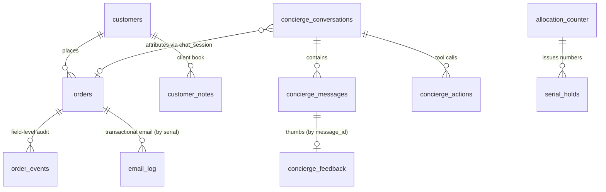
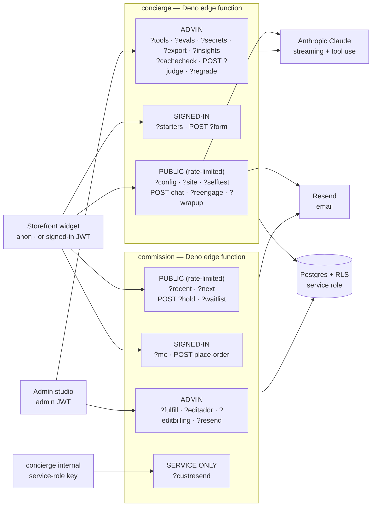
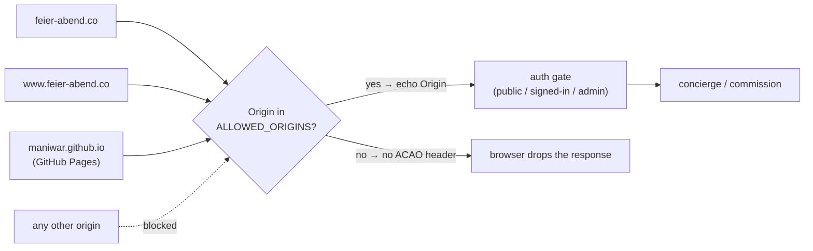

# Database Schema Reference — Feierabend (Decke 01)

This is the field-by-field reference for the whole backend: every table, every
column, what writes it, what reads it, and when. The schema itself is defined
in **`setup.sql`** (one idempotent file) and mirrored as ordered history in
**`migrations/`**. Keep this document in step with those files whenever a
column, function, or endpoint changes.

Two Supabase Edge Functions use this database:

| Function | Folder | Role |
| --- | --- | --- |
| **concierge** | `functions/concierge/` | The AI sales concierge — streaming chat, register tools, semantic cache, conversation logging, goals, lifecycle. System prompt is a prompt-cached static prefix + dynamic tail (see [`COST.md`](../COST.md)). |
| **commission** | `functions/commission/` | The demo checkout — serial holds and order placement. No payment; nothing ships. |

Both read the database with the **service-role key** over raw PostgREST (no
`supabase-js`). Row-Level Security therefore never gates the functions; it
gates the **browser** (anon key) and the **admin portal** (a signed-in admin).

---

## How the trust boundary works

- **Anon key (public browser)** — may only insert `concierge_feedback` rows.
  Everything else it tries to read/write is denied by RLS.
- **Signed-in customer** — may read their own `customers` and `orders` rows
  (owner policies). They never write orders directly; the edge functions do.
- **Signed-in admin** (email present in `concierge_admins`) — full read/write
  on the operational tables, governed by the `is_concierge_admin()` helper.
- **Service role (edge functions)** — bypasses RLS entirely. All order
  placement, serial allocation, cache, logging, and audit writes go through
  here, so the rules that matter for those live in the SQL functions
  (`security definer`, pinned `search_path = ''`), not in RLS.

---

## Tables

### Core entity relationships

The transactional heart — who bought what, the chat that drove it, and the audit
trail. (The `concierge_config`/`_kb`/`_sops`/`_forms`/`_goals`/`_tools`/`_evals`/
`site_content` tables are standalone registry/key-value content the admin edits;
`allocation_counter`/`serial_holds`/`rate_limits` back the serial + rate machinery.)

Key columns: `orders.serial` (UNIQUE), `orders.user_id`/`email` (owner, RLS),
`orders.chat_session` (→ the conversation that drove it); `concierge_messages`
carries `role`/`content`/**`model`**/`latency_ms`; `concierge_conversations`
carries `session_key`/`user_email`/`status`/`sales_stage`/`goal_status`.

### `concierge_config` — runtime settings (key → jsonb)
One row per setting. Cached in the function for 60s, so edits reach live
traffic within a minute.

| Column | Type | Purpose |
| --- | --- | --- |
| `key` | text PK | Setting name (see keys below). |
| `value` | jsonb | The setting's value. |
| `updated_at` | timestamptz | Last edit. |

**Keys the concierge reads** (`loadConciergeData`): `enabled` (bool — false ⇒
chat returns 503 and `?config=1` reports resting), `model` (Anthropic model id),
`model_fallback` (model used when `model` is blank — the fully configurable
fallback; `resolveModel()` resolves `model` → `model_fallback` → `MODEL` env →
a compiled cheap default), `max_tokens` (per-reply cap, default 1024),
`greeting` (opening line; may embed `{{reply:…}}` pills), `voice_notes`
(appended to the system prompt as tuning notes), `starters` (per-section
suggested questions), `images` (admin-added `{{img:token}}` sources, merged
client-side and injected into the prompt), `videos` (admin-added
`{{video:token}}` sources — `{src, poster?, label, description}` — merged and
injected exactly as `images` are), `goal_sample_rate` (0–1 — fraction of
turns the async goal grader runs).

*Client-book (memory) keys:* `clientbook_policy` (extra house rules injected into
the end-of-conversation summarizer — what to record vs. skip), `clientbook_log_actions`
(bool, default true — write a guaranteed `event` note on every mutating action),
`clientbook_reflect` (bool, default true — write a `reflection` line each
conversation). See DESIGN §4.10.

*Model keys:* `model`, `model_fallback` (§ Config table above).

*Selling engine keys:* `assertiveness` (1–5, default 3 = warm consultant — how
hard to sell; scales the prompt guidance and the client nudge/outreach budget),
`hooks` (array of true "selling angles" the bot weaves in to build desire),
`objections` (array of `{trigger, response}` for the Reassure move).

*Engagement pacing* lives under the `outreach` key (object), all admin-editable
in Tuning → Engagement (laid out as the visitor's journey): the in-chat follow-up ladder `nudge1Ms`–`nudge5Ms`
(the fifth repeats), `nudgeCap` (max in-chat follow-ups), `unackedCap` (pause
after N unacknowledged reach-outs), `holdBudget` (consecutive silent holds
before resting), opener delays `openerSignedMs`/`openerAnonMs`/
`openerReengageMs` (anon default 3s — panel-open is the visit's
highest-attention moment), `openerFollowMs` (the attention beat after opening
via a tapped bubble; default 8s, replaces the first ladder delay for that
open), `openerCooldownMs` (while the bot's last line is younger than this, a
re-opened panel lets the thread stand instead of re-greeting; default 10 min), `dwellMs`/`dwell2Ms` (closed-panel reach-out delays),
`draftMs` (half-written-order nudge), `idleReach` (bool), `maxAmbient` (max
closed-panel reach-outs), `bubbleWithdrawMs` (how long the outreach bubble
lingers), *on-page beats:* `inlineSections` (array of section keys where the
inline "Ask the mill ✳" starters render; default `why,wool,label,ritual,
arrival`; `hero` maps to the title header), `chipCap`/`chipLingerMs`/
`chipRepeatMs` (context-chip budget per page view, on-screen time, and an
optional re-show window — blank = once per section per view), `anonNudges` (bool, default false — run the in-chat follow-up ladder for
signed-out visitors who haven't typed yet; off = one opener, then wait),
`substanceGate` (bool, default true — a proactive beat must have
something new and concrete or it holds; held beats are logged as
`concierge_actions.action='beat_hold'`), `beatJudge` (bool, default true —
every spoken proactive line gets a second, stricter binary review before the
visitor sees it; a veto stays silent and writes
`concierge_actions.action='beat_veto'` with the killed line + reason; the
judge **fails open** on any API error, and the Actions tab shows the 7-day
spoke · held · vetoed scoreboard; toggle in Engagement → House rules),
`quietMs` (how long "that's all" /
"don't message me" pauses every proactive beat; default 30 min — time-boxed,
never persisted, lifted early by typing or reload), re-engagement keys (`reengageEnabled`,
`reengageIdleAnonMs`/`reengageMaxAnon`, `reengageIdleSignedMs`/
`reengageMaxSigned`, `reengageGraceMs` — congrats quiet right after a purchase,
entered in *seconds* in the admin, default 4 min; `reengagePostSaleWindowMs` —
how long after a purchase the bubble pivots to second-sale framing, entered as
a value **plus a unit picker (hours / minutes / seconds)** in the admin —
days-scale in production (default 48 h), seconds-scale for testing;
`postSaleMode` — what happens *inside* that window: `upsell` (default —
second-sale framing: companion / gift), `presence` (normal warm check-ins, no
selling frame), or `quiet` (**no closed-panel bubble for the entire window**,
named in `status().lastSkip` and visible in `status().postSale`); the legacy
`reengagePostSaleEnabled: false` maps to `quiet`), wrap-chip visibility (`wrapChipMinTurns` —
patron turns before the "That's all for now" chip appears, default 3, 0 =
always; `wrapChipOnFollowup` — bool, default on: also show it whenever a
proactive follow-up has fired), and `historyKeepMs` (how long a signed-in patron's
device-kept transcript survives a closed tab; default 7 days). The client reads
these via `?config=1`; blank/absent keys fall back to built-in defaults scaled
by `assertiveness`.

*Service limits* (`chat_rate_signed` default 60, `chat_rate_anon` default 20 —
chat calls per 10 minutes; proactive beats count, so this bounds the model
bill; signed-in keyed by user id, anonymous by IP).

*The Action Table* (`beat_actions`, object — versioned like every key):
per-rule overrides for the deterministic beat decision, e.g.
`{"PROPOSE_GIFT":{"enabled":false}}`. The rules run in fixed order
(`FIX_BLOCKED_ORDER`, `PROPOSE_COMPANION`, `PROPOSE_GIFT`,
`ADVANCE_GOAL:<slug>`, `KEEP_WARM:<section>` — give-first house expertise
before any silence — else `HOLD`) over the computed Sales Ledger. The table is
pure code (`functions/concierge/beats.ts`), unit-tested by `deno test` in the
deploy workflow. Simple rules are spent for 24h via their `beat_action` audit
row; the two *proposals* rest on an **escalating ladder** instead —
`outreach.proposalRestHours` (default `[24, 72, 168]`: a day, three days, a
week after each unanswered repeat; a new order or client-book note re-opens
early). Edited in Engagement → ⑤ After they buy → Fine-tune. The ledger also
carries **register colour for the proposal briefs**: `byCloth` (kept orders
per colorway, so a companion proposal names a cloth the patron does NOT yet
have) and `bookFacts` (the newest 1–2 durable client-book facts, delivered
with the never-reveal reminder in the same brief).

*Prompt bases as editable text* (versioned like every config key via
`concierge_edit_history`, History ⟲ in admin; blank = the built-in, and
`?defaults=1` serves each built-in for "Load built-in to edit"):
`engagement_base` — the full ENGAGEMENT & PACING rule block
(substance-with-speech-as-default, sell-don't-report, plain speech,
vary-the-door, the hold rule). `selling_base` — the full SELLING method
(discovery before presenting, give-first, the six moves with three close
shapes, held-number endowment, honest claimed/remaining proof, price framing,
gift-as-giver-identity, the commission trigger); keep the `{{DIAL}}` marker —
the live how-hard-to-sell guidance substitutes there (re-appended if dropped).
`exemplars_base` — the WORKED EXAMPLES block (one style-anchor pair per move
plus WEAK→GOOD contrastive pairs for the historical failure modes); its
section (`exemplars`) is toggleable in prompt_sections like the others.
`beat_notes` — the admin's standing instructions appended to every proactive
beat brief on top of the bases (they rank below the honesty rules).

*Reporting & retention keys* (Conversion tab / Edition & access — see
[`ATTRIBUTION.md`](../ATTRIBUTION.md)): `unit_price` (USD behind every revenue
figure; $589 fallback), `week_start` (0 = Sunday, 1 = Monday — drives the
This-week range, weekly buckets, and WoW alignment for all admins),
`retention_days` (the horizon last used by the Data-retention prune — a record
of policy, not a schedule; nothing deletes automatically). Every change to any
config key lands in `concierge_edit_history` (who/when/what), so reporting
settings are themselves auditable.

**Written by:** admin portal (Tuning tab — Config, Engagement, Selling
style, Bot images, Bot videos). **Read by:** `handleConfigGet` (`GET ?config=1`),
`handleChatPost` (every reply). **Seeded by:** `setup.sql` (`enabled`, `model`,
`max_tokens`, `greeting`, `voice_notes`, `assertiveness`, `hooks`, `objections`).

### `concierge_kb` — editable product knowledge
| Column | Type | Purpose |
| --- | --- | --- |
| `id` | uuid PK | Row id. |
| `slug` | text unique | Stable handle. |
| `title` | text | Rendered as `## <title>` in the prompt. |
| `content_md` | text | The knowledge body. |
| `sort_order` | int | Assembly order. |
| `enabled` | boolean | Only enabled rows are included. |
| `updated_at` | timestamptz | Last edit. |

Enabled rows are concatenated into the `{{KB}}` slot of the system prompt. If
the table is empty or unreachable, the function falls back to the knowledge
compiled into `functions/concierge/kb.ts`. **Written by:** admin (KB tab).
**Read by:** `buildSystemPrompt`.

### `concierge_admins` — who may administer
| Column | Type | Purpose |
| --- | --- | --- |
| `email` | text PK | An admin's verified email. |
| `is_super` | boolean | The protected owner. Exactly one is seeded; can never be removed or demoted. |

**Read by:** `is_concierge_admin()` and `is_super_admin()` (used in the admin RLS
policies). **Managed by:** the admin panel's **Tuning → Administrators** card.
**RLS (command-split):** any admin may **select** the roster and **insert** a
non-super admin; only the **super** admin may **delete**, and the super row
itself cannot be deleted or updated — so one owner always remains. A non-admin
sees zero rows (how the panel gates entry). **Seeded by:** `setup.sql` (change
the email to yours before running); the first/super admin must be seeded in
SQL, after which the roster is self-serve.

### `concierge_conversations` — one row per chat thread
| Column | Type | Purpose |
| --- | --- | --- |
| `id` | uuid PK | Conversation id (returned to the client in the `{"m":{cid}}` meta event). |
| `session_key` | text | The client's opaque per-thread key; threads repeat requests into one conversation. Rotated by the client after a wrap-up so the next message starts a fresh thread. |
| `user_id` | uuid → auth.users | Signed-in user, if any. Back-filled if they sign in mid-conversation. |
| `user_email` | text | Signed-in email, if any. Also back-filled. |
| `section` | text | Page section the chat opened from. |
| `created_at` | timestamptz | Thread start. |
| `status` | text (`active`/`snoozed`/`closed`/`concluded`) | **Lifecycle.** `active` by default; `snoozed`/`closed` set by `handleWrapup` (resumable — a new message revives them); **`concluded` is TERMINAL** — the bot said its warm goodbye (usually carrying the closing survey), and the visitor's next real message opens a **new conversation: a fresh case** for the same patron. Rating taps (`context.nps`) and nudges still attach to a concluded case. Stamped when `GRACEFUL_CLOSE`/`REQUEST_NPS` actually speaks (nudge path or typed farewell). |
| `ended_at` | timestamptz | When the thread was wrapped (snoozed, closed, or concluded). Presence of this = the thread is done; the next visit is a **re-engagement** (or, after `concluded`, a fresh case). |
| `last_activity_at` | timestamptz | The visitor's latest word (bot-initiated nudges don't count). The admin Conversations tab **sorts by this** and its date filter matches the case's activity span. Backfilled from `created_at`. |
| `goal_status` | jsonb | Per-goal scoring: `{ "<slug>": {"status":"met|partial|unmet","note":"…"} }`. |
| `goal_status_at` | timestamptz | When goals were last judged. |
| `sales_stage` | text | Funnel stage from the async grader: `browsing`/`engaged`/`evaluating`/`objection`/`ready`/`won`/`lost`. Written in a **separate best-effort PATCH** from `goal_status`, so a missing column can't break grading. Shown as a chip in the admin Conversations tab. |
| `ip` | text | Latest client IP for the session (from `x-forwarded-for`), stored for **abuse/legal forensics**. Admin-only (RLS), shown in the transcript header, and included in the transcript export **only** when the PII option is on. Disclosed in the privacy notice. **Searchable** in the admin: the Conversations tab matches it directly, and the Orders & Customers tab resolves it to `session_key`s and finds the orders placed from that IP (`ip ↔ session_key ↔ orders.chat_session`). A full IPv4/IPv6 matches exactly; a partial prefix, as a substring. |

**Written by:** `logUserTurn` (create + identity back-fill + `last_activity_at`
bump + the **case boundary**: a `concluded` thread is never revived — a real
visitor message creates a new row), `handleWrapup` (status/ended_at), the
spoken goodbye/survey (`status='concluded'`), `evaluateGoals` (goal_status +
sales_stage). **Read by:** `logUserTurn` (thread reuse), `customerBlock`
(re-engagement recency — most recent `ended_at` for the user), the beat
ledger (the **silence latch**: a goodbye spoken since the visitor's last word
holds every proactive door), admin (Conversations tab, goal scorecard).
**Proven by:** the **Case probe** workflow.

### `concierge_messages` — every turn
| Column | Type | Purpose |
| --- | --- | --- |
| `id` | bigint identity PK | Message id (the `mid` in the meta event; feedback keys off it). |
| `conversation_id` | uuid → conversations | Owning thread (cascade delete). |
| `role` | text (`user`/`assistant`) | Who spoke. |
| `content` | text | The message body. |
| `model` | text | Model used (assistant turns). |
| `latency_ms` | int | Reply latency (assistant turns). |
| `created_at` | timestamptz | Turn time. |

**Written by:** `logUserTurn` (user turn), `logAssistantTurn` (assistant turn
after the stream completes). **Read by:** admin (transcript view).

### `concierge_feedback` — thumbs on an answer
| Column | Type | Purpose |
| --- | --- | --- |
| `message_id` | bigint PK → messages | The rated assistant message. |
| `rating` | smallint (−1/1) | Down / up. |
| `note` | text | Optional. |
| `created_at` | timestamptz | When rated. |

**Written by:** the browser directly with the anon key (the one insert RLS
allows). **Read by:** admin.

### `customers` — signed-in profile
| Column | Type | Purpose |
| --- | --- | --- |
| `id` | uuid PK → auth.users | The account. |
| `email` | text | Their email. |
| `name` | text | Optional display name. |
| `created_at` | timestamptz | First seen. |

Owner RLS lets a user read/write only their own row; admins read all.

### `orders` — the register (demo orders)
The core table. No payment or street-shipping data beyond what the demo needs.

| Column | Type | Purpose | Written when |
| --- | --- | --- | --- |
| `id` | uuid PK | Order id. | placement |
| `user_id` | uuid → auth.users | Owner, if placed signed-in. | placement |
| `email` | text | Buyer email. | placement |
| `serial` | int **unique, nullable** | The edition number (1–15000). **Null while cancelled** so a struck number frees up (unique ignores nulls). | placement; cleared on cancel |
| `status` | text | `placed`→`weaving`→`finishing`→`shipped`→`delivered`, or `returned`/`cancelled`. Advanced by an admin via commission `POST ?fulfill=1`; on `shipped`/`returned` the customer is emailed. | placement; cancel; admin fulfillment |
| `tracking` | text | Carrier tracking; set alongside `status` on the fulfillment endpoint, included in the shipment email. | admin when shipped |
| `city`,`state`,`zip` | text | Shipping locale (state = 2 letters). | placement / address change |
| `address`,`address2` | text | Street lines (demo only). | placement / address change |
| `colorway` | text | `ungefaerbt`/`loden`/`graphit`. | placement / colorway change |
| `name` | text | Buyer name (first name feeds the concierge's address of them). | placement |
| `recipient_name` | text | Gift recipient, when different from buyer. | placement |
| `is_gift` | boolean | Gift flag. | placement |
| `billing` | jsonb | Billing address when it differs from shipping. | placement |
| `cancelled_serial` | int | Archives the number a cancelled order **used to** hold. | on cancel |
| `chat_session` | text | The `session_key` of the concierge conversation that drove the sale (revenue attribution). Also the join key for **IP lookup**: `chat_session ↔ concierge_conversations.session_key ↔ .ip` lets the admin find every order placed from an IP, and show each order's origin IP in the detail drawer. | placement |
| `chat_via` | text | Attribution **tier**: `concierge` = checkout was opened from the concierge's own commission button (causal); `ambient` = a chat existed this tab session but checkout came from a page button (co-occurrence); `identity` = signed-in buyer with an account conversation ≤ 30 days before placement and no same-session chat (server lookback — catches cross-device journeys); `NULL` = unassisted (or an order placed before this column existed). Constraint `orders_chat_via_check`. See [`ATTRIBUTION.md`](../ATTRIBUTION.md). | placement |
| `chat_meta` | jsonb | Commission-click context for `concierge`-tier orders: `{entry, section, turns}` — which proactive beat the exchange came from, the page section, and conversation depth at the click (whitelisted/bounded server-side). For `identity`-tier orders: `{lookback_days}` — days between the account's last conversation and placement. | placement |
| `placed_at` | timestamptz | Placement time (feeds LTV recency). | placement |

**Written by:** `commission_order` (placement), `cancel_order_return`
(cancel), the register tools `update_shipping_address` / `update_colorway`
(concierge, signed-in), admin fulfillment (`patchOrder` via commission
`POST ?fulfill=1`). **Read by:** `myOrders` /
`customerBlock` (concierge context + LTV/standing), the `get_my_orders` tool,
commission `?me=1` (prefill), admin (Customers/Orders). **Audited by:** the
`log_order_event` trigger → `order_events`.

### `allocation_counter` — the next fresh number
| Column | Type | Purpose |
| --- | --- | --- |
| `id` | int PK (=1) | Single-row guard. |
| `next_serial` | int | Next never-issued number. |
| `run_size` | int (default 15000) | The edition's total size; the allocation cap. Admin-settable via `set_edition`. |

RLS on, **no policies** — service-role only. **Read/written by:**
`hold_serial` and `commission_order` (both `... FOR UPDATE`, capping against
`run_size`); read/written by the admin RPCs `get_edition` / `set_edition`.

> **Edition framing.** Seeded at **next_serial 14215 / run_size 15000** so the
> run reads as "~786 of 15,000 remain" — an established, nearly-sold-out edition.
> The site's "remaining" is driven by the **live** counter (`commission ?next=1`,
> which now returns `run_size` too), not a hardcoded figure. An admin can reset to
> a fresh edition (start at Nº 1, any run size) from the studio's Edition card via
> `set_edition`.

### `serial_holds` — live reservations
| Column | Type | Purpose |
| --- | --- | --- |
| `serial` | int PK | The held number. |
| `session_key` | text | Who holds it (`'released'` marks a number freed by a cancel). |
| `expires_at` | timestamptz | Hold expiry (10 min); a past value = lapsed/free. |

**Written by:** `hold_serial` (reserve/refresh, lowest-free-first),
`commission_order` (consumes the hold on placement), `cancel_order_return`
(re-inserts the struck number as an already-lapsed hold so it's reclaimable).
Concurrency-safe via `FOR UPDATE SKIP LOCKED`.

### `rate_limits` — shared request counter
| Column | Type | Purpose |
| --- | --- | --- |
| `bucket` | text | Rate-limit key (an IP, or `f:<ip>` / `h:<ip>`). |
| `window_start` | timestamptz | Start of the fixed window. |
| `count` | int | Requests seen for this bucket in this window. |

PK `(bucket, window_start)`. RLS on, **no policies** — service-role only.
**Written/read by:** `rate_hit` (atomic upsert + count; self-prunes a key's
spent windows). Replaces the old in-memory per-instance limiter so the limit
holds across every edge instance.

### `waitlist` — future-edition sign-ups
| Column | Type | Purpose |
| --- | --- | --- |
| `id` | uuid PK | Row id. |
| `email` | text | Who to write to. |
| `name`,`colorway`,`note` | text | Optional details captured. |
| `source` | text | `sold_out` (front-end form), `concierge`, or `form`. |
| `user_id` | uuid | Set when captured from a signed-in patron. |
| `created_at` | timestamptz | When they joined. |
| `notified_at` | timestamptz | Admin stamps this once they've reached out. |

RLS on; **admin** select/manage policy (`is_concierge_admin()`). **Written by:**
commission `POST ?waitlist=1` (sold-out form) and the concierge `join_waitlist`
tool (both via service role). **Read/managed by:** admin (Orders & Customers tab →
Waitlist card: filter, mark notified, export CSV).

### `concierge_inquiries` — inquiry-mode lead capture
| Column | Type | Purpose |
| --- | --- | --- |
| `id` | uuid PK | Row id. |
| `created_at` | timestamptz | When it came in. |
| `kind` | text | `offer` / `viewing` / `question` / `callback` (checked). |
| `name` | text | The shopper's name. |
| `email`,`phone` | text | At least one is required (contact). |
| `amount` | numeric | The offer figure, when named. |
| `message` | text | A line of context. |
| `session_key` | text | Widget session — the rate-limit key. |
| `page_url` | text | Where the inquiry was made. |
| `status` | text | `new` (default) / `contacted` / `closed` (checked). |
| `meta` | jsonb | `{}`; carries the signed-in user id/email when present. |
| `chat_via` | text | Attribution channel, mirroring `orders.chat_via`. Always `concierge` (or `NULL` on pre-attribution rows): an inquiry is submitted **through** the concierge, so it is concierge-attributed by construction. Constraint `concierge_inquiries_chat_via_check` (`NULL` or `concierge`). |
| `chat_meta` | jsonb | `{}`; the session context at capture — `{section, turns, origin, captured_at}`: the page section, the conversation depth (user turns so far), how the lead arrived (`tool` = the model called `submit_inquiry` in chat; `form` = an inquiry form POST), and the capture timestamp. The inquiry-mode analog of the commission click's `{entry, section, turns}`. |

> Attribution note: an inquiry is the **inquiry-mode conversion event** — the analog of the commission-button click — but it is a **qualified lead, not a sale**. `chat_via`/`chat_meta` feed a **count-only** lead metric on the Conversion tab; they are **never** joined to `orders`, added to revenue, or valued in dollars. The deal closes off-platform. See [`../ATTRIBUTION.md`](../ATTRIBUTION.md).

RLS on; **admin** select/manage policy (`is_concierge_admin()`), **no anon
policy** — a direct client insert is denied, exactly like `waitlist`. **Written
by:** the concierge `submit_inquiry` tool via service role — reached anonymously
through the make-an-offer / book-a-viewing forms (`POST ?form=1`, serial-free) or
directly by the signed-in model. Rate-limited to 5 per `session_key` per hour;
notifies `inquiry_notify_email` (fail-soft). **Read/managed by:** admin (Orders &
Customers tab → Inquiries card: filter by kind/status, set status, export CSV).
See [`../INQUIRIES.md`](../INQUIRIES.md).

### `email_log` — record of transactional emails
| Column | Type | Purpose |
| --- | --- | --- |
| `id` | uuid PK | Row id. |
| `to_email` | text | Recipient. |
| `kind` | text | `placed` / `shipped` / `returned` / `cancelled` / `inquiry`. |
| `serial` | int | The order's Nº. |
| `subject` | text | The email subject line. |
| `ok` | boolean | Whether Resend accepted it. |
| `provider_id` | text | Resend message id (on success). |
| `error` | text | Short reason (on failure). |
| `created_at` | timestamptz | When it was attempted. |

RLS on; **admin** read policy. **Written by:** `sendEmail` in both functions
(every attempt, success or fail). **Read by:** admin (Orders & Customers tab → per-order
email history). **Re-sent via:** commission `POST ?resend=1` (admin-gated).

### `concierge_sops` — the house's standard operating procedures
Same shape as `concierge_kb` (`slug`,`title`,`content_md`,`sort_order`,
`enabled`). Enabled rows are injected into the system prompt's STANDARD
OPERATING PROCEDURES section — the selling method, snooze/wrap-up procedure,
post-purchase behavior. **Written by:** admin (Procedures tab). **Read by:**
`buildSystemPrompt`.

### `concierge_actions` — audit of register tool use
| Column | Type | Purpose |
| --- | --- | --- |
| `id` | bigint identity PK | Row id. |
| `conversation_id` | uuid → conversations | Where it happened. |
| `user_id`,`email` | — | Who. |
| `action` | text | Tool name (`get_my_orders`, `recall_context`, `update_colorway`, `cancel_order`, `remember_customer`, `resolve_admin_note`, `resend_confirmation`, `request_mending`, `update_gift_details`, `get_care_guide`, `track_shipment`, …) — plus non-tool audit rows: `attribution_qa` (QA run evidence), `beat_hold` (a proactive beat that chose silence; payload carries the beat kind and, when a ledger ran, the decision with rule trace), and `beat_action` (a beat that SPOKE its Action-Table decision; payload = `{action, beat, ledger, trace, outcome}`, plus `floored`+`flooredReason` when the merchant's judge floor released a line the judge would have blocked — the diagnostic trail, and what marks the action spent for 24h). Two wrap-up survey rows ride the same column: payload action `REQUEST_NPS` `via:'wrapup'` (the gate offered on a typed farewell — counted as an offer) and `REQUEST_NPS_APPENDED` `via:'wrapup-fallback'` (the deterministic net added the scale the model dropped — the model-compliance meter, target zero; see NPS.md). qa- sessions write neither. |
| `serial` | int | Affected order, if any. |
| `payload` | jsonb | The tool input. |
| `result` | text | Outcome summary. |
| `created_at` | timestamptz | When. |

**Written by:** `logAction` (every tool execution + form submission). **Read
by:** admin (read-only policy).

### `concierge_cache` — semantic answer cache + baked starter answers
| Column | Type | Purpose |
| --- | --- | --- |
| `id` | uuid PK | Row id. |
| `question` | text | The canonical question. |
| `answer_md` | text | The cached answer. |
| `embedding` | `extensions.vector(384)` | gte-small embedding; HNSW index with `vector_ip_ops` (inner product). Zero vector for a pinned row whose embed failed — pinned rows serve by exact match, never by similarity. |
| `hits` | int | Times served. |
| `enabled` | boolean | Off ⇒ never matched. |
| `model` | text | Model that produced the answer (`'baked'` for pinned rows). |
| `created_at`,`last_hit_at` | timestamptz | Bookkeeping. |
| `pinned` | boolean | **Baked starter answer** — a conversation starter's pre-authored reply, served by exact `norm_key` match with zero model + zero embedding calls ([KNOWLEDGE.md](../KNOWLEDGE.md)). |
| `stale` | boolean | Knowledge changed since the bake; keeps serving until the hourly pass re-bakes it. |
| `hand_edited` | boolean | The merchant's own wording — the auto-bake never overwrites it. |
| `kb_slug` | text | The knowledge entry that grounds the baked answer. |
| `norm_key` | text | `normalizeQuestionKey(question)` — the exact-match key; partial index `concierge_cache_pinned_key_idx` where `pinned`. |

The **learned** tier engages only for anonymous, single-turn, short questions
(signed-in and multi-turn answers depend on private/context state and are never
cached). The **pinned** tier (baked starter answers) serves any turn, any
visitor — its answers are grounded in house knowledge only.
**Written by:** the chat path after a cacheable answer (`embed` + insert), and
the starter bake pass (`bakeStarters` — on starters save, studio button,
or hourly self-scheduler). **Matched by:** exact `norm_key` lookup first
(pinned), then the `match_cached_answer` RPC — with a **polarity guard**
at the call site: an embedding puts "does it shed?" and "does it never shed?"
nearly on top of each other, so a hit whose negation signature differs from
the incoming question's is refused and the model answers live. **Flushed by:**
the `flush_cache` statement triggers on `concierge_kb`, `concierge_config`,
and `concierge_sops` — the cache memorizes ANSWERS and those tables are their
SOURCE, so any edit empties the learned rows (they re-warm from live traffic)
and marks pinned rows **stale** for re-bake (a starter tap never falls back to
a live model call). **Diagnosed by:** `GET ?cachecheck=1` and the **Starter
probe** workflow. **Read by:** admin (Saved answers tab).

### `concierge_insights` — cached "what's working" digests (coach feedback loop)
| Column | Type | Purpose |
| --- | --- | --- |
| `kind` | text PK | Digest name: `'beat_learning'`, `'judge_digest'` (weekly email claim), `'starter_bake'` (hourly bake claim + per-starter ledger), `'gap_draft'` (hourly gap-drafting claim + pass ledger). |
| `payload` | jsonb | The computed digest — `beat_learning`: `{ window_days, total_spoke, buckets:[{beat, move, n, reply_rate}] }`; `starter_bake`: `{ baked, statuses:[{starter, status, kb}] }` (the ledger the Starter probe reads). |
| `computed_at` | timestamptz | When it was last recomputed (drives the TTL / the atomic hourly-weekly claims). |

A cache for the **sales-strategist coach's feedback loop** ([`COACH.md`](../COACH.md)
§5), and the claim table for the self-scheduled passes (judge digest, starter
bake) — one isolate wins the conditional `computed_at` PATCH, everyone else
stands down. **Written & read by:** `beat_learning_digest()`, the digest/bake
schedulers — the function serves
the cached `payload` while it is fresher than the TTL, else recomputes and
upserts. RLS is **enabled with no policy**, so it is reachable only through that
`security definer` function (the service role / definer bypasses RLS); direct
anon/authenticated reads are denied. Tiny (one row per digest kind); not pruned.

### `nps_responses` — closed-loop NPS ratings ([NPS.md](../NPS.md))
| Column | Type | Purpose |
| --- | --- | --- |
| `id` | bigint identity PK | Row id. |
| `conversation_id` | uuid → conversations | The rated session, linked to the thread. |
| `customer_id` | uuid, nullable | Anonymous ratings allowed (like inquiries). |
| `coach_id` | text | Whoever/whatever ran the session (concierge instance or human agent). |
| `score` | smallint 0–10 | The rating. |
| `segment` | text, **generated** | `promoter` (9–10) / `passive` (7–8) / `detractor` (0–6) — derived, never stored loose. |
| `reason_text` | text | The open-text "why". |
| `categories` | jsonb `[{slug, confidence}]` | LLM-assigned themes (from `nps_categories`). |
| `category_source` | `'llm'`\|`'human'` | Human re-categorization is recorded. |
| `response_time_seconds`, `survey_version`, `created_at` | — | Survey UX metrics + bookkeeping. |

**Written by:** the deterministic capture path (`captureNpsScore` on a scale-pill
tap via `context.nps`, `attachNpsReason` on the follow-up turn, the async
categorizer via PATCH) — service role, never model-dependent (NPS.md §9).
**Read by:** admin (RLS `is_concierge_admin` — the Conversion-tab card, patron
badge, transcript badge), `nps_metrics()`, and `npsCoachBrief` for the coach
brief. Customers never read their own rows, and the concierge never quotes a
score back (the reach-out judge vetoes scorekeeping).

### `nps_categories` — the reason-classification vocabulary
| Column | Type | Purpose |
| --- | --- | --- |
| `slug` | text PK | Stable key used in `nps_responses.categories`. |
| `label`, `prompt_hint` | text | Display name + steering hint for the LLM classifier. |
| `detractor_focus` | boolean | Flags the actionable "why unhappy" themes the coach + dashboards emphasize. |
| `enabled`, `sort` | — | Admin management. |

Seeded (only when empty) with a **detractor-forward** starter set: scheduling,
communication, value, expectations, outcome, guidance (+ experience, product,
praise, other). Admin-managed under RLS, like goals/hooks.

### `concierge_flags` — knowledge gaps
| Column | Type | Purpose |
| --- | --- | --- |
| `id` | bigint identity PK | Row id. |
| `conversation_id` | uuid → conversations | Source thread. |
| `question` | text | What was asked. |
| `answer` | text | What the bot said. |
| `reason` | text | Default `knowledge_gap`; also `starter_bake` (a starter the knowledge can't answer), `starter_gap` (a Draft-with-AI section that got nothing), and embed/diagnostic failures. |
| `resolved` | boolean | Admin has addressed it. |
| `resolved_at` | timestamptz | When it was cleared. Stamped by the `concierge_flags_resolved_at` trigger on any `false→true` flip (and cleared on reopen), so every resolution path — studio, gap-draft sweep, coach — records an honest timestamp. Feeds the Judge & Coach trend's "gaps cleared per day." |
| `kb_slug` | text | The `origin='gap'` KB **draft** the gap-draft pass created for this gap — enabling that entry resolves the gap (eager in the studio; swept hourly as the net). |
| `created_at` | timestamptz | When flagged. |

**Written by:** `maybeFlagGap`, the `?cachecheck` diagnostic on embed failure,
the starter bake pass (ungroundable starters), and `?genstarters=1` (missed
sections) — all deduped while unresolved. `draftKbFromGaps` links `kb_slug`
and resolves swept rows. **Read by:** admin (Knowledge-gaps card) and the
gap-draft pass.

### `concierge_forms` — admin-defined in-chat forms
| Column | Type | Purpose |
| --- | --- | --- |
| `id` | uuid PK | Row id. |
| `slug` | text unique | Form handle (referenced by `{{form:slug}}`). |
| `title` | text | Heading. |
| `submit_tool` | text | The register tool the submission routes to. |
| `fields` | jsonb | Field definitions (name, label, type, options). |
| `enabled` | boolean | Availability. |
| `updated_at` | timestamptz | Last edit. |

Lets the bot ask the customer to fill a structured form for order
modifications, submitted through the same audited tool path as the model's own
tool calls. **Written by:** admin (Procedures → Forms). **Read by:**
`loadConciergeData`, `handleConfigGet` (exposes slug/title/fields to the
widget), `handleFormPost` (`POST ?form=1`).

### `customer_notes` — the client book
| Column | Type | Purpose |
| --- | --- | --- |
| `id` | bigint identity PK | Row id. |
| `user_id`,`email` | — | The patron. |
| `note` | text | One durable observation (≤240 chars; directives ≤400). |
| `kind` | text | Note type — **`event`** (something the concierge did — written deterministically by `bookEvent`), **`fact`** (a durable preference), **`reflection`** (private "serve better next time"), **`directive`** (a HUMAN admin's standing instruction the concierge must follow — see DESIGN §4.13), or **`summary`** (the rolling consolidated digest of the AI book — one per patron, written by `consolidateClientBook`; its `created_at` is bumped on each roll-up so newer raw notes are the "since then" tail). Default `fact`. No CHECK constraint. |
| `resolved` | boolean | Directives only: a one-time instruction that's been carried out is `true`. Standing ones stay `false`. Default `false`. |
| `resolved_at` | timestamptz | When a directive was checked off. |
| `author` | text | Directives only: the admin email who left it. |
| `created_at` | timestamptz | When learned. |

Typed clienteling memory the concierge **reads back to talk to the patron** (see
DESIGN §4.10). **Written by:** `bookEvent` (guaranteed `event` note on every
mutating action, via `logAction`), the `remember_customer` tool (`fact`), the
end-of-conversation summarizer `writeClientBookNote` (`fact` + `reflection`, both
deduped), and the **admin** (`directive`, from the Orders & Customers tab).
**Read by:** `customerBlock` and the `recall_context` tool — **grouped by kind**
(house-instructions / did-for-them / know-about-them / serve-better) into the
prompt — and the admin Orders & Customers tab (client book with a per-note kind
tag, plus Resolve/Reopen on directives). Open **directives** are queried
separately (unbounded by the 14-note window) and printed first in the CUSTOMER
block, which is rebuilt per turn in the **uncached** prompt tail — so an
instruction is picked up on the patron's next message, mid-session. The concierge
checks a one-time directive off with the `resolve_admin_note` tool (ownership-
scoped). Governed by the `clientbook_policy` / `clientbook_log_actions` /
`clientbook_reflect` config keys.

### `customer_addresses` — the managed address book
| Column | Type | Purpose |
| --- | --- | --- |
| `id` | uuid PK | Row id (also the client-side key for edit/remove). |
| `user_id`,`email` | — | The owner. |
| `label` | text | "Home", "Work", a gift recipient's name, "Billing"… |
| `is_gift` | boolean | A gift recipient's address (excluded from billing options). |
| `recipient_name` | text | For gift entries. |
| `address`,`address2`,`city`,`state`,`zip` | — | The address. |
| `created_at`,`updated_at` | timestamptz | Timestamps. |

Real, **editable/removable** addresses — distinct from the read-only view derived
from order history. **Written by:** the commission function on the patron's behalf
(`POST ?address_save` / auto-save on order placement / backfill from history on
first `?me`/`?addresses`), and admins via the "admin all" RLS policy. **Read by:**
`?me=1` (`saved_addresses`) and `?addresses=1`, both used by the checkout books.
RLS is enabled with no anon/self policy — patron access is brokered by the Edge
Function (service role + verified-JWT ownership). Migration `0041`. See DESIGN §4.12.

### `order_events` — full order audit trail
| Column | Type | Purpose |
| --- | --- | --- |
| `id` | bigint identity PK | Row id. |
| `order_id` | uuid → orders | The order (cascade delete). |
| `event` | text | `created` or `updated`. |
| `changes` | jsonb | `created` ⇒ the full row (minus id); `updated` ⇒ per-field `{old,new}` diffs. |
| `created_at` | timestamptz | When. |

**Written by:** the `log_order_event` trigger on every insert/update of
`orders`. **Read by:** admin (order history / full audit). Read-only RLS.

### `site_events` — funnel beacons (PII-free)
| Column | Type | Purpose |
| --- | --- | --- |
| `id` | bigint identity PK | Row id. |
| `kind` | text | `visit` (page loaded) · `chat_open` (concierge panel opened) · `checkout_open` (register sheet opened). Checked constraint. |
| `visit_key` | text | Random device token (`feier-visit`) — the funnel's unique-visitor key. **No IP, no email, no name.** |
| `session_key` | text | The chat session in play, when one exists (joins to `concierge_conversations.session_key`). |
| `section` | text | Page section at the event. |
| `via` | text | `checkout_open` only: `concierge` (the concierge's commission button opened the sheet) or `page`. |
| `created_at` | timestamptz | Event time — the funnel's date basis. |

**Written by:** the concierge function's rate-limited `POST ?track=1` (beacons
from `concierge.js` and `checkout.js`; always answers 204). **Read by:** admin
(Conversion tab funnel). Admin-read RLS; pruned by `prune_high_write` with the
other high-write tables. Full metric semantics in
[`ATTRIBUTION.md`](../ATTRIBUTION.md).

### `concierge_goals` — admin-defined conversation goals
| Column | Type | Purpose |
| --- | --- | --- |
| `id` | uuid PK | Row id. |
| `slug` | text unique | Goal handle (keys into `goal_status`). |
| `label` | text | Short name (admin scorecard). |
| `description` | text | What "met" means; injected so the bot pursues it. |
| `enabled` | boolean | Only enabled goals are pursued/scored. |
| `sections` | text[] | Journey stages (page sections) this goal fits; the bot leads with it when the visitor is in ANY of them. Empty/null = anywhere. **Source of truth** — the admin edits it as checkboxes. |
| `section` | text | Legacy single-section column, kept as a back-compat mirror of `sections[0]`; `goalSections()` prefers `sections`. |
| `sort_order` | int | Display order. |
| `updated_at` | timestamptz | Last edit. |

**Written by:** admin (Procedures → Conversation goals). **Read by:**
`buildSystemPrompt` (the bot pursues them) and `evaluateGoals` (the judge
scores each into `concierge_conversations.goal_status`). **Seeded by:**
`setup.sql` — **seven starter goals**: six base goals (in a `where not exists`
block, only if the table is empty) plus `house-notes`, seeded separately with
`on conflict do nothing` so it lands in already-seeded databases too. The judge's
output budget scales with this count (`320 + goals×160`), so adding goals never
truncates its per-goal JSON.

### `concierge_tools` — admin overrides for the model-callable tools
| Column | Type | Purpose |
| --- | --- | --- |
| `name` | text PK | Must match a built-in tool name (from the function's `REGISTER_TOOLS`). |
| `enabled` | boolean | `false` withholds the tool from the model entirely. Default `true`. |
| `description` | text | Non-empty → overrides the model-facing instruction; null/blank → built-in default. |
| `sort_order` | int | Reserved for display ordering. |
| `updated_at` | timestamptz | Last edit. |

The built-in tool **set** lives in code (`REGISTER_TOOLS`); this table only holds
**deviations** from the defaults, so an absent row means "enabled, default
instruction." **Written by:** admin (Tools tab). **Read by:** `loadConciergeData`
→ `buildToolsForModel` merges it over the code defaults before the `tools` array
is sent to the model (disabled dropped, descriptions overridden). The admin Tools
tab reads the built-in catalog from `GET ?tools=1` and the live override state
straight from this table. No seed — every tool starts at its default.

### `concierge_evals` — behavior-eval scenarios (studio Evals tab)
| Column | Type | Purpose |
| --- | --- | --- |
| `id` | uuid PK | — |
| `slug` | text UNIQUE | Stable name (used as the scenario key in results). |
| `name` | text | Human label shown in the panel. |
| `description` | text | What the scenario proves. |
| `signed_in` | boolean | `true` → runs against a signed-in session (the admin's own in the panel; `EVAL_TOKEN` in the CLI). |
| `context` | jsonb | Browsing context sent with each turn, e.g. `{"section":"reserve","device":"desktop"}`. |
| `turns` | jsonb | `[{ "user": "...", "checks": [ {"includes":"…"}, {"maxQuestions":1}, {"judge":"…"} ] }]`. Check kinds: `includes`/`excludes`/`regex`/`notRegex`/`maxQuestions`/`toolCalled` (deterministic) and `judge` (binary LLM). |
| `enabled` | boolean | `false` → skipped in a "run enabled" pass. |
| `sort_order` | int | Display order. |
| `updated_at` | timestamptz | Last edit. |

**Written by:** admin (Evals tab CRUD). **Read by:** the panel runner (direct
RLS select) and, for the CLI, `GET ?evals=1`. The deterministic checks run in the
browser; the `judge` checks go to the admin-gated `POST ?judge=1`, which runs a
pinned binary judge server-side (so the Anthropic key stays off the client).
Seeded with a starter deck (only when empty), mirroring `evals/scenarios.mjs`.

### `concierge_llm_usage` — the meter ([COST.md](../COST.md))
| Column | Type | Purpose |
| --- | --- | --- |
| `id` | bigint identity PK | Row id. |
| `created_at` | timestamptz | Call time — the Spend tab's date basis. |
| `purpose` | text | Which internal caller spent the tokens: `chat`, `beat`, `judge`, `coach`, `directives`, `clientbook`, `goals`, `nps-categorize`, `nps-report`, `prompt-review`, `eval-judge`, `lint`, `starters`, `notes`, `reengage`. |
| `model` | text | Model id as the API reported it. |
| `input_tokens` / `output_tokens` | int | Usage from the API response. |
| `cache_read_tokens` / `cache_write_tokens` | int | Prompt-cache usage (read ≈ 10% of input price, write ≈ 125%). |
| `conversation_id` | uuid FK → conversations | The chat the spend belongs to, when there is one (cost per conversation). |
| `qa` | boolean | `qa-` session traffic — the Spend tab splits it out so deploy-day eval runs don't read as customer cost. |

**Written by:** `logLlmUsage` via `llmFetch`, which wraps **every**
`api.anthropic.com/v1/messages` call in the concierge function (streamed chat
captures usage from the SSE `message_start`/`message_delta` frames). **Read
by:** `llm_cost_metrics` for the admin Spend tab. No RLS policies — RPC-only.
Pruned by `prune_high_write`. Prices live client-side (`cx_llm_prices`), so a
price change never needs a schema migration.

### The calendar ([APPOINTMENTS.md](../APPOINTMENTS.md)) — nine tables

Ships **dark**: `concierge_config.bookings.enabled` absent = off; offering
rows seed `enabled=false`. All nine are admin-editable on the Calendar tab
(admin-all RLS **granted inside the appointments block**, after creation),
except `concierge_appointments` itself, which carries PII and is **RPC-only**.

### `concierge_locations` — the places a visit can happen
| Column | Type | Purpose |
| --- | --- | --- |
| `id` | bigint identity PK | Row id. |
| `slug` / `title` | text | Handle (unique) + display name. |
| `address` | text | Rides confirmations. |
| `timezone` | text | **IANA — each location keeps its own clock**; every slot is expanded in this zone, per-date (DST-correct). |
| `directions` | text | Extra line for the confirmation email. |
| `enabled` | boolean | Per-location toggle (the cascade: master `bookings.enabled` → location → offering). |
| `sort_order` / `created_at` | int / timestamptz | Display order; created. |

Seeded with one `main` location so a single-location house never thinks about
the dimension — **only when the table is empty** (a fresh install). A removed
location stays removed across deploys; the seed never resurrects it. **The
master switch refuses to enable until an enabled location has business
hours.**

### `concierge_business_hours` — when the house is open
| Column | Type | Purpose |
| --- | --- | --- |
| `id` | bigint identity PK | Row id. |
| `location_id` | bigint FK → locations | Cascade delete. |
| `dow` | smallint 0–6 | 0 = Sunday, **location-local**. |
| `open_min` / `close_min` | smallint | Minutes since local midnight; several rows per day = split shifts. |

Clamps **all** availability (the slot engine intersects offering windows with
these), and feeds the model's HOURS context block ("are you open?" answers
from this, never from page prose).

### `concierge_appointment_types` — the offerings
| Column | Type | Purpose |
| --- | --- | --- |
| `id` / `slug` / `title` / `description` | — | Identity + display. |
| `duration_min` | int 5–480 | Visit length. |
| `step_min` | smallint ∈ {5,10,15,20,30,45,60} | The admin-picked start grid. |
| `mode` | text | `in-person` · `video` · `phone`. |
| `buffer_min` | int | Dead air after each visit (blocks the slot engine). |
| `lead_time_min` | int | Minimum notice. |
| `horizon_days` | int 1–365 | How far ahead booking opens. |
| `capacity` | int 1–50 | **Concurrency** — how many can run at once (enforced under the advisory lock). |
| `max_party` | smallint | 0 = never ask a party size. |
| `confirm_mode` | text | `auto` (instant) or `manual` (a request occupies the slot until the house confirms or the TTL expires). |
| `intake_prompt` | text | One optional extra question asked while booking. |
| `enabled` | boolean | Drafts first — seeds `false`. |

### `concierge_availability` — weekly offering windows
| Column | Type | Purpose |
| --- | --- | --- |
| `id` | bigint identity PK | Row id. |
| `type_id` / `location_id` | bigint FKs | The offering × place this window belongs to. |
| `dow` / `start_min` / `end_min` | smallint | Location-local weekly window. |
| `step_min` | smallint nullable | Per-window override of the offering's start grid; null = type default. |

### `concierge_availability_exceptions` — dated overrides
| Column | Type | Purpose |
| --- | --- | --- |
| `id` | bigint identity PK | Row id. |
| `location_id` / `type_id` | nullable FKs | **Null = wildcard** (every location / all offerings). |
| `staff_id` | nullable FK → `concierge_staff` | **Personal time off** (all-day or the window below) — affects only that person, never the shop; every shop-level reader filters `staff_id is null`. |
| `on_date` | date | The day. |
| `closed` | boolean | `true` = closed all day; `false` = the replacement window below applies instead of the weekly rules. |
| `start_min` / `end_min` | smallint | The replacement window (special hours). |
| `note` | text | Shown only in the studio. |
| `status` | text | Time-off lifecycle: `requested` → `approved` / `denied`; approved time can later be `returned` (given back to the schedule). **Only `approved` rows block anything** — the slot engine, candidate picks, and the adherence math all filter on it; a request is visible everywhere (hatched in the lanes, chip in the editor) but blocks nothing. Shop-level rows default `approved`. |

### `concierge_staff` — the team (APPOINTMENTS.md §16)
| Column | Type | Purpose |
| --- | --- | --- |
| `id` | bigint identity PK | Row id (no slug — people are picked, never typed). |
| `name` | text | First name shown to visitors ("with Maya") and in the studio. |
| `email` | text | Booking alerts land here (engine-sent; **stripped from every model-facing tool result**). |
| `phone` | text | Studio-only contact. |
| `enabled` | boolean | Off = takes no new bookings (departures also flip this). |
| `sort_order` / `created_at` | int / timestamptz | Roster order; audit. |

### `concierge_staff_hours` — when each person works
| Column | Type | Purpose |
| --- | --- | --- |
| `staff_id` / `location_id` | FKs | Whose hours, at which place. |
| `dow` | smallint | 0–6 (Sunday-first). |
| `open_min` / `close_min` | smallint | Their working window — sits INSIDE business hours; a day with no row is a day off. |

### `concierge_staff_services` — who does what
| Column | Type | Purpose |
| --- | --- | --- |
| `staff_id` / `type_id` | FKs | The person ↔ offering tie. Any row for an offering makes it **staffed**: slots then require a qualified free person and bookings are assigned under a per-person advisory lock. No rows = the offering books by capacity alone, exactly as before. |

### `concierge_appointments` — bookings and callbacks (PII — RPC-only)
| Column | Type | Purpose |
| --- | --- | --- |
| `id` | bigint identity PK | Row id. |
| `kind` | text | `appointment` or `callback`. |
| `type_id` / `location_id` | nullable FKs | `set null` on delete so history survives config edits. |
| `starts_at` / `ends_at` | timestamptz | UTC instants (presentation converts; storage never does). |
| `window_pref` | text | Callbacks: the visitor's window **in their own words**. |
| `party_size` | smallint | When the offering asks. |
| `status` | text | `requested` → `booked` → `completed`/`cancelled`/`no_show` (visits); `open` → `done` (callbacks). |
| `visitor_name` / `visitor_contact` / `contact_kind` | text | **`visitor_contact` is never injected into a prompt unmasked** — every tool result says `[contact on file]`. |
| `visitor_tz` | text | The visitor's IANA zone at booking (labels speak it). |
| `notes` | text | The visitor's ask, verbatim-ish. |
| `customer_id` | uuid | `customers.id` when signed in — ties the booking to the patron profile. |
| `conversation_id` / `session_key` | uuid / text | The chat that made it (📅 badge, drawer timeline, funnel). |
| `staff_id` | bigint FK → `concierge_staff` (`set null`) | Who takes the visit (staffed offerings). Null on a staffed offering = **needs a person** (the queue flags it; departures produce these when nobody is free). |
| `reschedule_of` | bigint FK → self | Manual-mode move lineage: the new `requested` row points at the original, which **stands until the swap confirms**. |
| `cancel_token` | uuid | Emailed secret — one of the three ownership proofs (token / customer / session). |
| `qa` | boolean | `qa-` sessions flag their rows; qa never occupies a real slot and the janitor deletes it. |
| `acted_by` | text | Who confirmed/cancelled/closed it from the studio (the signed-in admin's email; `''` for the concierge's own actions). Feeds the callbacks report and the "closed out" fold. |
| `created_at` / `updated_at` | timestamptz | Audit. |

**Written by:** the booking RPCs only (service role via the seven chat tools,
or the studio's queue actions). **Read by:** the queue/week/patron/facet RPCs.
A partial index (`type_id, location_id, starts_at` where live and not qa)
backs the slot engine; capacity is enforced under
`pg_advisory_xact_lock(hashtext(type|location|start))`. Terminal rows are
pruned by `prune_high_write`.

---

## Functions (RPCs) — all `security definer`, `search_path = ''`

| Function | Signature | What it does | Called by |
| --- | --- | --- | --- |
| `is_concierge_admin()` | → bool | True if the JWT email is in `concierge_admins`. | Every admin RLS policy. |
| `is_super_admin()` | → bool | True if the JWT email is the super admin. | `concierge_admins` delete/update policies. |
| `hold_serial(p_session)` | → (serial, expires_at) | Reserves the **lowest free** number for a visit — refresh own hold, else claim a lapsed hold, else draw from `allocation_counter`. `FOR UPDATE SKIP LOCKED`. | commission `?hold=1`. |
| `commission_order(…13 args)` | → int | Places an order: consume this visit's hold (or a lapsed one, or a fresh number), insert the order, return the serial. `-1` when the edition is full. **Self-heals a serial collision:** if the chosen number is already on the register (counter/hold drift), it catches the `unique_violation` and advances to the next free serial (`max(serial)+1`, counter kept ahead) instead of failing placement. | commission POST. |
| `cancel_order_return(p_serial,p_user_id,p_email)` | → text | Cancels a `placed` order the caller owns: sets `status='cancelled'`, moves `serial`→`cancelled_serial`, and re-inserts the number as a lapsed hold so it's reclaimable. | concierge `cancel_order` tool. |
| `match_cached_answer(query_embedding, match_threshold)` | → rows | Nearest cached answer above threshold; increments `hits`. Operator is `operator(extensions.<#>)`-qualified because `search_path=''`. | concierge chat (cache lookup), `?cachecheck`. |
| `log_order_event()` | trigger | Writes `order_events`: full row on insert, field diffs on update. | Trigger `orders_audit` on `orders`. |
| `log_edit_history()` | trigger | Snapshots an admin-managed row into `concierge_edit_history` after every real change. | `*_history` triggers on config, SOPs, KB, and the four calendar config tables (locations/hours/types/availability). |
| `flush_concierge_cache()` | trigger | Flushes the semantic answer cache whenever prompt-shaping content changes, so an edit is never answered from a stale cache ([BEHAVIOR.md](../BEHAVIOR.md)). Learned rows are deleted; **pinned** starter answers are marked `stale` for re-bake instead (a starter tap never falls back to a live model call). | `flush_cache` statement triggers on `concierge_config`/`concierge_sops`; on `concierge_kb` three **row-level, enabled-aware** triggers (`flush_cache_ins/upd/del`) so creating or editing a *disabled* draft (the gap-draft pass) never flushes — only changes to model-visible knowledge do. |
| `rate_hit(p_key, p_limit, p_window_seconds)` | → bool | Counts one request for `p_key` in the current fixed window (atomic upsert into `rate_limits`) and returns true when over `p_limit`. Shared across all edge instances. | both functions' rate limiters. |
| `beat_learning_digest(p_days, p_ttl_min, p_min_n)` | → jsonb | The coach's **feedback loop** ([`COACH.md`](../COACH.md) §5): buckets the reply rate after each proactive move (a following user turn within 30 min) by beat kind × move over a trailing window, so the coach reasons over what actually landed. Self-caching into `concierge_insights` with a TTL; drops buckets under `p_min_n`. | concierge coach path (`beatLearningBlock`). |
| `nps_metrics(p_days, p_coach?)` | → jsonb | The **NPS calculation** ([`NPS.md`](../NPS.md)): overall NPS (%promoters − %detractors, mirroring `npsScore` in `beats.ts`), the segment split, response count, **offers** (spoken `REQUEST_NPS` beat rows), **response_rate** (÷, mirroring `npsResponseRate`; null when coach-scoped or nothing offered), **gate_holds** (why the gate did NOT ask, from `payload.npsGate`), and category frequencies with the **detractor themes broken out**. Guarded like `get_edition()` (admin JWT or service role); granted to `authenticated`. Null NPS when there are no responses — never a fake zero. | The admin studio **NPS tab** (direct RPC). |
| `get_edition()` | → (next, run, claimed, remaining) | Reads the edition counter. Raises unless `is_concierge_admin()`. | admin Edition card. |
| `set_edition(p_next_serial, p_run_size)` | → void | Sets `next_serial`/`run_size` (validates `next ≤ run+1`). Raises unless `is_concierge_admin()`. | admin Edition card. |
| `llm_cost_metrics(p_days)` | → jsonb | The Spend tab's rollup ([COST.md](../COST.md)): totals + daily buckets **by model** and by purpose, qa split out. Admin-gated. | admin Spend tab. |
| `appointment_slots(p_type, p_location, p_from, p_to, p_visitor_tz?)` | → jsonb | **The one source of "available"**: weekly windows ∩ business hours, expanded per-date in the location's zone (DST-correct), minus exceptions, live bookings and buffers, clipped by lead time/horizon; **staffed offerings additionally require a qualified, enabled person on shift (their hours), not on time off, free of overlapping visits across all offerings** — slots carry the available first names; ≤ 40 slots, each with pre-formatted shop/visitor/lead labels — the model recites, never converts. | `get_available_times` tool; deploy CI probe. |
| `book_appointment(…)` | → jsonb | Advisory lock → max-open-per-contact check → **re-derives the slot through `appointment_slots`** (an offer is only ever a read of the same function) → inserts `booked` or `requested` per `confirm_mode`; staffed offerings pick the least-loaded qualified free person (or exactly the person named) under a per-person advisory lock and return `staff_name`/`staff_email`. `taken` returns three alternatives. | `book_appointment` tool. |
| `reschedule_appointment(…)` | → jsonb | Atomic move under **two hash-ordered locks**; auto mode updates in place, manual mode writes a new `requested` row (`reschedule_of`) while the original stands. On a lost race the original still stands and alternatives return. Staffed offerings keep the same person when free (continuity), else reassign. | `reschedule_appointment` tool. |
| `update_appointment(…)` | → jsonb | Party-size/notes edits, revalidated against `max_party`. | `update_appointment` tool. |
| `confirm_appointment(p_id)` | → jsonb | Queue action: `requested`→`booked`; **completes a pending move** by cancelling the original row. | studio queue. |
| `cancel_appointment(p_id, …)` | → jsonb | Ownership = cancel token OR signed-in customer OR session key OR admin (`coalesce(..., false)` — a null token can never bypass). Cancels pending moves with the row. | `cancel_appointment` tool; studio queue. |
| `close_appointment(p_id, p_outcome)` | → jsonb | `completed` / `no_show` / `done` (callbacks) — records **who** closed it (`acted_by`), allows corrections inside a **7-day window** (flip completed↔no_show↔done, or `reopen` back to open/booked; older rows are locked). | studio queue + "closed out" fold. |
| `change_callback(p_id, p_window?, p_phone?, p_customer?, p_session?)` | → jsonb | An **open** callback stays the visitor's to shape: new window (their words) and/or corrected number, ownership = signed-in customer or same session (admin override, null-safe). A handled or cancelled callback refuses (`not_found`). | `change_callback` chat tool; the CALLBACKS context line carries the id. |
| `reassign_appointment(p_id, p_staff?)` | → jsonb | Hands one future visit to a different qualified free person (same candidate rules + per-person lock as booking; named person honored; excludes the current assignee). `nobody_free` when honest refusal is the answer. Admin/service-gated. | studio visit card ("Hand to someone else" / "Give it a person"). |
| `staff_departure(p_staff_id)` | → jsonb | Someone leaves: disables the person, then reassigns every future visit of theirs nearest-first; whoever can't be covered is left standing but **unassigned** so the queue flags it. Returns `{moved, needs_attention, details}`. Admin/service-gated. | studio Team editor ("They've left"). |
| `staff_report(p_days?)` | → jsonb | Per-person adherence & productivity over the window: scheduled minutes (their hours minus **approved** time off — the same rows the slot engine reads), booked minutes, utilization, kept/no-show counts, kept rate, days off (approved only), upcoming. Rates are NULL when there is nothing to measure. Admin/service-gated. | studio Team card ("The last 30 days"). |
| `booking_report(p_days?, p_dim?)` | → jsonb | Productivity rollup by `offering`, `location`, or `callbacks`: booked minutes, kept, no-shows, cancelled, kept rate (NULL when nothing to measure), upcoming. **Every enabled entity appears, zeros included** — a quiet location is a fact, not a blank. The `callbacks` dimension rolls up per handler (`acted_by`, `(unattributed)` for legacy rows): done, cancelled, median minutes-to-close, plus top-level `open_now` and oldest-open age. Admin/service-gated. | studio report card (dimension switcher + CSV export + operations-review export). |
| `capacity_matrix()` | → jsonb | Promise vs coverage per enabled offering × location: configured capacity, **designated people** (qualified + enabled + any hours at the location — headcount independent of window overlap), weekly qualified person-minutes (hours ∩ windows ∩ business hours), start-times the task shape allows, exact peak concurrent qualified people (boundary-minute evaluation), effective ceiling = least(capacity, peak) when staffed, and a plain-words warning ladder: no bookable windows yet → nobody qualified has hours here → their hours never overlap the windows → promise outruns coverage. Offerings with availability nowhere still appear. Admin/service-gated. | studio "Capacity at a glance" (cells drill into the named editor). |
| `remove_location(p_id)` / `remove_offering(p_id)` / `remove_person(p_id)` | → jsonb | Guarded removal: refuses with `{reason:'has_visits', count}` while future live visits reference the thing; otherwise deletes children (hours/windows/service ties/scoped exceptions) then the row. Past visits keep their records (FKs SET NULL). Admin/service-gated. | studio "Remove…" acts in the three editors. |
| `appointments_queue()` | → jsonb | The triage board: sweeps `expire_stale_requests()` first, then requested (+TTL deadline, move flag), open callbacks (+age), today (+due house notes), needs-closing, and `recently_closed` (last 7 days, ≤ 15, with `acted_by` and `closed_at` — the correction window's working set). Admin-gated. | Calendar tab; deploy CI probe. |
| `expire_stale_requests()` | → int | Cancels `requested` rows older than the TTL (`bookings.requestTtlHours`); swept when the queue opens. | `appointments_queue()`. |
| `appointments_week(p_days)` | → jsonb | The 7-day grid's rows (id, status, staff name, conversation id, location tz) — feeds the coverage lanes and clickable visit cards. Admin-gated. | Calendar tab. |
| `patron_appointments(p_customer)` | → jsonb | One patron's bookings by `customers.id`. Admin/service-gated. | engine (UPCOMING VISIT context). |
| `patron_appointments_by(p_email, p_user)` | → jsonb | Same, resolved by email/auth-user id server-side (the studio never sees `customers` ids). | patron drawer timeline. |
| `appointment_facets(p_days)` | → jsonb | Bounded (≤ 5000) conversation/session booking facts. | 📅 badge on Conversations; the funnel's hard `Booked a visit` stage. |
| `judge_findings(p_days?)` | → jsonb | The Judge & Coach ledger in one call: totals (spoke/held/vetoed, pre-filter kills, redraft scoreboard, **`floored`** = lines the merchant's judge floor let through), per-beat-kind outcomes, veto reasons clustered into named defect classes with fresh sample kills, the unresolved gap ledger (repeat clusters, system alerts, studio feedback each labeled), and a gap-filled daily **`series`** (one row per day with spoke/held/vetoed/prefilter/redraft/floored/`gaps_cleared` **plus that day's dominant defect family `top_family`**) that powers the "Is it getting better?" trend chart, alongside a **`changes`** array (every versioned edit to a judge-relevant setting or to knowledge in the window) that the chart draws as change markers so a movement can be read — which defect drove it, and which of the merchant's own edits it followed. The defect-class ladder is mirrored byte-for-byte by the engine's `classifyJudgeReason` so the floor and this report never disagree. Admin/service-gated. | studio "Judge & coach" tab; weekly ops report. |

`EXECUTE` on the register/cache/booking RPCs is revoked from
`public`/`anon`/`authenticated`; only the service role calls them. The
exceptions — granted to `authenticated` because they self-gate on
`is_concierge_admin()` — are the studio's surfaces: the two edition RPCs,
`nps_metrics`, `llm_cost_metrics`, `judge_findings`, and the calendar's admin set
(`appointments_queue`, `staff_report`, `booking_report`, `capacity_matrix`,
`appointments_week`, the confirm/cancel/close actions,
`reassign_appointment`, `staff_departure`, the guarded `remove_*` trio,
`patron_appointments`/`_by`, `appointment_facets`, and `appointment_slots`
(the offering editor's live preview).

---

## HTTP endpoints

The backend is **two Deno edge functions**. The browser holds only the
publishable key and talks to these; the functions hold the secrets and talk to
Anthropic, Postgres (service role, so they bypass RLS by design), and Resend.
Every entrypoint is gated **public** / **signed-in** (verified JWT) / **admin**
(`is_concierge_admin`) / **service** (bearer = service-role key).

*Gate legend:* **PUBLIC** = no auth (abuse-bounded by per-IP rate limits);
**SIGNED-IN** = verified user JWT, own data only; **ADMIN** = JWT email in
`concierge_admins`; **SERVICE** = server-to-server only, unreachable from a
browser.

### Browser access — CORS & allowed origins

Before any gate above, a request from a browser must pass a **CORS origin check**.
Both functions read a comma-separated **`ALLOWED_ORIGINS`** allowlist and echo
`Access-Control-Allow-Origin` **only** when the request's `Origin` is on it;
otherwise the browser blocks the response (this is what surfaces as the widget's
"the line to the mill is quiet"). It is **browser-enforced defense-in-depth** — it
stops *other sites'* pages from calling the API on a visitor's behalf, but does
**not** stop a direct `curl` (rate limits + the auth gates do that).

**`ALLOWED_ORIGINS` is an ops-level deploy secret, not admin-editable** — it's set
by the **Deploy Concierge** workflow (`supabase secrets set ALLOWED_ORIGINS="…"`,
project-wide, so it covers both functions) and is deliberately kept out of the
admin panel because it's a security boundary. To add or change an origin, edit the
allowlist in `.github/workflows/deploy-concierge.yml` and re-run the workflow;
setting it in the dashboard alone is overwritten on the next deploy. Current
allowlist: `https://feier-abend.co`, `https://www.feier-abend.co`,
`https://maniwar.github.io`.

### concierge (`functions/concierge/index.ts`)
| Method / query | Handler | Gate | Purpose |
| --- | --- | --- | --- |
| `GET ?config=1` | `handleConfigGet` | public | Bootstrap: enabled, greeting, starters, forms, images, videos, outreach timings, assertiveness. |
| `GET ?site=1` | `handleSiteGet` | public | Storefront CMS slot values (`site_content`) for the runtime hydrator + head bake. |
| `GET ?selftest=1` | `handleSelfTest` | public (tiered) | Diagnostics: recognition, schema presence, attribution, the exact CUSTOMER block. Per-user + admin detail are gated; anon sees only schema presence + counts. |
| `POST` (chat) | `handleChatPost` | public (rate-limited) | Streaming reply (SSE). Nudges, **proactive openers** (`context.opener`), tools (incl. `recall_context`), cache, logging, goal scheduling. |
| `POST ?reengage=1` | `handleReengage` | public (rate-limited) | One short goal-/journey-aware outreach line for the closed-panel bubble (90-token cap; client fallback if unavailable). |
| `POST ?wrapup=1` | `handleWrapup` | public (rate-limited) | Records a conversation closed/snoozed. Body `{session_key, reason}` (`quiet`→snoozed, `close`/`auto`→closed). Stamps `status`+`ended_at` **once**; adds one `customer_notes` line for a signed-in patron. |
| `GET ?starters=1` | `handleStartersGet` | signed-in | Personalized starters built deterministically from the caller's real orders; `[]` when anonymous or no orders. |
| `POST ?form=1` | `handleFormPost` | signed-in | Structured form submission (verified JWT, routed through `submit_tool`, ownership-scoped). |
| `GET ?tools=1` | `handleToolsGet` | **admin** | The built-in tools manifest (name, enabled, core, effective + default instruction, overridden) for the admin Tools tab. |
| `GET ?evals=1` | `handleEvalsGet` | **admin** | The enabled behavior-eval deck (`concierge_evals`), shaped like `evals/scenarios.mjs`, so the CLI runner can share the DB deck (`--remote`). |
| `GET ?secrets=1` | `handleSecretsGet` | **admin** | Server-secret **presence** (booleans only, never values) + build tag + model-in-effect, for the studio's Keys & connection readout. |
| `GET ?export=1` | `handleExportGet` | **admin** | **Streaming** transcript export: keyset-paginates conversations and streams a CSV (one row per message, `user` pseudonymized unless `?pii=1`; `?from`/`?to` date bounds). Columns include the conversation's `section`, `sales_stage`, `goals_met`, `goals_total`, the full `goal_status` JSON (repeated per message row), and each message's `rating` (up/down) + `rating_note` from `concierge_feedback`, so grades, funnel, and thumbs travel with the transcript. Bounded memory on both ends — the scalable export tier (see note below). |
| `GET ?cachecheck=1` | inline | **admin** | Self-diagnosis of the semantic cache round-trip (writes+deletes a probe row, so admin-gated). |
| `POST ?judge=1` | `handleJudgePost` | **admin** | The pinned binary LLM judge server-side: `{criterion, transcript}` → `{pass, reason}`. Keeps the Anthropic key off the browser; used by the panel + CLI eval runners. |
| `POST ?lint=1` | `handleLintPost` | **admin** | Advisory honesty lint on admin-authored rule text: `{text, label}` → `{findings:[{quote, why}]}`. Flags only clear constitution conflicts (invention, discounts, pressure, revealing the book, deception) — never style/tone/pacing. Fail-open (errors return zero findings); the studio calls it after a changed prompt-text saves and shows findings as a heads-up — the save is never blocked. |
| `POST ?regrade=1` | `handleRegradePost` | **admin** | Re-run **goal grading** on demand for `{conversation_id}` or `{ids:[…]}` (≤30) — the Conversations panel's "Re-grade goals" / "Re-grade shown" buttons, so grading isn't only the sampled async pass. Returns `{graded, requested, empty, failed}`: `graded` counts real scorecard writes (`evaluateGoals` returns a success boolean), `empty` = chats with no messages, `failed` = judge ran but wrote nothing (transient). The per-chat button auto-retries once on `failed`. |
| `POST ?consolidate=1` | `handleConsolidatePost` | **admin** | Force-regenerate one patron's rolling **client summary** (`kind='summary'` note). Body `{email?, user_id?}`. Runs `consolidateClientBook(..., {force:true})` and returns `{ok, summary}` — the drawer's **Regenerate** button. (The same helper also runs automatically in the background after a signed-in turn once ~8 new notes have accrued.) |

**SSE frames** (chat): `{"t":…}` text, `{"s":…}` status, `{"m":{cid,mid}}`
meta, `{"c":…}` cache marker, `{"hold":1}` a held nudge, then `[DONE]`.

**Export tiers** (transcripts): the admin panel exports one open transcript or
the current filtered set entirely in the **browser** (bounded by memory); the
**`?export=1`** endpoint is the **streaming** tier — the server keyset-paginates
and streams the CSV, piped to disk via the File System Access API, so neither end
buffers the whole result. The next tier for warehouse-scale (not built) is an
**async COPY to a Storage bucket + signed URL**, which survives the function's
wall-clock limit.

### commission (`functions/commission/index.ts`)
| Method / query | Gate | Purpose |
| --- | --- | --- |
| `GET ?recent=1` | public | Recent real orders (serial + city/state only — no name/email) for the site ticker. |
| `GET ?next=1` | public | The live edition figures: `{next_serial, run_size, remaining}` (drives the ticker). |
| `GET ?me=1` | signed-in | Signed-in patron's standing + latest entry + **`saved_addresses[]`** (the managed `customer_addresses` book, backfilled from history if empty) + derived fallbacks **`addresses[]`** / **`billing_addresses[]`** for checkout prefill (`Cache-Control: no-store`). Address entry: `{id?, key?, label, is_gift, recipient_name, name?, address, address2, city, state, zip}`. See DESIGN §4.12. |
| `GET ?addresses=1` | signed-in | The patron's managed address book (`customer_addresses`), backfilled from history on first read. For a refresh after add/remove. `no-store`. |
| `POST ?address_save=1` | signed-in | Add or edit one saved address: `{id?, label, is_gift, recipient_name?, address, address2?, city, state, zip}`, validated. Update is ownership-scoped. Returns the refreshed `addresses[]`. |
| `POST ?address_delete=1` | signed-in | Remove one saved address: `{id}`, ownership-scoped. Returns the refreshed `addresses[]`. |
| `POST ?hold=1` | public (rate-limited) | Reserve the visit's serial (`hold_serial`). |
| `POST` | signed-in (rate-limited) | Place the order (`commission_order`) with the **verified** email; emails a confirmation (best-effort, `EdgeRuntime.waitUntil`). |
| `POST ?waitlist=1` | public (rate-limited) | Join the waitlist: `{email, name?, colorway?, note?, source?}` → inserts a `waitlist` row (links `user_id` if signed in). |
| `POST ?fulfill=1` | **admin** | Advances `status`, sets `tracking`; emails the customer on `shipped`/`returned`. |
| `POST ?editaddr=1` | **admin** | Correct a shipping address on a not-yet-shipped order (validated field-by-field). |
| `POST ?editbilling=1` | **admin** | Set/clear an order's **billing** address (the `orders.billing` jsonb): `{serial, address,…}` or `{serial, same_as_shipping:true}`. Validated; editable at any status (it's a record, not a shipping instruction). |
| `POST ?resend=1` | **admin** | Re-send an order email: `{serial, kind}` → rebuilds from the order and sends, logging to `email_log`. |
| `POST ?custresend=1` | **service** | Bearer = `SUPABASE_SERVICE_ROLE_KEY`; no browser can reach it. Re-send an order email on a customer's behalf; called internally by the concierge's `resend_confirmation` tool **after** it has verified the signed-in owner owns the order; guards `kind` against the order's real status. |

Transactional email uses Resend (`RESEND_API_KEY`, optional `EMAIL_FROM`,
default `Feierabend <concierge@feier-abend.co>` — an address on the verified
Resend domain, so real recipients receive it). Override `EMAIL_FROM` for a
different sender — see SETUP.md.

---

## Conversation lifecycle (the "mix of both")

Closing/snoozing a conversation is driven by **both** the customer's own
signal and the bot winding down — recorded through the one `?wrapup=1`
endpoint:

1. **Customer-explicit** (client `assets/concierge.js`): the composer `⋯` menu
   and the in-flow chip offer *"Don't message me until I write back"*
   (→ `enterQuietMode`, reason `quiet`) and *"That's all for now"*
   (→ `wrapUpByCustomer`, reason `close`). Both enter **quiet mode**, a
   time-boxed pause on all nudges/outreach (`outreach.quietMs`, default
   30 min; in-memory only — lifts by itself, on reload, or when they type).
2. **Bot-automatic**: dismissing the panel or leaving the tab after a real
   exchange fires `doWrapup('auto')`.

`doWrapup` records the wrap **once** (`wrappedUp` guard), then rotates the
`session_key` so the **next** message opens a fresh conversation. On the
server, `customerBlock` reads the most recent `ended_at` for a signed-in
patron and injects a **RE-ENGAGEMENT** line, so the returning visit is greeted
as continuity, not a cold open. The visitor writing again clears quiet mode
and begins the new (re-engaged) thread.

**When things get recorded:** a conversation is only marked ended once there
has been a genuine exchange (a visitor turn *and* a bot turn). Until then there
is nothing to wrap. After `ended_at` is set, that thread is immutable to
further wrap-ups; new activity lives in a new thread.
